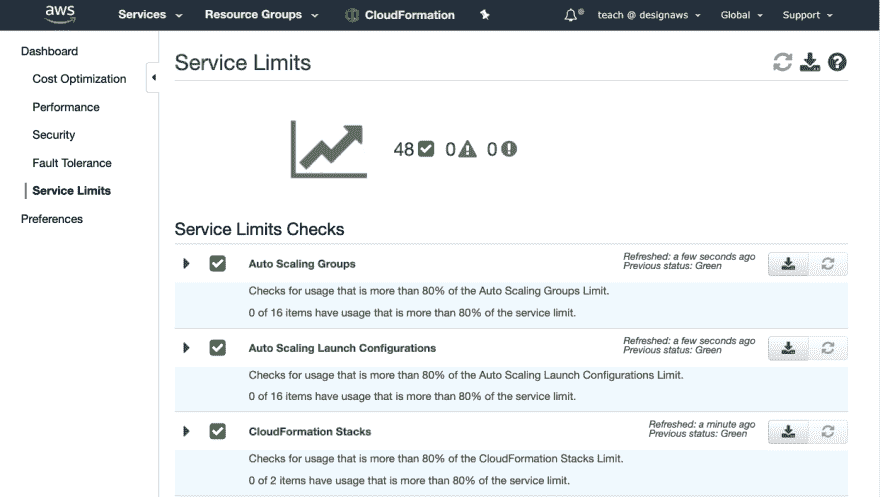

# 在 AWS 上操作:了解自己的极限

> 原文:[https://dev . to/ni macks/operating-on-AWS-know-your-limits-57gf](https://dev.to/nimacks/operating-on-aws-know-your-limits-57gf)

在 AWS 平台上运营一项服务有时会让人望而生畏。似乎有这么多活动部件。例如，区域、日志、主机等等。尽管有许多资源可以帮助指导开发人员，但是限制管理经常被遗忘。

失败的一个常见原因是资源限制，尤其是在构建基于微服务的工作负载时。例如，当您使用应用程序同步达到每个片段的 API 的最大数量，或者达到您可以使用 Amplify 控制台创建的应用程序的最大数量时。

理解限额管理有 3 个关键要素

1.  首先，了解物理约束以帮助您设计一个可靠的系统。
2.  其次，确定依赖项的服务限制。
3.  最后，当你即将达到或即将达到极限时，发出警报并报告。

### 了解物理约束

如果您在 [EC2 实例](https://aws.amazon.com/ec2/?nc2=h_m1)上运行工作负载，那么根据工作负载的性能监控并频繁调整硬件配置是至关重要的。 [Amazon CloudWatch](https://aws.amazon.com/cloudwatch/?nc2=h_m1) 可以用来设置警报，以指示您何时接近网络 IO、供应 IOPS、EBS 等的限制。您还可以在接近自动缩放组的最大容量时设置警报。

### 确定您的依赖项的服务限制

AWS 在提供有关服务限制的信息方面做得很好。您可以在这里找到大多数服务的限制[服务限制](https://docs.aws.amazon.com/general/latest/gr/aws_service_limits.html)。这些限额是按帐户跟踪的，所以如果您使用多个帐户，您需要知道每个帐户的限额是多少。其他限制可能基于您的配置。每个 AWS 地区和每个 AWS 帐户都有限额。如果您计划部署到多个区域或 AWS 帐户，那么您应该确保增加您使用的区域和帐户的限制

### 预警和报告

AWS 通过 [AWS 可信顾问](https://aws.amazon.com/premiumsupport/technology/trusted-advisor/)提供一些服务限制列表，其他服务限制可从 AWS 管理控制台获得。

[T2】](https://res.cloudinary.com/practicaldev/image/fetch/s--XGy8Zwy4--/c_limit%2Cf_auto%2Cfl_progressive%2Cq_auto%2Cw_880/https://nimacks.s3-us-west-2.amazonaws.com/img/limits.png)

理想情况下，限额跟踪应该是自动化的。您可以将当前的服务限制存储在像 Amazon DynamoDB 这样的持久性数据存储中。如果您将配置管理数据库(CMDB)或票据系统与 AWS 支持 API 集成，您可以自动跟踪限额增加请求和当前限额。

总之，通过有意识地监控服务限制，您可以省去很多麻烦。这将使你的客户感到高兴，你的应用程序或服务非常可靠。

[https://www . ni macks . com/AWS/limits/operationalexcellence/2019/09/03/know-your-limits . html](https://www.nimacks.com/aws/limits/operationalexcellence/2019/09/03/know-your-limits.html)