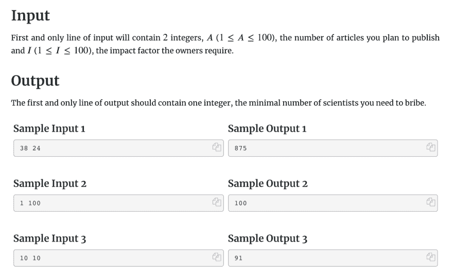
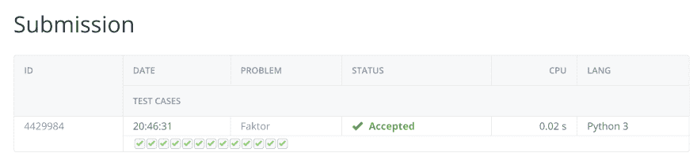

# 我刚刚解决了这个编码挑战，但是我不明白为什么我的解决方案有效🤔

> 原文:[https://dev . to/wango nya/I-just-solved-this-coding-challenge-but-I-do-understand-why-my-solution-works-581n](https://dev.to/wangonya/i-just-solved-this-coding-challenge-but-i-don-t-understand-why-my-solution-works-581n)

我一直试图在 Kattis 上每天做一个编程挑战，我刚刚解决了这个问题。起初，我真的不知道如何解决这个问题，所以我只是摆弄了一下提供的输入/输出数据样本，并注意到了一个模式:

[T2】](https://res.cloudinary.com/practicaldev/image/fetch/s--o-DgrBOI--/c_limit%2Cf_auto%2Cfl_progressive%2Cq_auto%2Cw_880/https://thepracticaldev.s3.amazonaws.com/i/zi4xlgqek2tu19sj3879.png)

在最后一个示例中，10 和 10 的输入给出了 91 的输出:这就是`10 * (10-1) + 1)`。假设第一个输入是`x`，第二个是`y`，这给出了一个公式`x * (y-1) + 1`，它给出了所有其他输入的正确输出，并通过了所有测试用例:

```
# https://open.kattis.com/problems/faktor import sys

def faktor(articles, impact):
    print(int(articles)*(int(impact)-1) + 1)

if __name__ == '__main__':
    a, i = sys.stdin.readline().split()
    faktor(a, i) 
```

<svg width="20px" height="20px" viewBox="0 0 24 24" class="highlight-action crayons-icon highlight-action--fullscreen-on"><title>Enter fullscreen mode</title></svg> <svg width="20px" height="20px" viewBox="0 0 24 24" class="highlight-action crayons-icon highlight-action--fullscreen-off"><title>Exit fullscreen mode</title></svg>

[T2】](https://res.cloudinary.com/practicaldev/image/fetch/s--pRKYvO90--/c_limit%2Cf_auto%2Cfl_progressive%2Cq_auto%2Cw_880/https://thepracticaldev.s3.amazonaws.com/i/5z3qrk68h3hod4f4c179.png)

问题是，这个公式似乎与挑战中的问题没有任何关系。也许我错过了什么🤔