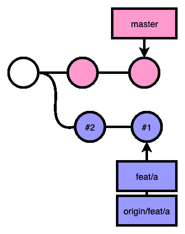
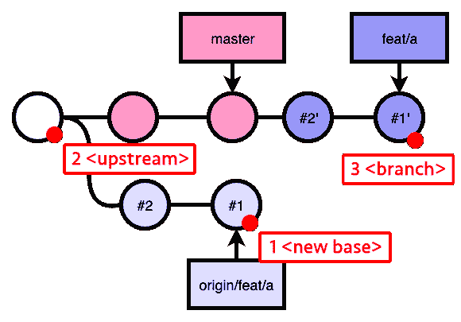
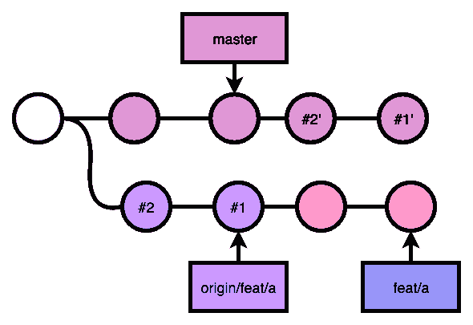
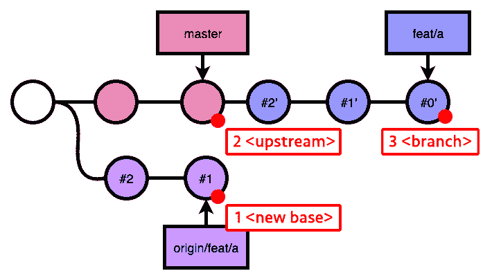
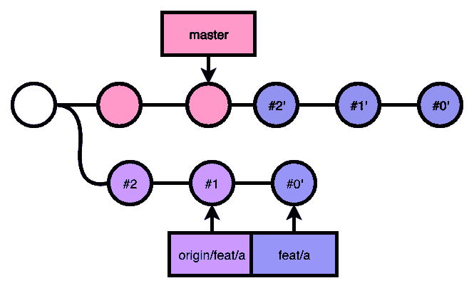

# 重置基础后 Git 提交丢失

> 原文：<https://dev.to/tanhauhau/git-commits-went-missing-after-a-rebase-477l>

* * *

这是来自我的博客的转贴。

* * *

上周，我在[Shopee React knowledge](https://github.com/Shopee/shopee-react-knowledgeable)分享了关于 git 命令的内容。在演讲的最后，我的一个同事走近我，问我关于 git rebase 的问题。她莫名其妙地结束了与`git rebase`的混乱的 git 历史，她无法理解她是如何结束的。

我发现她的场景很有趣，并决定把它写在这里。

这是她告诉我的:

> 我从`master`中分支出`feat/a`分支，做了几个提交(`commit #1`、`commit #2`)。
> 
> 我注意到主分支有新的提交，所以我拉出了`master`分支，并将我的分支`feat/a`重新放在主分支上。
> 
> 然后，代替`git push --force`我的本地`feat/a`到远程`origin`，我`git pull --rebase origin feat/a`。
> 
> 而且，我在`feat/a`，比如`commit #1`，`commit #2`的提交都不见了！

因此，我们期望在`git pull --rebase`之后将`commit #1`、`commit #2`重置到`origin/feat/a`之后，在`HEAD`看到`commit #1`、`commit #2`，然而，我们看到的唯一提交是来自`master`分支的一堆提交。

为了了解发生了什么，我决定画一些图表来形象化地描述发生了什么:

[](https://res.cloudinary.com/practicaldev/image/fetch/s--5wolo6VJ--/c_limit%2Cf_auto%2Cfl_progressive%2Cq_auto%2Cw_880/https://lihautan.com/static/1870ed5c6b42a8627c166d090343062e/ddcfc/initial.png)

所以，她做的第一件事就是把`git rebase` `feat/a`放在`master`上面:

[](https://res.cloudinary.com/practicaldev/image/fetch/s--ifdqXT0y--/c_limit%2Cf_auto%2Cfl_progressive%2Cq_auto%2Cw_880/https://lihautan.com/static/d090a782dcfc7453ab4ef2d721699496/71dfb/rebase-1.png)

到目前为止，一切看起来都很正常。下一个命令很棘手。

她把`feat/a`放在`origin/feat/a`上面，她跑了:

```
$ git checkout feat/a
$ git rebase origin/feat/a 
```

<svg width="20px" height="20px" viewBox="0 0 24 24" class="highlight-action crayons-icon highlight-action--fullscreen-on"><title>Enter fullscreen mode</title></svg> <svg width="20px" height="20px" viewBox="0 0 24 24" class="highlight-action crayons-icon highlight-action--fullscreen-off"><title>Exit fullscreen mode</title></svg>

`git rebase`上最重要的是重定基准的 3 个参考点:

[](https://res.cloudinary.com/practicaldev/image/fetch/s--1KOwRmfM--/c_limit%2Cf_auto%2Cfl_progressive%2Cq_auto%2Cw_880/https://lihautan.com/static/cb52f6fc1066f742317ba56f189f327e/71dfb/rebase-2.png)

所以，当她输入

```
$ git rebase origin/feat/a 
```

<svg width="20px" height="20px" viewBox="0 0 24 24" class="highlight-action crayons-icon highlight-action--fullscreen-on"><title>Enter fullscreen mode</title></svg> <svg width="20px" height="20px" viewBox="0 0 24 24" class="highlight-action crayons-icon highlight-action--fullscreen-off"><title>Exit fullscreen mode</title></svg>

，它的意思是:

```
$ git rebase --onto origin/feat/a origin/feat/a feat/a 
```

<svg width="20px" height="20px" viewBox="0 0 24 24" class="highlight-action crayons-icon highlight-action--fullscreen-on"><title>Enter fullscreen mode</title></svg> <svg width="20px" height="20px" viewBox="0 0 24 24" class="highlight-action crayons-icon highlight-action--fullscreen-off"><title>Exit fullscreen mode</title></svg>

*   `new base` : `origin/feat/a`
*   `upstream` : `origin/feat/a`
*   `branch` : `feat/a`

因此，所发生的事情是，在主服务器中分支了`feat/a`之后的所有提交，一直到`feat/a`中新重置的提交，都被重置到了`origin/feat/a`上:

[](https://res.cloudinary.com/practicaldev/image/fetch/s--VxePxlGb--/c_limit%2Cf_auto%2Cfl_progressive%2Cq_auto%2Cw_880/https://lihautan.com/static/3e8f06873f4e88760cd20b84fd11653d/ae30e/rebase-4.png)

然而，如果您现在查看历史，提交`commit #1`和`commit #2`被写了两次，第一次是原始提交，第二次是基于基础的提交。在这种情况下，git 不会再次重写提交，如果 git 可以判断出它是否是重复的:

[](https://res.cloudinary.com/practicaldev/image/fetch/s--bg3dnmj7--/c_limit%2Cf_auto%2Cfl_progressive%2Cq_auto%2Cw_880/https://lihautan.com/static/af50e5e634451222707106152a133619/623ee/rebase-5.png)

就好像提交`commit #1`和`commit #2`都不见了，只剩下来自`master`分支的提交，因为 git 在重定基准`feat/a`时没有重写它们。实际上在`commit #1`和`commit #2`所做的改动仍然有效。

> 你可以在 git 的文档中读到更多关于这种行为的信息

那么，如果她真的想在`origin/feat/a`之上重置本地`feat/a`，特别是在她再次提交`commit #0`之后，她应该怎么做呢？

嗯，她应该指定`<upstream>`参考点:

[](https://res.cloudinary.com/practicaldev/image/fetch/s--HR2RAX0q--/c_limit%2Cf_auto%2Cfl_progressive%2Cq_auto%2Cw_880/https://lihautan.com/static/c3b852c3e96d69241192dc4fef4ce3a7/00b72/rebase-7.png)T3】

```
$ git rebase --onto origin/feat/a master feat/a 
```

<svg width="20px" height="20px" viewBox="0 0 24 24" class="highlight-action crayons-icon highlight-action--fullscreen-on"><title>Enter fullscreen mode</title></svg> <svg width="20px" height="20px" viewBox="0 0 24 24" class="highlight-action crayons-icon highlight-action--fullscreen-off"><title>Exit fullscreen mode</title></svg>

你会得到:

[](https://res.cloudinary.com/practicaldev/image/fetch/s--TuSVTu8h--/c_limit%2Cf_auto%2Cfl_progressive%2Cq_auto%2Cw_880/https://lihautan.com/static/f8300411e8f165f4ed2d7e721e99cfc2/78bcf/rebase-8.png)

这里，git 足够聪明，不会重写`commit #1`和`commit #2`。

# 总结

使用`git rebase`时，始终记住重定基准的 3 个参考点，即`new base`、`upstream`和`branch`。