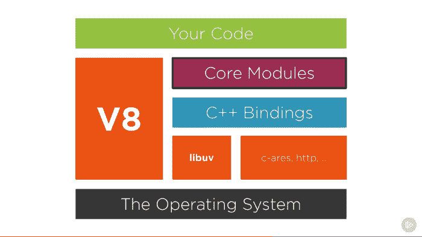

# Node.js 在第一层布下-了解我们的工具

> [https://dev . to/_ static oid/node-js-under-dos-panos-1-了解我们的工具-34b6](https://dev.to/_staticvoid/node-js-por-baixo-dos-panos-1-conhecendo-nossas-ferramentas-34b6)

> 这是我的[原文章](https://dev.to/khaosdoctor/node-js-under-the-hood-1-getting-to-know-our-tools-1465)的译本
> 
> 最近，我应邀在巴西最大的会议之一——“t0”【conf】上发表演讲。
> 
> 会议的目的是创建英语内容，以便世界上所有人将来都能通过观看在线录制的讲座而受益于此内容。不仅仅是我们巴西人讲葡萄牙语。

我觉得我在其他演讲中传递的内容没有我希望的那么先进和深刻。所以我决定做一个关于 Node.js、JavaScript 以及整个 Node.js 生态系统如何运作的演讲。这是因为现今大多数程序员都只用的东西，但从来没有人去思考它们的工作原理或它们的工作原理。

在当今世界，这甚至是“可以接受”的，我们有很多 libs，他们免除了我们阅读有关处理器体系结构的书籍和更多书籍的需要，这样我们就可以创建一个以汇编方式编写的时钟。但是，这使我们懒惰，用对它们一无所知的东西创造了一种氛围，在那里每个人只知道足够多，只读足够多的东西来创造他们需要的东西，而忘记了随它而来的所有概念。毕竟，复制和粘贴堆栈溢出代码要简单得多。

因此，考虑到这一点，我决定潜入 Node.js 的内部，至少是为了展示所有东西是如何连接起来的，以及我们的大多数代码是如何在 Node.js 生态系统中运行的。

这是我撰写和研究的第一篇关于这个主题的文章。我不会把所有的参考文献都放在这篇第一篇文章里，因为它们是很多甚至。相反，我将把所有这些内容分成几篇文章，每篇都包含了研究的一部分，最后一篇文章，我将转到我演讲的参考资料和幻灯片。

希望你们喜欢 d

## [](#objetivos)物体

本系列的目标是使人们能够更切实地了解 Node.js 在内部的工作方式，这是因为 Node 和 JavaScript 因其‘t0’libs’t1’而成为世界知名人士，但实际上没有人知道它们在引擎盖下的工作方式。为了解释这一切，我们将涵盖一系列主题:

1.  Node.js 是什么
    1.  好故事
    2.  联署材料本身的简短故事
    3.  他们是谁
2.  具有文件读取调用的示例
3.  Java Script 语言
    1.  Como funciona？
        1.  调用堆栈
    2.  哈罗
4.  Libuv
    1.  什么是 libuv？
    2.  我们为什么需要她？
    3.  事件运行中
    4.  微任务和宏任务
5.  V8
    1.  v8 是什么
    2.  概观
        1.  抽象语法树
    3.  旧编译管道
        1.  o 完整代码
        2.  机轴
            1.  氢
            2.  锂
    4.  新建编译管道
        1.  点火
        2.  涡轮风扇发动机
            1.  隐藏类和变量分配
    5.  碎片帐集
6.  编译最佳化
    1.  恒定折叠
    2.  变量归纳分析
    3.  再结晶
    4.  正在删除资源
    5.  Deflorestamento
    6.  Peephole 优化
    7.  内联扩充
    8.  内嵌缓存
    9.  删除程式码
    10.  重新排序代码块
    11.  跳线穿线
    12.  蹦床
    13.  删除常用子表达式

## [](#o-que-%C3%A9-o-nodejs)O que é o Node.js

Node.js 由 Ryan Dahl(原始创建者)定义为“在 V8 引擎上运行的一组库，允许在服务器上运行 JavaScript”，Wikipedia 将它定义为“在浏览器外部运行代码的开源 JavaScript 运行时”。

本质上，Node.js 是一个运行时，允许我们在浏览器域之外运行 js。但是，这不是服务器上第一次实现 Javascript。1995 年，Netscape 实现了所谓的 Netscape Enterprise Server，它允许用户在服务器上运行 LiveScript(年轻的 JavaScript)。

### node . js 的简史

Node.js 于 2009 年首次推出，由 Ryan Dahl 编写，随后由 Joyent 赞助。整个运行时源始于 Apache HTTP 服务器(当时最流行的 web 服务器)处理许多并发连接的有限能力。此外，Dahl 还批评了按顺序编写代码的方式，这可能会导致整个进程挂起，或者在多个并发连接的情况下导致多个执行堆栈。

Node.js 于 2009 年 11 月 8 日首次在 jsconf me 上推出。它结合了 V8、新编写的 libuv 提供的事件循环和低级 I/o API。

### JavaScript 简史

Javascript 被定义为符合 ECMAScript 规范并由 TC39 维护的“高级解释脚本语言”。1995 年由 brendan eich 在 Netscape 浏览器中使用脚本语言时创建。JavaScript 的设计完全是为了满足 Marc Andreessen 的想法，即 HTML 和 web 设计人员之间应该有一种“胶水语言”，这种语言应该易于使用来组装图像和插件等组件，以便将代码直接写入网页标记中。

Brendan Schwarz 被招募在 Netscape 中实施 Scheme 语言，但由于 Sun Microsystems 与 Netscape 之间的合作伙伴关系，为了将 Java 纳入 Netscape 浏览器，其重点已转移到创建类似 Java 语法的语言上。为了保护 JavaScript 的想法不受其他提议的影响，区域在 10 天内编写了一个功能原型。

ECMA 的规范是一年后制定的，当时 Netscape 将 JavaScript 语言发送到 ECMA International 以创建一个标准规范，其他浏览器供应商可以根据 Netscape 的工作实施该规范。这导致了 1997 年的第一个 ECMA-262 标准。ECMAScript-3 于 1999 年 12 月发布，是 JavaScript 语言的现代基线。ECMAScript 4 之所以被锁定，是因为 Microsoft 不打算在 IE 中正确地合作或实现 JavaScript，尽管他们不知道如何替换 JS，并且在服务器端对. NET 语言进行了部分但不同的实现。

2005 年，开源社区和开发人员开始致力于改变 JavaScript 可以实现的功能。首先，在 2005 年，杰西·詹姆斯·加雷特发布了所谓 AJAX 的草稿，从而导致了 jQuery、Prototype 和 MooTools 等开源库主导的 JavaScript 使用的复兴。2008 年，整个社区再次开始使用 JS 后，ECMAScript 5 于 2009 年发布。

### [](#elementos-que-comp%C3%B5em-o-nodejs)组成 Node.js 的元素

Node.js 包含一些依赖关系:

*   V8
*   Libuv
*   http 解析器
*   c-ares
*   OpenSSL
*   zlib

下图给出了完美的解释:

[T2】](https://res.cloudinary.com/practicaldev/image/fetch/s--B4RyMPrD--/c_limit%2Cf_auto%2Cfl_progressive%2Cq_auto%2Cw_880/https://github.com/khaosdoctor/my-notes/raw/master/node/assets/nodejs-components.png)

通过展示这一点，我们可以将 Node.js 分为 V8 和 libuv 两部分。V8 在 C++中占 70%左右，在 JavaScript 中占 30%，而 libuv 则完全用 c 语言编写。

## [](#nosso-exemplo-uma-chamada-de-leitura-de-dados)我们的例子——一个数据读取呼叫

为了实现我们的目标(并清楚地了解我们要做什么)，我们将首先编写一个简单的程序来读取文件并将其打印在屏幕上。您将看到，此代码不是程序员可以编写的理想代码，但它将实现作为我们必须经过的所有部分的学习对象的目的。

如果你仔细看一下“T7”节点源. js. ，你会注意到两个主要文件夹:`lib`和`src`。`lib`文件夹包含项目中所有必需但以 JavaScript 编写的函数和模块的所有定义。`src`文件夹是随它们一起提供的**实现，这是 Libuv 和 V8 所在的位置，也是`fs`、`http`、`crypto`等模块的所有实现最终停留的位置。**

 **做这个简单的程序:

```
const fs = require('fs')
const path = require('path')
const filePath = path.resolve(`../myDir/myFile.md`)

// Parseamos o buffer em string
function callback (data) {
  return data.toString()
}

// Transformamos a função em uma promise
const readFileAsync = (filePath) => {
  return new Promise((resolve, reject) => {
    fs.readFile(filePath, (err, data) => {
      if (err) return reject(err)
      return resolve(callback(data))
    })
  })
}

(() => {
  readFileAsync(filePath)
    .then(console.log)
    .catch(console.error)
})() 
```

<svg width="20px" height="20px" viewBox="0 0 24 24" class="highlight-action crayons-icon highlight-action--fullscreen-on"><title>Enter fullscreen mode</title></svg> <svg width="20px" height="20px" viewBox="0 0 24 24" class="highlight-action crayons-icon highlight-action--fullscreen-off"><title>Exit fullscreen mode</title></svg>

> 是的，我知道有`util.promisify`和`fs.promises`，但是，我想手动将函数回调转换成承诺，这样我们就能更好地了解事物的内部。

本文中的所有示例都将与此计划相关。而这是因为`fs.readFile` * *【否** 是 V8 或 JavaScript 的一部分。此函数仅由 Node.js 作为本地操作系统的 C++绑定实现，但是，我们用作“`fs.readFile (path, cb)`”的高级 API 完全在 JavaScript 中实现，该 API 调用这些绑定。以下是此函数的完整源代码`readFile`(因为整个文件有 1850 行，但在引用中):

```
// https://github.com/nodejs/node/blob/0e03c449e35e4951e9e9c962ff279ec271e62010/lib/fs.js#L46
const binding = internalBinding('fs');
// https://github.com/nodejs/node/blob/0e03c449e35e4951e9e9c962ff279ec271e62010/lib/fs.js#L58
const { FSReqCallback, statValues } = binding;

// https://github.com/nodejs/node/blob/0e03c449e35e4951e9e9c962ff279ec271e62010/lib/fs.js#L283
function readFile(path, options, callback) {
  callback = maybeCallback(callback || options);
  options = getOptions(options, { flag: 'r' });
  if (!ReadFileContext)
    ReadFileContext = require('internal/fs/read_file_context');
  const context = new ReadFileContext(callback, options.encoding);
  context.isUserFd = isFd(path); // File descriptor ownership

  const req = new FSReqCallback();
  req.context = context;
  req.oncomplete = readFileAfterOpen;

  if (context.isUserFd) {
    process.nextTick(function tick() {
      req.oncomplete(null, path);
    });
    return;
  }

  path = getValidatedPath(path);
  binding.open(pathModule.toNamespacedPath(path),
               stringToFlags(options.flag || 'r'),
               0o666,
               req);
} 
```

<svg width="20px" height="20px" viewBox="0 0 24 24" class="highlight-action crayons-icon highlight-action--fullscreen-on"><title>Enter fullscreen mode</title></svg> <svg width="20px" height="20px" viewBox="0 0 24 24" class="highlight-action crayons-icon highlight-action--fullscreen-off"><title>Exit fullscreen mode</title></svg>

> **免责声明:**我从提交`0e03c449e35e4951e9e9c962ff279ec271e62010`开始将代码引用粘贴到 Github 的源链接中，这是当时最新的，这样，本文在撰写时总是指向正确的实现。

看到 5 号线了吗？我们有一个呼叫`read_file_context`，另一个 JS 文件(也在参考中)。在[至`fs.readFile`的源代码末尾，我们有一个呼叫`binding.open`，这是一个 C++呼叫，用于打开描述符文件，传递路径、`fopen`c++标志、八进制文件模式权限(`0o`](https://github.com/nodejs/node/blob/0e03c449e35e4951e9e9c962ff279ec271e62010/lib/fs.js)

除此之外，我们还有‘t0’，它是 C++内部专用绑定的加载器，由于在‘t1’上可用，所以最终用户(如我们)无法访问，这实际上就是加载 C++代码的地方。而这里正是[我们严重依赖 V8](https://github.com/nodejs/node/blob/0e03c449e35e4951e9e9c962ff279ec271e62010/src/node_file.cc#L54-L79) 。

所以基本上，在上面的代码中，我们给出了一个`fs`到`internalBinding('fs')`的绑定，该绑定调用并加载文件 [`src/node_file.cc`](https://github.com/nodejs/node/blob/0e03c449e35e4951e9e9c962ff279ec271e62010/src/node_file.cc) (因为整个文件都在 [`namespace fs`](https://github.com/nodejs/node/blob/0e03c449e35e4951e9e9c962ff279ec271e62010/src/node_file.cc#L52)

函数`FSReqCallback`是我们调用`fs.readFile`时传递的异步回调(使用`fs.readFileSync`时，还有一个称为`FSReqWrapSync`的函数在此定义，其所有方法和实现均定义

```
// https://github.com/nodejs/node/blob/0e03c449e35e4951e9e9c962ff279ec271e62010/src/node_file.cc

FileHandleReadWrap::FileHandleReadWrap(FileHandle* handle, Local<Object> obj)
  : ReqWrap(handle->env(), obj, AsyncWrap::PROVIDER_FSREQCALLBACK),
    file_handle_(handle) {}

void FSReqCallback::Reject(Local<Value> reject) {
  MakeCallback(env()->oncomplete_string(), 1, &reject);
}

void FSReqCallback::ResolveStat(const uv_stat_t* stat) {
  Resolve(FillGlobalStatsArray(env(), use_bigint(), stat));
}

void FSReqCallback::Resolve(Local<Value> value) {
  Local<Value> argv[2] {
    Null(env()->isolate()),
    value
  };
  MakeCallback(env()->oncomplete_string(),
               value->IsUndefined() ? 1 : arraysize(argv),
               argv);
}

void FSReqCallback::SetReturnValue(const FunctionCallbackInfo<Value>& args) {
  args.GetReturnValue().SetUndefined();
}

void NewFSReqCallback(const FunctionCallbackInfo<Value>& args) {
  CHECK(args.IsConstructCall());
  Environment* env = Environment::GetCurrent(args);
  new FSReqCallback(env, args.This(), args[0]->IsTrue());
}

// Create FunctionTemplate for FSReqCallback
Local<FunctionTemplate> fst = env->NewFunctionTemplate(NewFSReqCallback);
fst->InstanceTemplate()->SetInternalFieldCount(1);
fst->Inherit(AsyncWrap::GetConstructorTemplate(env));
Local<String> wrapString =
    FIXED_ONE_BYTE_STRING(isolate, "FSReqCallback");
fst->SetClassName(wrapString);
target
    ->Set(context, wrapString,
          fst->GetFunction(env->context()).ToLocalChecked())
    .Check(); 
```

<svg width="20px" height="20px" viewBox="0 0 24 24" class="highlight-action crayons-icon highlight-action--fullscreen-on"><title>Enter fullscreen mode</title></svg> <svg width="20px" height="20px" viewBox="0 0 24 24" class="highlight-action crayons-icon highlight-action--fullscreen-off"><title>Exit fullscreen mode</title></svg>

在最后一部分中，有一个构造函数的定义:`Local<FunctionTemplate> fst = env->NewFunctionTemplate(NewFSReqCallback)`。这基本上是说，当我们调用`new FSReqCallback ()`时，函数`NewFSReqCallback`将被调用。现在看看属性`context`是如何出现在`target->Set(context, wrapString, fst->GetFunction)`部分中的，以及`oncomplete`也是如何在`::Reject`和`::Resolve`中定义和使用的。

同样重要的是，变量`req`是根据调用结果`new ReadFileContext`创建的，该调用结果被称为`context`，定义为`req.context`。这意味着变量“`req`”也是使用函数“`FSReqCallback()`”创建的回调的 C++绑定表示，并为我们的回调设置上下文，然后侦听事件“`oncomplete`”。

## [](#conclus%C3%A3o)结论

目前，我们看的不多。但是，在接下来的文章中，我们将越来越多地讨论事物的实际工作方式，以及如何利用我们的功能来更好地了解我们的工具！

不要忘了在我的博客上跟进我的内容，如果[订阅时事通讯](https://blog.lsantos.dev/signup?utm_source=devto&utm_medium=article&utm_campaign=node_under_the_hood)接收每周新闻！**