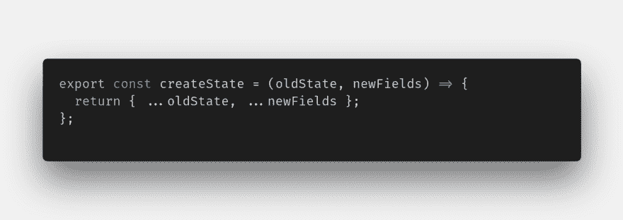
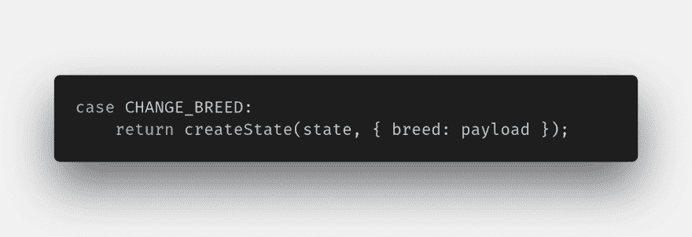
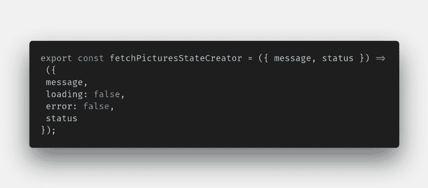
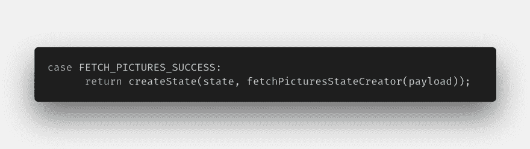
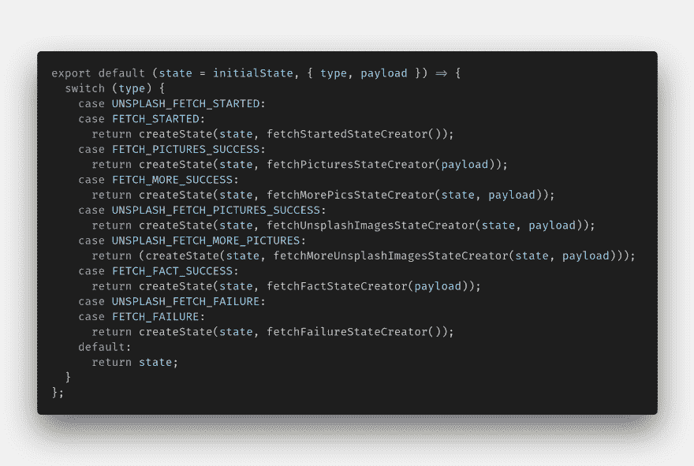

# 我对 Redux 的看法

> 原文:[https://dev.to/dudakp/my-take-on-redux-2289](https://dev.to/dudakp/my-take-on-redux-2289)

在工作中进行了非常棒的 React 和 Redux 培训后，我决定创建一个简单的应用程序来巩固我新获得的关于 React 和(主要是)Redux 的知识，在开发过程中，我发现 reducer 开始变得可读性很差(至少对我来说是这样)，所以下面是我对这个问题的看法。也许没那么糟糕，但我想要更简单、更易读的东西。
[T3】](https://res.cloudinary.com/practicaldev/image/fetch/s--4Klk7rp3--/c_limit%2Cf_auto%2Cfl_progressive%2Cq_auto%2Cw_880/https://thepracticaldev.s3.amazonaws.com/i/rklkcps9xts2c4yl2kw1.png)T5】首先，...在每个案例的开头声明，我不想要那个，但是，你不能去掉它，但是你可以替换它(我们可以只去掉… spread 操作符)！尽管如此，在每种情况下你都要写一些东西。我们能不能只做一个单函数调用？
 
作为回报，这将替换对象创建，我们只是这样调用这个函数:

【breed:payload】可以，但是字段越多，可读性越差。
只需制作类似 createState 的东西。
 
这将会用仅仅
 
来代替 FETCH_PICTURES_SUCCESS，并且缩减器变得更加仅仅是函数调用。
 
我们再举一个例子。我在我的减速器
 
中有这段 od 代码，我不想在我的减速器中有它，把它放在状态创建器中！使用这种模式，我得到了真正干净的 reducer 和文件，我称之为状态创建器的函数被分离在它们自己的文件中。

如果你有兴趣，这里是我做的应用程序(代码在生产分支)。

##  [杜达克](https://github.com/dudakp) / [狗牌](https://github.com/dudakp/dogBoard)

### 只有狗

<article class="markdown-body entry-content container-lg" itemprop="text">

# 狗板

只有狗

</article>

[View on GitHub](https://github.com/dudakp/dogBoard)

[这里是直播 app 的 Netlify 链接](https://goofy-fermi-c0f561.netlify.com/)只是无限狗图。没什么特别的，只是让我练习反应和还原。
让我知道你对这个模式的想法:)
喜欢看到任何善意的批评:)