# 如何构建口袋平台即服务

> 原文:[https://dev . to/rob Zhu/how-to-build-a-pocket-platform-as-service-2k 38](https://dev.to/robzhu/how-to-build-a-pocket-platform-as-a-service-2k38)

[T2】](https://res.cloudinary.com/practicaldev/image/fetch/s--KcPYEN1B--/c_limit%2Cf_auto%2Cfl_progressive%2Cq_auto%2Cw_880/https://miro.medium.com/max/2000/0%2AHZBBO9srk3RLjDqY.jpg)

> 必备知识:Linux，SSH，SSL，Docker，Nginx，HTTP，DNS

[T2】](https://res.cloudinary.com/practicaldev/image/fetch/s--GtGAFxcd--/c_limit%2Cf_auto%2Cfl_progressive%2Cq_auto%2Cw_880/https://miro.medium.com/max/1600/0%2A7cLM0a0n-c3WUp2M)

新项目需要什么样的基础设施？我会优先考虑简单性、灵活性、价值和按需容量。对于新的基于 web 的项目，我发现自己很快就达到了以下要求:

1.  DNS 配置
2.  SSL 支持
3.  服务的子域
4.  本地主机的 SSL 反向代理(类似于 ngrok 和 serveo)
5.  提交源存储库后自动部署(很好)

亚马逊 Lightsail 非常适合构建一个提供所有这些功能的简单“口袋平台”。对于初学者来说，它既便宜又简单，并且为管理虚拟机和 DNS 提供了一个友好的界面。让我们一步一步地在 Lightsail 上组装我们的口袋平台。

> 如果你更喜欢跟随视频:[第一部分](https://youtu.be/iqOq8LM3lXE)，[第二部分](https://youtu.be/tn9snFMXa0M)，[第三部分](https://www.youtube.com/watch?v=5Y5h0RT1cnA)

## [](#domain-name-amp-static-ip)域名&静态 IP

首先，我们的项目需要一个域名。你可以在任何域名注册服务注册你的域名，比如亚马逊 [Route53](https://aws.amazon.com/route53/) 。一旦你的域名注册成功，打开 [Lightsail 控制台](https://lightsail.aws.amazon.com/ls/webapp)，点击网络选项卡，点击创建静态 IP:

[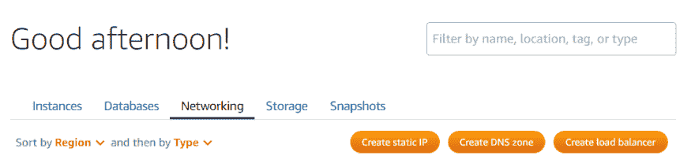T2】](https://res.cloudinary.com/practicaldev/image/fetch/s--vVZd6Zfa--/c_limit%2Cf_auto%2Cfl_progressive%2Cq_auto%2Cw_880/https://miro.medium.com/max/1002/0%2APIhqYmiojWoHlnDH)

给它一个你能记住的名字，不要担心把它附加到一个实例上。接下来，单击“创建 DNS 区域”:

[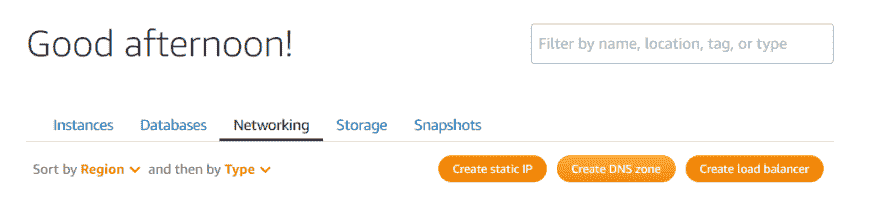T2】](https://res.cloudinary.com/practicaldev/image/fetch/s--SnC7dV3I--/c_limit%2Cf_auto%2Cfl_progressive%2Cq_auto%2Cw_880/https://miro.medium.com/max/1046/0%2AeXq82GPvkXpm4KFE)

在“创建 DNS 区域”页面上，输入您的域名，然后单击“创建 DNS 区域”。在本指南的剩余部分，我将使用我的一个域“浣熊新闻”。

[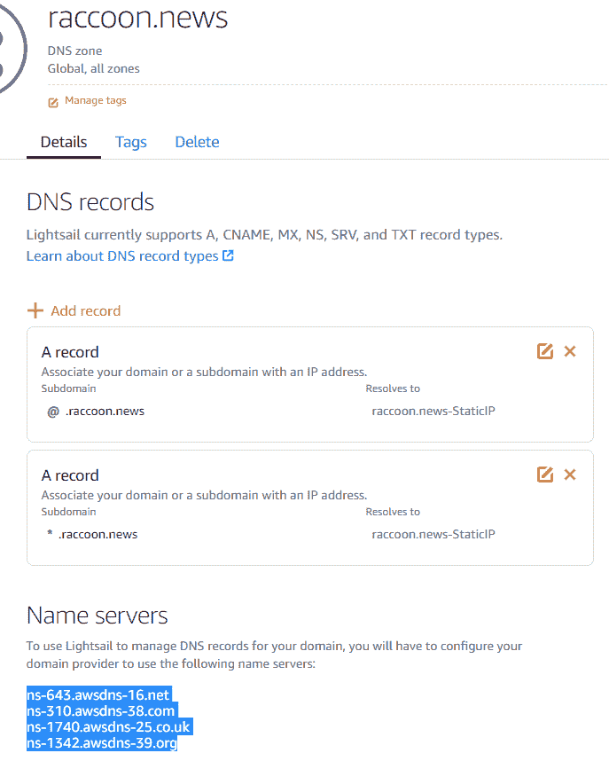T2】](https://res.cloudinary.com/practicaldev/image/fetch/s--0d3LBkYj--/c_limit%2Cf_auto%2Cfl_progressive%2Cq_auto%2Cw_880/https://miro.medium.com/max/687/0%2AuRKEYRGeoQBi6xB7)

创建两个 A 记录，“@ .浣熊. news”和“dev .浣熊. news”，这两个记录都解析为您之前创建的静态 IP 地址。然后在页面底部复制 Lightsail 名称服务器的值。回到您的域名提供商，编辑名称服务器，指向 Lightsail 名称服务器。因为我用 Route53 注册了我的域，所以它看起来是这样的:

[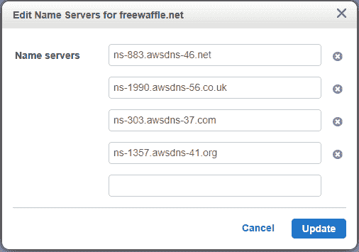T2】](https://res.cloudinary.com/practicaldev/image/fetch/s--nGs8IYJy--/c_limit%2Cf_auto%2Cfl_progressive%2Cq_auto%2Cw_880/https://miro.medium.com/max/506/0%2A2NzdPTZ30sh1IP8u)

注意:如果您使用 Route53 注册了您的域，请确保您正在更改“域注册”下的名称服务器值，而不是托管区域。事实上，如果您向 Route53 注册了您的域，您需要删除 Route53 自动为您的域创建的托管区域。

在等待 DNS 更改传播的同时，让我们设置 Lightsail 实例。

## [](#basic-server-setup)基本服务器设置

在 Lightsail 控制台中，创建一个新实例并选择 Ubuntu 18.04。出于本指南的目的，您可以使用最便宜的实例，但是一旦您在生产环境中运行任何东西，请选择一个有足够容量来满足您的工作负载的实例。

[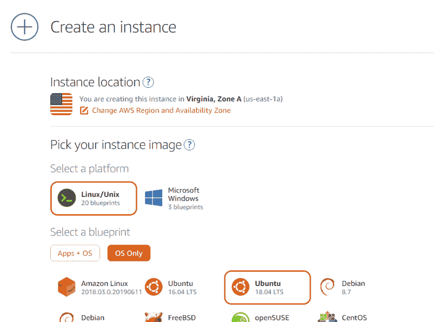T2】](https://res.cloudinary.com/practicaldev/image/fetch/s--EdMPnG74--/c_limit%2Cf_auto%2Cfl_progressive%2Cq_auto%2Cw_880/https://miro.medium.com/max/949/0%2ASZjxznQdFwW8EaP3)

实例启动后，选择 manage 并打开另外两个 TCP 端口:443 和 2222。然后，在 instance/networking 下，附加我们之前分配的静态 IP。

[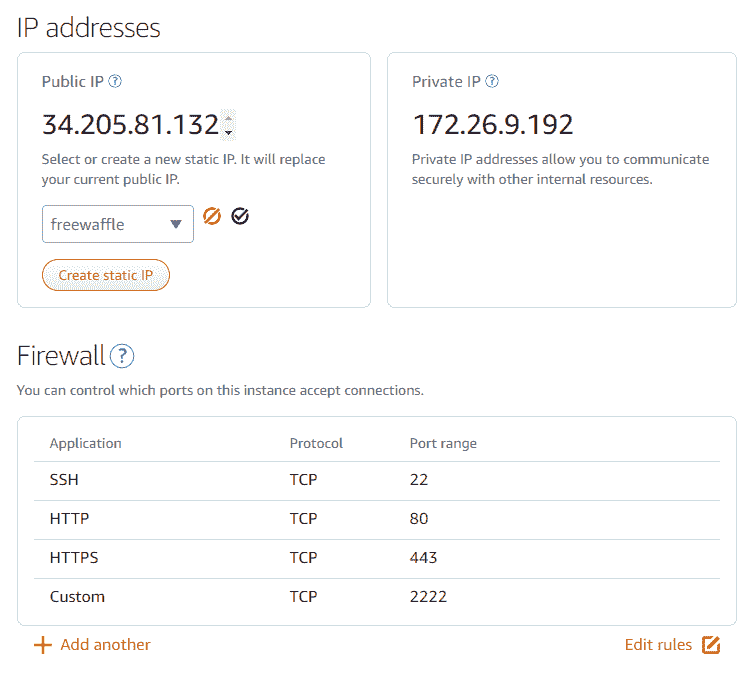T2】](https://res.cloudinary.com/practicaldev/image/fetch/s--EQo_en8T--/c_limit%2Cf_auto%2Cfl_progressive%2Cq_auto%2Cw_880/https://miro.medium.com/max/751/0%2AwvC7kmr40zj_RnqH)

SSH 到 Lightsail 实例，下载 SSH key，并保存到一个友好的文件路径，例如: **~/ls_ssh_key.pem**

[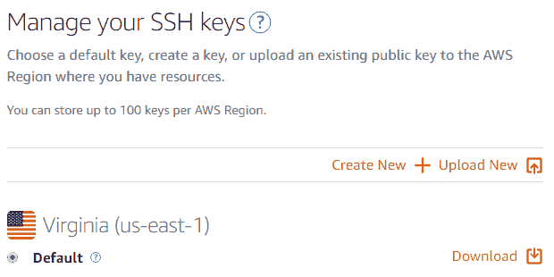T2】](https://res.cloudinary.com/practicaldev/image/fetch/s--oNZHorqJ--/c_limit%2Cf_auto%2Cfl_progressive%2Cq_auto%2Cw_880/https://miro.medium.com/max/620/0%2Axp5HZxsebJLh8qEP)

将 SSH 密钥和 SSH 的权限限制到实例:

```
# restrict permissions for your SSH key
chmod 400 ~/ls_ssh_key.pem

# SSH to the instance
ssh -i ls_ssh_key.pem ubuntu@STATIC_IP 
```

一旦我们连接到实例 install Docker 来帮助我们管理部署和配置:

```
sudo apt-get update && sudo apt-get install docker.io
sudo systemctl start docker
sudo systemctl enable docker
docker run hello-world 
```

安装 docker 后，我们将使用名为 [nginx-proxy](https://github.com/jwilder/nginx-proxy) 的容器来设置一个网关。这个容器允许我们通过提供“VIRTUAL_HOST”环境变量将流量路由到其他容器。方便的是，nginx-proxy 附带了一个 SSL 伴侣， [nginx-proxy-letsencrypt](https://github.com/JrCs/docker-letsencrypt-nginx-proxy-companion/blob/master/docs/Basic-usage.md) ，它使用 [Let 加密](https://letsencrypt.org/)。

```
# start the reverse proxy container
sudo docker run --detach \
    --name nginx-proxy \
    --publish 80:80 \
    --publish 443:443 \
    --volume /etc/nginx/certs \
    --volume /etc/nginx/vhost.d \
    --volume /usr/share/nginx/html \
    --volume /var/run/docker.sock:/tmp/docker.sock:ro \
    jwilder/nginx-proxy

# start the letsencrypt companion
sudo docker run --detach \
    --name nginx-proxy-letsencrypt \
    --volumes-from nginx-proxy \
    --volume /var/run/docker.sock:/var/run/docker.sock:ro \
    --env "DEFAULT_EMAIL=YOUREMAILHERE" \
    jrcs/letsencrypt-nginx-proxy-companion

# start a demo web server under a subdomain
sudo docker run --detach \
    --name nginx \
    --env "VIRTUAL_HOST=test.EXAMPLE.COM" \
    --env "LETSENCRYPT_HOST=test.EXAMPLE.COM" \
    nginx 
```

请特别注意为代理伙伴上的 DEFAULT_EMAIL 环境变量设置一个有效的电子邮件，否则每当您启动一个新的容器时都需要指定电子邮件。如果一切顺利，您应该能够导航到[https://test.EXAMPLE.COM](https://test.EXAMPLE.COM)并看到 nginx 默认内容，以及由 Let's Encrypt 自动生成的有效 SSL 证书:

[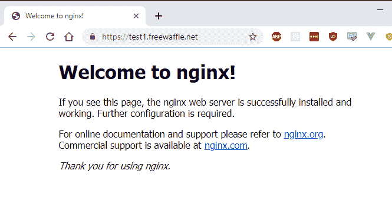T2】](https://res.cloudinary.com/practicaldev/image/fetch/s--YMcGfcZ_--/c_limit%2Cf_auto%2Cfl_progressive%2Cq_auto%2Cw_880/https://miro.medium.com/max/665/0%2AEdPeEhfjiReDWDvf)

需要注意的两个常见错误:

1.  确保 Lightsail 控制台中的端口 443 打开
2.  让我们加密限速:[https://letsencrypt.org/docs/rate-limits/](https://letsencrypt.org/docs/rate-limits/)

## [](#localhost-proxy-with-ssl)带 SSL 的本地主机代理

[T2】](https://res.cloudinary.com/practicaldev/image/fetch/s--VYJ496Z2--/c_limit%2Cf_auto%2Cfl_progressive%2Cq_auto%2Cw_880/https://miro.medium.com/max/550/0%2AIobqPd8T21Hnp1Wx)

大多数开发人员更喜欢在开发机器(笔记本电脑或台式机)上编码，因为他们可以访问文件系统、使用他们最喜欢的 IDE、重新编译、调试等等。不幸的是，由于与生产环境的差异，在开发机器上开发可能会引入错误。此外，某些服务(如 Alexa Skills、GitHub Webhooks)需要 SSL 才能工作，这在本地机器上配置可能会很麻烦。我们可以使用 SSL 反向代理使我们的本地开发环境从浏览器的角度来看类似于生产环境。这种技术也有助于我们的测试应用程序向生产端点发出 API 请求，并带有[跨源资源共享](https://developer.mozilla.org/en-US/docs/Web/HTTP/CORS)限制。虽然这不是一个完美的解决方案，但它让我们向无摩擦的开发/测试反馈循环更近了一步。

> 你可能使用过类似于 [ngrok](http://ngrok.com/) 和 [serveo](https://serveo.net/) 这样的服务。通过自己运行一个反向代理，我们不需要将我们的域和 SSL 设置分散到多个服务中。

为了运行反向代理，我们将创建一个 [SSH 反向隧道](https://www.maketecheasier.com/reverse-ssh-tunnel-allow-external-connections/)。一旦启动了反向隧道 SSH 会话，对主机上指定端口的所有网络请求都将被代理到我们的开发机器。然而，由于我们的 Lightsail 实例已经使用端口 22 进行 VPS 管理，我们需要一个不同的 SSH 端口(上面的 2222)。为了保持一切井然有序，我们还将在一个特殊的代理容器中运行端口 2222 的 SSH 服务器。这里有一个图表:

[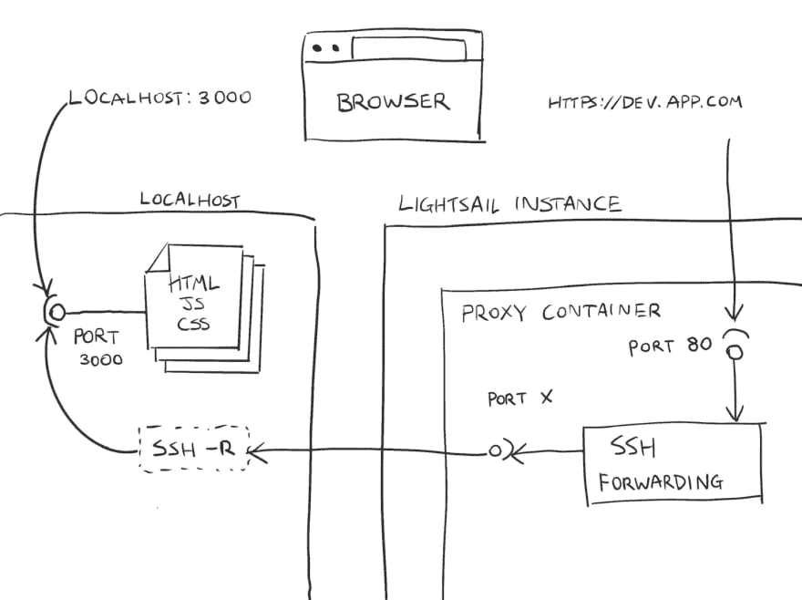T2】](https://res.cloudinary.com/practicaldev/image/fetch/s--Qla127n9--/c_limit%2Cf_auto%2Cfl_progressive%2Cq_auto%2Cw_880/https://miro.medium.com/max/1548/0%2Axl9Fxm5B-39DaRCk)

使用 [Dockerize 一个 SSH 服务](https://docs.docker.com/engine/examples/running_ssh_service/)作为起点，我已经创建了一个[库](https://github.com/robzhu/nginx-local-tunnel)，带有一个工作 Dockerfile 和 nginx 配置以供参考。下面是总结步骤:

```
git clone https://github.com/robzhu/nginx-local-tunnel
cd nginx-local-tunnel
docker build -t {DOCKERUSER}/dev-proxy . --build-arg ROOTPW={PASSWORD}

# start the proxy container
# Note, 2222 is the port we opened on the instance earlier.
docker run --detach -p 2222:22 \
    --name dev-proxy \
    --env "VIRTUAL_HOST=dev.EXAMPLE.com" \
    --env "LETSENCRYPT_HOST=dev.EXAMPLE.com" \
    {DOCKERUSER}/dev-proxy

# Ports explained:
# 3000 refers to the port that your app is running on localhost.
# 2222 is the forwarded port on the host that we use to directly SSH into the container.
# 80 is the default HTTP port, forwarded from the host
ssh -R :80:localhost:3000 -p 2222 root@dev.EXAMPLE.com

# Start sample app on localhost
cd node-hello && npm i
nodemon main.js
# Point browser to https://dev.EXAMPLE.com 
```

只有当反向代理 SSH 连接保持打开时，反向代理子域才会起作用。如果没有 SSH 连接，您应该会看到一个 nginx 网关错误:

[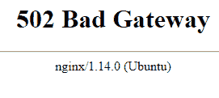T2】](https://res.cloudinary.com/practicaldev/image/fetch/s--oK64x2oC--/c_limit%2Cf_auto%2Cfl_progressive%2Cq_auto%2Cw_880/https://miro.medium.com/max/271/0%2Aok8kFNskEYCjtptO)

虽然这种解决方案很方便，但要非常小心，因为它可能会将您的工作进展暴露在互联网上。考虑添加额外的授权逻辑和[设置，以允许/拒绝特定的 IP](https://docs.nginx.com/nginx/admin-guide/security-controls/controlling-access-proxied-tcp/)。

## [](#automatic-deployment)自动部署

最后，让我们构建一个自动化工作流，它监视源存储库上的提交，构建一个更新的容器映像，并在我们的主机上重新部署容器。有很多方法可以做到这一点，但为了简单起见，我选择了以下组合:

1.  开源代码库
2.  [Docker 自动构建](https://docs.docker.com/docker-hub/builds/)
3.  首先，创建一个 GitHub 存储库来存放您的应用程序源代码。出于演示目的，您可以克隆我的 [express hello-world 示例](https://github.com/robzhu/express-hello)。在 docker hub 页面上，创建一个新的存储库，单击 GitHub 图标，并从下拉列表中选择您的存储库:

[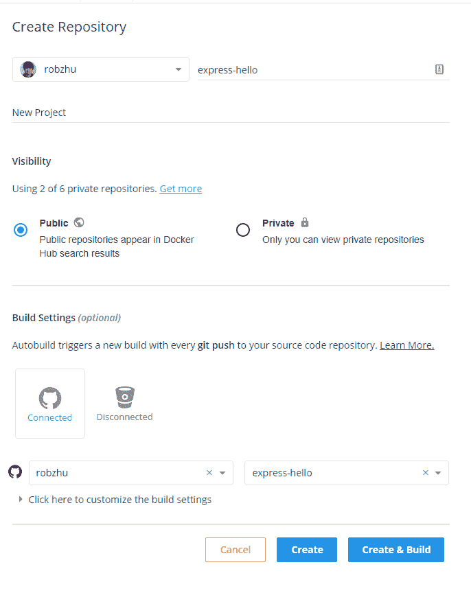T2】](https://res.cloudinary.com/practicaldev/image/fetch/s--K7q4vXxJ--/c_limit%2Cf_auto%2Cfl_progressive%2Cq_auto%2Cw_880/https://miro.medium.com/max/686/0%2AiZiN6JdLFCQJ7uhc)

现在 docker 将监视对 repo 的提交，并使用“latest”标签构建一个新的映像作为响应。一旦图像可用，就像这样启动容器:

```
docker run --detach \
    --name app \
    --env "VIRTUAL_HOST=app.raccoon.news" \
    --env "LETSENCRYPT_HOST=app.raccoon.news" \
    robzhu/express-hello 
```

*注意:您需要在 DNS 设置中添加 app .浣熊. news 作为 A 记录*

最后，让我们使用[瞭望塔](https://containrrr.github.io/watchtower/)来轮询 dockerhub，并在检测到新图像时更新“app”容器:

```
docker run -d \
    --name watchtower \
    -v /var/run/docker.sock:/var/run/docker.sock \
    containrrr/watchtower \
    --interval 10 \
    APPCONTAINERNAME 
```

## [](#summary)总结

我们的 Pocket PaaS 现在已经完成了！只要我们部署新的容器并添加 VIRTUAL_HOST 和 LETSENCRYPT_HOST 环境变量，我们就可以获得自动子域路由和 SSL 终止。有了 SSH 反向隧道，我们可以在本地开发机器上使用我们最喜欢的 IDE 进行开发，并在[https://dev.EXAMPLE.COM](https://dev.EXAMPLE.COM)测试/共享我们的应用。由于这是一个带有 SSL 的公共 URL，我们可以测试 Alexa Skills、GitHub Webhooks、CORS 设置、PWAs 以及其他任何需要 SSL 的东西。一旦我们对我们的更改感到满意，git commit 将触发 docker 映像的自动重建，这将由 Watchtower 自动重新部署。

[T2】](https://res.cloudinary.com/practicaldev/image/fetch/s---EKdOYLz--/c_limit%2Cf_auto%2Cfl_progressive%2Cq_auto%2Cw_880/https://miro.medium.com/max/480/0%2AWpb5ebvAys7OL9Fl)

我希望这是有用的。想法？请在 twitter 上留言或直接给我发消息: [@rbzhu](https://twitter.com/rbzhu) 。