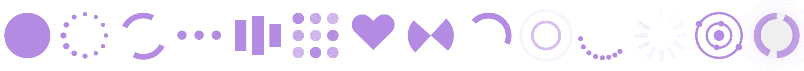

# 我如何创建自己的 React Spinners 库

> 原文：<https://dev.to/joshk2/how-i-created-my-own-react-spinners-library-4ckn>

我创建了一个使用 Airtable 作为数据库的应用程序。我使用了一个 spinner 来代替单调的空白页面，否则在请求的数据到达和页面相应地呈现的时间内，空白页面会呈现给用户。

我本来可以使用现有的 react spinners 库，但是相反，我决定利用这个机会来学习如何构建自己的 spinners 和自己的 react 组件库。因此，在这篇文章中，我将向你展示我的库，以及一个如何使用旋转器的例子。

## [反应过来的旋转器库](https://bit.dev/joshk/react-spinners-css)

所以，事不宜迟，这里是我的 react spinners 库( [GitHub](https://github.com/JoshK2/react-spinners-css) ， [Bit](https://bit.dev/joshk/react-spinners-css) )。它基于 loading.io CSS 加载器。我添加了将颜色和大小作为组件的道具发送的选项，这样可以更容易地定制微调器。我已经将 spinners(总共 12 个)导出到 [bit.dev](https://bit.dev/joshk/react-spinners-css) 中，这样你就可以很容易地在 bit 的 live playground 中查看和调整它们，并将它们作为包与 NPM 或 Yarn 一起安装(或者使用 Bit import 获得它们的源代码)。

##  [乔什科 2](https://github.com/JoshK2)/[react-spinners-CSS](https://github.com/JoshK2/react-spinners-css)

### React spinners 组件的惊人集合，包含纯 css

<article class="markdown-body entry-content container-lg" itemprop="text">

# 反应旋转器 CSS 加载器( [Vue](https://github.com/JoshK2/vue-spinners-css) 、 [Angular](https://github.com/JoshK2/ng-spinners)

React spinners 组件与纯 css 惊人的集合。
React 微调器基于 loading.io 并来自整个 web。
如果您想添加自己的 spinner，请遵循[投稿指南](https://raw.githubusercontent.com/JoshK2/react-spinners-css/master/CONTRIBUTING.md)。

*   <g-emoji class="g-emoji" alias="nail_care" fallback-src="https://github.githubassets.cimg/icons/emoji/unicode/1f485.png">💅</g-emoji>没有额外的 CSS 导入
*   <g-emoji class="g-emoji" alias="scissors" fallback-src="https://github.githubassets.cimg/icons/emoji/unicode/2702.png">✂️</g-emoji> 零依赖
*   <g-emoji class="g-emoji" alias="package" fallback-src="https://github.githubassets.cimg/icons/emoji/unicode/1f4e6.png">📦</g-emoji>旋转器可以单独安装

## [现场演示](https://bit.dev/joshk/react-spinners-css)

用[位](https://bit.dev/joshk/react-spinners-css)浏览组件并探索它们的道具。
使用 npm、纱线或钻头安装特定的 react spinner 组件，无需安装整个项目。
[安装组件和现场演示](https://bit.dev/joshk/react-spinners-css)

## <g-emoji class="g-emoji" alias="rocket" fallback-src="https://github.githubassets.cimg/icons/emoji/unicode/1f680.png">🚀</g-emoji>微调器列表-属性类型和默认属性

每个组件都接受一个`color`道具，少数组件也接受`size`道具。
默认的`color`道具是`#7f58af`。接受`size`道具的组件有一个默认的像素大小。

| 纺纱机 | 颜色:字符串 | 尺寸:数量 | 类名:字符串 | 样式:对象 |
| --- | --- | --- | --- | --- |
| `<Circle/>` | `#7f58af` | `64` | `""` | `{}` |
| `<Default/>` | `#7f58af` | `80` | `""` | `{}` |

…</article>

[View on GitHub](https://github.com/JoshK2/react-spinners-css)

例如，这是 circle loader，组件可以接收颜色和大小属性: