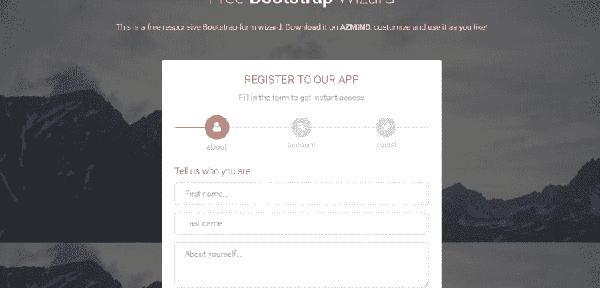
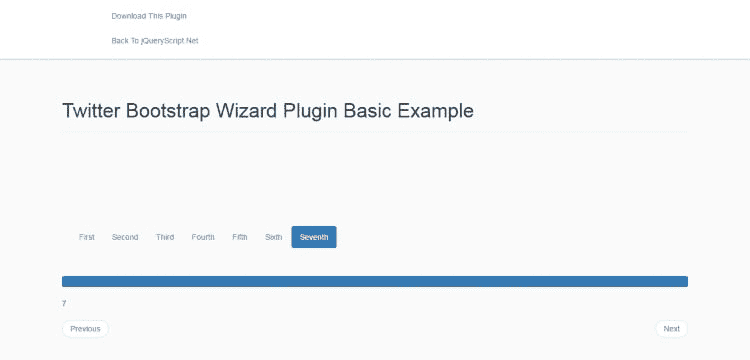
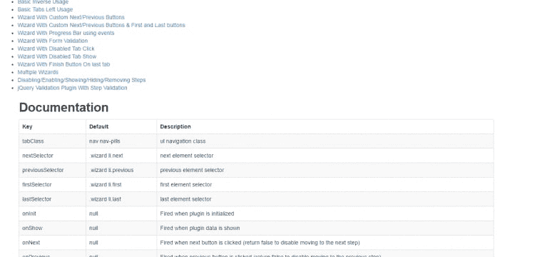
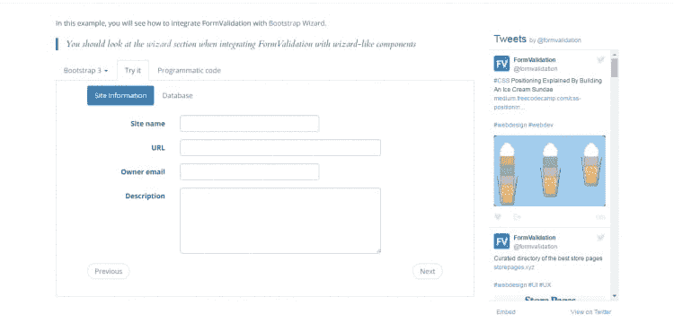
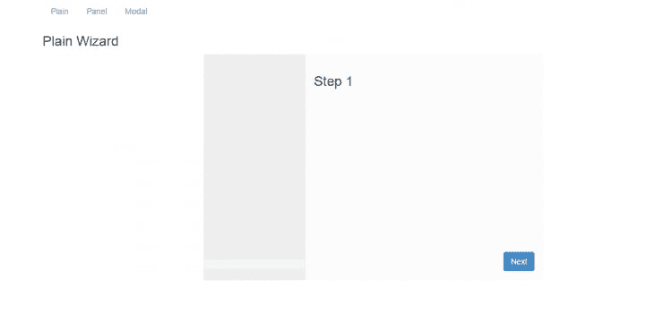
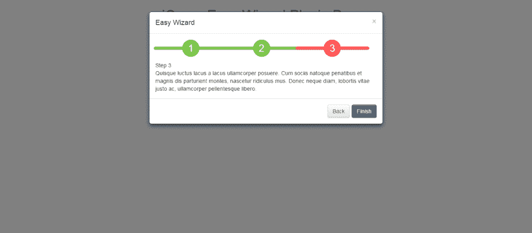
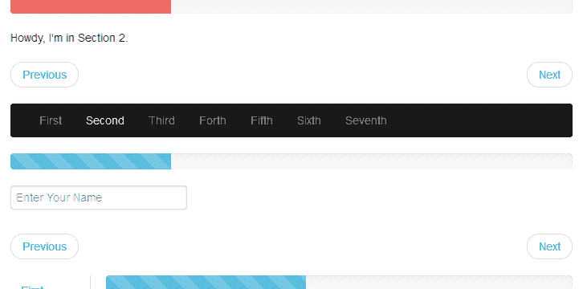

# 10 个免费的引导向导

> 原文:[https://dev . to/creative Tim _ official/10-free-bootstrap-wizards-587k](https://dev.to/creativetim_official/10-free-bootstrap-wizards-587k)

###### 本帖包含附属链接；如果您从本文提供的不同链接购买产品或服务，我可能会收到报酬。

* * *

因为 **Bootstrap Wizard** 是可以在项目中使用的最方便的元素之一，所以我们想帮助你。所以今天我们给你列出了 **10 个有用的免费引导向导**。

告诉我们您的想法，如果您认为列表中缺少了什么，请给我们留下您的评论。

### **1。[素材引导向导](https://www.creative-tim.com/product/material-bootstrap-wizard?ref=devto)**

[Material Bootstrap Wizard](https://demos.creative-tim.com/material-bootstrap-wizard/wizard-book-room.html?ref=devto) 是一款反应灵敏的向导，灵感来自著名的谷歌材料设计，配有 3 个有用的例子和 5 种颜色。
T3T5】

[下载](https://www.creative-tim.com/product/material-bootstrap-wizard?ref=devto) | [直播预告](https://demos.creative-tim.com/material-bootstrap-wizard/wizard-book-room.html?ref=devto) | [获取主持](https://m.do.co/c/276af09d9975)

### **2。引导向导 BootZard**

Bootstrap 向导 BootZard 是一个免费的引导表单向导模板，带有字段验证。
[T3】](https://res.cloudinary.com/practicaldev/image/fetch/s--zKfH_Yvb--/c_limit%2Cf_auto%2Cfl_progressive%2Cq_auto%2Cw_880/https://blog.creative-tim.com/wp-content/uploads/2016/08/screencapture-azmind-demo-bootzard-bootstrap-wizard-template-14726551175371-750x360.png)

[下载](https://azmind.com/bootstrap-wizard/) | [直播预告](https://azmind.com/demo/bootzard-bootstrap-wizard-template/) | [获取主持](https://m.do.co/c/276af09d9975)

### **3。引导应用程序向导**

应用程序向导是一个引导插件，允许多步表单以自然的顺序进行，同时保持灵活性。
[T3】](https://res.cloudinary.com/practicaldev/image/fetch/s--kAFfXkNz--/c_limit%2Cf_auto%2Cfl_progressive%2Cq_auto%2Cw_880/https://blog.creative-tim.com/wp-content/uploads/2016/08/687474703a2f2f692e696d6775722e636f6d2f653942325a2e706e67-750x360.png)

[下载](https://www.panopta.com/infrastructure-monitoring-blog/bootstrap-application-wizard-2/) | [直播预告](https://www.panopta.com/infrastructure-monitoring-blog/bootstrap-application-wizard-2/) | [获取主持](https://m.do.co/c/276af09d9975)

### **4。Twitter 引导向导**

Twitter Bootstrap Wizard 是一个 jQuery 插件，它使用 Bootstrap 的 tabs & pills 组件来生成一个交互式的分步向导 UI。
[T3】](https://res.cloudinary.com/practicaldev/image/fetch/s--BhG9Ntz_--/c_limit%2Cf_auto%2Cfl_progressive%2Cq_auto%2Cw_880/https://blog.creative-tim.com/wp-content/uploads/2016/08/screencapture-jqueryscript-net-demo-Sequential-Step-Wizard-Plugin-with-jQuery-Bootstrap-Twitter-Bootstrap-Wizard-1472651092234-750x360.png)

[下载](https://www.jqueryscript.net/other/Sequential-Step-Wizard-Plugin-with-jQuery-Bootstrap-Twitter-Bootstrap-Wizard.html) | [直播预告](https://www.jqueryscript.net/demo/Sequential-Step-Wizard-Plugin-with-jQuery-Bootstrap-Twitter-Bootstrap-Wizard/) | [获取主持](https://m.do.co/c/276af09d9975)

### **5。Twitter 引导向导插件**

这个 Twitter 引导插件使用格式化的表格结构构建了一个向导。它允许使用按钮通过不同的向导步骤来构建向导功能。
[T3】](https://res.cloudinary.com/practicaldev/image/fetch/s--ANwN9sg4--/c_limit%2Cf_auto%2Cfl_progressive%2Cq_auto%2Cw_880/https://blog.creative-tim.com/wp-content/uploads/2016/08/screencapture-vadimg-twitter-bootstrap-wizard-example-14726514194301-750x360.png)

[下载](http://www.bootstraplibrary.com/twitter-bootstrap-wizard-plugin/) | [直播预告](http://www.bootstraplibrary.com/twitter-bootstrap-wizard-plugin/) | [获取主持](https://m.do.co/c/276af09d9975)

### **6。使用引导向导进行表单验证**

在此示例中，您将看到如何将 FormValidation 与 Bootstrap Wizard 集成。
[T3】](https://res.cloudinary.com/practicaldev/image/fetch/s--K5tIpVFX--/c_limit%2Cf_auto%2Cfl_progressive%2Cq_auto%2Cw_880/https://blog.creative-tim.com/wp-content/uploads/2016/08/screencapture-formvalidation-io-examples-bootstrap-wizard-1472652607604-750x360.png)

[下载](https://formvalidation.io) | [直播预告](https://formvalidation.io) | [获取主持](https://m.do.co/c/276af09d9975)

### **7。引导向导–v 0.1**

Bootstrap Wizard 是一个干净的向导，可用于 Bootstrap 面板、模型等。
[T3】](https://res.cloudinary.com/practicaldev/image/fetch/s--rDv1hnWw--/c_limit%2Cf_auto%2Cfl_progressive%2Cq_auto%2Cw_880/https://blog.creative-tim.com/wp-content/uploads/2016/08/bootstrapwizard-750x360.png)

[下载](http://www.bootstrapwizard.com) |【直播预告】| [获取主持](https://m.do.co/c/276af09d9975)(【http://www.bootstrapwizard.com】T4)

### **8。简易向导**

Easy Wizard 是一个 jQuery 插件，用于创建一个向导界面，在一个引导模式窗口中显示您的一步一步的进度。
[T3】](https://res.cloudinary.com/practicaldev/image/fetch/s--V8HLEMbU--/c_limit%2Cf_auto%2Cfl_progressive%2Cq_auto%2Cw_880/https://blog.creative-tim.com/wp-content/uploads/2016/08/screencapture-jqueryscript-net-demo-Simple-Wizard-Modal-Plugin-with-jQuery-Bootstrap-Easy-Wizard-1472654012550.png)

[下载](https://www.jqueryscript.net/other/Simple-Wizard-Modal-Plugin-with-jQuery-Bootstrap-Easy-Wizard.html) | [直播预告](https://www.jqueryscript.net/demo/Simple-Wizard-Modal-Plugin-with-jQuery-Bootstrap-Easy-Wizard/) | [获取主持](https://m.do.co/c/276af09d9975)

### **9。Twitter 引导向导**

一个引导组件，用于将长表单或页面结构分解成更小、更容易理解的部分，并以步骤向导的形式呈现它们。
[T3】](https://res.cloudinary.com/practicaldev/image/fetch/s--tVFT8PxX--/c_limit%2Cf_auto%2Cfl_progressive%2Cq_auto%2Cw_880/https://blog.creative-tim.com/wp-content/uploads/2016/08/Twitter-Bootstrap-Wizard_1-731x360.png)

[下载](https://webscripts.softpedia.com/script/Email-Systems/Utilities/Twitter-Bootstrap-Wizard-82963.html) | [直播预告](https://webscripts.softpedia.com/script/Email-Systems/Utilities/Twitter-Bootstrap-Wizard-82963.html) | [获取主持](https://m.do.co/c/276af09d9975)

### **10。[自举向导](https://www.creative-tim.com/product/bootstrap-wizard?ref=devto)T5】**

[Bootstrap Wizard](https://demos.creative-tim.com/bootstrap-wizard/index.html?ref=devto)是一个反应灵敏的向导，有 3 个有用的例子和 5 种鲜艳的颜色。
T3T5】

[下载](https://www.creative-tim.com/product/bootstrap-wizard?ref=devto) | [直播预告](https://demos.creative-tim.com/bootstrap-wizard/index.html?ref=devto) | [获取主持](https://m.do.co/c/276af09d9975)