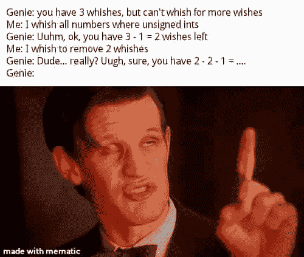

# 解释这个无符号整数迷因，就像我五岁一样

> 原文:[https://dev . to/bauri palash/explain-this-unsigned-int-meme-like-I-m-five-2b4b](https://dev.to/bauripalash/explain-this-unsigned-int-meme-like-i-m-five-2b4b)

请解释一下这个迷因？

[T2】](https://res.cloudinary.com/practicaldev/image/fetch/s--fbfGCniu--/c_limit%2Cf_auto%2Cfl_progressive%2Cq_auto%2Cw_880/https://thepracticaldev.s3.amazonaws.com/i/8mxal3socj7qgbu7rav7.jpg)

多余的`-1`从哪里来？