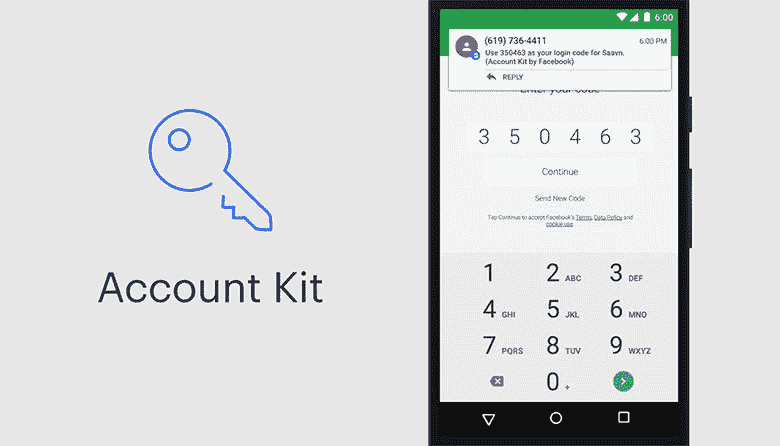
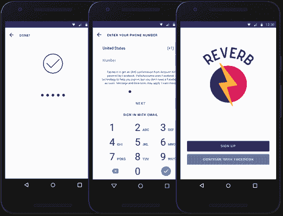

# 脸书的客户工具包👍

> 原文：<https://dev.to/realabbas/account-kit-by-facebook-52f>

 
在开发移动和 web 应用程序的过程中，我一直在寻找能够产生**零费用**并产生**无限动态口令的认证服务。**

我尝试了 Auth0，Firebase，但它们并不那么有前途。后来，我偶然发现了脸书的账户工具包，完全免费

*   机器人
*   ios
*   Web 客户端

脸书的 Account Kit 是一个无麻烦的**无密码认证系统**

**先决条件**

*   脸书开发者帐户
*   帐户套件客户端令牌
*   帐户套件应用程序密码

设置开发者账户后，您需要部署服务器代码，并将 SDK 集成到您的应用程序或网站中。脸书今年也推出了比手机验证更简单的 Whatsapp 验证。

几家在核心技术中集成了脸书账户套件的大公司有🏆

*   国外手机交友软件
*   -你好-你好
*   Fynd

**有用的资源** ⚡️

*   [正式文件](https://developers.facebook.com/docs/accountkit/)

*   对于 React 本地开发者-
    阅读 React 本地使用脸书账户工具包中的[无密码认证](https://medium.com/react-native-training/passwordless-authentication-in-react-native-using-facebook-account-kit-part-1-8d83e92077e9)

*   安卓系统——观看 Youtube 上的视频[脸书在安卓系统上设置账户套件](https://www.youtube.com/watch?v=4mRMTcmb_V8)

*   [设置脸书账户套件](https://auth0.com/blog/facebook-account-kit-passwordless-authentication/)

**Github 回购**🚀

*   [安卓账户工具包示例](https://github.com/fbsamples/account-kit-samples-for-android)

*   [iOS 版账户工具包样品](https://github.com/fbsamples/account-kit-samples-for-ios)

*   【React 原生账户套件

*   【React 的账户套件。JS