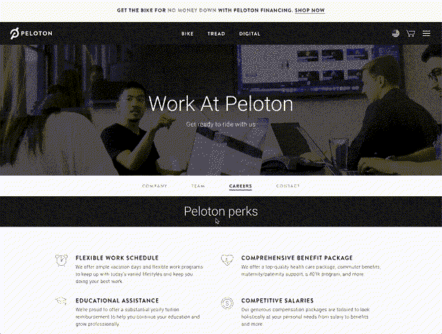
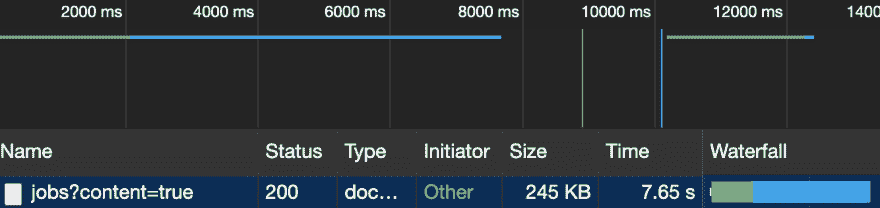
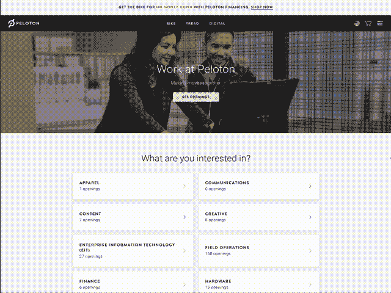

# 作为 Peloton 的前端开发人员，我学到了如何规划和构建 MVP

> 原文:[https://dev . to/bholmesdev/what-I-learn-planning-and-building-an-MVP-as-a-frontend-dev-at-peloton-41id](https://dev.to/bholmesdev/what-i-learned-planning-and-building-an-mvp-as-a-frontend-dev-at-peloton-41id)

写这篇文章的时候，我刚刚结束了在 peloton interactive 的暑期实习。当我挂上我的自行车帮派头盔时，我想谈谈我最大的学习经历:在一个大型 ReactJS 项目中工作，从概念到 MVP 演示。我将从头到尾介绍计划和构建项目的过程，讨论我在这个过程中所学到的经验教训。

在你听到“实习”这个词之前，请注意这是一个 100%真实的项目，现在已经投入生产！

***注意:**这篇文章既谈到了产品规划过程，也谈到了我在 git 和设计方面的一些心得。因为我不知道我的读者写这篇文章的背景，我希望你能在任何方面找到一些对你有用的东西！*

## 那么，项目是什么？

简而言之，修复...这个。

[T2】](https://res.cloudinary.com/practicaldev/image/fetch/s--tErW76KY--/c_limit%2Cf_auto%2Cfl_progressive%2Cq_66%2Cw_880/https://thepracticaldev.s3.amazonaws.com/i/6h7wnqu21z6zf9nl7dqp.gif)

很高兴看到很多空缺职位。除非你在寻找正确的标题时迷路了😕公司展示也有一个主要问题。我不知道你是怎么想的，但是仅仅是一大堆工作并不能让我对我申请的公司感到兴奋！

因此，我的团队的任务是撕掉我们无限的空缺职位列表，并把一些更友好的东西放在它的位置上。我们还需要更好地传播公司的故事，让人们去**砸**那个应用按钮！

## 第一课:竞争力分析很重要！

像任何一个充满幻想的 CS 学生一样，当设计模型涌入时，我希望马上开始在前端进行黑客攻击。但是慢下来！我们首先需要做很多研究。否则，我们可能会以另一个可用性差的无底洞列表而告终。

在 Peloton，对现有解决方案(在这种情况下是其他职业网站)的分析是由 UX 设计师完成的。尽管从 UI 的角度来看，我并没有参与到最终体验中，但我需要权衡实现的选项。换句话说，我们如何在没有太多技术开销的情况下尽可能快地加载我们所有的工作列表？

对于一些背景，Peloton 的现有职业页面使用 Greenhouse API 来检索职位发布并按部门标题显示。这是通过一个单独的、超大的 API 调用来完成的，该调用获取**所有**附有**所有**部门和**所有**职位描述的职位列表。有数百份清单和详尽的职位描述，这个电话...矮胖。

[T2】](https://res.cloudinary.com/practicaldev/image/fetch/s--8TIGjLN5--/c_limit%2Cf_auto%2Cfl_progressive%2Cq_auto%2Cw_880/https://thepracticaldev.s3.amazonaws.com/i/q323fxatw8g667wz41cz.png)

如果我们试图在手机连接不良的情况下获取，可能需要 10 秒钟才能开始滚动！

### 有哪些比较好的选择？

考虑到这一点，我开始使用 Greenhouse 检查现有职业页面的网络活动。仅从开发工具来看，我已经可以拼凑一些更聪明的方法来尝试:

*   使用自定义端点进行分页加载。由于温室 API 不提供分页，我需要在 Peloton 的后端添加一个端点来将温室响应分成页面。这将把我们的页面变成一个全栈的努力，虽然它不会太难。
*   使用 PHP 与[温室的 API 插件。](https://github.com/grnhse/greenhouse-tools-php)虽然这为每个端点增加了一些助手方法，但它只增加了我自己调用的功能。另外，我还得学习 PHP😬
*   建立一个 100%静态的网站。换句话说，在运行时没有网络调用来进行**即时**加载。然而，由于技术开销，在回购中加入一个像 [Gatsby](https://www.gatsbyjs.org) 这样的静态站点生成器几乎是不可能的。因此，我需要一个定制的解决方案来在构建时轮询 Greenhouse 并保持作业列表最新，这也相当复杂。
*   分页和静态内容的混合。Spotify Jobs 用它来立即显示列表的第一页，并向 API 查询附加内容。虽然很巧妙，但这与构建一个 100%静态的页面有相似的开销。
*   只在主页上加载部门，以进行更小的 API 调用。当选择一个部门时，我可以单独检索该部门的列表。

仔细观察 API，我注意到另一个简单的优势:每个工作列表都包含一个链接到工作描述和申请表的 URL。这意味着我们可以完全避免加载工作描述，直接链接到应用程序，节省了大量的响应时间。

### 这是如何告知设计的？

在研究了温室 API 并权衡了这些选项之后，我有了足够的信息来回到产品和设计上来。design 观察现有解决方案的 UX，我观察它们背后的技术，我们在一个可靠的方法上达成一致:

*   只需在主页上显示部门列表，以及每个部门的职位空缺数量。这减少了 API 响应的大小，同时使主页更吸引人。
*   为每个部门创建登录页面。每个都应该包括各自的工作列表和位置过滤器。
*   增加一些关于公司使命的额外部分🌶️.对于 MVP，这意味着使用现有的公司津贴部分，并添加一个关于公司文化的视频。

这显然不是最终的完美解决方案。如果用户想按位置浏览所有工作列表，该怎么办？一个对零售职位感兴趣的人和一个在总部工作的工程师相比，会如何浏览呢？

这些问题值得一问，因为团队正在充实未来的最佳体验。然而，我们不能忽略眼前的问题:让现有的体验更快更吸引人。如果我们的 MVP 成功了，这仍然是一个伟大的起点！

## 第二课:史诗对任务分解非常有帮助

在研究想法并决定解决方案后，我们需要开始构建可行的任务。我已经解决了相当多的半思考过的 GitHub 问题，但是这增加了整个产品术语的世界。

第一个是“KPI”，或关键绩效指标。说得通俗一点，我们需要衡量一个特性对项目和整个公司的价值。这指导了 MVP 设计过程，以了解制作 kicka**职业页面的最少功能集。推而广之，这引导了我们的任务所关注的用户故事。

...这让我想到了用户故事。虽然这在我的大学课程中有所涉及，但我对它们在项目规划中有多大用处没有什么看法。对于那些不熟悉的人来说，格式是这样的:

作为一个利益相关者，我想做一些事情，这样就有理由。

基于此，我们可以计算出实现这个目标所需的所有任务。这通常会导致每个可操作任务的“史诗”分支。我认为 epic 是我们为解决特定用户故事而开发的首要功能。由此，我们可以计算出开发人员和设计人员应该做的主要工作。

对我们来说，这从几个用户故事开始:

*   作为一个访问者，我想轻松地找到我正在寻找的职业，这样我就可以申请了。
*   作为一名访问者，我想查看我的首选位置的所有可用工作，以便我可以查看我在那里的机会。
*   作为一名访问者，我想更多地了解这家公司，这样我才能决定它是否适合我。

从这些，我们得出了一些可操作的史诗:

*   按部门显示工作列表
*   允许筛选工作列表
*   展示关于 Peloton 公司使命的视频

有了这些 MVP 目标和模型，是时候开始开发了！

## 第三课:智能子任务导致可管理的 PRs

作为向我的分支添加不相关修复的国王，这是一个很难学习的课程🙃尽管我在大学期间改进了团队项目的工作，但我很少需要自己计划一个月的任务，这样 pr 们就可以聪明地互相帮助。如果我没有先动手，这有时会很困难，因为在开始之前我可能不知道这些特性的技术挑战。尽管如此，我没有像往常一样一头扎进去，而是坐下来计划一个半现实的路线图。

最后，我和项目经理一起列出了我要完成的步骤:

*   让招聘页面显示在新的网址上(为了更容易被发现，我们使用了`[onepeloton.com/careers](http://onepeloton.com/careers)`而不是旧的`/company/careers`)
*   将现有的“津贴”部分移植到新页面
*   获取从温室中提取的部门列表，正确格式化以供前端使用
*   在页面上显示部门列表
*   添加带有“行动号召”的横幅图像，该图像将滚动到部门列表
*   添加可以通过名称链接的独立部门页面(例如可通过`onepeloton.com/careers/apparel`联系“服装”部门
*   从温室中提取工作列表以显示在每个部门页面上
*   添加位置过滤器
*   添加重定向到不同部门页面的部门筛选器

进行这种全面的概述真的有助于判断每个特征的规模。它还帮助我弄清楚哪些任务依赖于其他任务，比如在构建视觉效果之前设置 URL 路由。

### 那么，你是如何确保每一次公关都是“可控的”呢

尽管这个任务列表指导了我们的问题板，但是一些问题对于多个 pr 来说是足够大的。

将任务列表归档到可能的子任务中会导致一些小问题。例如，我注意到部门页面和登录页面都需要访问我们的 API 调度函数，所以我重新调整了这些布局，使用共享的包装器组件。在这些情况下，需要额外的公关来保持每次推送的目的高度集中。尽管这意味着团队需要审查更多的 pr，但是它们的范围更加清晰！我从一个开发伙伴那里学到了这个指针，他确保 PRs 接触大约 6 个或更少的文件，不包括对导入等的单行编辑。

测试驱动开发也有助于衡量每个 PR 的大小。这是一个最好的教训...把一个公关的[绝对单位](https://www.dailydot.com/unclick/absolute-unit-meme/)放出来，没人有时间去回顾。

当接受一项任务并在表面水平上判断其规模时，就会发生这种情况。在这里，我为每个部门设置了 [URL slugs](https://prettylinks.com/2018/03/url-slugs/) ，这样每个部门都可以拥有自己的可链接的登录页面。起初，这看起来像是从每个部门的名称到一个 slug 的简单映射，并设置路由以显示正确的页面。这有一些小警告，比如在生成 slugs 之前等待部门从温室进来，但是这很容易建立在我已经有的代码上。所以，我做了一个新的 git 分支，开始破解它，让页面工作起来...

意识到我没有处理坏鼻涕虫的重定向。

这种对重定向的检查最终比看上去的要多一点。一位同事向我展示了一种更简单的方法，使用 [Redux 状态管理](https://redux.js.org)来处理重定向，但是他花了一个多星期的时间来检查我的代码！

这是一个经典的例子，说明了从测试的角度来思考如何向我展示我需要考虑的所有情况，从而更容易地分解一切。根据我的经验，测试文件的大小往往反映了最终 PR 的大小。所以，如果那些单元测试很容易预测，试着尽早把它们写出来，以理解一个特性的范围。如果获得 100%的测试覆盖率是不可能的，那么在深入研究之前，试着写下该特性所有可能的用例😁

## 第四课:设计师沟通是关键

我承认，这不是我第一次和设计师合作一个项目。然而，他们通常经验不足，或者从事较小规模的项目，围绕最终产品的设计有很大的灵活性。与训练有素的 UX 一起工作...新项目的专家是一种新的体验，但也是一种令人兴奋的体验！

首先，从设计师那里获得定期反馈对破解 CSS 非常有帮助。这意味着 UAT 评论，或者对网站的测试版本给出反馈，以及更多的可视化 PRs 的桌面检查。在 Peloton，设计师们致力于一个非常严格的桌面-平板-移动实体模型系统，每个都有特定的像素断点。这导致了对我创建的所有布局的一些详细反馈，小到最小的 10px 填充调整。

正如您可能从这些详细的指南中所期望的，Peloton 有一个全面的设计系统来管理元素的可伸缩性。事实上，他们有一个由“UI 工程师”组成的小团队，与设计师密切沟通，以保持他们的系统是最新的。这意味着使用[故事书](https://storybook.js.org)来跟踪所有的按钮、标题、横幅等。供设计者和开发者参考。这使得我为文本和导航组件确定大小和间距的工作变得容易多了，只剩下少量的自定义布局需要手工处理。只要注意断点并使用 flexbox 就可以有效地处理这些问题！

[T2】](https://res.cloudinary.com/practicaldev/image/fetch/s--KTc--ZOx--/c_limit%2Cf_auto%2Cfl_progressive%2Cq_66%2Cw_880/https://thepracticaldev.s3.amazonaws.com/i/6w3ucpry1fwyz3lm924r.gif)

职业生涯的最终登录页面。所有按钮、标题和图像大小都来自 Storybook 组件，而箭头图标和两列布局使用自定义 CSS。

在 MVP 的每一页所使用的图像上也有密切的沟通。也就是说，我们需要在图像需要被裁剪的地方找出断点。例如，如果桌面上图像右侧的一个图形需要出现在移动设备的中央，则需要对该图像进行两种不同的裁剪。我可以使用一些定位魔法来使用纯 CSS 进行裁剪，但是因为我们的项目使用了 [Cloudinary](https://cloudinary.com) 来根据屏幕宽度提供不同大小的图像，所以没有理由这么做！

## 包装完毕

今年夏天，我在 Peloton 度过了一段美好而有意义的经历。考虑到与正式员工相同的责任和期望，一个地位低下的实习生很少能成为项目团队的主要开发人员。更难得的是，一个实习生能够向公司的利益相关者展示这个特性，并且让这个项目不加修改地部署到生产中去！如果你感兴趣，你可以[从 MVP 演示中查看我的幻灯片组](https://careers-page-demo.surge.sh)(是的，它使用的是 [mdx-deck](https://github.com/jxnblk/mdx-deck) ！).

要查看成品，[请点击这里](https://www.onepeloton.com/careers)！

总的来说，我非常感谢我在公司的时光，我很高兴看到职业项目的进展。我希望我在这个过程中学到的这些经验能够帮助你踏上 MVP 开发之旅！🚀

## 学点小东西？

完美。如果你错过了，我发布了一个[我的“网络魔法”时事通讯](https://tinyletter.com/bholmesdev)来探索更多像这样的知识金块！

这个东西解决了 web 开发的[【首要原则】](https://www.swyx.io/first-principles-approach/)。换句话说，是什么让我们所有的 web 项目运转起来的所有 janky 浏览器 API、弯曲的 CSS 规则和半可访问的 HTML？如果你正在寻找超越框架的*，这是给你亲爱的网络巫师的🔮*

 *[立即在此订阅](https://tinyletter.com/bholmesdev)。我保证永远教，永远不会垃圾邮件❤️*