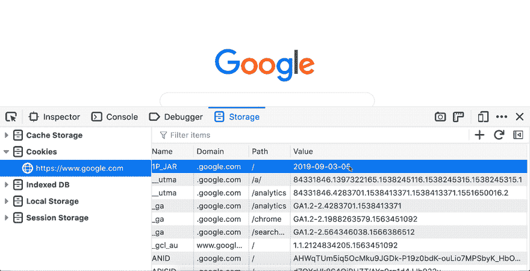
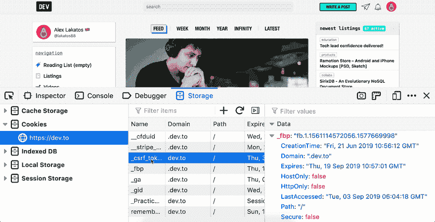
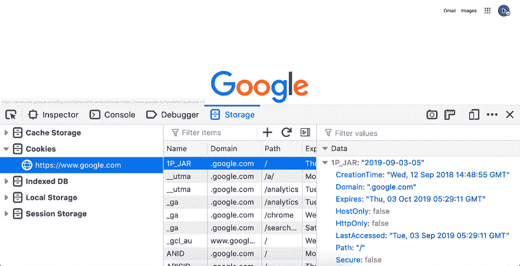
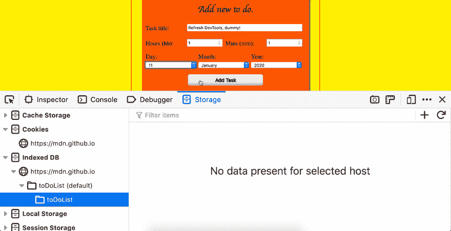
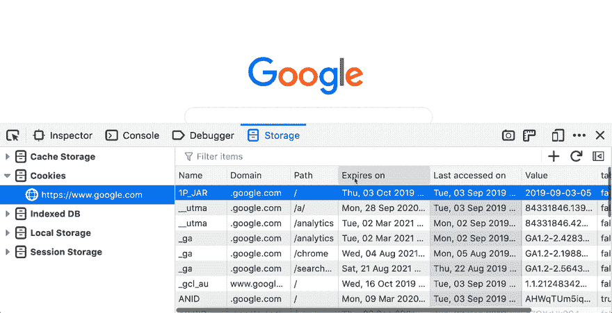

# Firefox dev tools-Storage Inspector 的 5 个技巧和窍门

> 原文:[https://dev . to/Lakatos 88/5-Firefox-devtools-storage-inspector-3loo](https://dev.to/lakatos88/5-tips-and-tricks-for-firefox-devtools-storage-inspector-3l0o)

这是我努力跟上的一个系列，这些年来我已经收集了很多技巧。如果你喜欢这个或者想看更多，我是推特上的[@ Lakatos 88](https://twitter.com/lakatos88)，跟我去吧！

*这是[系列](https://dev.to/devtricks/)中的第六篇文章，这是一系列帮助你用 Firefox Devtools 调试 web 应用程序的技巧和窍门。它向你展示了在 Firefox 开发工具中使用存储检查器的 5 个技巧&。*

我使用存储检查器作为调试 web 应用程序可以在浏览器中使用的所有存储类型的快速方法。有时我也用它来扰乱存储在那里的跟踪数据😅。

我认为我使用最多的是 Cookies 和 IndexedDB 工具，但最近我发现自己花了越来越多的时间来研究缓存存储，缓存 API 作为 ServiceWorker 生命周期的一部分越来越受欢迎。

#### 编辑 cookies

您可以编辑浏览器中存储的所有 cookies，至少可以部分编辑。你目前不能编辑灰色的列，比如创建和最后访问日期，或者像`hostOnly`和`sameSite`这样的安全标志。要编辑 cookie 的其他字段，只需双击要编辑的单元格并键入新值。

[T2】](https://res.cloudinary.com/practicaldev/image/fetch/s--9Cqvb_rm--/c_limit%2Cf_auto%2Cfl_progressive%2Cq_66%2Cw_880/http://alexlakatos.com/img/posts/devtricks/storage/edit-cookie.gif)

#### 删除 Cookies

有多种方法可以在存储检查器中删除 cookies。最简单的方法是在选中一行时按退格键，这样就会删除 cookie。从 Firefox 68 开始，本地存储和会话存储也可以在您按退格键时删除条目。我认为对我来说最有用的一个是`Delete all from domain`功能。不过有个问题，域名必须完全匹配，所以从`.dev.to`删除 cookie 不会删除`dev.to`的 cookie，反之亦然。

[T2】](https://res.cloudinary.com/practicaldev/image/fetch/s--j9VaFqD3--/c_limit%2Cf_auto%2Cfl_progressive%2Cq_66%2Cw_880/http://alexlakatos.com/img/posts/devtricks/storage/delete-cookies.gif)

#### cookie 的实时更新

当存储检查器打开时，您可以看到 cookie 正在实时更新，正在更改的 cookie 行将闪烁橙色。

[T2】](https://res.cloudinary.com/practicaldev/image/fetch/s--6N2yRrf9--/c_limit%2Cf_auto%2Cfl_progressive%2Cq_66%2Cw_880/http://alexlakatos.com/img/posts/devtricks/storage/realtime-update.gif)

#### 静态快照为 IndexedDB

当“存储检查器”打开时，您看不到实时更新的 IndexedDB 条目，它们只是“存储检查器”打开时的快照。为了获得更新的快照，您必须使用面板右上角的刷新按钮。

[T2】](https://res.cloudinary.com/practicaldev/image/fetch/s--EP1pGErD--/c_limit%2Cf_auto%2Cfl_progressive%2Cq_66%2Cw_880/http://alexlakatos.com/img/posts/devtricks/storage/refresh-update.gif)

#### 改变表头

您可以在“储存”检查器中更改表格的表格标题。虽然大多数表都是键/值对，隐藏任何东西都没有什么意义，但是对于 cookies 来说，这样做确实很有用。右键单击表格标题将显示启用/禁用的列标题，您可以切换它们。

[T2】](https://res.cloudinary.com/practicaldev/image/fetch/s--L6VJTxkW--/c_limit%2Cf_auto%2Cfl_progressive%2Cq_66%2Cw_880/http://alexlakatos.com/img/posts/devtricks/storage/table-header.gif)