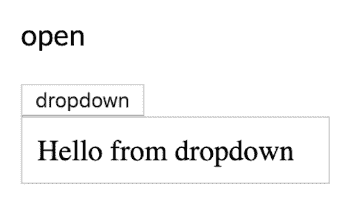
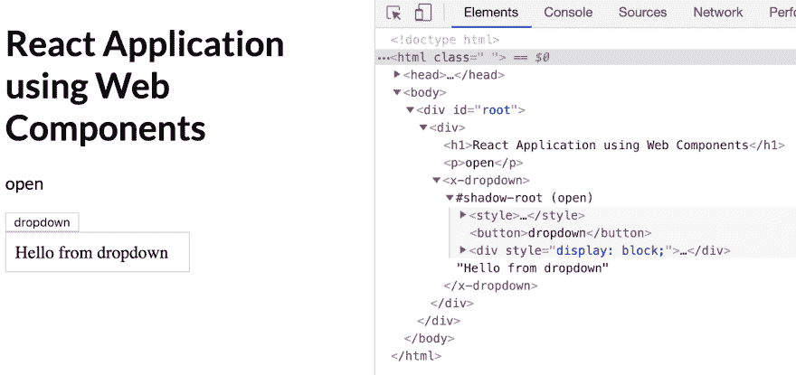

# 在 React 中使用 Web 组件

> 原文:[https://dev.to/coryrylan/using-web-components-in-react-441a](https://dev.to/coryrylan/using-web-components-in-react-441a)

这篇文章是从我的新电子书 [Web Component Essentials](https://webcomponent.dev) 中摘录的章节

在这篇文章中，我们将学习如何在 ReactJS 中使用 Web 组件。React 是一个由脸书开发的 JavaScript 库，它允许开发者用组件组成用户界面。React 是最早普及组件驱动架构的 JavaScript 库/框架之一。React 也是在 Web 组件 API 标准化之前创建的。因此，React 不像大多数其他 JavaScript 库和框架那样广泛支持 Web 组件/定制元素。

## [](#web-components-in-angular-and-vuejs)角形和 VueJS 中的腹板构件

当在 Angular 或 Vue 等其他框架中使用 Web 组件时，我们得到了内置的原生支持。在本帖中，我们将使用一个普通的下拉式 Web 组件。我们不会深入讨论 dropdown 组件的实现，但如果你想了解更多关于如何构建自己的 Web 组件的信息，请查看以下帖子:

[Web 组件介绍](https://coryrylan.com/blog/introduction-to-web-components)

[使用 lit-html 构建 Web 组件](https://coryrylan.com/blog/building-web-components-with-lit-html)

[T2】](https://res.cloudinary.com/practicaldev/image/fetch/s--agTRIRFR--/c_limit%2Cf_auto%2Cfl_progressive%2Cq_auto%2Cw_880/https://thepracticaldev.s3.amazonaws.com/i/5kuy6kz07dadfirih1xi.png)

Web 组件可以在任何地方使用，并且在使用普通 JavaScript 时就像普通的 HTML 元素一样工作。

```
<!doctype html>
<html>
  <head>
  </head>
  <body>
    <x-dropdown>
      Hello World
    </x-dropdown>

    <script type="module">
      import '/dropdown.js';

      const dropdown = document.querySelector('x-dropdown');
      dropdown.title = 'Custom Title';
      dropdown.addEventListener('show', e => console.log(e));
    </script>
  </body>
</html> 
```

HTML 中的元素可以通过属性、特性、内容槽和事件进行通信。在 Angular 或 Vue 中使用 Web 组件时，我们只需导入组件文件或包，并在模板中使用它。

```
<h1>Angular Application using Web Components</h1>

<p>
  {{open ? 'open' : 'closed'}}
</p>

<x-dropdown [title]="myTitle" (show)="toggle($event)">
  Hello from Web Component in Angular!
</x-dropdown> 
```

```
<h1>VusJS Application using Web Components</h1>

<p>
  {{show ? 'open' : 'closed'}}
</p>

<x-dropdown :title="myTitle" @show="log">
  Hello from Web Component in Vue!
</x-dropdown> 
```

Angular 和 Vue 都有一个本地绑定语法，允许您设置属性并监听本地定制元素/Web 组件上的事件。不幸的是，React 与在浏览器中设置属性和监听自定义事件不兼容。

## [](#react-compatibility)反应兼容性

React 使用类似的组件通信机制，将属性和函数作为事件在组件之间传递。不幸的是，React 事件系统是一个不使用内置浏览器自定义事件的合成系统。这个合成系统意味着 Web 组件事件不能与 React 组件通信。React，它使用的 JSX 模板语法将所有自定义元素属性错误地视为属性，迫使 React 用户只使用字符串值，而无需额外的工作。

为了克服我们示例中的这些缺点，我们将展示如何在 Web 组件周围创建瘦 React 包装器组件。包装组件将允许 React 能够与我们的 Web 组件兼容。

## [](#create-react-app)创建 React App

为了演示 React 中的 Web 组件，我们将使用 [Create React App](https://facebook.github.io/create-react-app/) CLI 工具来轻松创建 React 应用程序。为了创建我们的应用程序，我们运行以下命令:

```
npx create-react-app my-app
cd my-app
npm start 
```

一旦创建，我们将有一个完整的运行 React 应用程序。现在我们需要安装一个 Web 组件。我向 NPM 发布了一个基本的下拉组件，我们可以用它作为例子。

```
npm install web-component-essentials --save 
```

在我们的 React 应用程序中，我们需要创建一个 React `Dropdown`组件来包装我们现有的`x-dropdown`组件。

```
import React, { Component } from 'react';
import 'web-component-essentials';

export class Dropdown extends Component {
  render() {
    return (
      <x-dropdown>
        {this.props.children}
      </x-dropdown>
    )
  }
} 
```

为了使用我们的`x-dropdown`，我们将包导入到`Dropdown.js`
React 组件中。在 render 函数中，我们添加了`{this.props.children}`来将子元素传递到我们的内容槽中。

## [](#properties-and-events)属性和事件

我们需要将 Web 组件属性和事件映射到组件的 React 版本。我们需要使用`componentDidMount()`生命周期挂钩。

```
import React, { Component } from 'react';
import 'web-component-essentials';

export class Dropdown extends Component {
  constructor(props) {
    super(props);
    this.dropdownRef = React.createRef();
  }

  componentDidMount() {
    this.dropdownRef.current.title = this.props.title;

    if (this.props.onShow) {
      this.dropdownRef.current.addEventListener('show', (e) => this.props.onShow(e));
    }
  }

  render() {
    return (
      <x-dropdown ref={this.dropdownRef}>
        {this.props.children}
      </x-dropdown>
    )
  }
} 
```

使用 [Refs API](https://reactjs.org/docs/refs-and-the-dom.html) ，我们可以获取对`x-dropdown`的 DOM 引用。使用这个引用，我们可以创建我们的事件监听器。在我们的事件监听器中，我们可以调用任何传递给 react 组件的`onShow`属性的函数。这使得我们的 Web 组件能够与其他 React 组件进行通信。我们还将 React 下拉列表的`title`属性分配给 Web 组件属性。

```
// current gets the current DOM element attached to the ref
this.dropdownRef.current.title = this.props.title; 
```

## [](#prop-updates)道具更新

接下来，我们需要添加额外的代码，以应对 React 下拉列表中的一个属性发生变化的情况。为了监听适当的更新，我们可以使用`componentWillReceiveProps()`生命周期钩子。

```
import React, { Component } from 'react';
import 'web-component-essentials';

export class Dropdown extends Component {
  constructor(props) {
    super(props);
    this.dropdownRef = React.createRef();
  }

  componentDidMount() {
    this.dropdownRef.current.title = this.props.title;

    if (this.props.onShow) {
      this.dropdownRef.current.addEventListener('show', (e) => this.props.onShow(e));
    }
  }

  componentWillReceiveProps(props) {
    if (props.title !== this.props.title) {
      this.dropdownRef.current.title = props.title;
    }

    if (props.show !== this.props.show) {
      this.dropdownRef.current.show = props.show;
    }
  }

  render() {
    return (
      <x-dropdown ref={this.dropdownRef}>
        {this.props.children}
      </x-dropdown>
    )
  }
} 
```

使用`componentWillReceiveProps()`,我们可以检查道具何时更新
,并有效地更新 Web 组件上的属性。既然我们已经将 React props 映射到我们的 Web 组件属性和事件，我们就可以使用`Dropdown` React 组件了。

```
import React, { Component } from 'react';
import './App.css';
import { Dropdown } from './dropdown.js';

class App extends Component {
  constructor(props) {
    super(props);
    this.state = {
      show: false,
      title: 'project-react'
    };

    this.handleShow = this.handleShow.bind(this);
  }

  render() {
    return (
      <div>
        <h1>React Application using Web Components</h1> 
        <p>
          {this.state.show ? 'open' : 'closed'}
        </p> 
        <Dropdown title={this.state.title} onShow={this.handleShow}>
          Hello from dropdown
        </Dropdown>
      </div>
    );
  }

  handleShow(e) {
    this.setState({ show: e.detail });
  }
}

export default App; 
```

现在，我们应该看到我们呈现的 Web 组件在 React 应用程序中工作。

[T2】](https://res.cloudinary.com/practicaldev/image/fetch/s--xRcJnawV--/c_limit%2Cf_auto%2Cfl_progressive%2Cq_auto%2Cw_880/https://coryrylan.com/asseimg/posts/2019-05-06-using-web-components-in-react/web-component-in-react.png)

在我们的`App`组件中，你可以看到语法与
我们的 Angular 和 Vue 示例没有太大的不同。不幸的是，由于
与自定义元素 API 的不兼容性，我们不得不在组件之间添加一个薄的兼容性
层。

希望 React 很快能够适应并兼容定制元素 API。要跟踪与 Web 组件相关的开放 React 问题的状态，请查看[custom-elements-everywhere.com](https://custom-elements-everywhere.com/)。

在这里找到完整的工作演示！