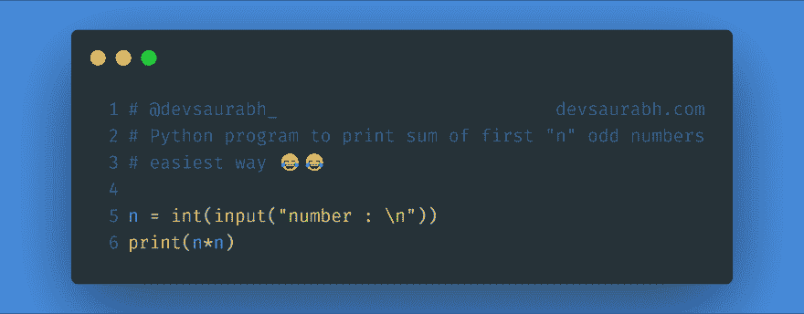
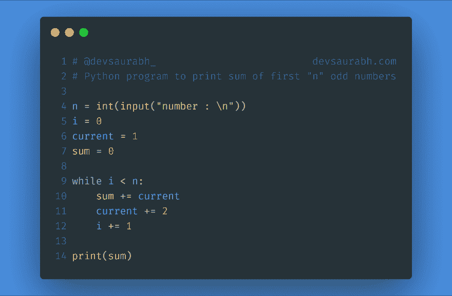

# 用 Python 对前“n”个奇数求和

> 原文:[https://dev . to/devsaurabh/sum-of-first-n-odd-numbers-with-python-4bkm](https://dev.to/devsaurabh/sum-of-first-n-odd-numbers-with-python-4bkm)

这是我的第一个帖子，所以忽略任何愚蠢的错误。进入正题。正如上面所说，我将编写一个 python 程序来计算从 1 开始的前“n”个奇数的总和。如果你想快速得到结果，在你进入我的 while 循环之前。这是最简单的方法。

[T2】](https://res.cloudinary.com/practicaldev/image/fetch/s--LMLvvVna--/c_limit%2Cf_auto%2Cfl_progressive%2Cq_auto%2Cw_880/https://thepracticaldev.s3.amazonaws.com/i/9g6xkgx2s6n10sm37j48.png)

现在，如果你想知道我为什么打印“数字的平方”，那么你可能需要通过基础数学。唉！我是一名程序员。因此，请前往[这篇 WikiHow 帖子](https://www.wikihow.com/Add-a-Sequence-of-Consecutive-Odd-Numbers)。

现在回到问题上来。如果你还在阅读，可能你也不喜欢这种又傻又短的方法。
欢迎使用大型解决方案。(还是小 xD)

[T2】](https://res.cloudinary.com/practicaldev/image/fetch/s--XQDfY1pS--/c_limit%2Cf_auto%2Cfl_progressive%2Cq_auto%2Cw_880/https://thepracticaldev.s3.amazonaws.com/i/8l3tm3c8uz1abv4s121z.png)

哈！现在是我最喜欢的(如果你是美国人，那就是最喜欢的😄)部分。

第一步。我们接受输入并将其转换为整数。因为那是字符串，对吗？

第二步。我们定义了一些变量。“I”是迭代器，它会告诉我们何时到达“n”个数字(如果你忘了“n”是我们必须相加的奇数的数目)。“current”变量是我们在每次循环(我们将在下一步编写的循环)中更新的数字的总和。最初设置为 1，因为这是数学中的第一个奇数。最后我们得到了一个可爱的变量，我们把它写成“sum”。顺便说一下，它在每次循环中都会更新。

第三步。我们有自己的 while 循环。你知道什么是对的。它不断重复自己，直到它的论点是正确的。我的读者们，这个论点是布尔值“i < n ”.
,这意味着当 I 等于 n 时，我们停止循环，因为我们添加了它们。并打印结果。我知道你在想什么。循环的内部。
这里我们有一个“某个”变量，它的值是“当前”变量的值。在第一次迭代中是 1(第一个奇数)，之后我们更新我们的“当前”变量为下一个奇数，总是+2，或者我错了？
接下来我们要做的是增加迭代器的原因，你不知道它会“到无穷远处”。希望你喜欢，因为即使你不喜欢，我也无能为力。