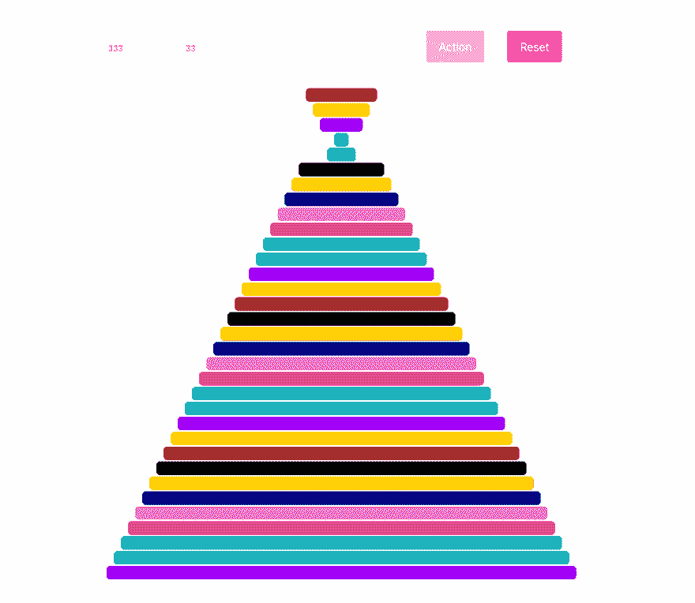

# 如何用 React 和 Popmotion.io 可视化煎饼算法

> 原文：<https://dev.to/mihailgaberov/how-to-visualize-pancakes-algorithm-with-react-and-popmotion-io-3ddj>

你将在下面看到的应该是我在一次编码挑战中给出的一个练习的解决方案的一部分。那是几个月前的事了，我已经签到了。由于不可预见的因素，我还没有走到最后。现在，在那个时间和挑战结束后，我可以在这里分享它。

这不是一个循序渐进的教程。而是快速回顾一下我们如何使用 React 和 Popmotion.io 这样的框架和算法。并为同样的算法创建一个很好的可视化。不知何故感觉很好！🤓

所谓的[煎饼排序算法](https://en.wikipedia.org/wiki/Pancake_sorting)很有名(还是不出名？)排序算法，如果感兴趣的话，你可以在网上读到很多。它的性质超出了本文的范围。多亏了 Popmotion.io，在这里我们只能看到它的动画效果。

这里是你可以玩的[现场演示](https://pancakes-algorithm.herokuapp.com/)。有两个文本输入和两个按钮。在第一次输入中，您输入将用于每一轮动画的时间间隔
，即每块薄饼将被分类的速度。以毫秒为单位，这意味着如果您输入值 1000，动画将执行大约 1 秒钟。第二个输入用于定义您希望看到多少煎饼被分类。该值必须介于 2 和 50 之间。这些按钮是不言自明的。一个用于启动排序动画，另一个用于重置它。

这里的是您可以找到演示应用程序源代码的地方。可以随意查看，仔细看看。你可以试着修改我做的动画。我很想看看你的版本。:)

仅此而已。好看又短，非常适合夏天！☀️ 🏖

🔥感谢阅读！🔥