# 用 GraphQL、Hasura 和 React 构建黑客新闻克隆——第 1 部分

> 原文：<https://dev.to/hasurahq/building-a-hacker-news-clone-with-graphql-hasura-and-react-part-1-2han>

[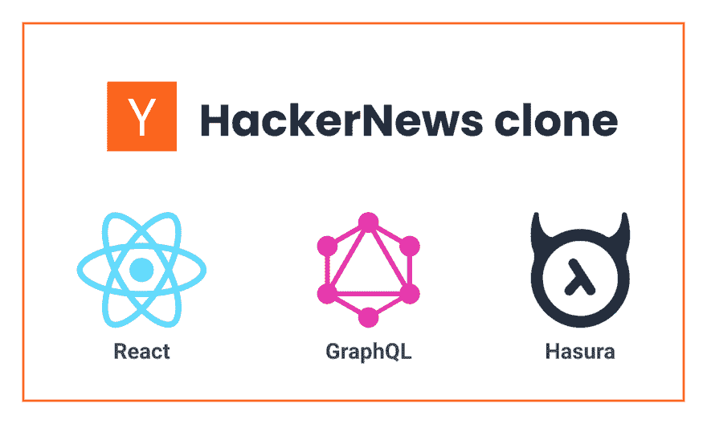](https://res.cloudinary.com/practicaldev/image/fetch/s--NUsvW-2B--/c_limit%2Cf_auto%2Cfl_progressive%2Cq_auto%2Cw_880/https://blog.hasura.io/conteimg/2019/09/Hackernews-clone--1-.png)

*本教程由* [阿比吉特·辛格](https://github.com/abhi40308) *撰写，并作为 [Hasura 技术作者计划](https://blog.hasura.io/the-hasura-technical-writer-program/)的一部分发布，该计划旨在支持为开源 Hasura GraphQL 引擎编写指南和教程的作者。*

下面是我如何使用 **Hasura GraphQL 引擎**和 **React** 来构建一个[黑客新闻](https://news.ycombinator.com/)克隆。最终代码托管在[这里](https://github.com/abhi40308/hackernews-clone)。点击查看现场演示[。](https://hackernews-1919.herokuapp.com/)

### App 功能

该应用程序将具有以下功能:

*   它将显示所有帖子的列表。
*   用户可以创建帐户(使用 Auth0 身份验证)。
*   经过身份验证的用户可以创建新帖子。
*   经过认证的用户可以投票支持帖子。
*   当其他用户投票支持一个帖子或创建一个新帖子时实时更新(更新 apollo 缓存)。

## 初始设置

首先，我们将使用 react 构建应用程序的前端。

为了快速开始，我们将使用 [**create-react-app**](https://github.com/facebook/create-react-app) 创建一个没有构建配置的基本 react 应用。在终端中运行以下命令:

```
$ npx create-react-app hackernews-clone
$ cd hackernews-clone
$ npm start 
```

<svg width="20px" height="20px" viewBox="0 0 24 24" class="highlight-action crayons-icon highlight-action--fullscreen-on"><title>Enter fullscreen mode</title></svg> <svg width="20px" height="20px" viewBox="0 0 24 24" class="highlight-action crayons-icon highlight-action--fullscreen-off"><title>Exit fullscreen mode</title></svg>

> **注:npx** 是一个 **npm** 包裹运送者。典型的用途是暂时下载并运行一个包**或**进行试用。create-react-app 是一个 **npm** 包，预计在项目的生命周期中只运行一次。因此，最好使用 **npx** 在一个步骤中安装并运行它。([来源](https://stackoverflow.com/questions/50605219/difference-between-npx-and-npm))

服务器将启动，您应该能够在 [http://localhost:3000](http://localhost:3000) 上看到一个欢迎屏幕(如下所示)。

[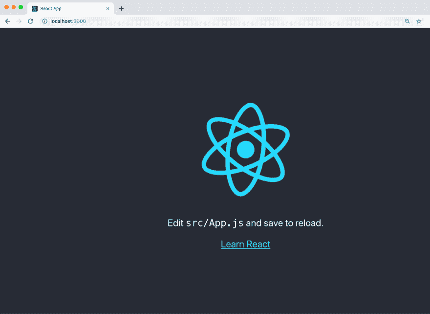](https://res.cloudinary.com/practicaldev/image/fetch/s--A10Xpxyk--/c_limit%2Cf_auto%2Cfl_progressive%2Cq_auto%2Cw_880/https://blog.hasura.io/conteimg/2019/08/0-yAArr-4Yk28n46Sg.png)

为了改进项目结构，让我们创建两个目录，都在`src`文件夹中。第一个叫做`components`，它将包含我们所有的 React 组件。第二个`styles`，那是你将要使用的所有 CSS 文件。

将所需的`jsx`和`css`文件移动到适当的目录中，并相应地更改`index.js`和`App.js`中对这些文件的引用。你的目录结构应该是这样的:

```
├── node_modules
├── package.json
├── public
│ ├── favicon.ico
│ ├── index.html
│ └── manifest.json
├── src
│ ├── App.test.js
│ ├── components
│ │ └── App.js
│ ├── index.js
│ ├── logo.svg
│ ├── serviceWorker.js
│ └── styles
│ ├── App.css
│ └── index.css
└── README.md 
```

<svg width="20px" height="20px" viewBox="0 0 24 24" class="highlight-action crayons-icon highlight-action--fullscreen-on"><title>Enter fullscreen mode</title></svg> <svg width="20px" height="20px" viewBox="0 0 24 24" class="highlight-action crayons-icon highlight-action--fullscreen-off"><title>Exit fullscreen mode</title></svg>

我将使用 [**react-bootstrap**](https://react-bootstrap.github.io/getting-started/introduction/) 包进行造型。使用
安装软件包

```
$ npm install react-bootstrap bootstrap 
```

<svg width="20px" height="20px" viewBox="0 0 24 24" class="highlight-action crayons-icon highlight-action--fullscreen-on"><title>Enter fullscreen mode</title></svg> <svg width="20px" height="20px" viewBox="0 0 24 24" class="highlight-action crayons-icon highlight-action--fullscreen-off"><title>Exit fullscreen mode</title></svg>

确保将 CDN 链接添加到`/public/index.html`中的样式表。从[T2 复制链接到这里 T4。](https://react-bootstrap.github.io/getting-started/introduction/)

同样使用以下命令安装[**react-Apollo**](https://github.com/apollographql/react-apollo)graph QL 客户端:

```
$ npm install apollo-boost apollo-link-context @apollo/react-hooks @apollo/react-hoc graphql 
```

<svg width="20px" height="20px" viewBox="0 0 24 24" class="highlight-action crayons-icon highlight-action--fullscreen-on"><title>Enter fullscreen mode</title></svg> <svg width="20px" height="20px" viewBox="0 0 24 24" class="highlight-action crayons-icon highlight-action--fullscreen-off"><title>Exit fullscreen mode</title></svg>

**Apollo Client** 帮助你从前端消费一个 **GraphQL API** 。

接下来，我们将使用 Hasura GraphQL 引擎和 Postgres 设置后端。

参见[本](https://docs.hasura.io/1.0/graphql/manual/getting-started/heroku-simple.html)指南，快速上手 **Hasura GraphQL 引擎**和 **Postgres** 在 **heroku** 上运行，一键部署。

## 设置后端

我们的 Postgres 数据库结构:

[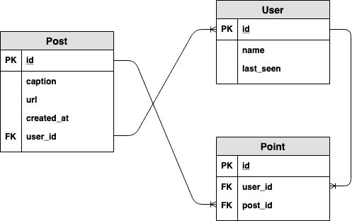](https://res.cloudinary.com/practicaldev/image/fetch/s--9AM1XGEb--/c_limit%2Cf_auto%2Cfl_progressive%2Cq_auto%2Cw_880/https://blog.hasura.io/conteimg/2019/09/1-ZMRb0Fkkt9disa_hz0AI_Q-1.png)

### 创建表格

创建以下表格:`users`表格(`id`具有类型`text`

<figure>[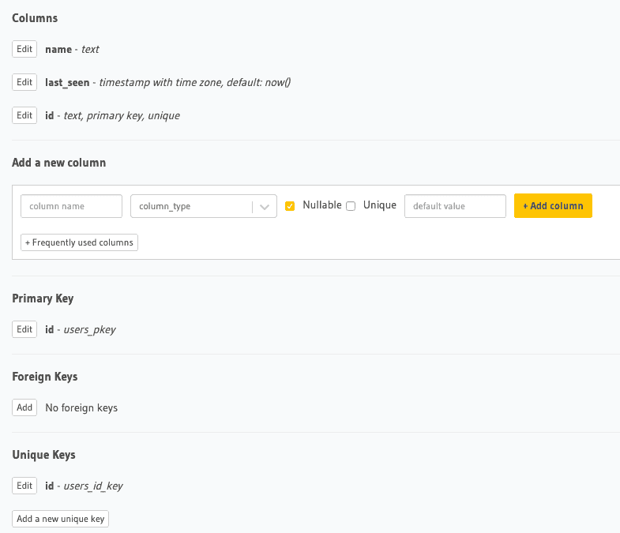](https://res.cloudinary.com/practicaldev/image/fetch/s--m8UJ7rnt--/c_limit%2Cf_auto%2Cfl_progressive%2Cq_auto%2Cw_880/https://blog.hasura.io/conteimg/2019/08/users_table.png) 

<figcaption>用户表</figcaption>

</figure>

`post`表(`id`有类型`integer(autoincrement)`):

<figure>[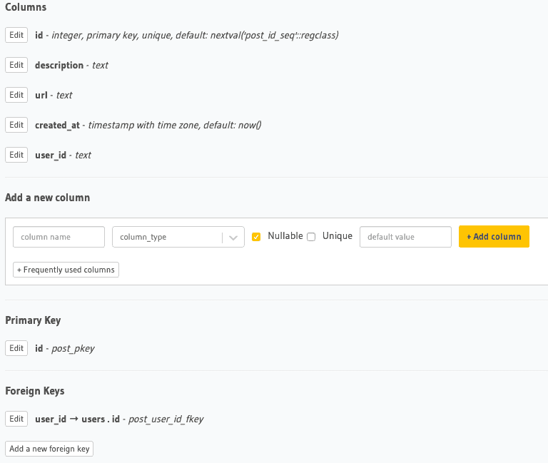](https://res.cloudinary.com/practicaldev/image/fetch/s--H7Nv7iix--/c_limit%2Cf_auto%2Cfl_progressive%2Cq_auto%2Cw_880/https://blog.hasura.io/conteimg/2019/08/post-table.png) 

<figcaption>岗位表</figcaption>

</figure>

将外键约束从`user_id`列添加到`users.id`。将`Update`和`Delete`违例设为`restrict`。

### 创建关系

通过跳转到 post 表的关系部分，在`posts`的`user_id`和`users`表的`id`之间创建 and `object`关系。这将允许您在单个获取查询中查询创建帖子的用户的信息。参见[这个](https://docs.hasura.io/1.0/graphql/manual/schema/relationships/create.html#step-1-add-foreign-key-constraint)链接，通过 hasura 中的外键创建关系。

`point`表(`id`有类型`integer(autoincrement)`):

<figure>[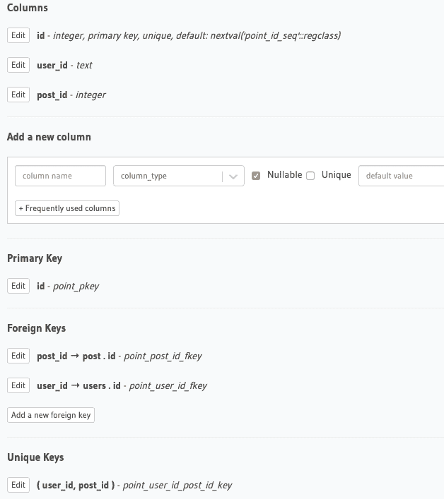](https://res.cloudinary.com/practicaldev/image/fetch/s--FVp4Z7bz--/c_limit%2Cf_auto%2Cfl_progressive%2Cq_auto%2Cw_880/https://blog.hasura.io/conteimg/2019/08/point_table.png) 

<figcaption>点表</figcaption>

</figure>

如图所示，添加外键和唯一键。`user_id, post_id`是一个唯一的键，因为一个用户只能对一篇文章投赞成票一次。它与`post`表和`users`表都有外键关系。

还在`post`表中添加对象关系，如下所示:

[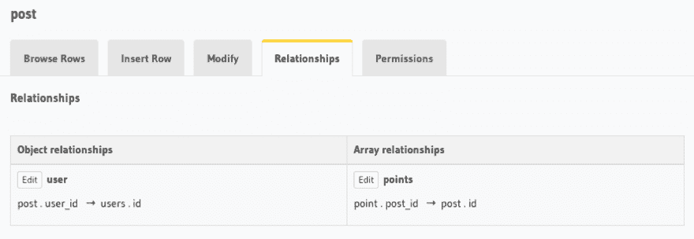](https://res.cloudinary.com/practicaldev/image/fetch/s--EnGyov2R--/c_limit%2Cf_auto%2Cfl_progressive%2Cq_auto%2Cw_880/https://blog.hasura.io/conteimg/2019/08/post_2.png)

这些关系将帮助我们查询每个帖子的点数。

### 设置权限

现在，我们将设置表的权限，以便只有登录的用户才能执行某些操作。如下所示设置权限:

<figure>[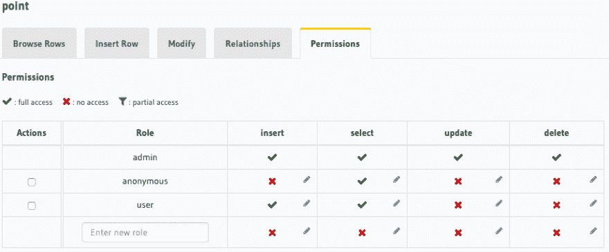](https://res.cloudinary.com/practicaldev/image/fetch/s--dKkRF2Bx--/c_limit%2Cf_auto%2Cfl_progressive%2Cq_auto%2Cw_880/https://blog.hasura.io/conteimg/2019/08/point_2.png) 

<figcaption>点表</figcaption>

</figure>

<figure>[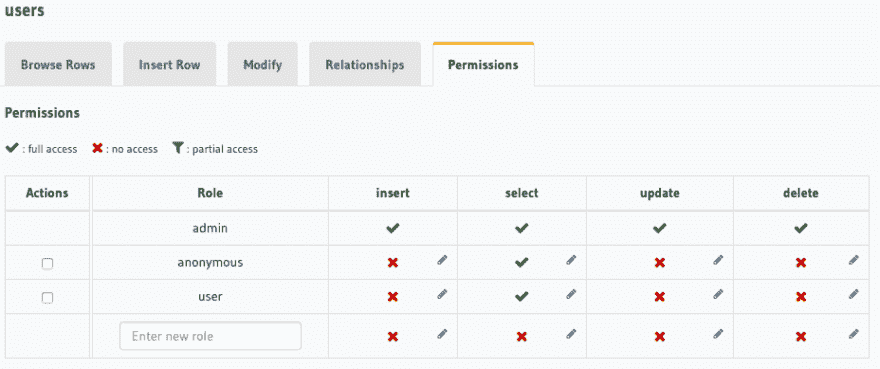](https://res.cloudinary.com/practicaldev/image/fetch/s--lSzhOFFZ--/c_limit%2Cf_auto%2Cfl_progressive%2Cq_auto%2Cw_880/https://blog.hasura.io/conteimg/2019/08/users_2.png) 

<figcaption>用户表</figcaption>

</figure>

<figure>[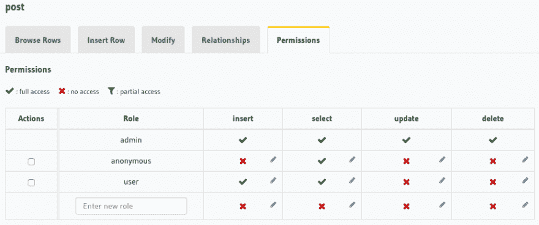](https://res.cloudinary.com/practicaldev/image/fetch/s--KoB_Y9y0--/c_limit%2Cf_auto%2Cfl_progressive%2Cq_auto%2Cw_880/https://blog.hasura.io/conteimg/2019/08/post_3.png) 

<figcaption>岗位表</figcaption>

</figure>

如果你不太熟悉 Hasura 中的访问控制及其工作原理，请参见[访问控制基础知识](https://docs.hasura.io/1.0/graphql/manual/auth/authorization/basics.html)。

[](https://res.cloudinary.com/practicaldev/image/fetch/s--KI7aWDl2--/c_limit%2Cf_auto%2Cfl_progressive%2Cq_auto%2Cw_880/https://blog.hasura.io/conteimg/2019/08/permissions.png)

为了使它不那么复杂，我将所有的行级权限赋予为`without any checks`，将列级权限赋予为`all columns`和聚合查询(用于计算一个`post`的`points`的数量)。暂时就这样了。

## 使用 Auth0 JWT 进行认证

下图快速解释了`JWT`认证是如何工作的。这里，需要配置应用服务器(我们的后端)来验证传入的`JWT`是由认证服务器(Auth0)创建的。( [*来源*](https://medium.com/vandium-software/5-easy-steps-to-understanding-json-web-tokens-jwt-1164c0adfcec) )

[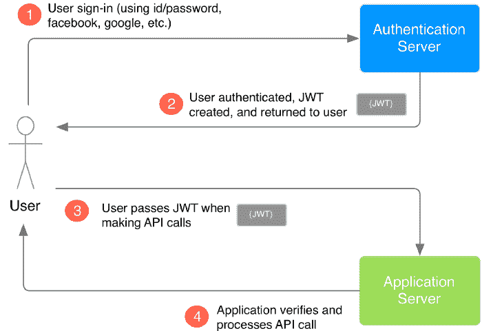](https://res.cloudinary.com/practicaldev/image/fetch/s--92ug1Rtk--/c_limit%2Cf_auto%2Cfl_progressive%2Cq_auto%2Cw_880/https://blog.hasura.io/conteimg/2019/08/app_flow.png)

我们使用 Auth0 作为认证服务器。它将创建一个`JWT`并传递给我们的 react 应用程序。然后，使用 apollo 客户端，我们将把`auth_token`(在我们的例子中是`access_token`)发送到我们的后端(应用服务器)，即 Hasura GraphQL 引擎。需要配置 Hasura 来验证传入的 JWT 是由 Auth0 身份验证服务器创建的。

让我们从使用`@apollo/react-hooks`和`@auth0/auth0-spa-js`开始。我们必须遵循以下步骤:

### Auth0 JWT 与哈苏拉的融合

请参见[本](https://docs.hasura.io/1.0/graphql/manual/guides/integrations/auth0-jwt.html)指南，了解 Auth0 JWT 与 Hasura 的集成，并获取 JWK(验证即将到来的 JWT 的密钥)。在 Auth0 dashboard 中，将`Allowed Callback URLs`、`Allowed Web Origins`、`Allowed Logout URLs`设置为 [http://localhost:3000](http://localhost:3000) 并保存更改。

您可能还需要在`Auth0 > Applications > Your_app > Settings > Advanced Settings`中禁用 OIDC 一致性。一旦你有了钥匙，下一步就是激活哈苏拉的 JWT 模式。进入 heroku 仪表盘，选择我们的应用程序，然后进入设置。在这里，您可以看到一些我们现在要设置的`Config Vars`。添加配置变量，如下所示:

[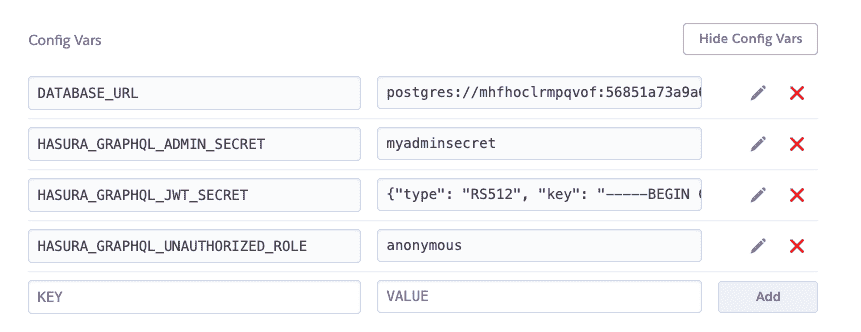](https://res.cloudinary.com/practicaldev/image/fetch/s--v1VCxqp1--/c_limit%2Cf_auto%2Cfl_progressive%2Cq_auto%2Cw_880/https://blog.hasura.io/conteimg/2019/08/jwts.png)

这里，`HASURA_GRAPHQL_ADMIN_SECRET`键为 JWT 模式工作。将密钥放在`HASURA_GRAPHQL_JWT_SECRET`环境变量中。一旦添加了这个，GraphQL 端点只能使用`Authorization`头或`X-Hasura-Admin-Secret`头来查询。

最后，将`HASURA_GRAPHQL_UNAUTHORIZED_ROLE`设置为`anonymous`,因为我们确实允许未经认证的用户读取一些数据。

> **未授权角色:**在仅访问密钥模式下不发送访问密钥或在 JWT 模式下没有“授权”报头时使用。例子:`anonymous`。现在，每当“授权”头缺失时，请求的角色将默认为“匿名”。

下一步是在我们的 Auth0 应用程序中添加规则。我们将向 Auth0 应用程序添加 2 条规则，如下所示: