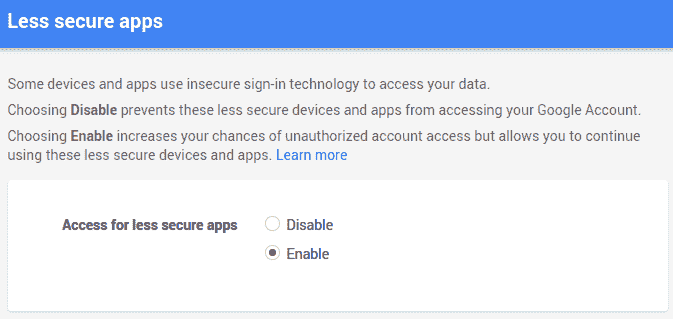

# 使用 Python 构建虚拟助手|自动化任务

> 原文:[https://dev . to/the pylot/build-virtual-assistant-with-python-automate-tasks-46 a6](https://dev.to/thepylot/build-virtual-assistant-with-python-automate-tasks-46a6)

注意:这篇文章发表于一年前，一些依赖项可能会导致错误。如果你遇到错误，请在 instagram 上给我发邮件，我会把这个文件的初始配置发给你。

[https://www.instagram.com/coderasha/](https://www.instagram.com/coderasha/)

怎么了 **DEV** Network？

Youtube 频道有视频教程- [反向 Python Youtube](https://www.youtube.com/channel/UCEwYRHE5ZAOMfUaIpCQvjEQ)

在这个实验中，我们将使用 Python 从星际电影中构建演示星球。TARS 可以帮助您自动化您的任务，例如在 YouTube 中搜索视频并播放它们，发送电子邮件，打开网站，在维基百科中搜索并阅读材料，通知您所在国家的天气预报，问候等等。通过构建 TARS，您将增加您的 Python 知识并学习许多有用的库/工具。我将把源代码推送到我的 git 存储库中，因此可以自由地贡献和改进 TARS 的功能

[T2】](https://res.cloudinary.com/practicaldev/image/fetch/s--SxkCqMmE--/c_limit%2Cf_auto%2Cfl_progressive%2Cq_66%2Cw_880/https://thepracticaldev.s3.amazonaws.com/i/0tu8bgn13lz8azuol669.gif)

让我们从创建虚拟环境和构建 TARS 的基础音频系统开始。

```
mkdir TARS
cd TARS
virtualenv venv 
```

<svg width="20px" height="20px" viewBox="0 0 24 24" class="highlight-action crayons-icon highlight-action--fullscreen-on"><title>Enter fullscreen mode</title></svg> <svg width="20px" height="20px" viewBox="0 0 24 24" class="highlight-action crayons-icon highlight-action--fullscreen-off"><title>Exit fullscreen mode</title></svg>

激活下面的 venv 运行命令

```
. venv/bin/activate 
```

<svg width="20px" height="20px" viewBox="0 0 24 24" class="highlight-action crayons-icon highlight-action--fullscreen-on"><title>Enter fullscreen mode</title></svg> <svg width="20px" height="20px" viewBox="0 0 24 24" class="highlight-action crayons-icon highlight-action--fullscreen-off"><title>Exit fullscreen mode</title></svg>

[什么是虚拟环境？](https://realpython.com/python-virtual-environments-a-primer/)

激活 venv 后，我们需要通过以下命令安装主库:

```
pip3 install gTTS
pip3 install SpeechRecognition
pip3 install PyAudio
pip3 install pygame 
```

<svg width="20px" height="20px" viewBox="0 0 24 24" class="highlight-action crayons-icon highlight-action--fullscreen-on"><title>Enter fullscreen mode</title></svg> <svg width="20px" height="20px" viewBox="0 0 24 24" class="highlight-action crayons-icon highlight-action--fullscreen-off"><title>Exit fullscreen mode</title></svg>

gTTS(Google 文本到语音)是一个 Python 库和 CLI 工具，用于与 Google Translate 的文本到语音 API 接口。这个模块有助于将字符串文本转换成语音文本，并且可以保存为. mp3

**语音识别**是家庭自动化、人工智能等应用中的一项重要功能。识别语音需要音频输入，SpeechRecognition 使检索这些输入变得非常简单。SpeechRecognition 无需从头开始构建脚本来访问麦克风和处理音频文件，只需几分钟就能让您启动并运行。

要使用 SpeechRecognizer 访问您的麦克风，您必须安装 **PyAudio** 软件包

Pygame 是一套跨平台的 Python 模块，用于编写视频游戏。它包括设计用于 Python 编程语言的计算机图形和声音库。

现在，让我们来构建 TARS 的语音系统:

```
from gtts import gTTS
import speech_recognition as sr
from pygame import mixer

def talk(audio):
    print(audio)
    for line in audio.splitlines():
        text_to_speech = gTTS(text=audio, lang='en-uk')
        text_to_speech.save('audio.mp3')
        mixer.init()
        mixer.music.load("audio.mp3")
        mixer.music.play() 
```

<svg width="20px" height="20px" viewBox="0 0 24 24" class="highlight-action crayons-icon highlight-action--fullscreen-on"><title>Enter fullscreen mode</title></svg> <svg width="20px" height="20px" viewBox="0 0 24 24" class="highlight-action crayons-icon highlight-action--fullscreen-off"><title>Exit fullscreen mode</title></svg>

正如你所看到的，我们传递音频作为一个参数，让焦油说话。例如，说话(‘嗨，我是塔斯！“我能帮你什么吗，”)程序将借助 splitlines()方法循环这些行。此方法用于在线边界处拆分线。查看 [splitlines()](https://www.geeksforgeeks.org/python-string-splitlines/) 了解更多信息。然后，gTTS 将把所有这些文本转换成语音。text 参数定义要读取的文本，lang 定义读取文本的语言(IETF language tag)。循环完成后，save()方法将结果写入文件。

**pygame.mixer** 是一个用于加载和播放声音的模块，在使用之前必须进行初始化。

好吧！现在，让我们创建一个监听命令的函数。

```
def myCommand():
    #Initialize the recognizer 
    r = sr.Recognizer()

    with sr.Microphone() as source:
        print('TARS is Ready...')
        r.pause_threshold = 1
        #wait for a second to let the recognizer adjust the  
        #energy threshold based on the surrounding noise level 
        r.adjust_for_ambient_noise(source, duration=1)
        #listens for the user's input
        audio = r.listen(source)

    try:
        command = r.recognize_google(audio).lower()
        print('You said: ' + command + '\n')

    #loop back to continue to listen for commands if unrecognizable speech is received
    except sr.UnknownValueError:
        print('Your last command couldn\'t be heard')
        command = myCommand();

    return command 
```

<svg width="20px" height="20px" viewBox="0 0 24 24" class="highlight-action crayons-icon highlight-action--fullscreen-on"><title>Enter fullscreen mode</title></svg> <svg width="20px" height="20px" viewBox="0 0 24 24" class="highlight-action crayons-icon highlight-action--fullscreen-off"><title>Exit fullscreen mode</title></svg>

在这个函数中，我们使用了 SpeechRecognition 库。它充当几种流行的语音 API 的包装器，因此非常灵活。其中之一——Google Web Speech API——支持一个默认的 API 键，该键被硬编码到 SpeechRecognition 库中。这意味着你可以不用注册服务就可以开始工作。

为了能够通过语音识别处理自己的声音，您需要 PyAudio 包。像音频文件识别器一样，我们需要麦克风来处理实时语音数据。

您可以在 with 块中使用 Recognizer 类的 listen()方法从麦克风捕获输入。该方法将音频源作为其第一个参数，并记录来自该源的输入，直到检测到无声。

试着在安静的地方说你的命令(背景噪音少)，否则 TARS 会混淆。

看一看[Python 语音识别终极指南](https://realpython.com/python-speech-recognition/)

```
import random

def tars(command):
    errors=[
        "I don\'t know what you mean!",
        "Excuse me?",
        "Can you repeat it please?",
    ]

    if 'Hello' in command:
        talk('Hello! I am TARS. How can I help you?')

    else:
        error = random.choice(errors)
        talk(error)

talk('TARS is ready!')

while True:
    assistant(myCommand()) 
```

<svg width="20px" height="20px" viewBox="0 0 24 24" class="highlight-action crayons-icon highlight-action--fullscreen-on"><title>Enter fullscreen mode</title></svg> <svg width="20px" height="20px" viewBox="0 0 24 24" class="highlight-action crayons-icon highlight-action--fullscreen-off"><title>Exit fullscreen mode</title></svg>

一旦你运行该程序，塔斯将开始与你交谈，说“塔斯准备好了！”并继续监听您的命令，直到您停止程序。从说“你好”开始:

当 TARS 没有收到命令时，我们将通过随机语句来处理错误。

以下是主要结构的完整代码:

```
from gtts import gTTS
import speech_recognition as sr
from pygame import mixer
import random
def talk(audio):
    print(audio)
    for line in audio.splitlines():
        text_to_speech = gTTS(text=audio, lang='en-uk')
        text_to_speech.save('audio.mp3')
        mixer.init()
        mixer.music.load("audio.mp3")
        mixer.music.play()

def myCommand():
    #Initialize the recognizer
    #The primary purpose of a Recognizer instance is, of course, to recognize speech. 
    r = sr.Recognizer()

    with sr.Microphone() as source:
        print('TARS is Ready...')
        r.pause_threshold = 2
        #wait for a second to let the recognizer adjust the  
        #energy threshold based on the surrounding noise level 
        r.adjust_for_ambient_noise(source, duration=1)
        #listens for the user's input
        audio = r.listen(source)

    try:
        command = r.recognize_google(audio).lower()
        print('You said: ' + command + '\n')

    #loop back to continue to listen for commands if unrecognizable speech is received
    except sr.UnknownValueError:
        print('Your last command couldn\'t be heard')
        command = myCommand();
    return command

def tars(command):
    errors=[
        "I don't know what you mean",
        "Did you mean astronaut?",
        "Can you repeat it please?",
    ]
    if 'hello' in command:
        talk('Hello! I am TARS. How can I help you?')
    else:
        error = random.choice(errors)
        talk(error)

talk('TARS is ready!')

#loop to continue executing multiple commands while True:
    tars(myCommand()) 
```

<svg width="20px" height="20px" viewBox="0 0 24 24" class="highlight-action crayons-icon highlight-action--fullscreen-on"><title>Enter fullscreen mode</title></svg> <svg width="20px" height="20px" viewBox="0 0 24 24" class="highlight-action crayons-icon highlight-action--fullscreen-off"><title>Exit fullscreen mode</title></svg>

良好的..AI 不仅仅是一堆 IF 语句吗？

[T2】](https://res.cloudinary.com/practicaldev/image/fetch/s--UzSoaDyL--/c_limit%2Cf_auto%2Cfl_progressive%2Cq_auto%2Cw_880/https://thepracticaldev.s3.amazonaws.com/i/r7jscyinhtfezslpr1fy.png)

如果你谈论的是“真正的”人工智能，那么是的，它不仅仅是 If 语句。人工智能的发展历史上分为两个领域；符号人工智能和机器学习。

符号人工智能是用 if-else 型逻辑设计人工智能系统的领域。程序员会试图定义系统要处理的每一个可能的场景。直到 70 年代末，这是人工智能系统开发的主要形式。该领域的专家非常强烈地认为，机器学习永远不会流行，人工智能只能以这种方式编写。

现在我们知道，在智能系统中考虑每一种可能的情况是非常不切实际的，我们使用机器学习来代替。机器学习使用统计学来寻找和定义数据中的模式，以便机器可以了解和改进它被设计来执行的任务。这要灵活得多。

我们只是用一堆 IF 语句来理解人工智能的基础。但是我们稍后会实现一些很酷的 ML 算法。

我希望你到目前为止学到了新的东西，现在，是时候教 TARS 如何自动化的东西了。

##### 打开谷歌搜索一下

我们将在 Python 中导入 [webbrowser](https://www.pythonforbeginners.com/code-snippets-source-code/python-webbrowser) 模块，它提供了一个显示基于 Web 的文档的接口。

当我们说命令时，tar 必须通过匹配它们来检测这些命令的可用性。Python 有一个名为 [re](https://docs.python.org/3/library/re.html) 的内置包，可以用来处理正则表达式。

```
import re
import webbrowser

if 'open google' in command:
        #matching command to check it is available
        reg_ex = re.search('open google (.*)', command)
        url = 'https://www.google.com/'
        if reg_ex:
            subgoogle = reg_ex.group(1)
            url = url + 'r/' + subreddit
        webbrowser.open(url)
        print('Done!') 
```

<svg width="20px" height="20px" viewBox="0 0 24 24" class="highlight-action crayons-icon highlight-action--fullscreen-on"><title>Enter fullscreen mode</title></svg> <svg width="20px" height="20px" viewBox="0 0 24 24" class="highlight-action crayons-icon highlight-action--fullscreen-off"><title>Exit fullscreen mode</title></svg>

re.search()方法接受一个正则表达式模式和一个字符串，并在字符串中搜索该模式。如果搜索成功，search()返回一个匹配对象，否则返回 None。因此，搜索后通常会紧跟一个 if 语句，以测试搜索是否成功

代码 reg_ex = re.search('打开谷歌(。*)'，命令)将搜索结果存储在名为“reg_ex”的变量中。然后 if 语句测试匹配-如果为真，则搜索成功，group()是匹配的文本。否则，如果匹配为假(更具体地说是无)，则搜索不成功，并且没有匹配的文本。 [reg_ex.group(1)](https://docs.python.org/2/library/re.html#re.MatchObject.group) 中的 1 表示第一个带括号的子组。

甚至你可以安装 **Selenium** 通过 TARS 在谷歌进行搜索。要安装 Selenium，请运行以下命令:

```
pip3 install selenium 
```

<svg width="20px" height="20px" viewBox="0 0 24 24" class="highlight-action crayons-icon highlight-action--fullscreen-on"><title>Enter fullscreen mode</title></svg> <svg width="20px" height="20px" viewBox="0 0 24 24" class="highlight-action crayons-icon highlight-action--fullscreen-off"><title>Exit fullscreen mode</title></svg>

Selenium WebDriver 是一个开源 API 集合，用于自动测试 web 应用程序。该工具用于自动化 web 应用程序测试，以验证它是否按预期工作。它支持许多浏览器，如 Safari、Firefox、IE 和 Chrome。

你可以搜索如何用 Python 使用 [Selenium，网上有很多资源，学起来真的很容易。让我们将这个特性添加到 TARS 中](https://selenium-python.readthedocs.io/)

```
from selenium import webdriver
from selenium.webdriver.common.keys import Keys

    if 'open google and search' in command:
        reg_ex = re.search('open google and search (.*)', command)
        search_for = command.split("search",1)[1]
        url = 'https://www.google.com/'
        if reg_ex:
            subgoogle = reg_ex.group(1)
            url = url + 'r/' + subgoogle
        talk('Okay!')
        driver = webdriver.Firefox(executable_path='/path/to/geckodriver') #depends which web browser you are using
        driver.get('http://www.google.com')
        search = driver.find_element_by_name('q') # finds search
        search.send_keys(str(search_for)) #sends search keys 
        search.send_keys(Keys.RETURN) #hits enter 
```

<svg width="20px" height="20px" viewBox="0 0 24 24" class="highlight-action crayons-icon highlight-action--fullscreen-on"><title>Enter fullscreen mode</title></svg> <svg width="20px" height="20px" viewBox="0 0 24 24" class="highlight-action crayons-icon highlight-action--fullscreen-off"><title>Exit fullscreen mode</title></svg>

TARS 将考虑“打开谷歌和搜索”命令后的字符串，并将所有单词作为搜索关键字。我用的是 Firefox，所以我安装了 geckodriver，但是如果你用的是 Chrome，请检查下面的 StackOverflow 问题。

<header> [Python Selenium Chrome Webdriver](https://stackoverflow.com/questions/42478591/python-selenium-chrome-webdriver) Feb 27 '17 Comments: 2 Answers: 2[68](https://stackoverflow.com/questions/42478591/python-selenium-chrome-webdriver) </header>

我开始自动化枯燥的东西书，我试图通过 python 打开一个 chrome 网络浏览器。我已经安装了 selenium 和

我已尝试运行该文件:

```
from selenium import webdriver
from selenium.webdriver.common.by import By
from selenium.webdriver.common.keys import Keys

browser = webdriver.Chrome()
browser.get('https://automatetheboringstuff.com') 
```

而是因为…

[Open Full Question](https://stackoverflow.com/questions/42478591/python-selenium-chrome-webdriver)

#### 发送电子邮件

我们将导入 **smtplib** 来用 Python 发送电子邮件。SMTP 代表简单邮件传输协议，它对于与邮件服务器通信以发送邮件非常有用。

```
 import smtplib

  elif 'email' or 'gmail' in command:
        talk('What is the subject?')
        time.sleep(3)
        subject = myCommand()
        talk('What should I say?')
        time.sleep(3)
        message = myCommand()
        content = 'Subject: {}\n\n{}'.format(subject, message)

        #init gmail SMTP
        mail = smtplib.SMTP('smtp.gmail.com', 587)

        #identify to server
        mail.ehlo()

        #encrypt session
        mail.starttls()

        #login
        mail.login('your_gmail', 'your_gmail_password')

        #send message
        mail.sendmail('FROM', 'TO', content)

        #end mail connection
        mail.close()

        talk('Email sent.') 
```

<svg width="20px" height="20px" viewBox="0 0 24 24" class="highlight-action crayons-icon highlight-action--fullscreen-on"><title>Enter fullscreen mode</title></svg> <svg width="20px" height="20px" viewBox="0 0 24 24" class="highlight-action crayons-icon highlight-action--fullscreen-off"><title>Exit fullscreen mode</title></svg>

请注意，简而言之，谷歌不允许你通过 smtplib 登录，因为它已经将这种登录标记为“不太安全”，所以你必须做的是在你登录到你的谷歌帐户时转到这个链接，并允许访问。

[启用](https://www.google.com/settings/security/lesssecureapps)

[T2】](https://res.cloudinary.com/practicaldev/image/fetch/s--D3gE32OJ--/c_limit%2Cf_auto%2Cfl_progressive%2Cq_auto%2Cw_880/https://thepracticaldev.s3.amazonaws.com/i/y4jbxy4w076bzo0u3ae2.png)

还是不行？检查这个 StackOverflow 问题

<header> [Login credentials not working with Gmail SMTP](https://stackoverflow.com/questions/16512592/login-credentials-not-working-with-gmail-smtp) May 12 '13 Comments: 5 Answers: 13[143](https://stackoverflow.com/questions/16512592/login-credentials-not-working-with-gmail-smtp) </header>

我正试图通过 Gmail 用 Python 发送一封电子邮件。以下是我的代码:

```
import smtplib

fromaddr = '......................'  
toaddrs  = '......................'  
msg = 'Spam email Test'  

username = '.......'  
password = '.......'

server = smtplib.SMTP('smtp.gmail.com', 587)  
server.ehlo()
server.starttls()
server.login(username, password)  
server.sendmail(fromaddr, toaddrs, msg)  
server.quit() 
```

我得到的错误是:

…[Open Full Question](https://stackoverflow.com/questions/16512592/login-credentials-not-working-with-gmail-smtp)

##### 爬网数据

到目前为止，我们做得很好！TARS 可以发送邮件，在谷歌上搜索你想搜索的任何内容。现在，让我们实现更复杂的功能，让 TARS 抓取一些维基百科数据，并为我们阅读。

[美汤](https://www.crummy.com/software/BeautifulSoup/bs4/doc/)是一个 Python 库，用于从 HTML 和 XML 文件中提取数据。它与您喜欢的解析器一起工作，提供导航、搜索和修改解析树的惯用方式。它通常为程序员节省数小时或数天的工作。在您的终端中运行以下命令来安装 beautifulsoup:

```
pip install beautifulsoup4 
```

<svg width="20px" height="20px" viewBox="0 0 24 24" class="highlight-action crayons-icon highlight-action--fullscreen-on"><title>Enter fullscreen mode</title></svg> <svg width="20px" height="20px" viewBox="0 0 24 24" class="highlight-action crayons-icon highlight-action--fullscreen-off"><title>Exit fullscreen mode</title></svg>

我们还需要[请求库](https://realpython.com/python-requests/)来用 Python 发出 HTTP 请求。它将发出请求的复杂性抽象在一个漂亮、简单的 API 后面，这样您就可以专注于与服务交互和在应用程序中使用数据。好吧！让我们看看代码:

```
import bs4
import requests

elif 'wikipedia' in command:
        reg_ex = re.search('search in wikipedia (.+)', command)
        if reg_ex: 
            query = command.split()
            response = requests.get("https://en.wikipedia.org/wiki/" + query[3])

            if response is not None:
                html = bs4.BeautifulSoup(response.text, 'html.parser')
                title = html.select("#firstHeading")[0].text
                paragraphs = html.select("p")
                for para in paragraphs:
                    print (para.text)

                intro = '\n'.join([ para.text for para in paragraphs[0:5]])
                print (intro)
                mp3name = 'speech.mp3'
                language = 'en'
                myobj = gTTS(text=intro, lang=language, slow=False)   
                myobj.save(mp3name)
                mixer.init()
                mixer.music.load("speech.mp3")
                mixer.music.play()
    elif 'stop' in command:
        mixer.music.stop() 
```

<svg width="20px" height="20px" viewBox="0 0 24 24" class="highlight-action crayons-icon highlight-action--fullscreen-on"><title>Enter fullscreen mode</title></svg> <svg width="20px" height="20px" viewBox="0 0 24 24" class="highlight-action crayons-icon highlight-action--fullscreen-off"><title>Exit fullscreen mode</title></svg>

“在维基百科火星搜索”TARS 会以“火星”为关键词在维基百科搜索。如果你在维基百科上搜索一些东西，你会看到 URL 看起来像 https://en.wikipedia.org/wiki/Keyword，所以我们发送带有关键字(搜索什么)的 get 请求来访问数据。一旦请求成功，beautifulsoup 将解析维基百科中内容。join()方法是一个字符串方法，它返回一个字符串，其中的 sequence 元素通过 str 分隔符连接在一起，我们用它来分隔段落。你已经熟悉 gTTS 和混频器，所以我通过这一部分。

TARS 将在控制台上显示抓取的数据，并开始为您读取。

##### 在 YouTube 上搜索视频并播放

这个功能类似于用谷歌搜索，但这次使用 **urllib** 更好。主要目标是学习 Python 的新知识，所以我不想在这个函数中包含 Selenium。代码如下:

```
import urllib.request #used to make requests import urllib.parse #used to parse values into the url 
 elif 'youtube' in command:
        talk('Ok!')
        reg_ex = re.search('youtube (.+)', command)
        if reg_ex:
            domain = command.split("youtube",1)[1] 
            query_string = urllib.parse.urlencode({"search_query" : domain})
            html_content = urllib.request.urlopen("http://www.youtube.com/results?" + query_string) 
            search_results = re.findall(r'href=\"\/watch\?v=(.{11})', html_content.read().decode()) # finds all links in search result
            webbrowser.open("http://www.youtube.com/watch?v={}".format(search_results[0]))
            pass 
```

<svg width="20px" height="20px" viewBox="0 0 24 24" class="highlight-action crayons-icon highlight-action--fullscreen-on"><title>Enter fullscreen mode</title></svg> <svg width="20px" height="20px" viewBox="0 0 24 24" class="highlight-action crayons-icon highlight-action--fullscreen-off"><title>Exit fullscreen mode</title></svg>

Python 3 中的 **urllib** 模块允许你通过你的程序访问网站。这为你的程序打开了许多的门，就像互联网为你打开一样。Python 3 中的 urllib 与 Python 2 中的 urllib2 略有不同，但它们大部分是相同的。通过 urllib，您可以访问网站、下载数据、解析数据、修改您的头，以及执行您可能需要执行的任何 GET 和 POST 请求。

查看本教程了解更多关于 urllib 的信息

在解析为 url 之前，必须对搜索关键字进行编码。如果你在 YouTube 上搜索一些东西，你可以看到在 http://www.youtube.com/results?"之后有一个编码的搜索关键字。一旦这些搜索关键字被编码，程序就可以成功地访问搜索结果。表达式 [re.findall()](https://www.hackerrank.com/challenges/re-findall-re-finditer/problem) 将字符串中所有不重叠的模式匹配作为字符串列表返回。youtube 上的每个视频都有自己的 11 个字符 ID(https://www.youtube.com/watch?v=**GEP ma 3us jdi**)，re.findall()会在解码后的 html_content(在搜索结果页面)中找到所有匹配。decode()用于从一种编码方案转换，其中自变量字符串被编码为所需的编码方案。这与编码相反。它接受编码字符串的编码，对其进行解码，并返回原始字符串。最后，它播放搜索结果中的第一个视频，因为通常第一个视频是最接近搜索关键字的视频。

完整代码:

```
from gtts import gTTS
import speech_recognition as sr
import re
import time
import webbrowser
import random
from selenium import webdriver
from selenium.webdriver.common.keys import Keys
import smtplib
import requests
from pygame import mixer
import urllib.request
import urllib.parse
import bs4

def talk(audio):
    "speaks audio passed as argument"

    print(audio)
    for line in audio.splitlines():
        text_to_speech = gTTS(text=audio, lang='en-uk')
        text_to_speech.save('audio.mp3')
        mixer.init()
        mixer.music.load("audio.mp3")
        mixer.music.play()

def myCommand():
    "listens for commands"
    #Initialize the recognizer
    #The primary purpose of a Recognizer instance is, of course, to recognize speech. 
    r = sr.Recognizer()

    with sr.Microphone() as source:
        print('TARS is Ready...')
        r.pause_threshold = 1
        #wait for a second to let the recognizer adjust the  
        #energy threshold based on the surrounding noise level 
        r.adjust_for_ambient_noise(source, duration=1)
        #listens for the user's input
        audio = r.listen(source)
        print('analyzing...')

    try:
        command = r.recognize_google(audio).lower()
        print('You said: ' + command + '\n')
        time.sleep(2)

    #loop back to continue to listen for commands if unrecognizable speech is received
    except sr.UnknownValueError:
        print('Your last command couldn\'t be heard')
        command = myCommand();

    return command

def tars(command):
    errors=[
        "I don't know what you mean",
        "Excuse me?",
        "Can you repeat it please?",
    ]
    "if statements for executing commands"

    # Search on Google
    if 'open google and search' in command:
        reg_ex = re.search('open google and search (.*)', command)
        search_for = command.split("search",1)[1] 
        print(search_for)
        url = 'https://www.google.com/'
        if reg_ex:
            subgoogle = reg_ex.group(1)
            url = url + 'r/' + subgoogle
        talk('Okay!')
        driver = webdriver.Firefox(executable_path='/home/coderasha/Desktop/geckodriver')
        driver.get('http://www.google.com')
        search = driver.find_element_by_name('q')
        search.send_keys(str(search_for))
        search.send_keys(Keys.RETURN) # hit return after you enter search text 
    #Send Email
    elif 'email' in command:
        talk('What is the subject?')
        time.sleep(3)
        subject = myCommand()
        talk('What should I say?')
        message = myCommand()
        content = 'Subject: {}\n\n{}'.format(subject, message)

        #init gmail SMTP
        mail = smtplib.SMTP('smtp.gmail.com', 587)

        #identify to server
        mail.ehlo()

        #encrypt session
        mail.starttls()

        #login
        mail.login('your_mail', 'your_mail_password')

        #send message
        mail.sendmail('FROM', 'TO', content)

        #end mail connection
        mail.close()

        talk('Email sent.')

    # search in wikipedia (e.g. Can you search in wikipedia apples)
    elif 'wikipedia' in command:
        reg_ex = re.search('wikipedia (.+)', command)
        if reg_ex: 
            query = command.split("wikipedia",1)[1] 
            response = requests.get("https://en.wikipedia.org/wiki/" + query)
            if response is not None:
                html = bs4.BeautifulSoup(response.text, 'html.parser')
                title = html.select("#firstHeading")[0].text
                paragraphs = html.select("p")
                for para in paragraphs:
                    print (para.text)
                intro = '\n'.join([ para.text for para in paragraphs[0:3]])
                print (intro)
                mp3name = 'speech.mp3'
                language = 'en'
                myobj = gTTS(text=intro, lang=language, slow=False)   
                myobj.save(mp3name)
                mixer.init()
                mixer.music.load("speech.mp3")
               while mixer.music.play()
    elif 'stop' in command:
        mixer.music.stop()

    # Search videos on Youtube and play (e.g. Search in youtube believer)
    elif 'youtube' in command:
        talk('Ok!')
        reg_ex = re.search('youtube (.+)', command)
        if reg_ex:
            domain = command.split("youtube",1)[1] 
            query_string = urllib.parse.urlencode({"search_query" : domain})
            html_content = urllib.request.urlopen("http://www.youtube.com/results?" + query_string)
            search_results = re.findall(r'href=\"\/watch\?v=(.{11})', html_content.read().decode())
            #print("http://www.youtube.com/watch?v=" + search_results[0])
            webbrowser.open("http://www.youtube.com/watch?v={}".format(search_results[0]))
            pass

    elif 'hello' in command:
        talk('Hello! I am TARS. How can I help you?')
        time.sleep(3)
    elif 'who are you' in command:
        talk('I am one of four former U.S. Marine Corps tactical robots')
        time.sleep(3)
    else:
        error = random.choice(errors)
        talk(error)
        time.sleep(3)

talk('TARS activated!')

#loop to continue executing multiple commands while True:
    time.sleep(4)
    tars(myCommand()) 
```

<svg width="20px" height="20px" viewBox="0 0 24 24" class="highlight-action crayons-icon highlight-action--fullscreen-on"><title>Enter fullscreen mode</title></svg> <svg width="20px" height="20px" viewBox="0 0 24 24" class="highlight-action crayons-icon highlight-action--fullscreen-off"><title>Exit fullscreen mode</title></svg>

酷！我们刚刚创建了演示 TARS，我希望您能从这个实验中学到很多东西。请随意在 [GitHub](https://github.com/raszidzie/TARS) 上贡献这个项目，TARS 将等待改进。

下一篇帖子再见，开发者们！保持联系！🚀

[insta gram](https://www.instagram.com/coderasha/?hl=en)
[Twitter](https://twitter.com/coderasha?lang=en)
给我买杯咖啡[支持我](https://www.buymeacoffee.com/xT2K0N1PY)