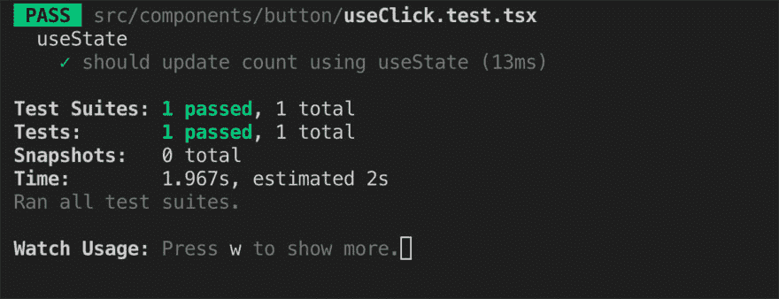

# 使用 RxJS 测试 React 钩子的快速指南

> 原文：<https://dev.to/kamaal/a-quick-guide-to-testing-react-hooks-that-use-rxjs-4lpa>

当您处理复杂的异步操作时，RxJs 很酷。RxJS 设计用于使用可观测量的反应式编程。它将你的异步操作转换成可观察的。有了可观测量，我们可以“观察”数据流，被动地监听事件。

React 钩子以多种方式为你的功能组件增压。通过钩子，我们可以用定制的钩子抽象和分离逻辑。逻辑分离使得你的代码可测试并在组件间共享。

这篇文章有助于解释如何测试使用 RxJs 内部的`useEffect`钩子来监听鼠标点击，并使用 RxJs 的`debounceTime`操作符延迟点击。

### 我们这里用的钩子。

*   **使用状态:**用状态增强功能部件。
*   **useEffect:** 我们可以进行 DOM 操作和选择。

### 我们这里用的 RxJs 运算符。

*   **map:** 使用源发出的信号从提供的函数中返回可观察值。
*   **debouonceTime:** 只有在特定时间过去而没有其他源发射的情况下，才从可观测的源发射一个值。

在我们开始编写测试代码之前，让我们先看看我们的示例组件。

`Button.tsx`

```
//Button.tsx
import React, { SFC} from 'react'
import {useClick} from './useClick'

type Props = {
    interval?: number;
    label?:string;
}

const Button:SFC<Props> = (props:Props) => {
    const {ref, count} = useClick(props.interval)
    return <button data-testid="btn" ref={ref}>Hello {count}</button> }

export default Button 
```

`useClick.ts`

```
// useClick.ts
import React, { useRef, useEffect, useCallback, useState, RefObject, Dispatch} from 'react'
import {fromEvent, Observable, Subscribable, Unsubscribable} from 'rxjs'
import {map, debounceTime} from 'rxjs/operators'

type NullableObservarbel = Observable<any> | null;
type NUllabe = HTMLButtonElement | null;
type NullableSubscribable = Subscribable<any> | null
type NullableUnsubscribable = Unsubscribable | null
export type Result = {
    ref: RefObject<HTMLButtonElement>;
    count:number;
    updateCount:Dispatch<React.SetStateAction<number>>;
}

export const isString = (input:any):Boolean => (typeof input === "string" && input !== "")

export const makeObservable = (el:NUllabe, eventType:string):NullableObservarbel => el instanceof HTMLElement && isString(eventType) ? fromEvent(el, eventType) : null

export const useClick = (time:number = 500):Result => {
    const button: RefObject<HTMLButtonElement> = useRef(null)
    const [count, updateCount] = useState<number>(0)
    const fireAfterSubscribe = useCallback((c) => {updateCount(c)}, [])
    useEffect(():()=>void => {
        const el = button.current
        const observerble =  makeObservable(el, 'click')
        let _count = count
        let subscribable:NullableSubscribable = null
        let subscribe:NullableUnsubscribable = null
        if(observerble){
            subscribable = observerble.pipe(
                map(e => _count++),
                debounceTime(time)
            )
            subscribe = subscribable.subscribe(fireAfterSubscribe)
        }
        return () => subscribe && subscribe.unsubscribe() // cleanup subscription
    // eslint-disable-next-line
    }, [])
    return {ref:button, count, updateCount:fireAfterSubscribe}
} 
```

在上面的例子中，我们有两个文件。

*   1 **Button.tsx:** 是一个简单的按钮组件。
*   2 **useClick.ts:** 包含自定义钩子`useClick`和`makeObservable`。功能。

按钮使用`useClick`来延迟按钮的点击。每次点击用 RxJs `debounceTime`功能去抖。

当用户在 400 毫秒内点击时，点击将被忽略。一旦用户点击完毕，它会等待 400 毫秒，然后触发最后一个事件。

简单！。🤓

现在让我们测试！🧪.

先说简单的。测试`useState`挂钩。

```
// useClick.test.tsx - v1
import React from 'react'
import {useClick} from './useClick'
describe('useState', () => {
    it('should update count using useState', () => {
        const result = useClick(400) // test will break due to invarient violation
        const {updateCount} = result
        updateCount(8) 
        expect(result.current.count).toBe(8)
    })
}) 
```

现在运行`yarn test.`

`Invariant Violation: Invalid hook call. Hooks can only be called inside of the body of a function component....`

不是我们预期的结果。

上面的错误意味着在功能组件体之外调用钩子是无效的。

在这种情况下，我们可以使用 react hooks 测试实用程序库`@testing-library/react-hooks`。

```
import {  renderHook } from '@testing-library/react-hooks 
```

使用`renderHook`,我们可以在函数组件的主体之外调用钩子。

让我们把`const result = useClick(400)`换成
`const {result} = renderHook(() => useClick(400)`

`const {updateCount} = result`亦同
`const {updateCount} = result.current`

然后用`act`结束`setState`调用，否则测试会抛出错误。

```
// useClick.test.tsx -v2
import React from 'react'
import { useClick } from './useClick'
import { renderHook, act as hookAct } from '@testing-library/react-hooks'
describe('useState', () => {
    it('should update count using useState', () => {
        const {result} = renderHook(() => useClick(400))
        const {updateCount} = result.current
        hookAct(() => {
            updateCount(8) 
        })
        expect(result.current.count).toBe(8)
    })
}) 
```

好了，现在我们可以走了。

再次运行`yarn test`。

[](https://res.cloudinary.com/practicaldev/image/fetch/s--XQg-uLF1--/c_limit%2Cf_auto%2Cfl_progressive%2Cq_auto%2Cw_880/https://thepracticaldev.s3.amazonaws.com/i/3pqegyblvxim7whijiui.jpg)

瞧啊。。测试通过。

## 更多测试

现在我们测试`makeObservable`功能。函数`makeObservable`将 DOMElement 和事件类型作为一个字符串，应该返回 Observable。如果给定了无效的参数，它应该返回 false。

让我们测试一下`makeObservable`的功能。

```
// useClick.test.tsx
import React from 'react'
import { makeObservable, useClick } from './useClick'
import {Observable} from 'rxjs'
import Button from './Button'
import { render } from '@testing-library/react'
import { renderHook, act as hookAct } from '@testing-library/react-hooks'

describe('useState', () => {
    it('should update count using useState', () => {
        const {result} = renderHook(() => useClick(400))
        const {updateCount} = result.current
        hookAct(() => {
            updateCount(8) 
        })
        expect(result.current.count).toBe(8)
    })
})

describe('makeObservable', () => {
    it('should return false for non HTMLElement', () => {
        const observable = makeObservable({}, 'click')
        expect(observable instanceof Observable).toBe(false)
    })

    it('should return false for non non string event', () => {
        const {getByTestId} = render(<Button/>)
        const el = getByTestId('btn') as HTMLButtonElement
        const observable = makeObservable(el, 20)
        expect(observable instanceof Observable).toBe(false)
    })

    it('should return false for null', () => {
        const observable = makeObservable(null, 'click')
        expect(observable instanceof Observable).toBe(false)
    })

    it('should create observable', () => {
        const {getByTestId} = render(<Button/>)
        const el = getByTestId('btn') as HTMLButtonElement
        const observable = makeObservable(el, 'click')
        expect(observable instanceof Observable).toBe(true)
    })
}) 
```

## 测试订阅者和 useEffect。

测试使用效果和可观察性是复杂的部分。

1.  因为`useEffect`和使你的组件呈现异步。

2.  订户内部的断言从不运行，因此测试总是通过。

为了捕捉 useEffect 的副作用，我们可以用 react-dom/test-utils 中的`act`来包装我们的测试代码。

为了在订阅内部运行断言，我们可以在完成测试之前使用`done().` Jest wait，直到 done 回调被调用。

```
// useClick.test.tsx
import React from 'react'
import {isString, makeObservable, useClick } from './useClick'
import {Observable} from 'rxjs'
import {map, debounceTime} from 'rxjs/operators'
import Button from './Button'
import { render, fireEvent, waitForElement } from '@testing-library/react'
import {act} from 'react-dom/test-utils'
import { renderHook, act as hookAct } from '@testing-library/react-hooks'

describe('useState', () => {
    it('should update count using useState', () => {
        const {result} = renderHook(() => useClick(400))
        const {updateCount} = result.current
        hookAct(() => {
            updateCount(8) 
        })
        expect(result.current.count).toBe(8)
    })
})

describe('makeObservable', () => {
    it('should return false for non HTMLElement', () => {
        const observable = makeObservable({}, 'click')
        expect(observable instanceof Observable).toBe(false)
    })

    it('should return false for non non string event', () => {
        const {getByTestId} = render(<Button/>)
        const el = getByTestId('btn') as HTMLButtonElement
        const observable = makeObservable(el, 20)
        expect(observable instanceof Observable).toBe(false)
    })

    it('should return false for null', () => {
        const observable = makeObservable(null, 'click')
        expect(observable instanceof Observable).toBe(false)
    })

    it('should create observable', () => {
        const {getByTestId} = render(<Button/>)
        const el = getByTestId('btn') as HTMLButtonElement
        const observable = makeObservable(el, 'click')
        expect(observable instanceof Observable).toBe(true)
    })
})

describe('isString', () => {

    it('is a string "click"', () => {
        expect(isString('click')).toEqual(true)
    })

    it('is not a string: object', () => {
        expect(isString({})).toEqual(false)
    })

    it('is not a string: 9', () => {
        expect(isString(9)).toEqual(false)
    })

    it('is not a string: nothing', () => {
        expect(isString(null)).toEqual(false)
    })
})

describe('Observable', () => {
    it('Should subscribe observable', async (done) => {
        await act( async () => {
            const {getByTestId} = render(<Button/>)
            const el = await waitForElement(() => getByTestId('btn')) as HTMLButtonElement
            const observerble =  makeObservable(el, 'click');
            if(observerble){
                let count = 1
                observerble
                    .pipe(
                        map(e => count++),
                        debounceTime(400)
                    )
                    .subscribe(s => {
                        expect(s).toEqual(6)
                        done()
                    })

                fireEvent.click(el)
                fireEvent.click(el)
                fireEvent.click(el)
                fireEvent.click(el)
                fireEvent.click(el)
                fireEvent.click(el)
            }
        })
    })
}) 
```

和按钮组件测试

```
// Button.test.tsx
import React from 'react'
import ReactDOM from 'react-dom'
import Button from './Button'
import { render, fireEvent, waitForElement, waitForDomChange } from '@testing-library/react'

describe('Button component', () => {
    it('renders without crashing', () => {
        const div = document.createElement('div');
        ReactDOM.render(<Button />, div);
        ReactDOM.unmountComponentAtNode(div);
    });
})

describe('Dom updates', () => {
    it('should update button label to "Hello 2"', async (done) => {
        const {getByTestId} = render(<Button interval={500}/>)
        const el = await waitForElement(() => getByTestId('btn')) as HTMLButtonElement
        fireEvent.click(el)
        fireEvent.click(el)
        fireEvent.click(el)
        const t = await waitForDomChange({container: el})
        expect(el.textContent).toEqual('Hello 2')
        done()
    })
}) 
```

现在再次运行`yarn test`。

[](https://res.cloudinary.com/practicaldev/image/fetch/s--5Chz7rdq--/c_limit%2Cf_auto%2Cfl_progressive%2Cq_auto%2Cw_880/https://thepracticaldev.s3.amazonaws.com/i/an1wd8e81i9sea1z4d6r.jpg)

现在一切都按预期运行，您可以看到代码覆盖率结果及其超过 90%。

在这篇文章中，我们看到了如何用 react-testing-library 为自定义钩子内部的 RxJS 可观察的 React 钩子编写测试。

如果你有任何问题或意见，可以在下面分享。

##  [卡马尔- ](https://github.com/kamaal-) / [反应-钩子-rxjs-测试](https://github.com/kamaal-/react-hook-rxjs-test)

### 测试 react hook & RxJs。

<article class="markdown-body entry-content container-lg" itemprop="text">

# 测试反应挂钩和 RxJs

[](https://travis-ci.org/kamaal-/react-hook-rxjs-test)

</article>

[View on GitHub](https://github.com/kamaal-/react-hook-rxjs-test)