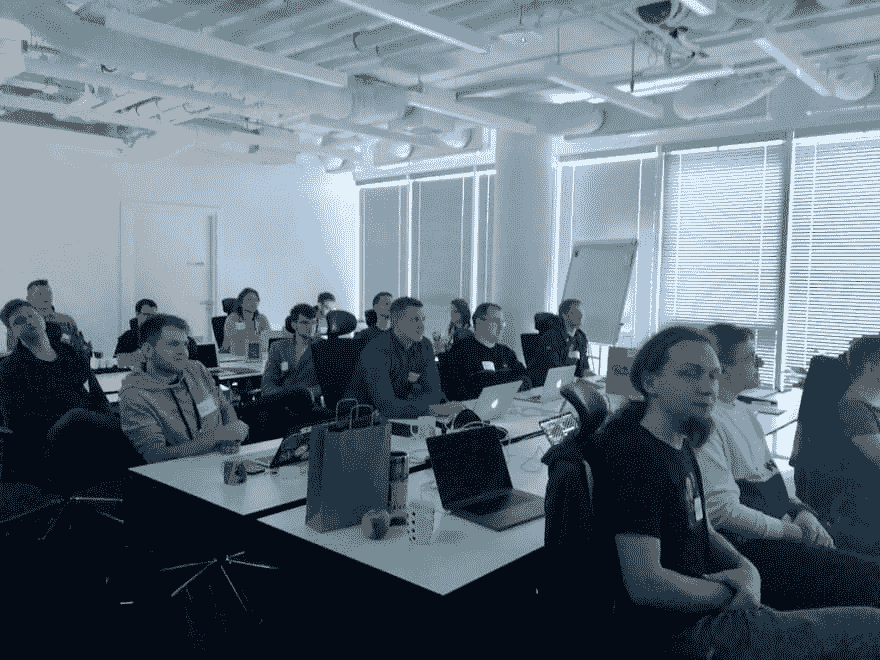
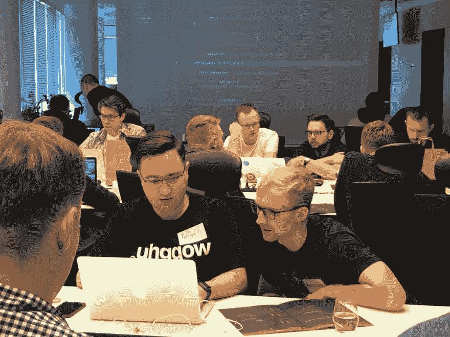
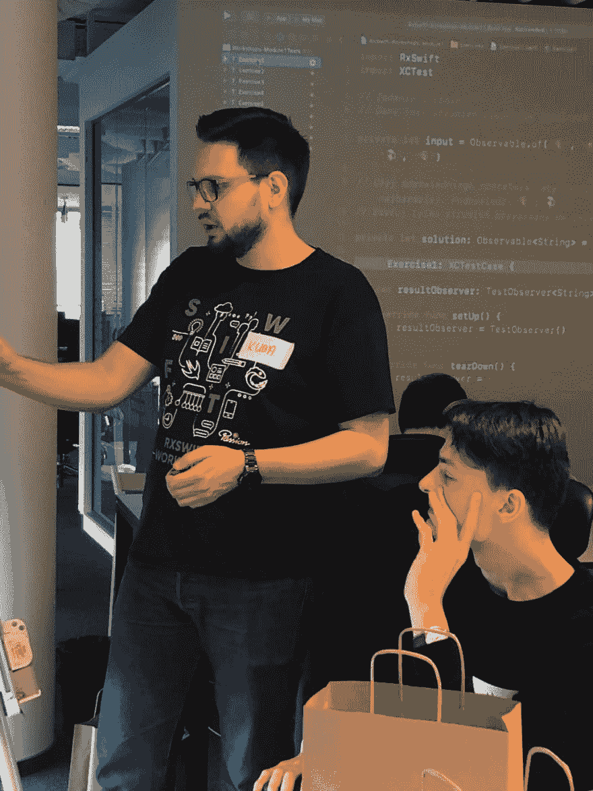
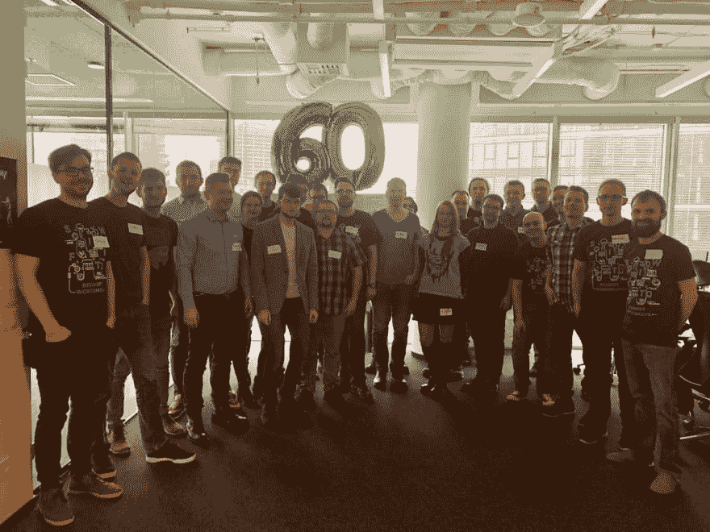

# RxSwift 研讨会

> 原文：<https://dev.to/elpassion/rxswift-workshops-f3m>

> 您希望我们在贵公司开展专业的 RxSwift 培训吗？请通过[projects@elpassion.com](//mailto:projects@elpassion.com)联系我们。

EL Passion 的移动团队非常热衷于反应式编程。反应式方法帮助我们构建考虑功能的应用程序，而不是考虑保持内部状态同步的技术问题。

事实上，我们如此广泛地使用反应式编程，以至于我们决定与他人分享知识。我们已经举办了两期 RxSwift 研讨会，在此期间，我们指导了近 **40 名 iOS 开发人员**完成了框架和反应式编程的第一步！

## 内容

该研讨会面向熟悉 iOS 开发但从未有机会尝试 RxSwift 的人。它分为三个模块:

1.  函数反应式编程和基本 RxSwift 运算符介绍。
2.  与 RxCocoa 的 UI 绑定。
3.  反应式网络。

每个模块都包括以演示形式进行的理论介绍和一系列实践练习，重点是以反应方式执行最常见的任务。

## 议程

*   **9:00 - 9:30** 项目设置
*   **9:30 - 11:30** FRP 和基本 RxSwift 操作员
*   **11:30 - 12:00** 咖啡时间
*   **12:00-14:00**rx cocoa 中的 UI 绑定
*   **14:00 - 15:00** 午休时间
*   **15:00 - 17:00** 被动 API 调用
*   **17:00 - 17:15** 体验&关闭思路

## 与会者点评

回顾#1:

> 我在 RxSwift 培训期间参观过 EL Passion。我从事软件开发超过 15 年，我必须承认我从未见过如此组织良好的免费研讨会。整个组织的专业性给我留下了深刻的印象。

回顾#2:

> 感谢 iOS 团队为 RxSwift 研讨会做了专业和充分的准备。

回顾#3:

> 我参加了 EL Passion 举办的 RxSwift 培训。非常实质性的研讨会，很好的准备，在良好的氛围中举行。

你可以在我们的脸书页面上阅读更多评论。

## 图片

| 图片 |
| --- |
|  |
|  |
|  |
|  |

点击[我们的脸书页面](https://www.facebook.com/elpassion/posts/2080492595363174)查看更多图片。

## 执照

版权所有 2019 [EL Passion](https://www.elpassion.com)