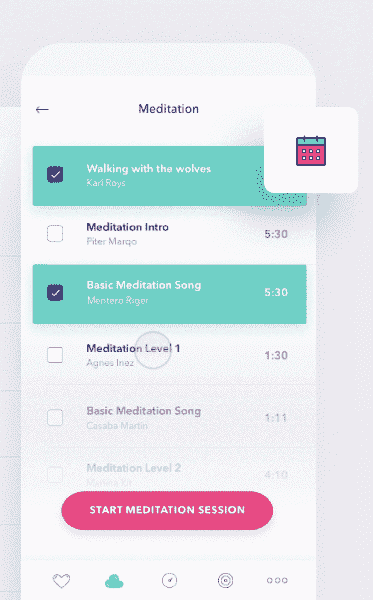
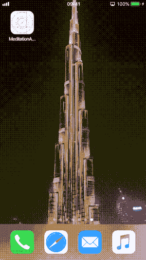

# iOS 版冥想应用- dribbble shot 实现

> 原文:[https://dev . to/El passion/meditation-app-for-IOs-dribbble-shot-implementation-1e9e](https://dev.to/elpassion/meditation-app-for-ios-dribbble-shot-implementation-1e9e)

实现动画可能很棘手，要求也很高，但另一方面，用户要求他们的应用程序既有价值又有美感。如何采取我们的设计师的一个 dribbble 镜头，并转换为原生的 iOS 应用程序？看下面的结果！

| 点滴射击 | 演示应用程序 |
| --- | --- |
| [T2】](https://dribbble.com/shots/3853204-Meditation-app) |  |

*   Swift 4.2

## 来源

*   [埃拉·库梅拉拍摄的点滴镜头](https://dribbble.com/shots/3853204-Meditation-app)
*   [Bart omiej gumi niak 实施 iOS](https://github.com/elpassion/meditation-ios-demo)

## 执照

版权所有 2019 [EL Passion](https://www.elpassion.com)