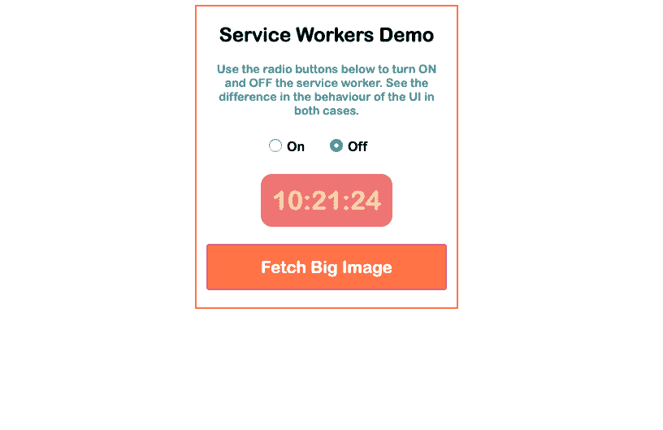

# 如何使用服务人员优化您的 JavaScript 应用程序

> 原文:[https://dev . to/mihailgaberov/how-to-optimize-your-JavaScript-app-by-using-service-workers-3 imh](https://dev.to/mihailgaberov/how-to-optimize-your-javascript-app-by-using-service-workers-3imh)

[T2】](https://res.cloudinary.com/practicaldev/image/fetch/s--5kTgbHTz--/c_limit%2Cf_auto%2Cfl_progressive%2Cq_auto%2Cw_880/https://mihail-gaberov.eu/static/a30787b3e3507e66cf8239444bf0730f/a296c/optimize-your-javascript-service-workers.jpg)

###### [](#a-nice-image-used-for-demonstration-of-sw-work)用于演示软件工作的精美图像。

* * *

我们不时会听到一些关于优化的事情。我们可以做不同种类的优化来使我们的应用程序更快更有效。为了节省时间或记忆。本文将介绍其中的一种方法——服务工作者。

## TL；速度三角形定位法(dead reckoning)

本教程解释了什么是维修工人以及如何使用它。在 JavaScript 中。最后有一个代码示例。如果你想跳过阅读，这里的是 Git 回购，[这里的](https://compassionate-brahmagupta-71d9b4.netlify.com/)你可以看到一个现场演示。

## [](#the-theory)理论

让我们先看看这是一个什么样的工人👀我们可以用它来做什么🤓。

服务人员是一个简单的脚本。JavaScript 代码，你的浏览器在后台运行，独立于网页。对于不需要网页或用户交互的功能，使用服务人员非常方便。最常见的用途之一是拦截和处理网络请求。其中包括管理响应缓存。下面是如何在应用程序运行中包含服务人员的简单示例。

通常在你 app 的入口点，你放这个:

```
if ('serviceWorker' in navigator) {  
  window.addEventListener('load', function() {
    navigator.serviceWorker.register('/service-worker.js');  
  });
} 
```

这种使用服务人员的方式比基本的有一点点改进。这将直接调用 *if 语句*中的 *register()* 方法。在这种情况下，我们使用窗口加载事件在页面加载完成后注册服务人员。这样做之后，您需要在 *service-worker.js* 文件中添加您的服务人员代码。在这一点上，你可能想看看我的服务人员档案。

现在所有主流浏览器都支持服务人员，你可以马上开始使用他们。

## [](#the-example)举个例子

理论已经足够了，让我们构建一个真正的示例应用程序，它将利用服务人员功能。

假设我们正在构建一个需要加载大量数据的应用程序。例如，它可以是一个漂亮的、大的全屏图像，我们将在首页显示。或者它可能是一个大的视频剪辑，我们必须等待加载。这是一个让服务人员大放异彩的理想用例。让我们看看怎么做。👀

在我们的具体案例中，我们将使用时钟时间来展示使用服务人员的好处。我的意思是，我们将建立一个简单的应用程序，显示时间。它将有一个漂亮的大按钮，用于获取漂亮的大图像。并且它将为用户提供选择使用或不使用服务人员的选项。

下面是它的截图。

[T2】](https://res.cloudinary.com/practicaldev/image/fetch/s--ba-oAlfh--/c_limit%2Cf_auto%2Cfl_progressive%2Cq_auto%2Cw_880/https://mihail-gaberov.eu/static/af9d1550eecb5662e5706620049fe279/ac127/sw-demo.png)

这个应用程序演示的是，当获取图像时(通过点击按钮，哇！)使用活动的服务人员—我们不会遇到被阻止的 UI(用户界面，即字段、按钮、🐛).如果您选择不使用服务工作者，您将获得一个冻结的用户界面一段时间。当工作完成并且主线程释放自己时，它将解冻 UI。

如果你不想自己克隆和运行代码，直接跳到[现场演示](https://compassionate-brahmagupta-71d9b4.netlify.com/)。

## [](#conclusion)结论

服务人员的演示向我们展示了使用他们的好处。尤其是当您试图构建响应迅速且健壮的 JavaScript 应用程序时。没有用户希望在一段未知的时间内停留在一个冻结的页面上，因为没有开发人员希望他的应用程序的用户出现这种情况。记住以上几点，现在服务人员是必须的。我们不应该忽视他们。

🔥感谢阅读！🔥