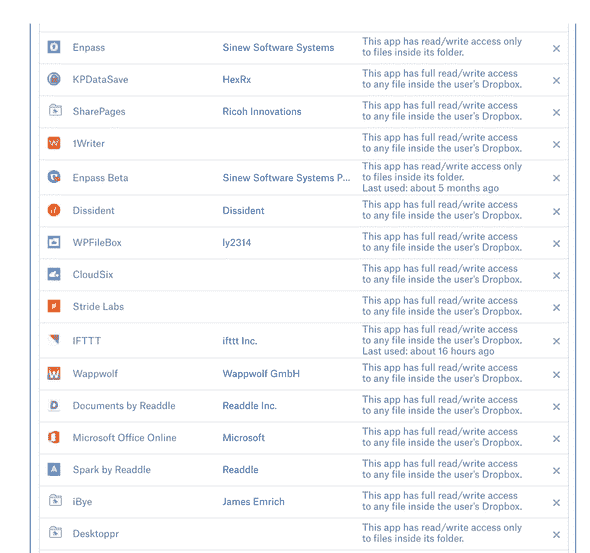
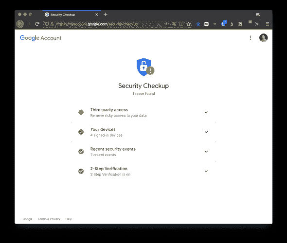

# 隐私和安全系列，第三部分:MFA 和审计的进一步发展

> 原文：<https://dev.to/jayhankins/privacy-and-security-series-part-iii-going-farther-with-mfa-and-audits-2e1h>

在上一篇隐私和安全系列文章[的](//../privacy-and-security-series-part-ii-multi-factor-auth/)中，我们谈到了多因素身份认证(MFA)的重要性，也称为双因素身份认证(2FA)。启用 MFA 在保护你的在线账户方面是一个巨大的飞跃——[谷歌和微软都说启用 MFA 可以阻止 99.9%的账户黑客](https://www.zdnet.com/article/microsoft-using-multi-factor-authentication-blocks-99-9-of-account-hacks/)。

> 如果黑客是细菌，那么 MFA 就是互联网账户安全的代表。

因此，您已经遵循了我们讨论过的密码最佳实践，并且拥有了密码管理器，并且在您的帐户上启用了 MFA。你还能做什么？是的，当然！

## 双因素认证更进一步

上周，Square & Twitter 首席执行官杰克·多西的 Twitter 账户受到了 aSIM-swap 攻击。长话短说，一个诈骗犯能够说服一个在& T 工作的人把杰克的电话号码换成了用于通过短信发送推文的诈骗 SIM 卡。

为什么一个 [SIM-swappingattack](https://krebsonsecurity.com/tag/sim-swapping/) 对你很重要？

好吧，如果你的 MFA 策略是把一次性密码发送到你的手机上，你很容易被 SIM 卡交换。从技术上讲，任何拥有移动设备的人都是易受攻击的，但是由 SMS-OTP MFA 支持的帐户尤其容易受到攻击。

短信一次性密码还有其他缺点吗？

是啊，实际上有不少。截至 2016 年 7 月，美国国家标准与技术研究所(NIST) [表示停止使用它们](https://blog.identityautomation.com/two-factor-authentication-2fa-explained-email-and-sms-otps)。我在上一篇文章中讨论了一些额外的缺点。

有什么比手机短信更好的替代方式？

基于令牌的动态口令(基于时间的动态口令)

不易受到 SIM 交换攻击，因为每个一次性密码都是由种子/令牌值生成的。只要

```
1\. the seed is not intercepted (which you can be reasonably sure of, ifyou trust the security of HTTPS/TLS and the root CertificateAuthorities); and
2\. your OTP device is secure you are much more secure than with anSMS-based OTP. 
```

<svg width="20px" height="20px" viewBox="0 0 24 24" class="highlight-action crayons-icon highlight-action--fullscreen-on"><title>Enter fullscreen mode</title></svg> <svg width="20px" height="20px" viewBox="0 0 24 24" class="highlight-action crayons-icon highlight-action--fullscreen-off"><title>Exit fullscreen mode</title></svg>

U2F / Yubikey /其他智能卡/证书认证

一些公司，如谷歌，正在支持 FIDO/U2F/Yubikey 方法，该方法涉及交换公钥，以与存储在安全硬件设备上的私钥对相匹配。只要

```
1\. As long as no one steals your U2F device; and
2\. the encryption isn’t cracked 
```

<svg width="20px" height="20px" viewBox="0 0 24 24" class="highlight-action crayons-icon highlight-action--fullscreen-on"><title>Enter fullscreen mode</title></svg> <svg width="20px" height="20px" viewBox="0 0 24 24" class="highlight-action crayons-icon highlight-action--fullscreen-off"><title>Exit fullscreen mode</title></svg>

您甚至比基于令牌的 OTP 更安全，因为令牌种子本质上是通过网络传输的私钥。U2F 方法保持私钥的私密性。

## 审核您的设置

即使我们已经完成了更改所有密码和在一系列服务上启用多因素身份验证的艰苦工作，仍然有一些事情你应该半频繁地做。

首先，你应该仔细检查与你的账户“连接”的应用/服务列表。也许你在 Gmail 中使用过 Boomerang，或者有一些应用程序使用 Google Drive 上的文件。你最后一次查看名单是什么时候？

下面是连接到我的 Dropbox 的一些服务的截图。我并不以此为荣。看看有多少条目具有“对任何文件的完全读/写访问权限”。

[](///static/493f95f9589ad3a48f8b9ae78aa3eda6/2b4d9/ScreenShot2019-01-16at4-6ae5466a-6ca0-4387-81fd-ba011939d766.11.42PM.png)

仔细检查这个列表，确保你知道所有连接的应用和服务。如果您无法识别某个应用程序，请将其移除并更改密码。经常为你的高风险账户这样做，比如你的电子邮件提供商。谷歌、微软、脸书和推特都提供应用连接，所以要经常检查。

同样，从您的帐户中删除未知或未使用的设备。例如，您的 Google 帐户可能仍然注册了一部手机，并向其发送认证推送通知。如果您有任何理由认为某个设备已经受损，请将其移除。

最后，如果可能的话，查看最近的安全事件。一些公司让你查看最近的登录尝试、应用程序连接等。此时，默认情况下，您应该正在查看您的帐户的任何活动信息。

谷歌在一个名为“SecurityCheckup”的易于使用的门户网站中提供了所有这些功能。

[](///static/773f612605658c2efe5dfe6beff29e51/f3580/Untitled-326ccf91-c1f7-476c-b6bd-5aaa9a865aec.png)

是的，我的帐户在安全性方面没有获得 A+，因为我有一个未签名的第三方应用程序连接到 Google Sheets。好消息是:这是我正在开发的一个项目，我相信自己(大部分情况下)。

## 下次

当然还有更多。我们甚至还没有开始讨论浏览器扩展，这会严重影响你的隐私游戏。在那之前。