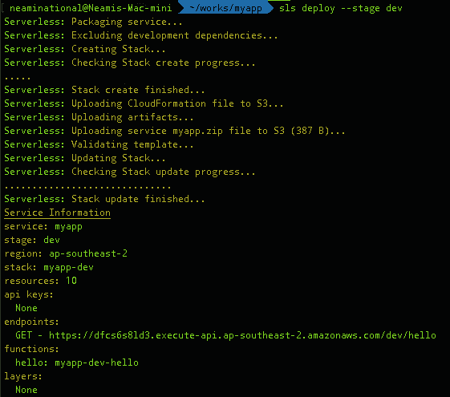
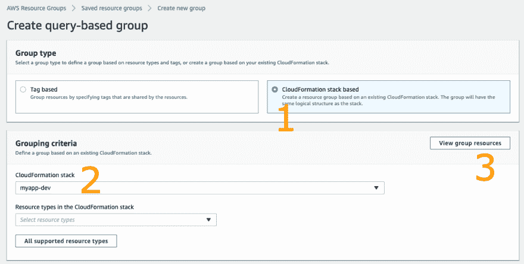
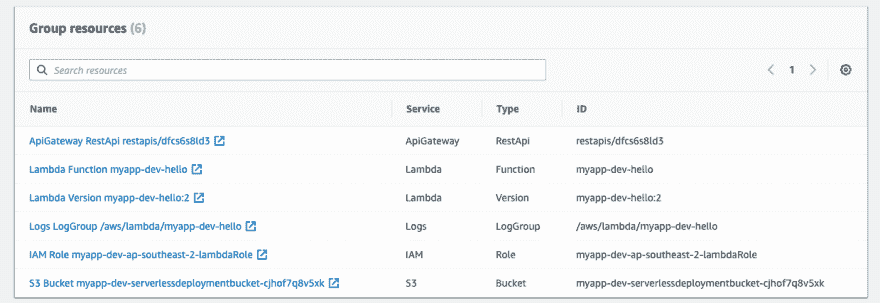
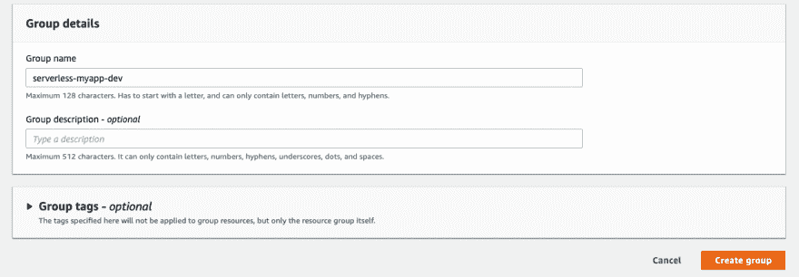
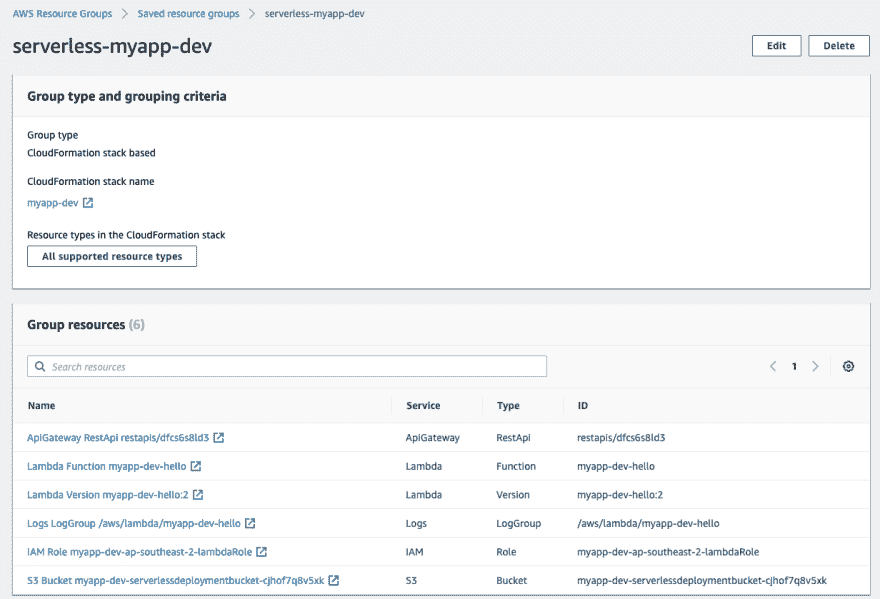
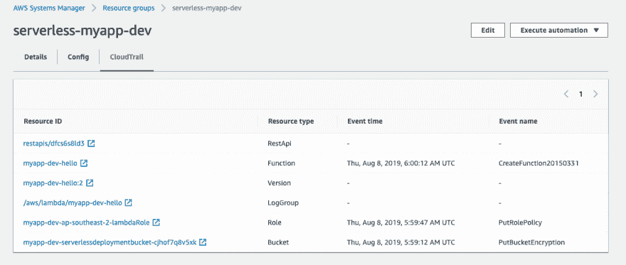

# 无服务器框架:Gerenciando recursos com AWS 资源组

> 原文：<https://dev.to/oieduardorabelo/serverless-framework-gerenciando-recursos-com-aws-resource-groups-4n1a>

如果您正在处理无服务器项目，您应该知道无服务器项目可能会以数百个 Lambda 函数结束，这肯定会增加应用程序的复杂性，一个好消息是，“**AWS resource groups”**最近宣布支持更多类型的资源，特别是组资源

使用**资源组**时，将所有相应资源分组为一项服务要容易得多，而不是单独访问每个部分。

在本文中，我将使用**服务器无关框架**创建 rest API 项目，并创建一个**资源组**，其中包含与我们的 API 项目相关的 AWS 服务的集合。

# 先决条件

遵循本指南之前，必须执行以下操作:

*   设置一个[AWS 账户](https://docs.aws.amazon.com/cli/latest/userguide/cli-chap-configure.html)
*   无服务器框架 T3

# Construindo uma API RESTful com 无服务器框架

首先，我们需要安装或升级无服务器框架到最新版本:

```
$ npm install -g serverless 
```

接下来，我们将创建一个新项目:

```
$ sls create --template aws-nodejs --path myapp 
```

创建的目录包含两个文件:t1[handler . js]是 Lambda 函数，而包含后端设置的文件:**server less . yml**，将以下设置添加到**server less . yml**:12304

```
service: myapp
provider:
  name: aws
  runtime: nodejs8.10
  region: ap-southeast-2
  tags:
    serverless: myapp
functions:
  hello:
    handler: handler.hello
    events:
      - http:
          path: hello
          method: get 
```

让我们更新我们的 **handler.js** ，创建 lambda 函数来处理网关 API 请求:

```
module.exports.hello = async (event, context) => {
  return {
    statusCode: 200,
    body: JSON.stringify({
      message: "Go Serverless v1.0! Your function executed successfully!",
      input: event
    })
  };
}; 
```

接下来，我们将部署 API:

```
$ sls deploy --stage dev 
```

结果如下所示:

[](https://res.cloudinary.com/practicaldev/image/fetch/s--0r-njWZe--/c_limit%2Cf_auto%2Cfl_progressive%2Cq_auto%2Cw_880/https://miro.medium.com/max/1122/1%2ApwXc-rrXOz0D9jWbz7wJYw.png)

现在我们的蜜蜂开始工作了，这就是乐趣开始的地方！我们将创建一个**资源组**来管理我们的 API 资源。

# Criando um 资源组

打开 AWS 资源组控制台，在导航窗格中的**【资源组】**下，选择**【创建资源组】**。

选择**【云信息栈基础】**，然后选择云信息栈。在此示例中，我们部署了堆栈**【myapp-dev】**。

[](https://res.cloudinary.com/practicaldev/image/fetch/s--RDtmW9lO--/c_limit%2Cf_auto%2Cfl_progressive%2Cq_auto%2Cw_880/https://miro.medium.com/max/2456/1%2Ah2YHOQ_LYbUIhE0XbsaFQg.png)

单击**按钮【view group resources】**查看此堆栈中包含的所有相关服务。

[](https://res.cloudinary.com/practicaldev/image/fetch/s--dF7N-N1M--/c_limit%2Cf_auto%2Cfl_progressive%2Cq_auto%2Cw_880/https://miro.medium.com/max/2478/1%2AhqIkFAdBC9lKRQysOxnPbA.png)

在**【group details】**中输入组的名称和说明。

[](https://res.cloudinary.com/practicaldev/image/fetch/s--Gj6WCPeI--/c_limit%2Cf_auto%2Cfl_progressive%2Cq_auto%2Cw_880/https://miro.medium.com/max/2482/1%2AWHGbYk96h2lx-K1HWe2nLg.png)

一切都安排好了，选择**【create group】**。我们可以转到**【保存的资源组】**查看我们刚刚创建的资源组。

[](https://res.cloudinary.com/practicaldev/image/fetch/s--IVvStJNJ--/c_limit%2Cf_auto%2Cfl_progressive%2Cq_auto%2Cw_880/https://miro.medium.com/max/2464/1%2AzalPpyPa3Ww_y-faCfVMMA.png)

浏览**【group resource】**，我们可以看到，我们的无服务器项目包括 S3 功能、ApiGateway RestApi、lambda、Cloudwatch Logs 和 IAM Roles 功能。

# visualando eventos do cloud trail do AWS 资源组

AWS 系统管理器显示有关我们组中功能的详细信息，如配置日志和 AWS CloudTrail。

打开 AWS 系统管理器控制台，在左侧导航窗格**【运营管理】**中选择**【资源组】**。我们可以看到 CloudTrail 事件日志中的所有数据。

[](https://res.cloudinary.com/practicaldev/image/fetch/s--1UiSVhen--/c_limit%2Cf_auto%2Cfl_progressive%2Cq_auto%2Cw_880/https://miro.medium.com/max/2526/1%2ARbAdZ5-rs4u0waHjFbUENw.png)

* * *

谢谢你的阅读，希望你发现这篇文章有用。如果你以后想看更多这样的内容，可以跟我来！

# 克雷蒂托

*   [使用 AWS 资源组](https://medium.com/the-cloud-builders-guild/an-easy-way-to-manage-serverless-project-resources-by-using-aws-resource-groups-68475cc19d35)、escrito origination e por[@ yia 333](https://dev.to/yia333)管理无服务器项目资源的简单方法