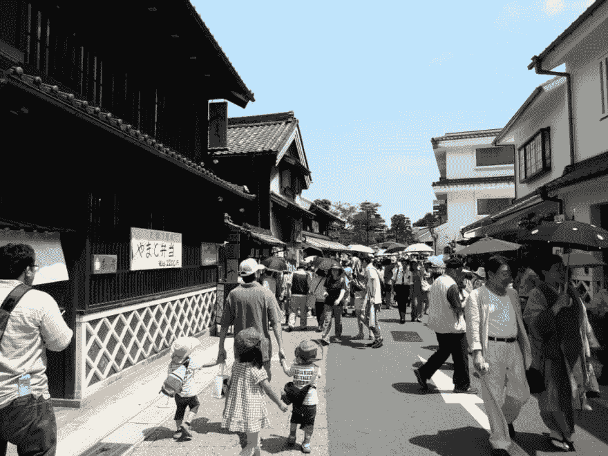
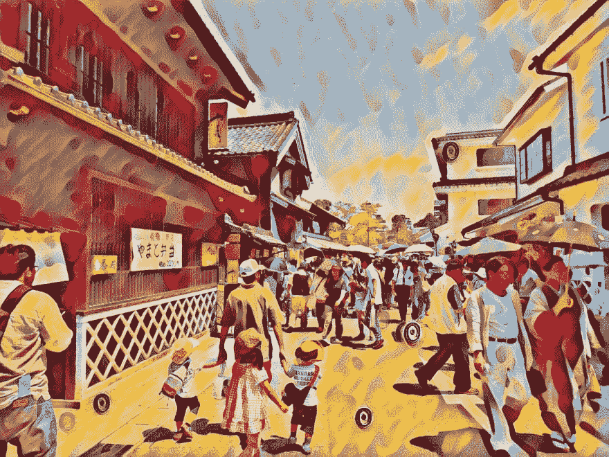
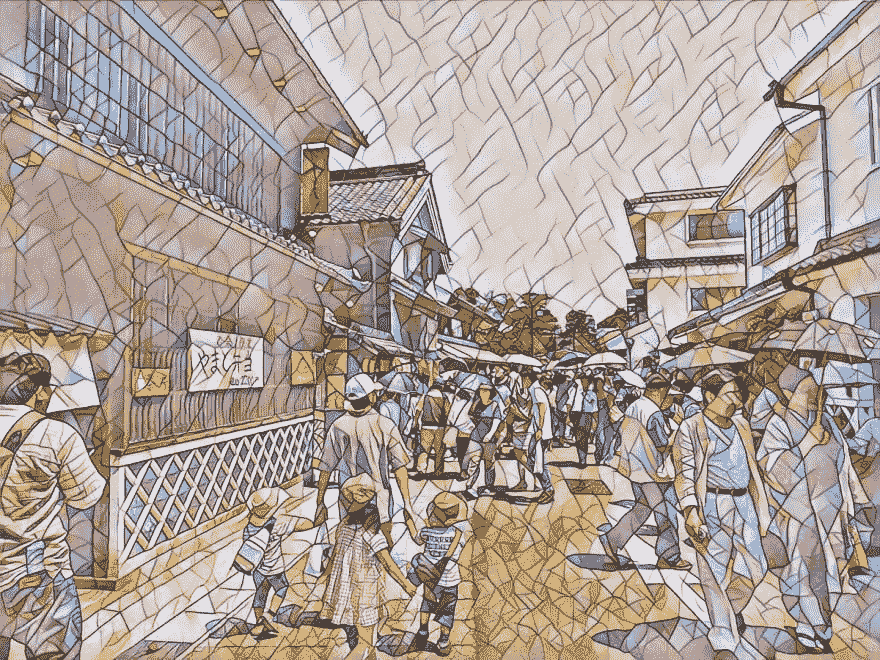
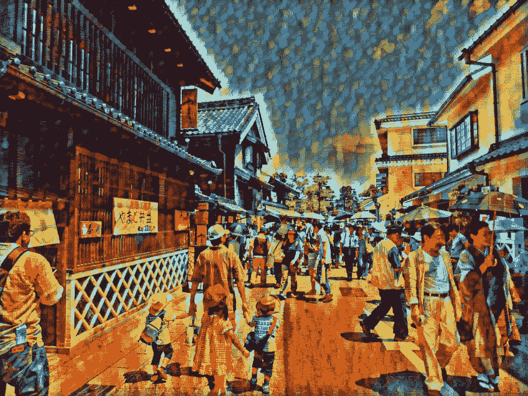
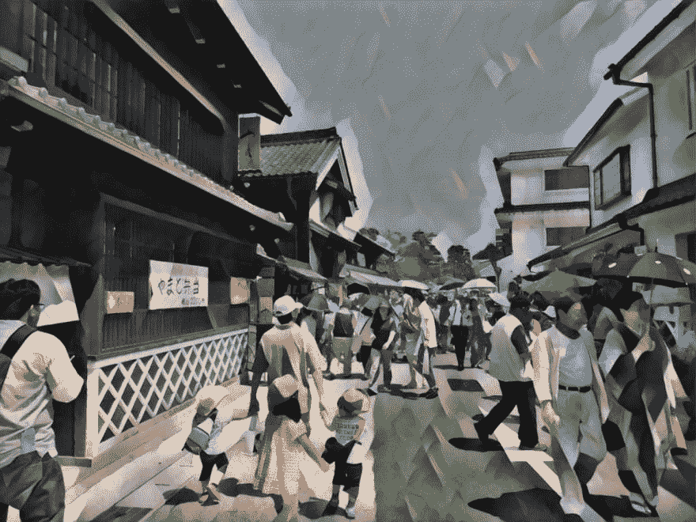

# Ruby 中的深度学习风格转换

> 原文：<https://dev.to/kojix2/deep-learning-style-transformations-in-ruby-3jjk>

想用 Ruby 做深度学习推理？是的，你可以！

### 要求

*   [ONNXRuntime](https://github.com/microsoft/onnxruntime) 和它的 [Ruby binding](https://github.com/ankane/onnxruntime) 由安德鲁·凯恩创造。
    液体错误:内部

*   [麦格罗](https://github.com/yoshoku/magro)和[纳雷](https://github.com/ruby-numo/numo-narray)。

*   [在](https://github.com/onnx/models/tree/master/vision/style_transfer/fast_neural_style) [ONNX 模型动物园](https://github.com/onnx/models)中的快速神经风格转移模型。

`st.rb`

```
require 'magro'
require 'onnxruntime'

model = OnnxRuntime::Model.new('')

input = Magro::IO.imread(ARGV[0])
                 .transpose(2, 0, 1)
                 .expand_dims(0)
                 .to_a

output = model.predict(input1: input)

result = Numo::Int32[*output['output1'][0]]
                    .clip(0, 255)
                    .transpose(1, 2, 0)
                    .cast_to(Numo::UInt8)

Magro::IO.imsave(ARGV[1], result) 
```

<svg width="20px" height="20px" viewBox="0 0 24 24" class="highlight-action crayons-icon highlight-action--fullscreen-on"><title>Enter fullscreen mode</title></svg> <svg width="20px" height="20px" viewBox="0 0 24 24" class="highlight-action crayons-icon highlight-action--fullscreen-off"><title>Exit fullscreen mode</title></svg>

### 运行

输入图像尺寸应该是 4 的倍数

```
ruby st.rb in.jpg out.jpg 
```

<svg width="20px" height="20px" viewBox="0 0 24 24" class="highlight-action crayons-icon highlight-action--fullscreen-on"><title>Enter fullscreen mode</title></svg> <svg width="20px" height="20px" viewBox="0 0 24 24" class="highlight-action crayons-icon highlight-action--fullscreen-off"><title>Exit fullscreen mode</title></svg>

### 生成图像

[https://commons . wikimedia . org/wiki/file:ari 松下 bori。JPG](https://commons.wikimedia.org/wiki/File:Arimatsushibori.JPG) <sup id="fnref1">[1](#fn1)</sup>

[](https://res.cloudinary.com/practicaldev/image/fetch/s--7CNh1hRu--/c_limit%2Cf_auto%2Cfl_progressive%2Cq_auto%2Cw_880/https://thepracticaldev.s3.amazonaws.com/i/ndojt1rtihn621le74ti.jpg)

糖果
[](https://res.cloudinary.com/practicaldev/image/fetch/s--bTKKTfV7--/c_limit%2Cf_auto%2Cfl_progressive%2Cq_auto%2Cw_880/https://thepracticaldev.s3.amazonaws.com/i/jjltuq897i1g458feimc.jpg)

马赛克
[](https://res.cloudinary.com/practicaldev/image/fetch/s--HSC8HpSq--/c_limit%2Cf_auto%2Cfl_progressive%2Cq_auto%2Cw_880/https://thepracticaldev.s3.amazonaws.com/i/ubgd9uirx4cslwkgylmx.jpeg)

点主义
[](https://res.cloudinary.com/practicaldev/image/fetch/s--Tr6T1vDx--/c_limit%2Cf_auto%2Cfl_progressive%2Cq_auto%2Cw_880/https://thepracticaldev.s3.amazonaws.com/i/sxubdn3pkjxg9xsqm9c3.jpg)

雨 _ 公主
[](https://res.cloudinary.com/practicaldev/image/fetch/s--y0Znw995--/c_limit%2Cf_auto%2Cfl_progressive%2Cq_auto%2Cw_880/https://thepracticaldev.s3.amazonaws.com/i/3hjsqhpg4vq7tqw62mal.jpg)

udnie
[](https://res.cloudinary.com/practicaldev/image/fetch/s--ja53knd7--/c_limit%2Cf_auto%2Cfl_progressive%2Cq_auto%2Cw_880/https://thepracticaldev.s3.amazonaws.com/i/yhqjpfmhf4g558bnncd8.jpg)

太美了。

其他员额

*   [使用 ONNXRuntime 和 Ruby 进行 YOLO 物体检测](https://dev.to/kojix2/yolo-object-detection-using-onnxruntime-with-ruby-1ap0)
*   [NumPy 的 NArray - Ruby 等价物](https://dev.to/kojix2/narray-ruby-equivalent-of-numpy-30ji)

* * *

1.  归属-共享相似 3.0 未移植(CC BY-SA 3.0) [↩](#fnref1)