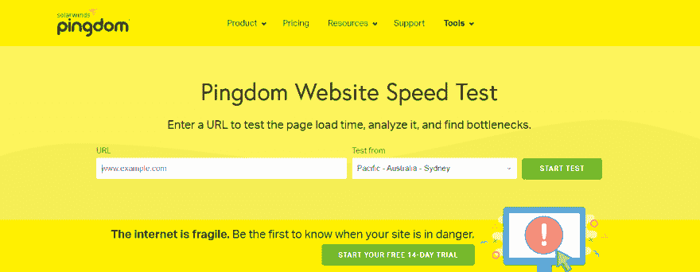
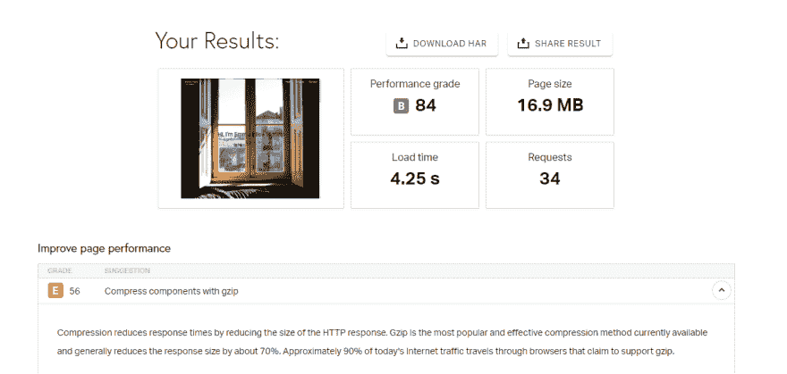
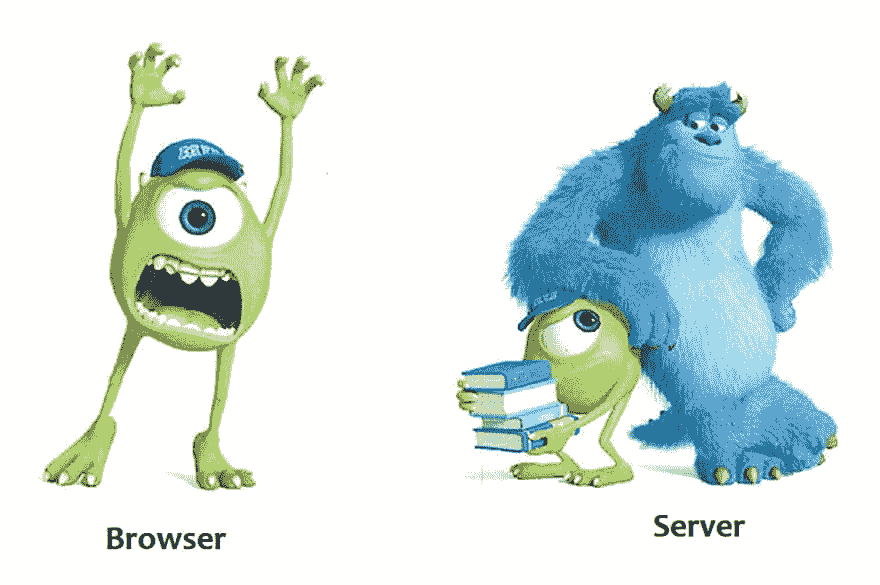
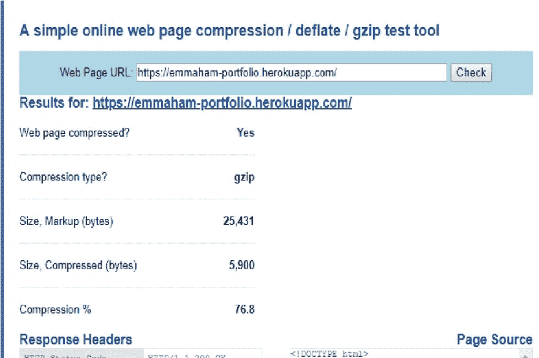
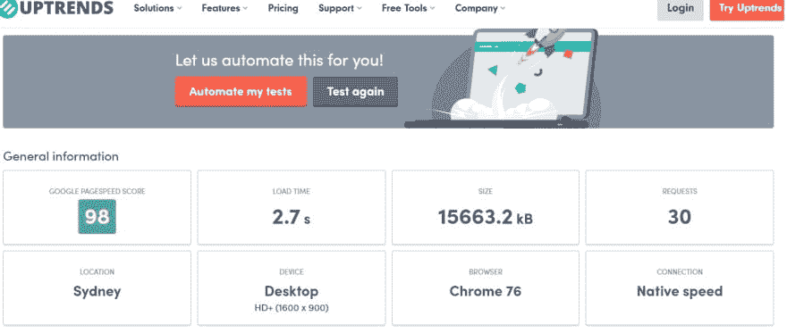

# 如何优化你的 php 网站(壮举。Gzip 压缩)

> 原文：<https://dev.to/ham8821/how-to-optimize-your-php-website-feat-gzip-compression-285j>

你有没有经历过当你绞尽脑汁把这个网站做得很漂亮，一旦你把它部署到网上，它就永远无法加载，你在别人面前感到非常尴尬，因为他们也必须等待永恒？

我们都去过那里

如果部署在 heroku、github.it 等免费托管网站上，事情通常会变得更糟。

然后，我们能做些什么。

### **第一次**:一次诊断**T3】**

听起来简单明了，我们首先需要弄清楚网站有多慢，原因是什么，就像我们收到医生的诊断一样！为了做到这一点，你可以将一些有用的链接加入书签。
尽管我知道事实上有数百个网站在做类似的工作，但这纯粹是个人喜好的问题，就简单直接的 UI 设计和内容而言，这两个是我最喜欢的。

a.[uptrends.com/tools/website-speed-test](https://www.uptrends.com/tools/website-speed-test)T2 b .[tools.pingdom.com/](https://tools.pingdom.com/)

这是你点击第二个链接时的样子，这个链接是 pingdom，它帮助我清楚地看到这个问题。您可以简单地复制您的网站 url 并选择您想要测试的位置。点击“开始测试”按钮！

[](https://res.cloudinary.com/practicaldev/image/fetch/s--tJxNHTKp--/c_limit%2Cf_auto%2Cfl_progressive%2Cq_auto%2Cw_880/https://thepracticaldev.s3.amazonaws.com/i/uhuyev0oblc4glt3mpcl.png)

让我们看看结果。

[](https://res.cloudinary.com/practicaldev/image/fetch/s--NGdG1G_l--/c_limit%2Cf_auto%2Cfl_progressive%2Cq_auto%2Cw_880/https://thepracticaldev.s3.amazonaws.com/i/zb6be83b3ygbuna2iy7u.png)

似乎整体性能等级并不可怕，但是我在“压缩组件”的名称下有一个“D”级。
据说

###### 压缩通过减小 HTTP 响应的大小来缩短响应时间。Gzip 是目前可用的最流行和最有效的压缩方法，通常可以减少大约 70%的响应大小。如今，大约 90%的互联网流量是通过声称支持 gzip 的浏览器传输的。”

好了，听起来是时候深入研究“gzip”部分了，不是吗？

### **第二 **: Gzip，你是什么？**T3】**

在我们讨论 Gzip 之前，通过这样的解释，理解内容编码的概念会更容易。

[](https://res.cloudinary.com/practicaldev/image/fetch/s--2n0dw4kU--/c_limit%2Cf_auto%2Cfl_progressive%2Cq_auto%2Cw_880/https://thepracticaldev.s3.amazonaws.com/i/ltrvefjf0vnj30g5mdcf.jpg)

###### 原创

浏览器:嘿，老兄，我能得到 index.php 的文件吗？服务员:稍等一下....是啊！明白了！我把文件发给你。
浏览器:200KB？哎唷…等待，我需要更多的时间…好了，完成并加载。

###### 压缩后

浏览器:嘿，老兄，我能得到 index.php 的文件吗？如果你有压缩版本的话，我不介意。服务员:稍等一下....是啊！明白了！你说你擅长压缩的？太神奇了。我把文件发给你。
浏览器:太好了！才 20KB。我自己拉开！

就这么简单！较小的文件可以减少大量的下载时间，这样用户就不必等待很长时间才能看到整个网站。

### **第三 **: Gzip，我怎么会有你？**T3】**

好了，现在让我们进入正题，在我们的网站上实现 Gzip。这将是非常直接的，但语法可能会有所不同，所以请记住这一点！

首先，打开你的。根文件夹中的 htaccess 文件。如果你没有，那么你可以简单的做一个。在文件中，我们能做的是指定我们想要压缩的文件的类型。我看起来会像这样。

```
<IfModule deflate_module>
    # Enable compression for the following file types.
    AddOutputFilterByType            \
     DEFLATE                         \
      application/javascript         \
      text/css                       \
      text/html                      \
      text/javascript                \
      text/plain                     \
      text/xml
</IfModule> 
```

<svg width="20px" height="20px" viewBox="0 0 24 24" class="highlight-action crayons-icon highlight-action--fullscreen-on"><title>Enter fullscreen mode</title></svg> <svg width="20px" height="20px" viewBox="0 0 24 24" class="highlight-action crayons-icon highlight-action--fullscreen-off"><title>Exit fullscreen mode</title></svg>

但是请注意，Gzip 无法压缩已经以压缩格式(如 PNG、zip 或任何其他压缩格式)压缩的文件。

在 Apache 中，这也是可行的

```
# compress text, html, javascript, css, xml:
AddOutputFilterByType DEFLATE text/plain
AddOutputFilterByType DEFLATE text/html
AddOutputFilterByType DEFLATE text/xml
AddOutputFilterByType DEFLATE text/css
AddOutputFilterByType DEFLATE application/xml
AddOutputFilterByType DEFLATE application/xhtml+xml
AddOutputFilterByType DEFLATE application/rss+xml
AddOutputFilterByType DEFLATE application/javascript
AddOutputFilterByType DEFLATE application/x-javascript 
```

<svg width="20px" height="20px" viewBox="0 0 24 24" class="highlight-action crayons-icon highlight-action--fullscreen-on"><title>Enter fullscreen mode</title></svg> <svg width="20px" height="20px" viewBox="0 0 24 24" class="highlight-action crayons-icon highlight-action--fullscreen-off"><title>Exit fullscreen mode</title></svg>

如果以上都不行，那么试试这里的这个

```
<ifModule mod_gzip.c>
mod_gzip_on Yes
mod_gzip_dechunk Yes
mod_gzip_item_include file \.(html?|txt|css|js|php|pl)$
mod_gzip_item_include mime ^application/x-javascript.*
mod_gzip_item_include mime ^text/.*
mod_gzip_item_exclude rspheader ^Content-Encoding:.*gzip.*
mod_gzip_item_exclude mime ^image/.*
mod_gzip_item_include handler ^cgi-script$
</ifModule> 
```

<svg width="20px" height="20px" viewBox="0 0 24 24" class="highlight-action crayons-icon highlight-action--fullscreen-on"><title>Enter fullscreen mode</title></svg> <svg width="20px" height="20px" viewBox="0 0 24 24" class="highlight-action crayons-icon highlight-action--fullscreen-off"><title>Exit fullscreen mode</title></svg>

**其次，**把这段 php 代码放在你主页的顶部

```
<?php
if (!isset($_SERVER['HTTP_ACCEPT_ENCODING'])) {
    ob_start();            
}
elseif (strpos(' ' . $_SERVER['HTTP_ACCEPT_ENCODING'], 'x-gzip') == false) {
    if (strpos(' ' . $_SERVER['HTTP_ACCEPT_ENCODING'], 'gzip') == false) {
        ob_start();
    }
    elseif(!ob_start("ob_gzhandler")) {
        ob_start();
    }   
}
elseif(!ob_start("ob_gzhandler")) {
    ob_start();
}
?> 
```

<svg width="20px" height="20px" viewBox="0 0 24 24" class="highlight-action crayons-icon highlight-action--fullscreen-on"><title>Enter fullscreen mode</title></svg> <svg width="20px" height="20px" viewBox="0 0 24 24" class="highlight-action crayons-icon highlight-action--fullscreen-off"><title>Exit fullscreen mode</title></svg>

第三，让我们继续检查压缩是否有效！gidnetwork.com/tools/gzip-test.php
T3

[](https://res.cloudinary.com/practicaldev/image/fetch/s--sRkIFN6K--/c_limit%2Cf_auto%2Cfl_progressive%2Cq_auto%2Cw_880/https://thepracticaldev.s3.amazonaws.com/i/3s38ksls9jhb8cd47ylr.jpg)

霍雷。它说，这是压缩的权利和压缩类型是 gzip。看起来我们已经完成了我们的工作:)

最后，如果你对速度不满意，再给你一点额外的小费。

```
## EXPIRES CACHING ##
<IfModule mod_expires.c>
ExpiresActive On
ExpiresByType image/jpg "access plus 1 month"
ExpiresByType image/jpeg "access plus 1 month"
ExpiresByType image/gif "access plus 1 month"
ExpiresByType image/png "access plus 1 month"
ExpiresByType text/css "access plus 1 month"
ExpiresByType application/pdf "access plus 1 month"
ExpiresByType text/x-javascript "access plus 1 month"
ExpiresByType application/x-shockwave-flash "access plus 1 month"
ExpiresByType image/x-icon "access plus 1 year"
ExpiresDefault "access plus 2 days"
</IfModule>
## EXPIRES CACHING ## 
```

<svg width="20px" height="20px" viewBox="0 0 24 24" class="highlight-action crayons-icon highlight-action--fullscreen-on"><title>Enter fullscreen mode</title></svg> <svg width="20px" height="20px" viewBox="0 0 24 24" class="highlight-action crayons-icon highlight-action--fullscreen-off"><title>Exit fullscreen mode</title></svg>

把上面的线放进去。htaccess 文件。它所做的是，提到的文件将被存储在缓存中，并在一定时间后过期，所以如果你几天后再次访问该网站，你就不需要等待浏览器再次加载所有文件！

### **最后**:让我们再检查一下它在**网站上是如何工作的**

我点击了第一个链接来检查速度，结果是这样的！
[T3】](https://res.cloudinary.com/practicaldev/image/fetch/s--M9TTdPBC--/c_limit%2Cf_auto%2Cfl_progressive%2Cq_auto%2Cw_880/https://thepracticaldev.s3.amazonaws.com/i/1jux83vpbbdois5p4ozg.jpg)

哇，看起来很酷，听起来我明显减少了一些加载时间。

### **结论:**:**T3】**

通过压缩你网站的文件，你可以确保加载时间保持在低水平，你的用户不会遭受不必要的减速。我希望这篇文章能对你有所帮助，如果你觉得这篇文章有用，请告诉我。谢谢！

如果你想看看我的网站
[来这里访问](https://emmaham-portfolio.herokuapp.com/)

[](https://res.cloudinary.com/practicaldev/image/fetch/s--MeqrZon_--/c_limit%2Cf_auto%2Cfl_progressive%2Cq_auto%2Cw_880/https://thepracticaldev.s3.amazonaws.com/i/3druws88n6n6c2zmzwjh.png)