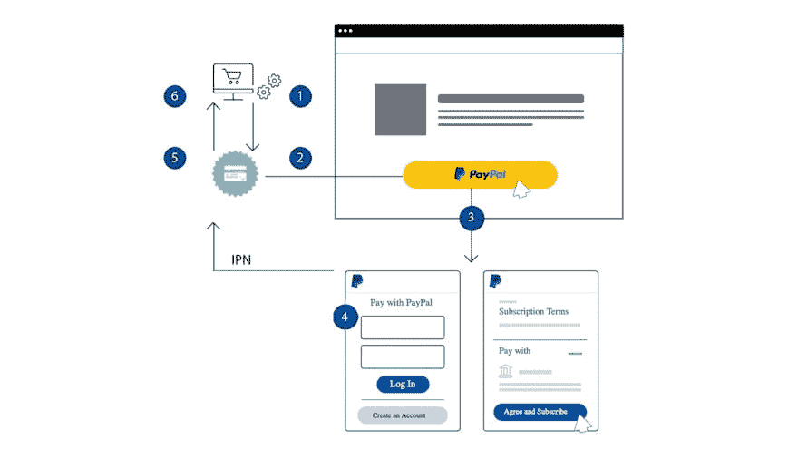
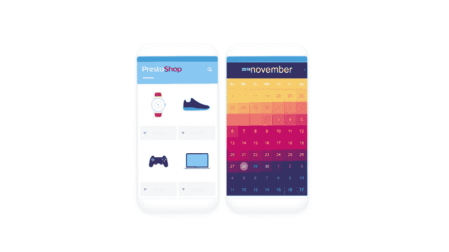

# 售前产品、订购产品与订购

> 原文：<https://dev.to/franken/prestashop-products-subscription-products-vs-subscriptions-23fn>

[SOO Paypal 订阅&定期付款](https://www.prestasoo.com/prestashop-modules/subscriptions-prestashop-module.html)是唯一的 Prestashop 模块，允许您使用 Paypal 在 Prestashop 网站上将产品作为定期产品销售。

它提供了两个不同但相关的项目:订阅产品和订阅。

每个人都知道订阅关系对你来说远比一次性购买更有价值。

在商业方面，订阅商务提供了一个稳定的每月收入模式，可以围绕几乎每个利基市场进行设计——从食品、美容、会员到宠物。

如果在网上有一个关于某个产品或课程的相关社区，你可能会围绕它建立一个订阅箱。在您的 PrestaShop 网站上提供订阅是一个好主意！

在这里，我们将解释 Prestashop 产品(常规产品)、subscription 产品和 subscription 之间的区别。然后，你可以找到一些例子来说明这些差异。

### 预铺产品

这些是你可以在你的网站上使用银行电汇、货到付款、维萨卡、万事达卡等常规支付方式进行销售的默认要素..等等...

### 认购产品

订阅产品是 Prestashop 产品的延伸。您可以从后端办公室的产品管理器页面创建它们，或者从现有产品转换。通过将产品分配到立即开始订购计划，您可以将该产品作为订购产品销售。

像任何其他 Prestashop 产品一样，订阅产品拥有所有相同的数据，它们可以添加到购物车中，客户可以通过 Paypal 网站购买。

订购产品的购买记录在订单中，未来的付款将作为新订单添加。

Paypal 订阅付款帮助您管理 PayPal 网站上的预定付款，收取未来付款，并向管理订单的模块发送付款通知。

### 订阅

现在你知道什么是 Prestashop 产品，什么是 subscription 产品。
**那么，什么是订阅呢？**

订阅产品是提供给顾客购买的东西，而订阅是你的商店和顾客之间关于未来交易的协议，但可以作为产品展示，它也具有与标准产品相同的所有数据。

产品、订阅产品和订阅之间的区别在于，订阅将被分配到一个订阅计划，该计划允许客户选择开始日期，然后订购产品/订阅产品的订单是过去交易的记录，而订阅的订单是未来交易的协议。

### 这个模块非常灵活

您可以将您的产品作为标准产品/订购产品/订购产品或所有产品进行销售。这很容易。

## 例子

在这里你可以找到一些例子来想象。

### 购买每周披萨订阅产品

顾客在你的商店订购产品的典型流程是:

顾客参观你的比萨饼店。他们查看了每周发货的披萨订阅产品。
他们将该订购产品添加到购物车中，然后进行结账。
顾客在 Paypal 上完成结账。
Prestashop 创建订单以记录交易。披萨订阅产品将作为一个单项包含在订单中。
SOO Paypal Subscription &循环支付创建一个订户来记录未来交易的协议。
一周后，套餐将根据其账单时间表通过 Paypal 进行续订。Paypal 向该模块发送通知。SOO Paypal 订阅&定期付款创建新订单。

### 年费订阅

假设你的俱乐部提供 300 美元/年的会员资格。因此，您可以在订阅计划页面上创建会员计划，然后访问业务对象->目录->产品来创建订阅，并将该订阅分配到您的会员计划。

## 总结

在 Prestashop 网站上创建订阅/订阅产品或将现有产品转换为订阅/订阅产品非常简单。

你所需要的一切只是一个贝宝商业帐户，并填写表格中的必要信息。

当客户购买这些产品时，订单将被创建，未来的付款将被自动收取。您还可以选择将默认产品作为订阅产品、订阅产品或同时作为所有产品销售。