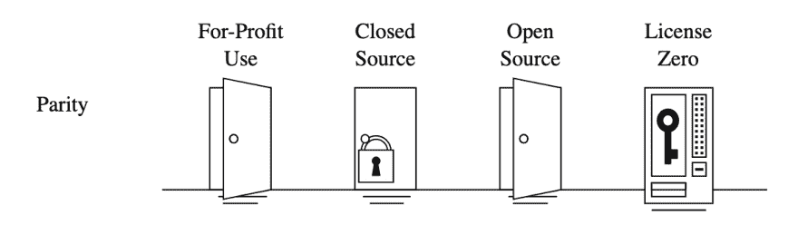

# 可持续自由/开源软件系统

> 原文：<https://dev.to/zkat/a-system-for-sustainable-foss-11k9>

***免责声明**:该系统仍在开发中。我期待着阅读(并纳入！)你的(建设性！)反馈，我希望将它发展成一个完全可用的模型，任何人都可以采用。我也不是律师。即使我是，我也不是你的律师。不要把这些当作法律建议，或者以任何合法的方式。如果你想确定这在法律上对你来说是合理的，就让你的律师看看。最后，我和零号许可证没有任何关系。我写这篇文章是因为我认为它创造了一些伟大的工具来实现我们在这里试图做的事情。*

在你阅读其他任何东西之前，请注意这一点:这整件事集中在**开发者工具**上——它不打算用于像库、数据库或操作系统这样的东西。它确实涵盖了编译器、linters、包管理器、捆绑器和所有其他类似的工具。我的希望是，通过更专注于特定类别的软件，我们可以有更好的成功机会。

这并不是说这个模型不能应用于其他用例。只是我不会在这里讨论那些其他情况的含义，并且在那些情况的实现中可能会有一些令人惊讶的复杂性。

## 整个系统的概括

因为这篇文章是用来作为参考的，所以这里有一个完整的模型。点击各种链接，详细了解每个步骤的方法和原因！

1.  将对等许可应用到您的项目中。
2.  将 Apache 2.0 许可证应用于您项目的第三方贡献。
3.  建立一个赞助/众筹平台，并确保它有一个给赞助商发放许可证的层级。
4.  将赞助人许可证应用到您的项目中。
5.  (可选)[用其他零许可许可证](#handling-additional-licensing)处理附加许可。
6.  阅读[为什么首先要做这件事](#some-background)。
7.  当上述工作为你赚了足够的钱时，辞职吧。恭喜你，你现在有一个自由软件的工作了！

## 模型，详细

我提议的模式包括让我们的社区回归自由软件模式——我的意思是，使用所谓的左版权许可——并以此为维护者提供资金，以补偿他们的劳动。这一提议的工作流程与 Red Hat 或 MongoDB 等公司使用的许可模型没有本质上的不同，但它更具体，更适合于仅由一个或几个开发人员维护的较小项目，并且它还被设计为可能用于“devtools”维护人员，这是那些较大的开源公司使用的大多数许可证没有覆盖的使用缺口。我将在最后总结整个模型，但首先，所有这些背后的动机的一些背景。

### 平价许可证

> 将奇偶校验许可证应用于您的项目。

这个模型的第一步是使用一个强大的 copyleft 许可证——有点像 AGPL，但在这种情况下，我更喜欢使用奇偶校验许可证,因为它堵住了“devtools 漏洞”——也就是说，它对使用你的开发工具的任何人(linters、编译器/trans piler、编辑器等)强加了共享相似的要求。)，而不仅仅是人们“链接”或者在 Affero GPL 的情况下，“使用你的服务”。

要应用许可，只需将[许可文本](https://licensezero.com/licenses/parity)复制到工具根目录下的`LICENSE-PARITY`文件中。如果你使用的软件包管理器能够识别 [SPDX 许可表达式](https://spdx.org/licenses/)(比如 NPM 和 Cargo)，你要找的 ID 是`Parity-6.0.0`。

考虑到有多少小团队开源项目实际上有开发者工具，我相信这是一个需要弥合的关键差距。平价许可证还有一个好处，就是可读性更强，甚至包括明确原谅那些不知道许可证细节的人，只要他们在发现后开始遵守条款。我最喜欢这个许可的另一个部分是，它允许其他人以比奇偶校验本身更宽松的许可来许可他们自己的软件，所以它与其他 copyleft 许可不同。

我们想从这个许可决定中得到什么？

1.  确保自由软件社区中的每个人都能自由使用我们的软件，只要他们也共享他们的软件。
2.  向许可协议敞开大门，这样希望编写专有软件的人和公司必须以某种方式做出回报。
3.  堵住任何会让专有用户绕过这些期望的使用漏洞。

### 第三方捐款

> 将 Apache 2.0 许可证应用于您的项目的第三方贡献。

当然，一旦我们开始用授予专有许可证的意图来处理 copyleft，我们可能会遇到整个模型中最棘手的部分:确保人们仍然可以为您的项目做出贡献。

作为一名非律师，这是我只能给出模糊建议的部分，但这是我个人的理解，如果你要完成这个工作流程，你的项目的每一个贡献者都必须同意几个备选方案中的一个:

1.  同意在许可协议下许可他们自己的更改(如 MIT 或 Apache 2.0)。
2.  同意授予您向第三方授予私人许可的能力，同时保留他们自己的版权。
3.  将他们的版权转让给你。

你选择哪一个最终取决于你，但是你**必须**确保这一点是清楚明确的，例如，通过在你的`CONTRIBUTING.md`或[上注明一个贡献者许可协议](https://en.wikipedia.org/wiki/Contributor_License_Agreement)。

出于这篇博文的目的，我们将采用第一种选择:让第三方贡献获得 Apache 2.0 的许可。Apache 2.0 是一个非常宽松的许可证，很像 MIT 和 BSD0 许可证，除了它还有授予专利许可的语言，这在今天被认为是非常重要的。

所以继续复制[许可证](https://www.apache.org/licenses/LICENSE-2.0.txt)的文本，并把它放在项目根文件夹中的一个名为`LICENSE-APACHE`的文件中。如果您正在使用一个带有`license`字段的包管理器，那么它的新 SPDX 表达式将是`Parity-6.0.0 AND Apache-2.0`，所以也把它添加进去。

如果你想走其他路线，或者你仍然想使用 CLA 来获得 Apache 许可，你可以去 [Project Harmony](http://www.harmonyagreements.org/index.html) 获得一些模板，甚至是[协议选择器](http://selector.harmonyagreements.org/)。你也可以为你的 GitHub 库设置一个 [CLA bot](https://colineberhardt.github.io/cla-bot/) 来自动签署这些文件。

但是等等，你会问，这整个练习是关于可持续性和软件自由的。为什么贡献者要为了没有回报而放弃那么多？我对此的回答是，你不应该在没有某种补偿的情况下接受来自贡献者的重要补丁。一旦你从这整个系统中赚钱，我相信把其中的一部分提供给为你的项目提交重要变更的贡献者是合乎道德的。更进一步，定期贡献者应该成为项目的完全合作者，你应该与他们更公平地分享赞助和许可协议的收益。具体取决于你和他们。

### 众筹平台

> 建立一个赞助/众筹平台，并确保它有一个授予赞助商许可证的层级。

根据您的团队，您有几个选择:

*   如果你是项目中唯一的核心开发人员，我建议你注册 GitHub 赞助商(如果没有的话)或者 T2 的 Patreon(在撰写本文时，赞助商仍处于测试阶段，随着 GH 解决问题，赞助商的账户正在慢慢地被授予)。
*   如果你在一个团队中，我推荐使用类似 [OpenCollective](https://opencollective.com) 或类似的东西。

你应该建立一些基本的奖励等级，你愿意给你的赞助商。这可以是提供 X 小时的支持，将他们添加到你的自述文件中的“感谢”列表中，甚至在你的项目网站上出现他们的徽标。要有创意！

然而，这里最重要的事情是决定哪一层将授权人们在封闭源代码场景中使用您的软件。因为这基本上相当于订阅，所以我建议你在这里把目标定在一个合理的数字上，考虑到这一点。

## 顾客执照

> 将顾客许可证应用到你的项目中。

继续下载[用户许可](https://blog.licensezero.com/2019/05/24/patron-license.html)并填写它，然后把它放入你的项目根目录下的`PATRONAGE.md`。

这一点法律术语是什么将授予个人订阅许可证给任何人谁想要使用你的软件为专有目的。值得注意的是，这些将是**单个开发者**的许可，并且只在他们的赞助有效时有效。

但是，如果您想向某人或某个实体授予批量许可，该怎么办呢？或者让一个朋友或友好的项目一次性全面放弃你的许可条款？这就是[附加许可](#handling-additional-licensing)的用武之地。

## 处理附加许可

> 使用其他零许可许可证处理额外的许可。

现在，这里有几个重要的许可场景我还没有介绍。如果您只想向朋友或合作者授予一次性豁免，您会怎么做？卖单次购买许可怎么样？还是批量企业牌照给企业？是的，在这种情况下，您将需要更专业的许可。

这些用例中的一些已经被[零许可工具](https://licensezero.com/)覆盖了，所以我推荐你去安装他们的工具，并使用它来[授予豁免](https://licensezero.com/licenses/waiver)和[私有许可](https://licensezero.com/licenses/private)到你的心满意足！

再次重申:我与零许可没有任何关系，所有这一切纯粹是因为我认为他们的工具和许可是我在这里试图实现的目标的最佳手段。因此，我非常乐意帮助他们。

反正就是这样！你完了！勇往直前，创造令人敬畏的东西！黑客快乐！

## 一些背景

自由和开源软件的兴起、对 GitHub 的崇拜、以语言为中心的包管理器所催生的生态系统，以及企业对开源的接受和参与，已经创造了一种难以置信的不可持续的局面，在这种情况下，自由共享自己的源代码和作品已经成为广大开发者社区的规范，而不是例外，无论是专业人士、业余爱好者还是学生。以至于我们已经开始期望在很多情况下源代码的可用性，在这些情况下封闭的源代码已经被规范化了。开源的梦想(如开源倡议所定义的)实际上已经实现了。

但是这给我们留下了什么？

当被受欢迎的兴奋和其他人愿意使用我们的代码来实现伟大目标的兴奋冲昏头脑时，我相信我们有点超前了，忘记了关心什么是最重要的:我们自己和我们的幸福。

由 FSF 和其他自由软件倡导者定义的自由软件，有一些答案:通过创建一个自由软件的世界，在那里某些权利得到相互保证，我们将能够确保我们社区的长期可持续性，并能够赶走企业剥削。这是通过软件许可实现的，这种许可在很多方面对公司利益是敌对的，但对开发软件的社区是友好的:“我会帮助你，只要你帮助我。”

唉，OSI 和它的努力消灭了这个模型的大部分流行，我相信这是对我们社区的巨大伤害。

你看，当许多开发人员(以及雇佣他们的公司)愉快地使用通过 GitHub、NPM、Ruby Gems 和各种其他分发方法免费获得的软件时，维护人员正在触及他们的临界点，这已经成为一种开源可持续发展危机:维护人员正在耗尽精力，被越来越大的社区对他们通常只允许在“业余”时间工作的项目的需求所淹没，同时因为任何实现更可持续发展模式的尝试而受到惩罚，如最近基于广告的资金争议。

出于某种原因，维护者被期望免费从事基本上是全职的工作，或者依赖基本的慈善活动，这些活动最终只会让那些足够受欢迎的人受益，如众筹和赞助平台。记住工作就是工作，即使你在做开源软件，强迫人们免费为你工作最终是不道德的。

经过一段时间的思考和各种可能性的研究，我相信我已经找到了一种更好地改变这种情况的方法:一种让维护人员能够证明他们在项目上花费的时间是合理的，同时继续确保源代码的免费可用性，并且不需要依赖陌生人的施舍。也就是说，从慈善变成公平交易。

# 变更日志

*   更新了以前的 CLA 部分，改为建议第三方贡献在 Apache-2.0 或类似的许可下获得许可，以使整个过程更容易。中情局的文件为那些有兴趣走这条路的人保留着。