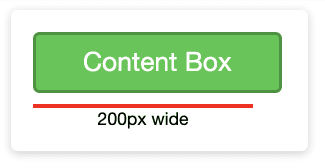
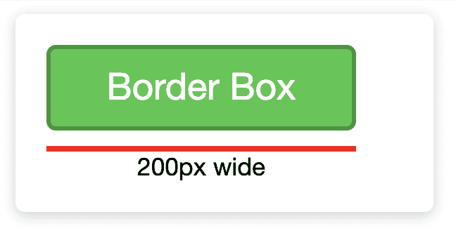

# 见见边框盒子，我最好的朋友。

> 原文：<https://dev.to/ameseee/meet-border-box-my-best-friend-a56>

有人建议你使用`box-sizing: border-box;`，但你并不完全明白它能为你做什么？

无论是重建精确到像素的构图，还是构建自己的设计，`border-box`都让我的生活变得更加轻松。但直到我明白它对我有什么作用，我才觉得轻松了许多。这就是为什么它是我最好的朋友，我想你可能也希望它出现在你的生活中！

在深入研究之前，您应该了解内容、填充、边框和边距，以及它们在盒子模型中扮演的角色。

## `box-sizing: content-box;`

`content-box`是大多数元素的框大小属性的默认值。`content-box`中的**内容**意味着内容，并且只有内容，将使用应用于元素的高度和宽度。

如果我们对一个`div`应用 200px 的宽度，看到它占用 200px 也不会奇怪。现在，当我们添加 10px 的填充和 3px 的边框时，我们会看到框现在是 226px 宽:

如果这个元素只有 200 像素，我现在需要从内容中减去填充和边框，所以我将内容设置为 174 像素。从那以后，我决定对填充或边框进行任何微小的更改，我也必须计算并对内容进行更改。

## `box-sizing: border-box;`

`border-box`中的**边框**意味着边框及其内部的所有内容，填充和内容，都将计入元素的定义高度和宽度。

如果我们对一个`div`元素应用 200px 的宽度，那么 10px 的填充和 3px 的边框、内容、填充和边框都将适合这个 200px 的宽度:

如果我需要在任何时候修改边框或填充，我可以依靠 border-box 来保持我定义的元素大小，使我不必每次都计算和调整内容的高度和宽度。

## 不同的元素→不同的默认样式

虽然大多数元素都默认为`content-box`，但并不是所有的都必须默认！这取决于您使用的浏览器的用户代理样式表。在 [Chrome 的最新样式表](https://chromium.googlesource.com/chromium/blink/+/master/Source/core/css/html.css)中，按钮默认为`border-box`以及几种类型的输入。

## 举例

要了解这一点，请访问[这个代码笔](https://codepen.io/ameseee/pen/JjPWJdL)。一次注释掉第 30 行和第 34 行中的一行，可以让您对每个声明的作用有所了解。

## 总结起来

可能是你新的最好的朋友，但前提是你知道它为你做了什么。试着将添加到你的下一个小项目中，看看它如何帮助你！