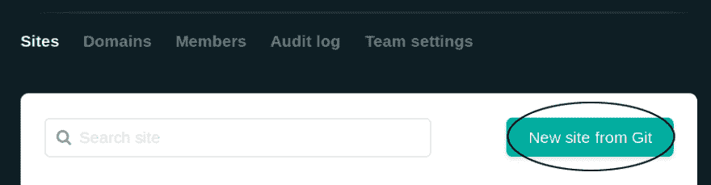
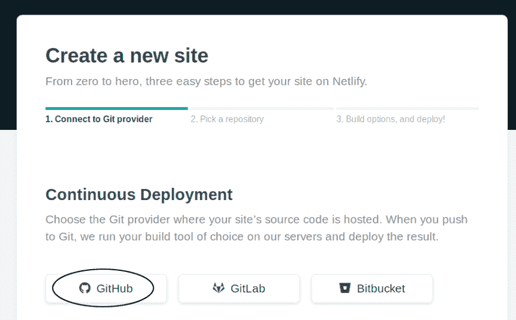
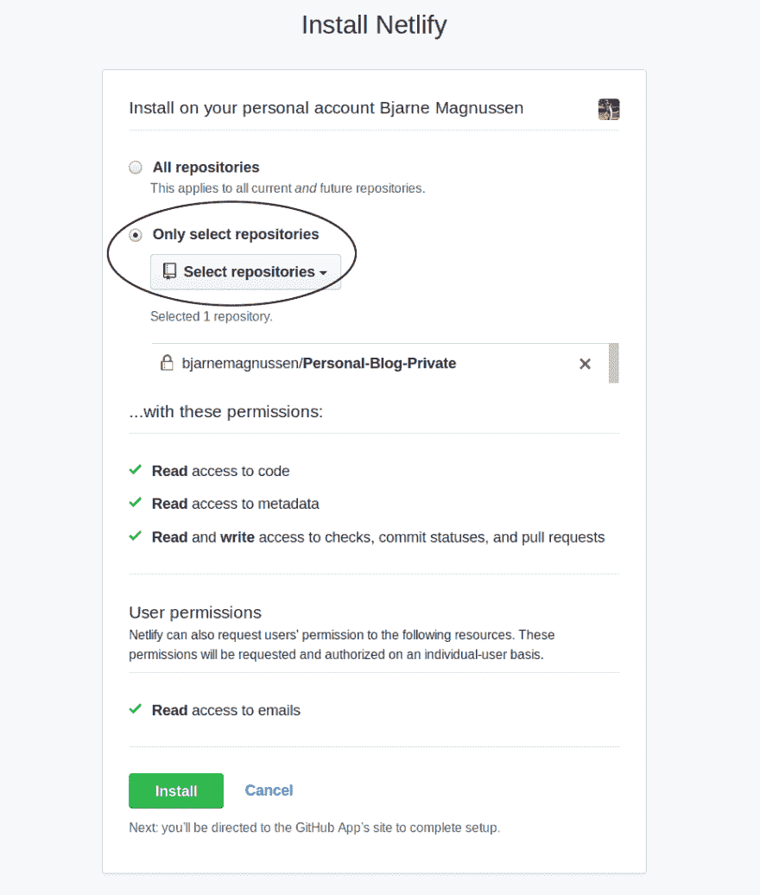
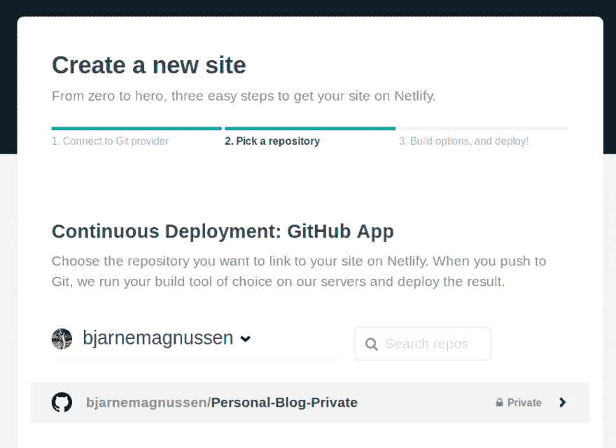
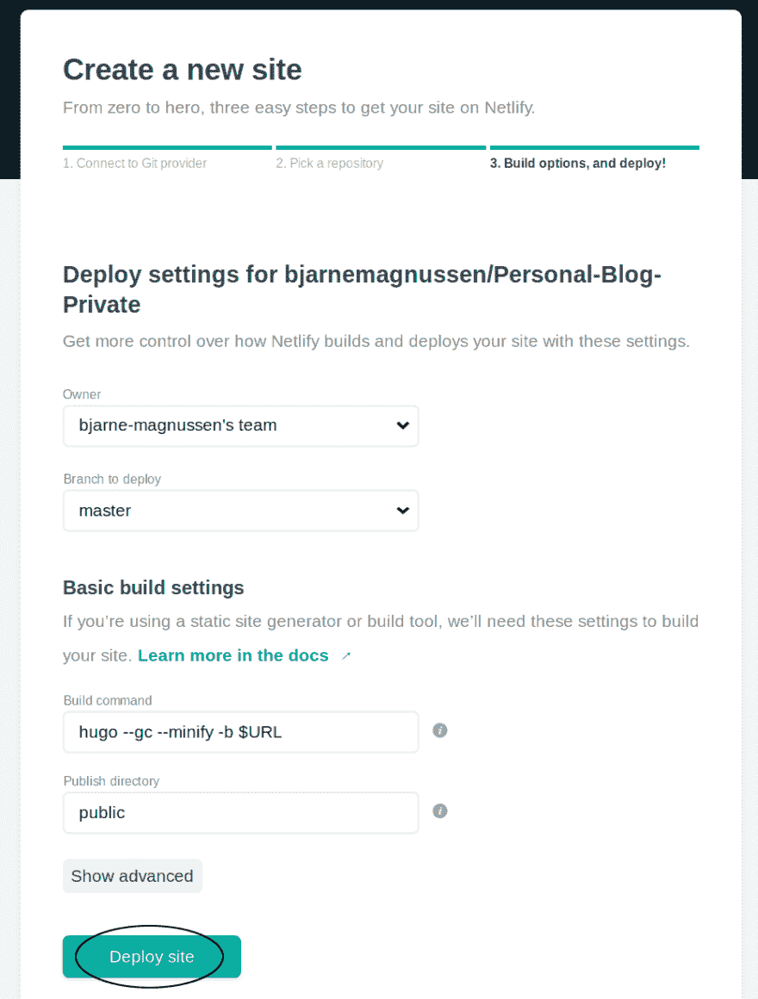
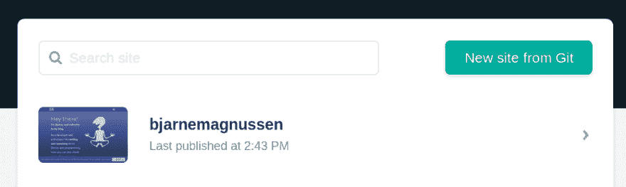

# 与 Hugo 和 Netlify 一起写博客

> 原文：<https://dev.to/bjarnemagnussen/making-a-blog-with-hugo-and-netlify-f3l>

已经有很多博客文章解释了如何用 Hugo 构建博客，以及如何使用 Netlify 部署它。但是因为这是我的第一篇博文(顺便热烈欢迎❤️)，我想简单描述一下我是如何创建我自己的网站的，你可以在[https://bjarnemagnussen.netlify.com](https://bjarnemagnussen.netlify.com)上找到。

我还将澄清我经常发现在其他描述中缺乏的东西，例如使用 Netlify 时需要注意什么，如何为原始文件使用*私有*存储库，以及如何使用 Hugo 的学术主题。需要一些 git 和 GitHub 的知识。

当我开始创建自己的网站时，我想要的东西是**易于部署**并且支持**降价**。这是我喜欢的写作方式，我很快选择了静态站点生成器**。我选择了 *Hugo* ，因为它是用 go(我目前学习的语言)写的，我喜欢这个学术主题的外观。Netlify 易于部署也是一个明显的优势。**

 **## 以学术为主题安装雨果

我选择了一种使用 git 和 GitHub 的安装方法，如这里描述的。然而，**我不希望我的原始 markdown 文档和配置文件暴露在公共存储库中**，并改变了安装过程中的一些步骤。

1.  首先在 GitHub 上创建一个**私有**存储库，你可以随意命名。

2.  然后将`academic-kickstart`库克隆到本地机器的临时字典*镜像*中。

```
mkdir mirror
cd mirror
git clone --bare https://github.com/sourcethemes/academic-kickstart.git 
```

1.  最后，将它推送到您在步骤 1 中创建的私有存储库中(相应地更改下面的`yourname`和`private-repo`)。

```
cd academic-kickstart.git
git push --mirror https://github.com/yourname/private-repo.git 
```

现在，您的存储库中已经有了一个基本的学术主题框架，可以删除专门为此目的创建的临时*镜像*文件夹。

以您认为方便的任何方式使用您的存储库。Academic 预装了许多示例页面和配置选项。您可以在这里找到它的文档页面[，并根据您的喜好和需要更改示例文件。](https://sourcethemes.com/academic/docs/)

## 部署站点

要在 Netlify 上部署网页，您首先需要在这里向他们注册[。](https://netlify.com)

> 只用你的邮箱注册是完全没问题的😉。此时不需要 GitHub 的单点登录！ <sup id="fnref1">[1](#fn1)</sup>

然后，我们可以通过点击右上角的“从 Git 新建站点”按钮来部署一个新站点。
[T3】](https://res.cloudinary.com/practicaldev/image/fetch/s--N1d1r3jx--/c_limit%2Cf_auto%2Cfl_progressive%2Cq_auto%2Cw_880/https://bjarnemagnussen.netlify.com/img/post/making-a-blog-with-hugo-and-netlify/screen1.png)

在新窗口中，我们选择“持续部署”下的“Github”选项。
[T3】](https://res.cloudinary.com/practicaldev/image/fetch/s--2M08NYkM--/c_limit%2Cf_auto%2Cfl_progressive%2Cq_auto%2Cw_880/https://bjarnemagnussen.netlify.com/img/post/making-a-blog-with-hugo-and-netlify/screen2.png)

然后，我们必须授予一些权限和访问我们专门为此创建的私有存储库的权限。
[T3】](https://res.cloudinary.com/practicaldev/image/fetch/s--RYHVWNxG--/c_limit%2Cf_auto%2Cfl_progressive%2Cq_auto%2Cw_880/https://bjarnemagnussen.netlify.com/img/post/making-a-blog-with-hugo-and-netlify/screen3.png)

在 Netlify 的窗口中单击存储库进行确认。
[T3】](https://res.cloudinary.com/practicaldev/image/fetch/s--Neof3lrT--/c_limit%2Cf_auto%2Cfl_progressive%2Cq_auto%2Cw_880/https://bjarnemagnussen.netlify.com/img/post/making-a-blog-with-hugo-and-netlify/screen4.png)

并按下“部署站点”按钮，使用`hugo`的默认参数进行部署。
[](https://res.cloudinary.com/practicaldev/image/fetch/s--eXvxQoBU--/c_limit%2Cf_auto%2Cfl_progressive%2Cq_auto%2Cw_880/https://bjarnemagnussen.netlify.com/img/post/making-a-blog-with-hugo-and-netlify/screen5.png)

🎉恭喜你！您的博客应该显示在“站点”下，并且自动部署您的私有存储库的每个新提交。
T3T5】

您现在可以更改“看起来复杂且自动分配”的子域的设置，或者切换到使用您自己的域名。所有这些都在他们的[文档页面](https://www.netlify.com/docs/custom-domains/)上有解释。

* * *

1.  虽然我们必须将我们的 GitHub 帐户与 Netlify 链接，但我总是避免使用来自特定供应商的单点登录。我发现使用起来很麻烦，因为如果我们不应该再使用他们的服务的话，以后与供应商的分离会变得复杂... [↩](#fnref1)**