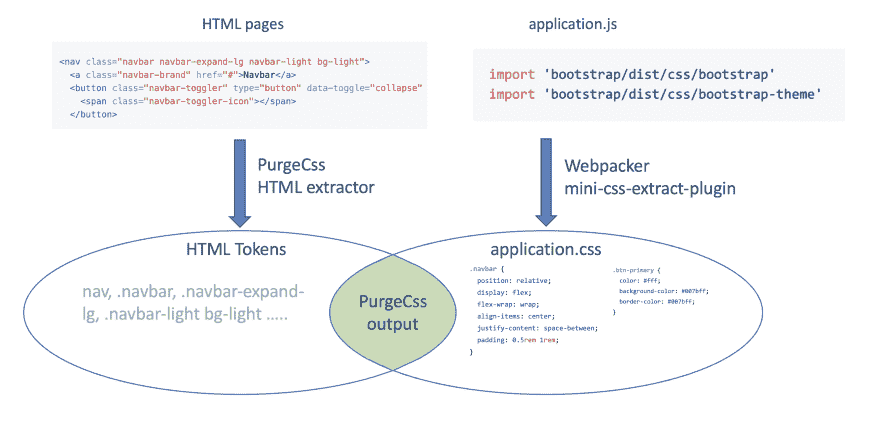

# 使用 Rails 和 Webpacker 的关键 CSS 无存储包第 1 部分

> 原文：<https://dev.to/adrienpoly/critical-css-with-rails-and-webpacker-sprocketsless-part-1-2bck>

这是关于将所有资产转移到 Webpacker 时新的高级用法的系列文章中的第一篇。在第一部分，我们将研究优化你的 CSS 大小。

我们都想要快速可靠的网页。当做[页面速度审核](https://developers.google.com/speed/pagespeed/insights/?hl=en)时，经常出现的推荐是**关键 CSS** 。关键 CSS，尤其是折叠上方的关键 CSS，是内联(在 HTML 中)呈现页面顶部(折叠上方)所需的最小 CSS 的能力。一段时间以来，我一直在寻找一个在 Rails 应用中实现这一点的简单解决方案，但我从未真正成功过。

Webpack(即 Rails 中的 Webpacker)的一个伟大之处是它周围的所有 echo 系统。虽然 Rails 中的 JS 端有大量的文档记录，但它们也有许多可用于 CSS 和 images 的工具。

几个月前，我发现了一个来自 [GoRails](https://gorails.com/) 的很棒的视频，是关于在 Rails 应用中使用 [PurgeCss 的。](https://gorails.com/episodes/purgecss)

## 了解采购

[](https://res.cloudinary.com/practicaldev/image/fetch/s--q-X3Lyoq--/c_limit%2Cf_auto%2Cfl_progressive%2Cq_auto%2Cw_880/https://thepracticaldev.s3.amazonaws.com/i/4anqgftf0j9v8zih0mh5.png)

PurgeCSS 的全局概念是，一方面，你把你所有的文件都提供给 PurgeCSS，在那里你会用到一些 CSS 类(通常是`.html`、`html.erb`、`.js`)。PurgesCSS 创建一个可能是 CSS 选择器所有标记的列表。

另一方面，Webpacker 使用`mini-css-extract-plugin`创建一个 CSS 包。提取一个令牌列表

结果是这两个令牌列表的交集。

## 多个装多个规则

使用 Webpacker 很容易拥有多个包。你只需要在`app/javascript/packs`目录下创建一个新的`some-pack.js`文件。

**我们要做的事情的总体思路是:**

*   定义第二个包`critical.js`，其中只有一些 CSS 导入。
*   将我们的 PurgesCss 过程拆分到 PostCss 中，以便对`critical.css`应用更严格的规则。
*   顺便说一下在 HTML 中内嵌我们的关键 CSS 为`Dev.to` [。](https://github.com/thepracticaldev/dev.to/blob/master/app/views/layouts/_styles.html.erb)
*   懒的装我们的主`application.css`。

#### 我们的 critical.js 入口点

给定一个 **application.js** ，看起来会像这样:

```
// app/javascript/packs/application.js

require("@rails/ujs").start();
require("local-time").start();
require("turbolinks").start();

window.Rails = Rails;

// import CSS
import "stylesheets/application.scss";

// import Stimulus controllers
import "controllers/index";

// import vendor JS
import "bootstrap"; 
```

我们的主要入口点， **import** 我们的主要**应用程序. scss** 通常看起来像这样:

```
// app/javascript/stylesheets/application.scss

// Fonts
@import "config/fonts";

// Graphical variables
@import "config/colors";

// Vendor
@import "~bootstrap/scss/functions";
@import "config/bootstrap_variables";
@import "~bootstrap/scss/bootstrap";

$fa-font-path: "~@fortawesome/fontawesome-free/webfonts";
@import "~@fortawesome/fontawesome-free/scss/fontawesome";
@import "~@fortawesome/fontawesome-free/scss/brands";

// Components
@import "components/index";

// layouts
@import "layouts/sticky-footer"; 
```

我们可以创建一个非常基本的`critical.js`，它唯一要做的就是导入一个新的 critical.scss 样式表。

```
// app/javascript/packs/critical.js
import "stylesheets/critical.scss"; 
```

在我们的 **`critical.scss`** 文件中，我们可以开始更有选择性地放入内容，以帮助采购人员做得更好。(这确实有很小的区别)

```
// colors
@import "config/colors";

// vendor
@import "~bootstrap/scss/functions";
@import "config/bootstrap_variables";
@import "config/bootstrap_critical"; // pick only the Bootstrap module you need

// Components
@import "components/banner"; //just pick the components you need for the homepage 
```

## PostCSS / PurgeCSS 配置

那么这就是重要的部分。我们需要告诉 PurgeCSS 对每个文件应用不同的规则。幸运的是，我们在 PostCSS 中有一个充满信息的上下文。

因此，我们可以将我们的信息上下文传递给环境:

```
module.exports = ctx => environment(ctx); 
```

给我们的环境添加一个上下文变量

```
const environment = ctx => ({
  plugins: [
    require("postcss-import"),
    require("postcss-flexbugs-fixes"),
    require("postcss-preset-env")({
      autoprefixer: {
        flexbox: "no-2009"
      },
      stage: 3
    }),
    purgeCss(ctx)
  ]
}); 
```

用这个上下文调用我们的 PurgeCss 插件

```
const purgeCss = ({ file }) => {
  return require("@fullhuman/postcss-purgecss")({
    content: htmlFilePatterns(file.basename),
    defaultExtractor: content => content.match(/[A-Za-z0-9-_:/]+/g) || []
  });
}; 
```

现在我们在 PurgeCss 中有了文件名，我们可以为每个文件指定不同的规则。对于我的关键 CSS，我只指定与主页相关的页面，并为所有其他文件指定通常的模式集。

```
const htmlFilePatterns = filename => {
  switch (filename) {
    case "critical.scss":
      return [
        "./app/views/pages/index.html.erb",
        "./app/views/shared/_navbar.html.erb",
        "./app/views/layouts/application.html.erb"
      ];
    default:
      return [
        "./app/**/*.html.erb",
        "./config/initializers/simple_form_bootstrap.rb",
        "./app/helpers/**/*.rb",
        "./app/javascript/**/*.js"
      ];
  }
}; 
```

所以总的来说，看起来是这样的

```
// postcss.config.js

const environment = ctx => ({
  plugins: [
    require("postcss-import"),
    require("postcss-flexbugs-fixes"),
    require("postcss-preset-env")({
      autoprefixer: {
        flexbox: "no-2009"
      },
      stage: 3
    }),
    purgeCss(ctx)
  ]
});

const purgeCss = ({ file }) => {
  return require("@fullhuman/postcss-purgecss")({
    content: htmlFilePatterns(file.basename),
    defaultExtractor: content => content.match(/[A-Za-z0-9-_:/]+/g) || [],
  });
};

const htmlFilePatterns = filename => {
  switch (filename) {
    case "critical.scss":
      return [
        "./app/views/pages/index.html.erb",
        "./app/views/shared/_navbar.html.erb",
        "./app/views/layouts/application.html.erb"
      ];
    default:
      return [
        "./app/**/*.html.erb",
        "./config/initializers/simple_form_bootstrap.rb",
        "./app/helpers/**/*.rb",
        "./app/javascript/**/*.js"
      ];
  }
};

module.exports = ctx => environment(ctx); 
```

## 结果

在我做的一个小测试中，我得到了这些结果

*   初始包大小为 32kb
*   随着 CSS 的清除，这下降到 9kb
*   **我的 critical.css 只有 3kb！**

咩咩🎉🎉🎉🎉🎉🎉🎉🎉🎉🎉🎉🎉🎉

## 来自 Webpacker 的内联 CSS

我确实绞尽脑汁将我的 CSS 文件内联到 HTML 中。多亏了 Stackoverflow 我可以在这里得到一些帮助

```
<% if current_page?(root_path) %>
  <!-- Inline the critical CSS -->
  <style>
    <%= File.read(File.join(Rails.root, 'public', Webpacker.manifest.lookup('critical.css'))).html_safe %>
  </style>

  <!-- Lazy load the rest with loadCSS -->
  <link rel="preload" href="<%= Webpacker.manifest.lookup('application.css') %>" as="style" onload="this.rel='stylesheet'">
  <noscript><link rel="stylesheet" href="<%= Webpacker.manifest.lookup('application.css') %>"></noscript>
<% else %>
  <%= stylesheet_pack_tag 'application', 'data-turbolinks-track': 'reload' %>
<% end %> 
```

## 就这样吧！！！！

演示:[https://sprockets-less-rails6.herokuapp.com](https://sprockets-less-rails6.herokuapp.com)
源代码:[https://github.com/adrienpoly/sprockets-less-rails6](https://github.com/adrienpoly/sprockets-less-rails6)