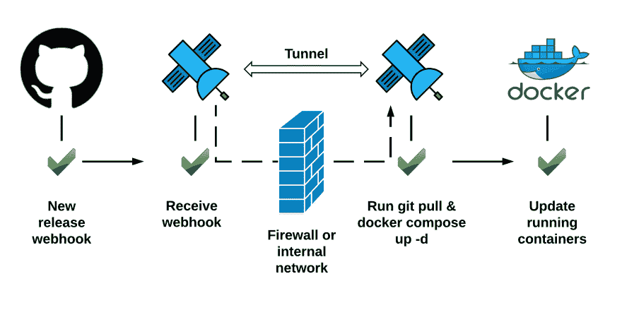
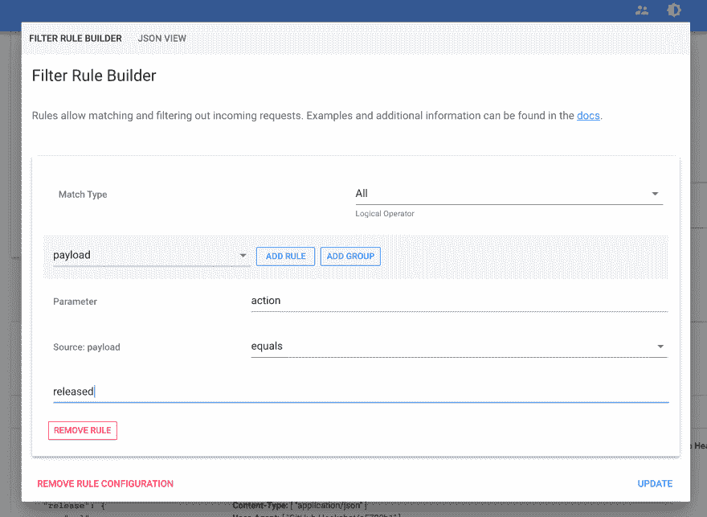
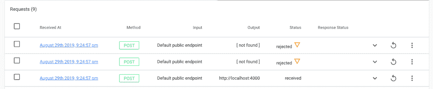
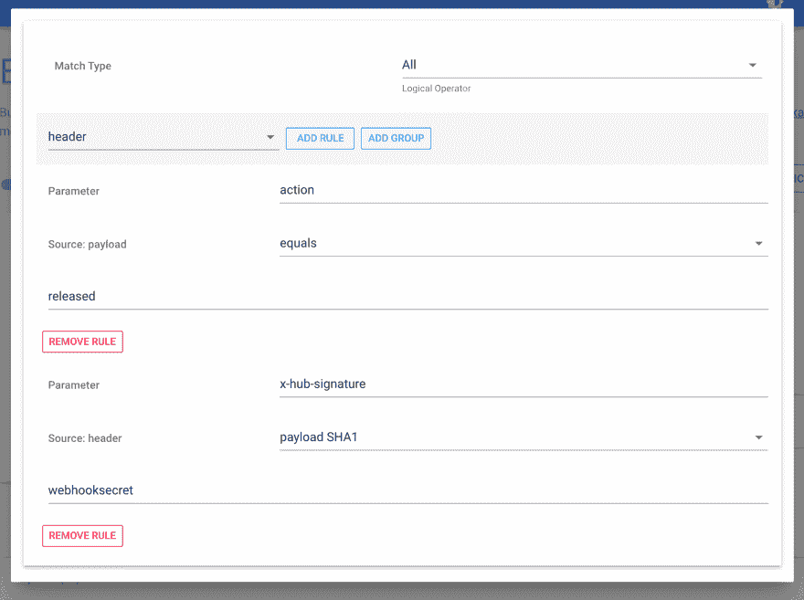

# Docker 撰写 GitHub 发布 webhook 的更新

> 原文：<https://dev.to/webhookrelay/docker-compose-update-on-github-release-webhook-fch>

[](https://res.cloudinary.com/practicaldev/image/fetch/s--6ShstueE--/c_limit%2Cf_auto%2Cfl_progressive%2Cq_auto%2Cw_880/https://thepracticaldev.s3.amazonaws.com/i/6w0sncnp3fck4ppuvhtj.png)

去年我写了一篇博文，内容是关于[结合几个工具](https://dev.to/blog/2018/07/17/auto-deploy-on-git-push)在 git push 上自动化简单的 NodeJS 应用更新。许多用户通过用 Ruby、Python 或 PHP 编写本地 web 服务器来接收 webhooks，然后进行异步处理，从而解决了类似的问题。我很高兴地宣布，我们最终决定将这一功能添加到[中继 CLI](https://dev.to/v1/installation/cli) 中。现在，要执行 bash 脚本，您可以:

```
relay forward --bucket my-bucket-name --relayer exec --command bash update.sh 
```

<svg width="20px" height="20px" viewBox="0 0 24 24" class="highlight-action crayons-icon highlight-action--fullscreen-on"><title>Enter fullscreen mode</title></svg> <svg width="20px" height="20px" viewBox="0 0 24 24" class="highlight-action crayons-icon highlight-action--fullscreen-off"><title>Exit fullscreen mode</title></svg>

并在 webhook 上启动 Python 应用:

```
relay forward --bucket my-bucket-name --relayer exec --command python my-app.py 
```

<svg width="20px" height="20px" viewBox="0 0 24 24" class="highlight-action crayons-icon highlight-action--fullscreen-on"><title>Enter fullscreen mode</title></svg> <svg width="20px" height="20px" viewBox="0 0 24 24" class="highlight-action crayons-icon highlight-action--fullscreen-off"><title>Exit fullscreen mode</title></svg>

这开启了一些有趣的可能性，可以创建管道，可以对几乎所有发出 webhooks 的东西做出反应。在本文中，我将向您展示如何构建 GitOps 风格的管道，使 Docker Compose 部署与托管在 git 存储库上的 docker-compose.yaml 保持同步。

**先决条件**

*   坞站& [坞站组成](https://docs.docker.com/compose/install/)
*   [配置了](https://my.webhookrelay.com/login)[中继 CLI](https://webhookrelay.com/v1/installation/cli) 的 Webhook 中继账户
*   [Github 账户](https://github.com)

包含我在本文中使用的脚本的存储库可以在这里找到:[https://github . com/webhook relay/docker-compose-update-on-git-push](https://github.com/webhookrelay/docker-compose-update-on-git-push)。

## 步骤 1:通过 Docker Compose 部署容器

第一步是进行初始部署。我们将创建一个简单的 dockerized Python 应用程序，您可以在这里找到[连接到 Redis 并部署它:](https://github.com/webhookrelay/docker-compose-update-on-git-push) 

```
version: '3'
services:
  web:
    image: "karolisr/python-counter:0.1.0"
    ports:
      - "5000:5000"
  redis:
    image: "redis:alpine" 
```

<svg width="20px" height="20px" viewBox="0 0 24 24" class="highlight-action crayons-icon highlight-action--fullscreen-on"><title>Enter fullscreen mode</title></svg> <svg width="20px" height="20px" viewBox="0 0 24 24" class="highlight-action crayons-icon highlight-action--fullscreen-off"><title>Exit fullscreen mode</title></svg>

## 步骤 2:在 Github 标签上设置更新

因为我们只想更新 git 标签，而不只是任何推送，所以让我们配置一个 webhook 并分析有效载荷。

为了实现这一点，让我们首先创建一个带有内部输出的 bucket:

```
$ relay forward --bucket docker-compose-update-on-git-push http://localhost:4000
Forwarding:
https://my.webhookrelay.com/v1/webhooks/a956a9f7-2260-4bc2-a54b-3d896acf4206 -> http://localhost:4000
Starting webhook relay agent...
2019-08-28 23:14:41.773 INFO    using standard transport...
2019-08-28 23:14:41.928 INFO    webhook relay ready...  {"host": "my.webhookrelay.com:8080", "buckets": ["8e977e70-09a6-464c-ad30-855e1cd5d9f9"]} 
```

<svg width="20px" height="20px" viewBox="0 0 24 24" class="highlight-action crayons-icon highlight-action--fullscreen-on"><title>Enter fullscreen mode</title></svg> <svg width="20px" height="20px" viewBox="0 0 24 24" class="highlight-action crayons-icon highlight-action--fullscreen-off"><title>Exit fullscreen mode</title></svg>

这里，稍后将使用 bucket 来订阅 github 请求，而 destination 只是一个强制参数，在本例中我们不必使用。

抓取那个[https://my.webhookrelay.com/v1/webhooks/***](https://my.webhookrelay.com/v1/webhooks/***)网址，进入你的库的设置- > webhooks 部分。到达后，设置:

*   您唯一的[https://my.webhookrelay.com/v1/webhooks/***](https://my.webhookrelay.com/v1/webhooks/***)网址的有效负载网址
*   *应用程序/json* 的内容类型
*   一个随机的秘密名称，为了这个例子，我的秘密将是' webhooksecret '
*   点击`Let me select individual events.`并选择*释放*。

现在，转到您的存储库的发布页面(例如[https://github . com/webhookreel/docker-compose-update-on-git-push/releases](https://github.com/webhookrelay/docker-compose-update-on-git-push/releases))并创建一个新的发布`1.0.0`。然后，如果你访问 bucket 细节页面或者[日志页面](https://my.webhookrelay.com/logs)——你应该会看到来自 Github 的 webhook。打开它，让我们检查有效载荷。虽然很长，但我们应该能看到

```
 "action":  "released", 
```

<svg width="20px" height="20px" viewBox="0 0 24 24" class="highlight-action crayons-icon highlight-action--fullscreen-on"><title>Enter fullscreen mode</title></svg> <svg width="20px" height="20px" viewBox="0 0 24 24" class="highlight-action crayons-icon highlight-action--fullscreen-off"><title>Exit fullscreen mode</title></svg>

在顶部。为了确保我们只对这些事件做出反应，请创建一个规则:

[](https://res.cloudinary.com/practicaldev/image/fetch/s--ebqmoAPh--/c_limit%2Cf_auto%2Cfl_progressive%2Cq_auto%2Cw_880/https://thepracticaldev.s3.amazonaws.com/i/h81b4f6kj0p40gju4mbs.png)

如果您标记了另一个版本，您现在应该看到只有一个 webhook 是 forwarder

[](https://res.cloudinary.com/practicaldev/image/fetch/s--bvjP5nQT--/c_limit%2Cf_auto%2Cfl_progressive%2Cq_auto%2Cw_880/https://thepracticaldev.s3.amazonaws.com/i/vglu9whudofjj376jq84.png)

## 第三步:更新脚本，启动中继后台服务

我们的更新脚本是:

```
#!/bin/bash

git pull
docker-compose up -d 
```

<svg width="20px" height="20px" viewBox="0 0 24 24" class="highlight-action crayons-icon highlight-action--fullscreen-on"><title>Enter fullscreen mode</title></svg> <svg width="20px" height="20px" viewBox="0 0 24 24" class="highlight-action crayons-icon highlight-action--fullscreen-off"><title>Exit fullscreen mode</title></svg>

它将获取最新的合成文件并更新容器。现在，让我们更新`relay.yml`文件中的配置([访问密钥&秘密可以在这里](https://my.webhookrelay.com/tokens)生成):

```
version: v1
key: xxx     # your access key
secret: xxx  # your access secret
buckets:
- docker-compose-update-on-git-push # your bucket name where github webhooks are sent
relayer:
  type: exec
  command: bash
  commandArgs:
  - /full/path/to/docker-compose-update-on-git-push/update.sh # <-- should be full path to your update script
  timeout: 300 
```

<svg width="20px" height="20px" viewBox="0 0 24 24" class="highlight-action crayons-icon highlight-action--fullscreen-on"><title>Enter fullscreen mode</title></svg> <svg width="20px" height="20px" viewBox="0 0 24 24" class="highlight-action crayons-icon highlight-action--fullscreen-off"><title>Exit fullscreen mode</title></svg>

要启动中继，运行:

```
relay run -c relay.yml 
```

<svg width="20px" height="20px" viewBox="0 0 24 24" class="highlight-action crayons-icon highlight-action--fullscreen-on"><title>Enter fullscreen mode</title></svg> <svg width="20px" height="20px" viewBox="0 0 24 24" class="highlight-action crayons-icon highlight-action--fullscreen-off"><title>Exit fullscreen mode</title></svg>

这将通过您的终端运行它。对于生产用例，请使用[后台服务模式](https://dev.to/v1/installation/background-service)。它将确保守护程序在操作系统启动时启动。

## 让我们来试试吧

发射码头-复合物:

```
docker-compose up -d 
```

<svg width="20px" height="20px" viewBox="0 0 24 24" class="highlight-action crayons-icon highlight-action--fullscreen-on"><title>Enter fullscreen mode</title></svg> <svg width="20px" height="20px" viewBox="0 0 24 24" class="highlight-action crayons-icon highlight-action--fullscreen-off"><title>Exit fullscreen mode</title></svg>

检查容器:

```
$ docker ps
CONTAINER ID        IMAGE                           COMMAND                  CREATED             STATUS              PORTS                    NAMES
26cd2219e18b        redis:alpine                    "docker-entrypoint.s…"   20 seconds ago      Up 3 seconds        6379/tcp                 docker-compose-update-on-git-push_redis_1
63c8cd1ae7bb        karolisr/python-counter:0.1.0   "flask run"              20 seconds ago      Up 18 seconds       0.0.0.0:5000->5000/tcp   docker-compose-update-on-git-push_web_1
$ curl http://localhost:5000
I have been seen 1 times.
$ curl http://localhost:5000
I have been seen 2 times. 
```

<svg width="20px" height="20px" viewBox="0 0 24 24" class="highlight-action crayons-icon highlight-action--fullscreen-on"><title>Enter fullscreen mode</title></svg> <svg width="20px" height="20px" viewBox="0 0 24 24" class="highlight-action crayons-icon highlight-action--fullscreen-off"><title>Exit fullscreen mode</title></svg>

下一步是构建一个新的图像`0.2.0`并将其推送到注册表中。一旦它可用，我们就可以更新我们的 github 库`docker-compose.yml`并发布新版本。为了这个例子，让我们通过 Github UI 来实现。

几秒钟后，您应该会看到一个新的容器正在运行:

```
$ docker ps
CONTAINER ID        IMAGE                           COMMAND                  CREATED             STATUS              PORTS                    NAMES
27b2542423ec        karolisr/python-counter:0.2.0   "flask run"              9 seconds ago       Up 7 seconds        0.0.0.0:5000->5000/tcp   docker-compose-update-on-git-push_web_1
26cd2219e18b        redis:alpine                    "docker-entrypoint.s…"   10 minutes ago      Up 9 minutes        6379/tcp                 docker-compose-update-on-git-push_redis_1 
```

<svg width="20px" height="20px" viewBox="0 0 24 24" class="highlight-action crayons-icon highlight-action--fullscreen-on"><title>Enter fullscreen mode</title></svg> <svg width="20px" height="20px" viewBox="0 0 24 24" class="highlight-action crayons-icon highlight-action--fullscreen-off"><title>Exit fullscreen mode</title></svg>

## 可选:验证 Github 秘密

Webhook 中继输出规则也可以验证 Github 签名:

[](https://res.cloudinary.com/practicaldev/image/fetch/s--7uCZpzHz--/c_limit%2Cf_auto%2Cfl_progressive%2Cq_auto%2Cw_880/https://thepracticaldev.s3.amazonaws.com/i/5k36auilqr3xk3yzn7ur.png)

这将确保只处理 Github 签名的 webhooks。

## 备选方案

我已经成功地使用了这些工具来更新容器:

*   [https://github.com/pyouroboros/ouroboros](https://github.com/pyouroboros/ouroboros)
*   [https://github.com/containrrr/watchtower](https://github.com/containrrr/watchtower)

如果你有一个简单的设置，只需要跟踪`latest`标签，这两个工具都可以工作。然而，如果您有多个带有 semver(或任何其他版本控制机制)的容器，这些解决方案就不起作用了。这就是为什么有一个要么是有用的。将带有图像标签的 env 或 docker-compose.yml config 提交到 git 并同步到运行服务的主机。

## 结论

如同在您的机器上执行的任何代码一样，在自动化任务时您必须小心。Webhook Relay 将为您提供单向的 Webhook 流入机器。您的脚本/应用程序在您的机器上，不能通过 Webhook 中继远程修改。再加上经过身份验证的 webhook 端点(您可以在存储桶级别上配置它)或 webhook 有效负载校验和验证，您可以构建一个安全的更新机制。

*最初发布于[https://webhook relay . com/blog/2019/09/02/docker-compose-update-on-github-web hooks/](https://webhookrelay.com/blog/2019/09/02/docker-compose-update-on-github-webhooks/)T3】*