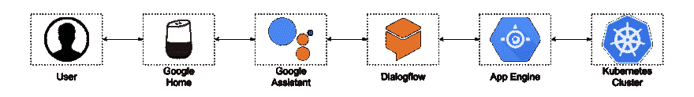

# 管理您的 Kubernetes 集群的 Google Home 操作

> 原文：<https://dev.to/plutov/google-home-action-to-manage-your-kubernetes-cluster-36nb>

我一直想找一个 Google Home 的好用例，让一些 DevOps 任务变得更有趣。例如语音部署、系统度量等。由于我经常使用 Kubernetes，我认为通过语音命令来控制它会很有趣。

因此，我决定带着以下目标开展这项行动:

*   行动应该能够与任何 Kubernetes 集群:GKE，EKS 等。
*   可扩展命令
*   直觉之声 UX
*   易于安装

我已经在 Github ( [google-home-k8s](https://github.com/plutov/google-home-k8s) )上发布了这个项目，在这里我将向您展示如何部署它。

### 这一切是如何运作的

下图显示了从用户设备到 Dialogflow 再到部署到 App Engine(可以部署在其他地方)的 API 再到我们的 Kubernetes 集群的流程。

[](https://res.cloudinary.com/practicaldev/image/fetch/s--H42F5-PR--/c_limit%2Cf_auto%2Cfl_progressive%2Cq_auto%2Cw_880/https://raw.githubusercontent.com/plutov/packagemain/master/17-google-home-k8s/diagram.png)

让我们回顾一些组件:

*   Dialogflow 是一个用于创建对话界面的开发套件。在这里，我们将设置用户流，并指定所有可用的语音命令、意图和实体。
*   语音命令将调用我们部署到 App Engine 的 API。
*   取决于命令，API 将调用 Kubernetes API。

### 安装

#### 立方图

我假设您已经在某个地方运行了一个 Kubernetes 集群。我将使用我的 GKE 集群进行演示。

首先，我们必须生成一个有效的`kubeconfig`配置文件，它将被我们的 API 用于认证。

让我们克隆我们的项目，并使用我准备的脚本来生成`kubeconfig`。在此之前，请确保您的`kubectl`指向正确的配置，并且您在该集群中拥有必要的权限。

```
git clone git@github.com:plutov/google-home-k8s.git
cd google-home-k8s
./generate-kubeconfig.sh 
```

它将生成一个`./build/kubeconfig`文件，供 API 以后使用，这个配置永远不会过期。

#### 部署 API

现在您可以在某个地方部署 API，我将使用 Google App Engine 来实现这一目的。API 需要很少的 env。需要设置的变量，如`NAMESPACE`、`API_KEY`和`LOG_LEVEL`。

```
cp env.sample.yaml env.yaml 
```

API 受静态 API 密钥保护，静态 API 密钥应在`env.yaml`中设置。要访问 API，客户端应该发送`Authorization: Bearer ${API_KEY}`头。

```
gcloud app deploy 
```

复制 API 的 URL。

#### 安静

google-home-k8s 已经包含了一个可以轻松导入的 Dialogflow 配置。

1.  转到[对话流控制台](https://console.dialogflow.com/)
2.  选择或创建新代理
3.  转到设置->导出和导入
4.  选择**从 Zip 导入**(导入此文件 [google-home-k8s.zip](https://raw.githubusercontent.com/plutov/google-home-k8s/master/google-home-k8s.zip) )
5.  转到实现
6.  启用 Webhook
7.  将 URL 粘贴到部署到应用程序引擎的 API
8.  添加标题。键:`Authorization`，值:`Bearer API_KEY`(用`env.yaml`中的值替换`API_KEY`)

#### 测试

转到谷歌助手，给你的行动命名为“Kubernetes 经理”，并点击“测试”，这将打开一个模拟器。

如果一切都做对了，你将能够重现下面的对话:

对话示例:

> 嘿，谷歌，和 Kubernetes 的经理谈谈
> 
> 欢迎来到 Kubernetes 经理。我怎么帮你？
> 
> [你]比例状态设置“再”
> 
> [助手]知道了。目前，有 3 个“redis”状态集的副本。您希望扩展到多少个复制副本？
> 
> [你] 5
> 
> [助手] Statefulset 已更新。还有别的吗？

如果你有谷歌家庭设备，你可以在那里做同样的对话。

[演示视频](https://youtu.be/GJz02DrYWag)

### 结论

我不建议发布这个 Google Home 操作，而是建议在一台设备上使用它，使用与 Google Assistant 中相同的用户进行身份验证。除非您想公开您的 Kubernetes 集群:)

另外，也可以在 Github 的项目中添加更多的命令。