# 深入探讨用 Webpack 替换热模块(第二部分——处理更新)

> 原文：<https://dev.to/stanimiravlaeva/a-deep-dive-into-hot-module-replacement-with-webpack-part-two-handling-updates-3c1f>

本文是关于使用 [webpack](https://webpack.js.org/) 进行热模块更换的“深入探讨”系列的第二部分。

*   第一部分:[基础知识](https://dev.to/stanimiravlaeva/a-deep-dive-into-hot-module-replacement-with-webpack-part-one-the-basics-39hn)
*   第 2 部分:使用 module.hot API 处理热更新

# 第 2 部分:用 module.hot API 处理热更新

在 HMR 系列的第一篇博文中，我们讨论了*热模块更换*过程的四个阶段。

[](https://res.cloudinary.com/practicaldev/image/fetch/s--dGLKc9AW--/c_limit%2Cf_auto%2Cfl_progressive%2Cq_auto%2Cw_880/https://thepracticaldev.s3.amazonaws.com/i/j27uvbdlva5xt0eqg0sn.png)

今天，我们将关注最后一个阶段。我们将学习如何指示应用程序中的模块在收到热更新时进行自我刷新。

*热更新处理程序*既可以在构建期间由 webpack 加载器注入，也可以由您手动添加。在本文中，我们将只讨论第二种方法。Webpack 公开了一个来自`module.hot`对象的公共接口。让我们来探索一下吧！

# 模块.热 API

对于我们的演示，我们将修补一个简单的网页。如果你克隆了这个项目并按照说明去做是最好的，但这不是强制性的。你也可以看看博客，相信我一切正常。

从[https://github.com/sis0k0/christmas-tree](https://github.com/sis0k0/christmas-tree)克隆存储库。如果你是命令行界面的粉丝，执行:

```
git clone https://github.com/sis0k0/christmas-tree.git 
```

<svg width="20px" height="20px" viewBox="0 0 24 24" class="highlight-action crayons-icon highlight-action--fullscreen-on"><title>Enter fullscreen mode</title></svg> <svg width="20px" height="20px" viewBox="0 0 24 24" class="highlight-action crayons-icon highlight-action--fullscreen-off"><title>Exit fullscreen mode</title></svg>

导航到克隆的文件夹并安装依赖项:

```
cd christmas-tree
npm install 
```

<svg width="20px" height="20px" viewBox="0 0 24 24" class="highlight-action crayons-icon highlight-action--fullscreen-on"><title>Enter fullscreen mode</title></svg> <svg width="20px" height="20px" viewBox="0 0 24 24" class="highlight-action crayons-icon highlight-action--fullscreen-off"><title>Exit fullscreen mode</title></svg>

要运行开发服务器，请执行:

```
npm run watch 
```

<svg width="20px" height="20px" viewBox="0 0 24 24" class="highlight-action crayons-icon highlight-action--fullscreen-on"><title>Enter fullscreen mode</title></svg> <svg width="20px" height="20px" viewBox="0 0 24 24" class="highlight-action crayons-icon highlight-action--fullscreen-off"><title>Exit fullscreen mode</title></svg>

构建完成后，浏览器中将会打开一个新的选项卡。切换 devtools 控制台。

[](https://res.cloudinary.com/practicaldev/image/fetch/s--1csUiFcc--/c_limit%2Cf_auto%2Cfl_progressive%2Cq_66%2Cw_880/https://thepracticaldev.s3.amazonaws.com/i/i18g1nxgwnmd6pljdiy0.gif)

圣诞快乐！是的，我知道现在是九月。但是冬天来了。

我希望大家注意两件事:

1.  `npm run watch`启动由 webpack-dev-server 包提供的 webpack 开发服务器。
2.  控制台显示*热模块更换*已启用。默认情况下，它不是。这个项目是*配置*与 HMR 一起运行。我们将在下一节中了解如何做到这一点。

# 项目里有什么？

下图显示了项目结构(不包括`node_modules`):

[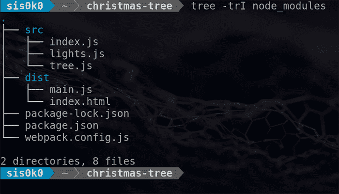](https://res.cloudinary.com/practicaldev/image/fetch/s--8hweM3fp--/c_limit%2Cf_auto%2Cfl_progressive%2Cq_auto%2Cw_880/https://thepracticaldev.s3.amazonaws.com/i/wmbg4sfstxw1f5frh39c.png)

`source`目录是我们将要进行更改的地方:

*   `index.js`导入所有源文件。那是 webpack 的*入口*模块；
*   为圣诞树创造闪烁效果；
*   绘制树本身。

`dist`目录托管准备运行的应用程序。

*   `main.js`是单输出*包*，由 webpack 生产；
*   `index.html`是加载 main.js 的网页。

本帖不讨论`package.json`和`package-lock.json`。如果你想了解更多，请查看 [npm 文档](https://docs.npmjs.com/files/package.json)。

最后，`webpack.config.js` -我们指导 webpack 如何*捆绑*我们的应用程序的地方。应用程序使用 *HMR* 运行，因为*热模块替换*插件是配置
的一部分

```
const path = require('path');
const webpack = require('webpack');

module.exports = (env, argv) => {
    const config = {
        entry: './src/index.js',
        output: {
            filename: 'main.js',
            path: path.resolve(__dirname, 'dist')
        },
        devServer: {
            contentBase: './dist',
            hot: true,
        },
        plugins: [],
    };

    if (argv.mode === 'development') {
        config.plugins.push(
            new webpack.HotModuleReplacementPlugin()
        );
    }

    return config;
}; 
```

<svg width="20px" height="20px" viewBox="0 0 24 24" class="highlight-action crayons-icon highlight-action--fullscreen-on"><title>Enter fullscreen mode</title></svg> <svg width="20px" height="20px" viewBox="0 0 24 24" class="highlight-action crayons-icon highlight-action--fullscreen-off"><title>Exit fullscreen mode</title></svg>

# 自接受模块

理论够了，让我们回到浏览器。devtools 控制台显示*热模块替换*正在运行。但是真的管用吗？🤔

打开`src/tree.js`并增加`rowsCount`的值。

我们得到了一个更大的树，但也是一个完整的页面重新加载。可能很难注意到。查看控制台中的消息——当重新加载开始时，它们消失了。当页面上的脚本重新执行时，消息再次出现。HMR 的目标是避免整页重载。

[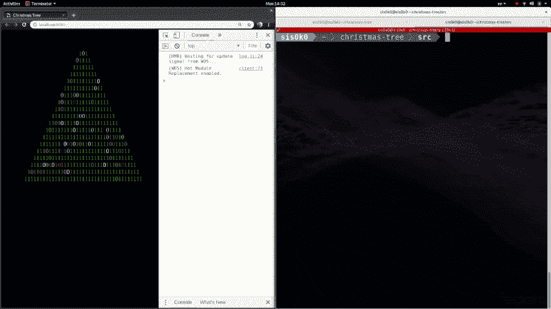](https://res.cloudinary.com/practicaldev/image/fetch/s--jqd7bg0X--/c_limit%2Cf_auto%2Cfl_progressive%2Cq_66%2Cw_880/https://thepracticaldev.s3.amazonaws.com/i/fyv1t0tuol99wq9uiat1.gif)

目前，应用程序不接受*热更新*，因为我们没有指示它这样做。因此，`webpack-dev-server`退回到全页面重载。

处理传入更新的最简单方法是通过*自接受*来自已更改模块的更新。这将导致 webpack 执行模块的新版本。我们需要补充的是:

```
// src/tree.js

module.hot.accept(); 
```

<svg width="20px" height="20px" viewBox="0 0 24 24" class="highlight-action crayons-icon highlight-action--fullscreen-on"><title>Enter fullscreen mode</title></svg> <svg width="20px" height="20px" viewBox="0 0 24 24" class="highlight-action crayons-icon highlight-action--fullscreen-off"><title>Exit fullscreen mode</title></svg>

然而，`module.hot`属性仅在 HMR 启用时定义。如果我们在没有 HMR 的情况下为生产构建应用程序，上面的代码将会抛出一个错误。我们需要检查:

```
// src/tree.js

if (module.hot) {
    module.hot.accept();
} 
```

<svg width="20px" height="20px" viewBox="0 0 24 24" class="highlight-action crayons-icon highlight-action--fullscreen-on"><title>Enter fullscreen mode</title></svg> <svg width="20px" height="20px" viewBox="0 0 24 24" class="highlight-action crayons-icon highlight-action--fullscreen-off"><title>Exit fullscreen mode</title></svg>

在试用之前，最后一个注意事项——当我们为生产而构建时，webpack 知道`module.hot`是`undefined`,并且由 if 语句保护的代码块永远不会被执行。webpack 的 *UglifyJS/Terser* 插件会将其从捆绑包中移除。我们不必担心我们的开发设置会在生产中终止。

让我们再次改变`rowsCount`，看看会发生什么。页面没有完全重新加载，但是树仍然会更新，因为执行了新的`tree.js`模块。

[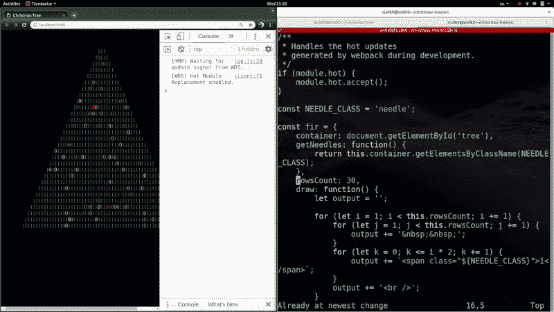](https://res.cloudinary.com/practicaldev/image/fetch/s--yhZXVk3i--/c_limit%2Cf_auto%2Cfl_progressive%2Cq_66%2Cw_880/https://thepracticaldev.s3.amazonaws.com/i/q2yun2dz1m7itpszwhpi.gif)

# 旧模块的处理

在我们简单的应用程序中还有一个模块- `src/lights.js`，它“照亮”了这棵树。

```
// src/lights.js

import fir from './tree.js';

/**
 * Changes the look of
 * some 'needles' in the tree
 * every 1000ms
 */
function turnOn() {
    const blinkRate = 1000;
    const rowsCount = fir.rowsCount;
    const needles = fir.getNeedles();

    setInterval(() =>
        blink(rowsCount, needles),
        blinkRate
    );
}

turnOn();
// ... 
```

<svg width="20px" height="20px" viewBox="0 0 24 24" class="highlight-action crayons-icon highlight-action--fullscreen-on"><title>Enter fullscreen mode</title></svg> <svg width="20px" height="20px" viewBox="0 0 24 24" class="highlight-action crayons-icon highlight-action--fullscreen-off"><title>Exit fullscreen mode</title></svg>

为了使`lights.js`成为一个自接受的模块，我们需要用之前用于`tree.js`的相同代码来扩展它:

```
// src/lights.js

if (module.hot) {
    module.hot.accept();
} 
```

<svg width="20px" height="20px" viewBox="0 0 24 24" class="highlight-action crayons-icon highlight-action--fullscreen-on"><title>Enter fullscreen mode</title></svg> <svg width="20px" height="20px" viewBox="0 0 24 24" class="highlight-action crayons-icon highlight-action--fullscreen-off"><title>Exit fullscreen mode</title></svg>

现在，让我们试着减少`blinkRate`来让灯光变得更快，增加它来达到相反的效果。

[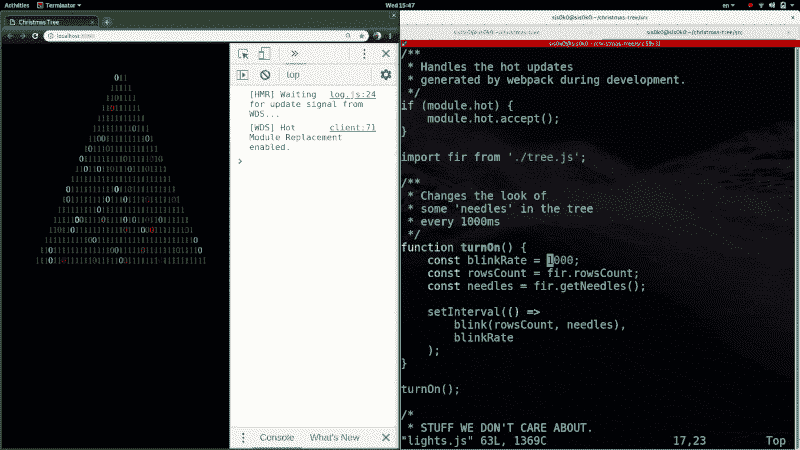](https://res.cloudinary.com/practicaldev/image/fetch/s--nT-PrGp9--/c_limit%2Cf_auto%2Cfl_progressive%2Cq_66%2Cw_880/https://thepracticaldev.s3.amazonaws.com/i/hfdm8ox14g2obifpf6wu.gif)

我们没有得到我们想要的行为。随着每一次变化，灯泡变得越来越多。每当需要*热更新*时，*自接受*使 webpack 执行该模块。

```
// src/lights.js

function turnOn() {
...
    setInterval(() =>
        blink(rowsCount, needles),
        blinkRate
    );
}

turnOn();  // <-- gets called every time the module is changed 
```

<svg width="20px" height="20px" viewBox="0 0 24 24" class="highlight-action crayons-icon highlight-action--fullscreen-on"><title>Enter fullscreen mode</title></svg> <svg width="20px" height="20px" viewBox="0 0 24 24" class="highlight-action crayons-icon highlight-action--fullscreen-off"><title>Exit fullscreen mode</title></svg>

执行上面的代码有一个副作用——它通过调用`setInterval`触发了一个重复的动作。我们从不取消已经开始的行动，而是不断触发新的行动。幸运的是，webpack 提供了一种机制，让 T1 在替换旧模块之前处理掉 T2 旧模块。

首先，我们需要保存开始动作的 ID:

```
// src/lights.js

let lightsInterval;
function turnOn() {
...
    lightsInterval = setInterval(() =>
        blink(rowsCount, needles),
        blinkRate
    );
} 
```

<svg width="20px" height="20px" viewBox="0 0 24 24" class="highlight-action crayons-icon highlight-action--fullscreen-on"><title>Enter fullscreen mode</title></svg> <svg width="20px" height="20px" viewBox="0 0 24 24" class="highlight-action crayons-icon highlight-action--fullscreen-off"><title>Exit fullscreen mode</title></svg>

然后，我们可以在执行新模块之前*清除它:* 

```
// src/lights.js

if (module.hot) {
    module.hot.accept();
    module.hot.dispose(_data => {
      clearInterval(lightsInterval);
    });
} 
```

<svg width="20px" height="20px" viewBox="0 0 24 24" class="highlight-action crayons-icon highlight-action--fullscreen-on"><title>Enter fullscreen mode</title></svg> <svg width="20px" height="20px" viewBox="0 0 24 24" class="highlight-action crayons-icon highlight-action--fullscreen-off"><title>Exit fullscreen mode</title></svg>

最后，我们可以再次尝试改变`blinkRate`:

[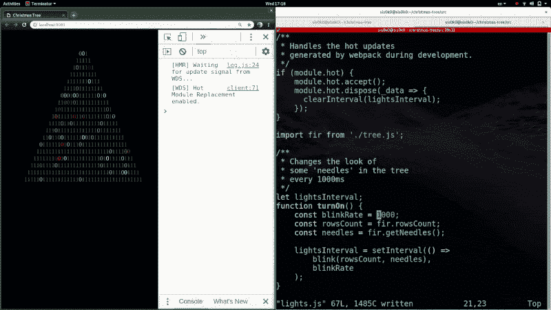](https://res.cloudinary.com/practicaldev/image/fetch/s--TMdcOtU_--/c_limit%2Cf_auto%2Cfl_progressive%2Cq_66%2Cw_880/https://thepracticaldev.s3.amazonaws.com/i/6d9erzo6hayhtnap57gt.gif)

# 父级接受的模块

到目前为止，我们指示 webpack 在我们修改代码时执行`tree.js`和`lights.js`模块。当更改的数据是内部数据时，热模块替换似乎出奇地有效。但是，如果我们修改模块的公共接口，会发生什么呢？依赖于该接口的其他模块会发生什么情况😱？

`tree.js`模块导出单个对象- `fir`:

*   函数将容器 DOM 元素中的树可视化。它用 span elements 针头替换容器中的内容物。每根针得到一个等于`NEEDLE_CLASS`常数的值的`className`；
*   `fir.getNeedles()`函数返回所有带有上述`className`的 DOM 元素。

`lights.js`模块导入 tree.js 并使用`fir.getNeedles()`获得新绘制的 DOM 元素列表。这份清单对于点亮圣诞树至关重要。依赖关系图如下所示:

[](https://res.cloudinary.com/practicaldev/image/fetch/s--nYsldTK5--/c_limit%2Cf_auto%2Cfl_progressive%2Cq_auto%2Cw_880/https://thepracticaldev.s3.amazonaws.com/i/c9dzun9ldkf2vfyj7dv8.png)

让我们通过修改`tree.js`中`NEEDLE_CLASS`的值来测试 HMR 过程。

[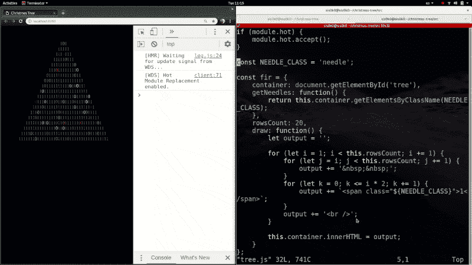](https://res.cloudinary.com/practicaldev/image/fetch/s--MN9kRbjQ--/c_limit%2Cf_auto%2Cfl_progressive%2Cq_66%2Cw_880/https://thepracticaldev.s3.amazonaws.com/i/hjvzwzqbsetu36226xpc.gif)

我们的灯熄灭了！HMR 进程悲惨地失败了。

当我们改变它时，Webpack 执行了`tree.js`。`fir.draw()`功能创建了全新的指针，其`classNames`与`NEEDLE_CLASS`的新值相匹配。也摆脱了之前的扎针。

然而`lights.js`里什么都没发生。它的针列表仍然引用旧的、已经移除的针。当`tree.js`改变时，我们应该刷新列表。

*parent accept* API 允许我们处理从其他模块导入的模块的热更新。我们可以扩展`lights.js`中的 HMR 逻辑，在`tree.js`改变时重启灯泡:

```
// src/lights.js

if (module.hot) {
    module.hot.accept(['./tree.js'], function() {
        clearInterval(lightsInterval);
        turnOn();
    });
    ...
} 
```

<svg width="20px" height="20px" viewBox="0 0 24 24" class="highlight-action crayons-icon highlight-action--fullscreen-on"><title>Enter fullscreen mode</title></svg> <svg width="20px" height="20px" viewBox="0 0 24 24" class="highlight-action crayons-icon highlight-action--fullscreen-off"><title>Exit fullscreen mode</title></svg>

现在我们在两个地方有了`tree.js`的更新处理逻辑:

*   *母接受`lights.js`中的*；
*   *自我接受`tree.js`模块中的*本身。

但是哪一个会更受青睐呢？

# 刷新策略

让我们想象一下`tree.js`所有可能的更新处理场景。

## 在 tree.js 中自我接受

如果`tree.js`中有*自接受*，webpack 执行该模块。导入`tree.js`(它的“父母”)的模块没有被通知这个变化。

[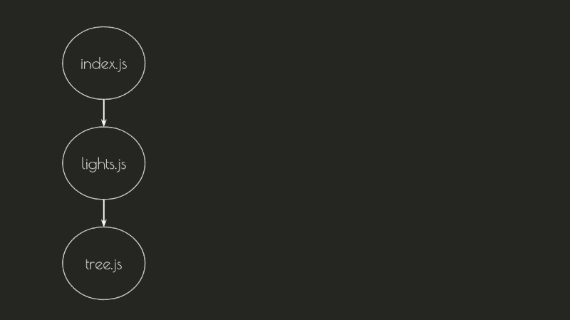](https://res.cloudinary.com/practicaldev/image/fetch/s--v7gpf-EV--/c_limit%2Cf_auto%2Cfl_progressive%2Cq_66%2Cw_880/https://thepracticaldev.s3.amazonaws.com/i/ghgqp40sg77131if6asi.gif)

## 在 lights.js 中父接受

如果在`tree.js`中没有*自接受*，webpack 会在导入它的模块中寻找更新处理程序。

`lights.js`模块导入`tree.js`。假设它有一个处理程序:

```
// src/lights.js

module.hot.accept(['./tree.js'], function updateHandler() {
    ...
}); 
```

<svg width="20px" height="20px" viewBox="0 0 24 24" class="highlight-action crayons-icon highlight-action--fullscreen-on"><title>Enter fullscreen mode</title></svg> <svg width="20px" height="20px" viewBox="0 0 24 24" class="highlight-action crayons-icon highlight-action--fullscreen-off"><title>Exit fullscreen mode</title></svg>

Webpack 将:

*   执行`tree.js`；
*   更新`lights.js`中的`tree.js`导入以指向新模块；
*   执行`updateHandler()`。

[](https://res.cloudinary.com/practicaldev/image/fetch/s--WI9UMzyP--/c_limit%2Cf_auto%2Cfl_progressive%2Cq_66%2Cw_880/https://thepracticaldev.s3.amazonaws.com/i/tmjpkyiam4kdam5fdjiv.gif)

## index . js 中的父接受

如果`lights.js`中没有`tree.js`的处理程序，webpack 将继续查找依赖图。

`index.js`模块导入`lights.js`。Webpack 将检查它是否包含一个`lights.js`的处理程序。我想强调这一部分——它不会检查`tree.js`(更改后的模块)的处理程序，而是检查`lights.js`(它实际导入的模块)。让我们想象一下`index.js`有一个处理程序:

```
// src/index.js

module.hot.accept(['./lights.js'], function updateHandler() {
    ...
} 
```

<svg width="20px" height="20px" viewBox="0 0 24 24" class="highlight-action crayons-icon highlight-action--fullscreen-on"><title>Enter fullscreen mode</title></svg> <svg width="20px" height="20px" viewBox="0 0 24 24" class="highlight-action crayons-icon highlight-action--fullscreen-off"><title>Exit fullscreen mode</title></svg>

Webpack 将:

*   执行`tree.js`；
*   执行`lights.js`(更新导入的`tree.js`模块)
*   更新对`index.js`内`lights.js`的引用；
*   执行`updateHandler()`。

[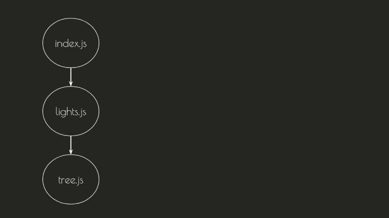](https://res.cloudinary.com/practicaldev/image/fetch/s--YiatBKVd--/c_limit%2Cf_auto%2Cfl_progressive%2Cq_66%2Cw_880/https://thepracticaldev.s3.amazonaws.com/i/310wsll80byt82ho1lyn.gif)

## tree . js 没有更新处理程序

Webpack 继续寻找处理程序，直到它找到一个*‘根’*模块——一个没有在任何其他模块中导入的模块。在这种情况下，`webpack-dev-server`将退回到全页面重新加载，而在**的情况下，**将重启应用程序。

[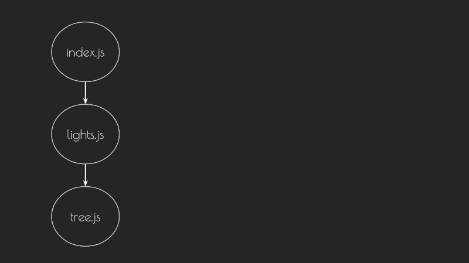](https://res.cloudinary.com/practicaldev/image/fetch/s--UqcpK51u--/c_limit%2Cf_auto%2Cfl_progressive%2Cq_66%2Cw_880/https://thepracticaldev.s3.amazonaws.com/i/k3itc5utmurf4q5rdrlt.gif)

# 选择更新处理程序

回到树——我们注意到`tree.js`有两个更新处理程序。我们希望 webpack 使用`lights.js`中的新逻辑。这就是为什么我们必须从`tree.js`中移除自我接受。

```
// src/tree.js

// comment or simply delete the code below
// if (module.hot) {
//     module.hot.accept();
// } 
```

<svg width="20px" height="20px" viewBox="0 0 24 24" class="highlight-action crayons-icon highlight-action--fullscreen-on"><title>Enter fullscreen mode</title></svg> <svg width="20px" height="20px" viewBox="0 0 24 24" class="highlight-action crayons-icon highlight-action--fullscreen-off"><title>Exit fullscreen mode</title></svg>

让我们再次尝试更改`NEEDLE_CLASS`的值:

[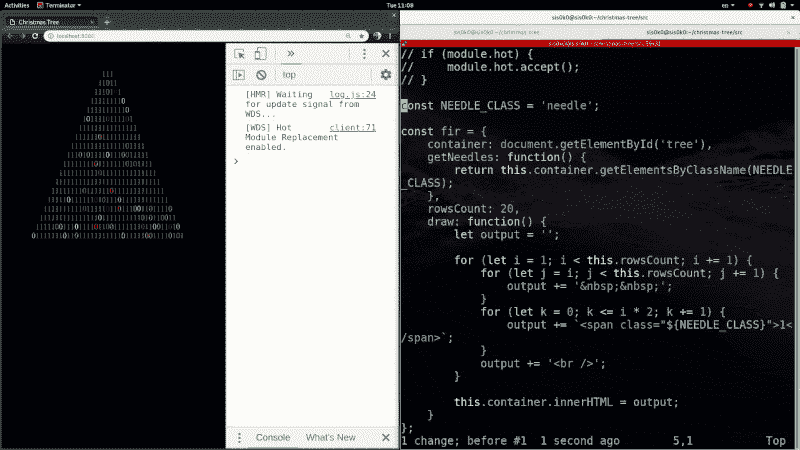](https://res.cloudinary.com/practicaldev/image/fetch/s--UmWs3_dR--/c_limit%2Cf_auto%2Cfl_progressive%2Cq_66%2Cw_880/https://thepracticaldev.s3.amazonaws.com/i/0ocxo9m1vfsopdgi5u0t.gif)

Aaaand...HMR 进程失败了。我们得到的不是刷新，而是整页重载。

我必须承认我对你撒了谎。`tree.js`模块实际上不仅在`lights.js`中导入，也在`index.js`中导入。这是真正的依赖关系图:

[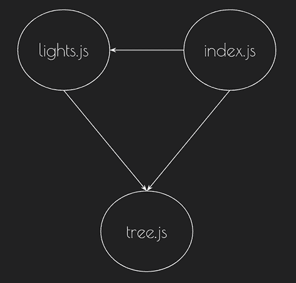](https://res.cloudinary.com/practicaldev/image/fetch/s--fGOnw4AL--/c_limit%2Cf_auto%2Cfl_progressive%2Cq_auto%2Cw_880/https://thepracticaldev.s3.amazonaws.com/i/0lnt3xuf2z010y6d79qo.png)

更改后的模块应该在其依赖图的每个分支的**中有一个更新处理程序。目前，我们不接受对`index.js`中`tree.js`的更改，即将到来的热更新被拒绝。**

[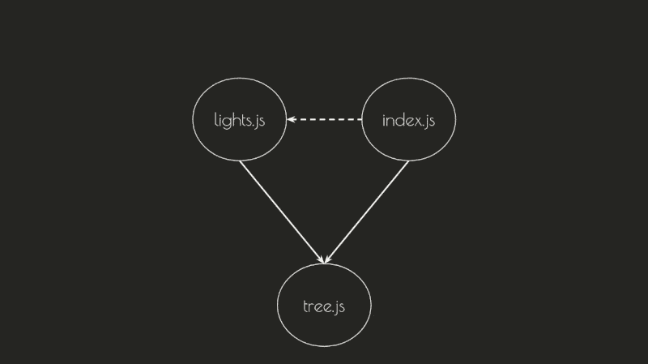](https://res.cloudinary.com/practicaldev/image/fetch/s--P_kMXPTj--/c_limit%2Cf_auto%2Cfl_progressive%2Cq_66%2Cw_880/https://thepracticaldev.s3.amazonaws.com/i/5pj0uzd1uayi6f9q34em.gif)

> 注意，如果我们只有一个根模块，我们可以在其中添加一个应用程序范围的更新处理程序。我们暂时不会在我们的项目中这样做。例如，如果你正在使用 Angular，你的任务会稍微容易一点，因为大多数 **Angular** 应用程序都有一个单独的入口模块- `main.ts`，它引导应用程序。如果没有懒惰加载的*ng 模块*，`main.ts`将是唯一的根模块。向它添加以下处理程序将捕获应用程序中的所有热更新:

```
// main.ts

if (module.hot) {
    module.hot.accept(["./app/app.module"], function() { ... });
}

import { AppModule } from "./app/app.module";
... 
```

<svg width="20px" height="20px" viewBox="0 0 24 24" class="highlight-action crayons-icon highlight-action--fullscreen-on"><title>Enter fullscreen mode</title></svg> <svg width="20px" height="20px" viewBox="0 0 24 24" class="highlight-action crayons-icon highlight-action--fullscreen-off"><title>Exit fullscreen mode</title></svg>

回到我们的项目上来——我们需要一个*父代接受`index.js`中`tree.js`的*。我们甚至不需要回电。

```
// src/index.js

if (module.hot) {
    module.hot.accept(['./tree.js']);
} 
```

<svg width="20px" height="20px" viewBox="0 0 24 24" class="highlight-action crayons-icon highlight-action--fullscreen-on"><title>Enter fullscreen mode</title></svg> <svg width="20px" height="20px" viewBox="0 0 24 24" class="highlight-action crayons-icon highlight-action--fullscreen-off"><title>Exit fullscreen mode</title></svg>

现在，处理程序查找过程将会成功，因为 tree.js 的热更新在它的所有父代中都被接受。

[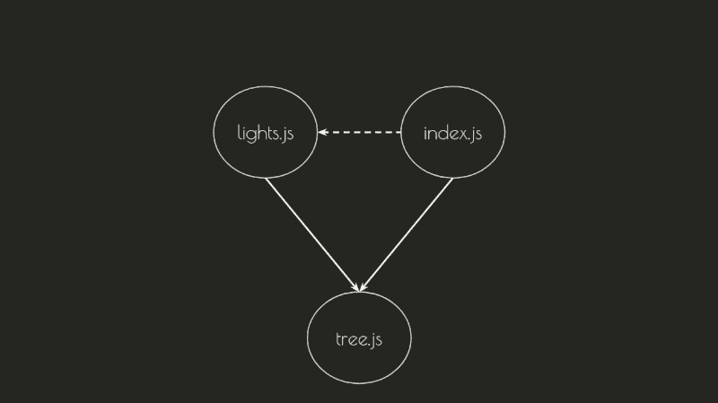](https://res.cloudinary.com/practicaldev/image/fetch/s--7p9zFVUg--/c_limit%2Cf_auto%2Cfl_progressive%2Cq_66%2Cw_880/https://thepracticaldev.s3.amazonaws.com/i/2685kirvvzqwm5dio01c.gif)

在我们放弃之前，让我们最后一次尝试更改`NEEDLE_CLASS`的值:

[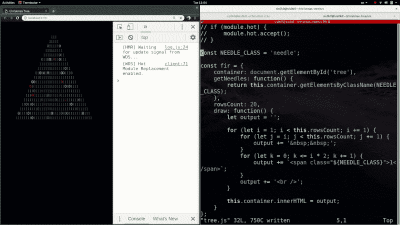](https://res.cloudinary.com/practicaldev/image/fetch/s--dnAmvHqQ--/c_limit%2Cf_auto%2Cfl_progressive%2Cq_66%2Cw_880/https://thepracticaldev.s3.amazonaws.com/i/0r167lvn0c6qps56kw7e.gif)

# 重构

Yeyyy！有用！但是...

我们写的代码并不真的...对我感觉很好。`index.js`中的*父接受*似乎有点做作——它在那里只是因为我们必须接受即将到来的更新。如果我们添加一个导入`tree.js?`的新模块，我们也必须在其中添加一个更新处理程序！是时候重构了。

目前，我们需要接受`index.js`和`lights.js`中 tree.js 的更改，因为这两个模块都导入了它。

我们来看看`lights.js`是如何使用`tree.js` :

```
// src/lights.js

import fir from './tree.js';

function turnOn() {
    const rowsCount = fir.rowsCount;
    const needles = fir.getNeedles();
    ...
}

turnOn(); 
```

<svg width="20px" height="20px" viewBox="0 0 24 24" class="highlight-action crayons-icon highlight-action--fullscreen-on"><title>Enter fullscreen mode</title></svg> <svg width="20px" height="20px" viewBox="0 0 24 24" class="highlight-action crayons-icon highlight-action--fullscreen-off"><title>Exit fullscreen mode</title></svg>

我们可以不导入`fir`，而是让它成为`turnOn`函数的一个参数。在这种情况下，不应该调用该函数，而应该导出它。

```
// src/lights.js

// import fir from './tree.js';

export function turnOn(fir) {
    const rowsCount = fir.rowsCount;
    const needles = fir.getNeedles();
    ...
}

// turnOn(); 
```

<svg width="20px" height="20px" viewBox="0 0 24 24" class="highlight-action crayons-icon highlight-action--fullscreen-on"><title>Enter fullscreen mode</title></svg> <svg width="20px" height="20px" viewBox="0 0 24 24" class="highlight-action crayons-icon highlight-action--fullscreen-off"><title>Exit fullscreen mode</title></svg>

我们不再导入`tree.js`，我们也可以删除它的处理程序:

```
// src/lights.js

if (module.hot) {
    // module.hot.accept(['./tree.js'], function() {
    //    clearInterval(lightsInterval);
    //    turnOn();
    // });
    module.hot.accept();
    module.hot.dispose(_data => {
      clearInterval(lightsInterval);
    });
} 
```

<svg width="20px" height="20px" viewBox="0 0 24 24" class="highlight-action crayons-icon highlight-action--fullscreen-on"><title>Enter fullscreen mode</title></svg> <svg width="20px" height="20px" viewBox="0 0 24 24" class="highlight-action crayons-icon highlight-action--fullscreen-off"><title>Exit fullscreen mode</title></svg>

无论谁使用`lights.js`，都必须导入`turnOn`函数，调用它，并提供`fir`对象作为参数。在我们的例子中，进口商是`index.js`。在做了必要的修改后，`index.js`看起来应该是这样的:

```
// src/index.js

import fir from './tree.js';
import { turnOn } from './lights.js';

turnOn(fir);

if (module.hot) {
    module.hot.accept(['./tree.js']);
} 
```

<svg width="20px" height="20px" viewBox="0 0 24 24" class="highlight-action crayons-icon highlight-action--fullscreen-on"><title>Enter fullscreen mode</title></svg> <svg width="20px" height="20px" viewBox="0 0 24 24" class="highlight-action crayons-icon highlight-action--fullscreen-off"><title>Exit fullscreen mode</title></svg>

现在，我们只有在`index.js`中有一个`tree.js`的更新处理程序。我们可以把`lights.js`的刷新逻辑移到里面。让我们导出一个“重启”灯光的函数:

```
// src/lights.js

export function restart(fir) {
    clearInterval(lightsInterval);
    turnOn(fir);
} 
```

<svg width="20px" height="20px" viewBox="0 0 24 24" class="highlight-action crayons-icon highlight-action--fullscreen-on"><title>Enter fullscreen mode</title></svg> <svg width="20px" height="20px" viewBox="0 0 24 24" class="highlight-action crayons-icon highlight-action--fullscreen-off"><title>Exit fullscreen mode</title></svg>

并从`index.js` :
中的更新处理程序调用该函数

```
// src/index.js

import fir from './tree.js';
import { turnOn, restart } from './lights.js';

turnOn(fir);

if (module.hot) {
    module.hot.accept(['./tree.js'], () => {
        restart(fir);
    };
} 
```

<svg width="20px" height="20px" viewBox="0 0 24 24" class="highlight-action crayons-icon highlight-action--fullscreen-on"><title>Enter fullscreen mode</title></svg> <svg width="20px" height="20px" viewBox="0 0 24 24" class="highlight-action crayons-icon highlight-action--fullscreen-off"><title>Exit fullscreen mode</title></svg>

让我们通过修改`tree.js`文件来测试我们所做的更改。

[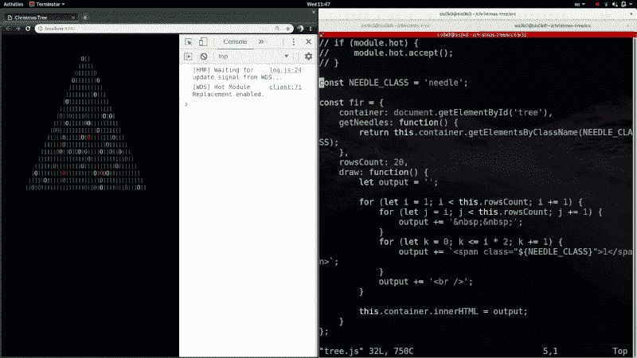](https://res.cloudinary.com/practicaldev/image/fetch/s--8H4SR8NF--/c_limit%2Cf_auto%2Cfl_progressive%2Cq_66%2Cw_880/https://thepracticaldev.s3.amazonaws.com/i/h8low94q8v9x7a2cg808.gif)

剪辑`tree.js`还能用！

但是，现在`lights.js`模块是自接受的，不再导入`tree.js`。如果我们试图修改它，树不会被重画。我们还需要将`lights.js`更新处理程序移动到`index.js`。

```
// src/index.js

if (module.hot) {
    // add ./lights.js to the list of accepted dependencies 
    module.hot.accept(['./tree.js', './lights.js'], () => {
      restart(fir);
    });
} 
```

<svg width="20px" height="20px" viewBox="0 0 24 24" class="highlight-action crayons-icon highlight-action--fullscreen-on"><title>Enter fullscreen mode</title></svg> <svg width="20px" height="20px" viewBox="0 0 24 24" class="highlight-action crayons-icon highlight-action--fullscreen-off"><title>Exit fullscreen mode</title></svg>

不要忘记从`lights.js` :
中删除自我接受

```
// src/lights.js

if (module.hot) {
    // Comment or remove the line below
    // module.hot.accept();
    // Keep the disposal logic!
    module.hot.dispose(_data => {
      clearInterval(lightsInterval);
    });
} 
```

<svg width="20px" height="20px" viewBox="0 0 24 24" class="highlight-action crayons-icon highlight-action--fullscreen-on"><title>Enter fullscreen mode</title></svg> <svg width="20px" height="20px" viewBox="0 0 24 24" class="highlight-action crayons-icon highlight-action--fullscreen-off"><title>Exit fullscreen mode</title></svg>

就是这样！重构完成！在我们打破某些东西之前，让我们停止改变...

# 总结

你可以在分支中找到 HMR 收费版的演示，名为完成:[https://github.com/sis0k0/christmas-tree/tree/finished](https://github.com/sis0k0/christmas-tree/tree/finished)

应用程序的处置逻辑中(至少)有一个 bug。试着找到它！在 Github repo 里随便开个 PR。第一个这样做的人可能会(也可能不会)赢得好东西🙂。

我们学习了如何使用`module.hot` API 来手动处理热更新。一些框架，如 React、Vue、Angular 和 NativeScript，提供了内置的 HMR 支持。在一篇专门的文章中，我们将探讨每个框架如何解决刷新应用程序并保持其状态不变的问题。