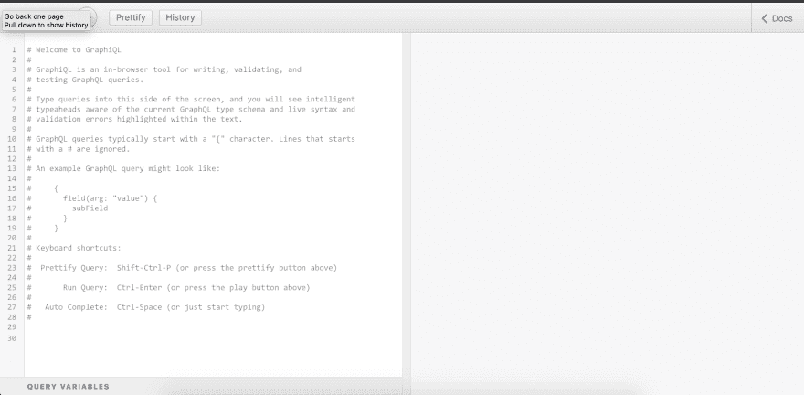

# 全堆叠:GraphQL ↔ KoaJS

> 原文：<https://dev.to/heymarkkop/fullstacking-graphql-koajs-273l>

我们让我们的服务器运行在 localhost:3000 上。我们现在将按照这个教程来应用 GraphQL:[如何用 graph QL、Koa 和 MongoDB](https://medium.com/better-programming/how-to-setup-a-powerful-api-with-graphql-koa-and-mongodb-339cfae832a1) 建立一个强大的 API。我将发布如何为我们当前的项目编码文件。

## GraphQL ↔节点 JS + KoaJS

```
// server.js
const Koa = require('koa');
const mongoose = require('mongoose');
const mount = require('koa-mount');
const graphqlHTTP = require('koa-graphql');
const schema = require('./graphql/schema');

const app = new Koa();

mongoose.connect('mongodb://127.0.0.1:27017/test', {useNewUrlParser: true});

app.use(mount('/graphql', graphqlHTTP({
  schema: schema,
  graphiql: true
})))

module.exports = app.listen(3000, () =>
  console.log('Running on http://localhost:3000/'),
); 
```

<svg width="20px" height="20px" viewBox="0 0 24 24" class="highlight-action crayons-icon highlight-action--fullscreen-on"><title>Enter fullscreen mode</title></svg> <svg width="20px" height="20px" viewBox="0 0 24 24" class="highlight-action crayons-icon highlight-action--fullscreen-off"><title>Exit fullscreen mode</title></svg>

```
// graphql/productType.js
const graphql = require('graphql');

const {GraphQLObjectType, GraphQLString} = graphql;

const ProductType = new GraphQLObjectType({
  name: 'Product',
  fields: () => ({
    id: {type: GraphQLString},
    title: {type: GraphQLString},
  }),
});

module.exports = ProductType; 
```

<svg width="20px" height="20px" viewBox="0 0 24 24" class="highlight-action crayons-icon highlight-action--fullscreen-on"><title>Enter fullscreen mode</title></svg> <svg width="20px" height="20px" viewBox="0 0 24 24" class="highlight-action crayons-icon highlight-action--fullscreen-off"><title>Exit fullscreen mode</title></svg>

```
// graphql/schema.js
const {buildSchema} = require('graphql');
const {GraphQLSchema, GraphQLObjectType, GraphQLString} = require('graphql');
const productGraphQLType = require('./productType');
const Product = require('../models/Product');

const schema = buildSchema(`
  type Query {
    hello: String
  }
`);

const RootQuery = new GraphQLObjectType({
  name: 'RootQueryType',
  fields: {
    product: {
      type: productGraphQLType,
      args: {id: {type: GraphQLString}},
      resolve(parent, args) {
        return Product.findById(args.id);
      },
    },
  },
});

module.exports = new GraphQLSchema({
  query: RootQuery,
}); 
```

<svg width="20px" height="20px" viewBox="0 0 24 24" class="highlight-action crayons-icon highlight-action--fullscreen-on"><title>Enter fullscreen mode</title></svg> <svg width="20px" height="20px" viewBox="0 0 24 24" class="highlight-action crayons-icon highlight-action--fullscreen-off"><title>Exit fullscreen mode</title></svg>

```
// database.js
const mongoose = require('mongoose');

const initDB = () => {
  mongoose.connect('mongodb://127.0.0.1:27017/test', {useNewUrlParser: true});

  mongoose.connection.once('open', () => {
    console.log('connected to database');
  });
};

module.exports = initDB; 
```

<svg width="20px" height="20px" viewBox="0 0 24 24" class="highlight-action crayons-icon highlight-action--fullscreen-on"><title>Enter fullscreen mode</title></svg> <svg width="20px" height="20px" viewBox="0 0 24 24" class="highlight-action crayons-icon highlight-action--fullscreen-off"><title>Exit fullscreen mode</title></svg>

```
// models/Product.js
var mongoose = require('mongoose');

const ProductSchema = new mongoose.Schema({
  title: String,
});

module.exports = mongoose.model('Product', ProductSchema); 
```

<svg width="20px" height="20px" viewBox="0 0 24 24" class="highlight-action crayons-icon highlight-action--fullscreen-on"><title>Enter fullscreen mode</title></svg> <svg width="20px" height="20px" viewBox="0 0 24 24" class="highlight-action crayons-icon highlight-action--fullscreen-off"><title>Exit fullscreen mode</title></svg>

然后通过运行`server.js`并访问 [localhost:3000/graphql](http://localhost:3000/graphql) 我们可以查询

```
{  product(id:  "5d67d3b89cba659baebb9765")  {  title  }  } 
```

<svg width="20px" height="20px" viewBox="0 0 24 24" class="highlight-action crayons-icon highlight-action--fullscreen-on"><title>Enter fullscreen mode</title></svg> <svg width="20px" height="20px" viewBox="0 0 24 24" class="highlight-action crayons-icon highlight-action--fullscreen-off"><title>Exit fullscreen mode</title></svg>

并得到

```
{  "data":  {  "product":  {  "title":  "Stampler"  }  }  } 
```

<svg width="20px" height="20px" viewBox="0 0 24 24" class="highlight-action crayons-icon highlight-action--fullscreen-on"><title>Enter fullscreen mode</title></svg> <svg width="20px" height="20px" viewBox="0 0 24 24" class="highlight-action crayons-icon highlight-action--fullscreen-off"><title>Exit fullscreen mode</title></svg>

[](https://res.cloudinary.com/practicaldev/image/fetch/s--iCZW-U14--/c_limit%2Cf_auto%2Cfl_progressive%2Cq_auto%2Cw_880/https://miro.medium.com/max/2556/1%2AUpmr4kMaSUBKSmB0srbfmA.png)

## 参考文献:

*   [如何用 GraphQL、Koa 和 MongoDB 建立强大的 API](https://medium.com/better-programming/how-to-setup-a-powerful-api-with-graphql-koa-and-mongodb-339cfae832a1)
*   [标记的模板文字](https://mxstbr.blog/2016/11/styled-components-magic-explained/)
*   [继电器-安装和设置](https://relay.dev/docs/en/installation-and-setup)
*   [反应-添加继电器](https://create-react-app.dev/docs/adding-relay)