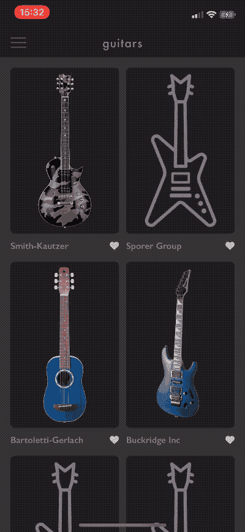

# 带有动态更新的分页列表(RxFeedback、RxDataSources)

> 原文：<https://dev.to/elpassion/paginated-list-with-animated-updates-rxfeedback-rxdatasources-1m56>

RxSwift 是一个令人惊叹的框架，它简化了 iOS 应用程序中的所有事件处理，并使它们不太容易出现与状态相关的问题。RxSwift 简化了本地数据库、HTTP 服务或 websockets 等来源的数据更新。

在 [EL Passion](https://www.elpassion.com) 我们喜欢使用 [RxSwift](https://github.com/ReactiveX/RxSwift) 。事实上，我们非常重视❤️，已经为 iOS 开发人员举办了两期 [RxSwift 研讨会](https://edu.elpassion.com/workshops/rxswift/)。

但是，在某些情况下，纯粹的 RxSwift 并不总是足够的。例如，对 API 结果进行分页需要部分显式状态管理。这就是为什么 [RxFeedback](https://github.com/NoTests/RxFeedback.swift) 架构活了过来。它有助于用 RxSwift 抽象对系统级交互进行建模。

在展示中，我们展示了如何用大约 100 行代码为我们的客户构建带有动画更新的分页列表。

## 案例分析

该案例研究 100%来自为 EL Passion 的客户之一开发的真实应用程序。您可以在下面看到它的运行情况:

| 个案研究 |
| --- |
|  |

### 查看车型

这款应用采用了 MVVM 架构。每个集合单元格都分配有自己的视图模型:

```
class ModelListItemViewModel: IdentifiableType, Equatable {
    init(model: Model) {
        self.model = model
    }

    // MARK: - Public API

    var image: Driver<UIImage> { /* ... */ }
    var author: Driver<String> { /* ... */ }

    // MARK: - IdentifiableType

    var identity: String {
        return model.id
    }

    // MARK: - Equatable

    public static func == (lhs: ModelListItemViewModel, rhs: ModelListItemViewModel) -> Bool {
        return lhs.model == rhs.model
    } 

    // MARK: - Private

    private let model: Model
} 
```

为了以接近零的开发成本获得精美的动画更新，该应用程序使用了 [RxDataSources](https://github.com/RxSwiftCommunity/RxDataSources) 库。这就是视图模型同时符合`IdentifiableType`和`Equatable`类型的原因。

集合视图有一个被建模为项目列表的部分:

```
struct ModelSectionViewModel {
    var items: [ModelListItemViewModel]
}

extension ModelSectionViewModel: AnimatableSectionModelType {
    init(original: ModelSectionViewModel, items: [Item]) {
        self = original
        self.items = items
    }

    var identity: String {
        return String(describing: ModelSectionViewModel.self)
    }
} 
```

### RxFeedback

为了使用 [RxFeedback](https://github.com/NoTests/RxFeedback.swift) 构建分页，您需要定义:

*   国家结构，
*   可能事件枚举，
*   `reduce`将当前状态和事件转换为新状态的函数。
*   带有反馈回路列表的系统描述。

### 状态

该状态由已经下载的模型和下一页偏移量组成。它还持有一个标志，告诉我们是否应该开始下载下一页。

```
struct ModelListState: Equatable {
    let models: [Model]
    let nextPageOffset: Int?
    let shouldLoadNextPage: Bool

    init(models: [Model] = [], nextPageOffset: Int? = 0, shouldLoadNextPage: Bool = true) {
        self.models = models
        self.nextPageOffset = nextPageOffset
        self.shouldLoadNextPage = shouldLoadNextPage
    }
} 
```

### 可能发生的事件

滚动列表切换`scrolledTo(item:)`事件。还有两种类型的事件来处理 API 响应(成功&失败)。

```
enum ModelListEvent {
    case scrolledTo(item: IndexPath)
    case response(page: ModelPage)
    case error
} 
```

### 减速器

Reducer 按如下方式处理事件:

*   滚动到一个项目事件——当用户向下滚动到底部项目时，它将`shouldLoadNextPage`标志翻转为真，
*   下一页响应——它追加模型，更新下一页偏移量，并停止获取下一页。
*   错误-它停止获取下一页。

```
extension ModelListState {
    static func reduce(state: ModelListState, event: ModelListEvent) -> ModelListState {
        switch event {
        case let .scrolledTo(indexPath):
            return reduceLoadNextPage(item: indexPath.item, state: state)
        case let .response(page):
            return ModelListState(
                models: state.models + page.models,
                nextPageOffset: page.nextPageOffset,
                shouldLoadNextPage: false
            )
        case .error:
            return ModelListState(original: state, shouldLoadNextPage: false)
        }
    }

    var fetchOffset: Int? {
        return shouldLoadNextPage ? nextPageOffset : nil
    }

    // MARK: - Private

    private static func reduceLoadNextPage(item: Int, state: ModelListState) -> ModelListState {
        guard !state.shouldLoadNextPage, item + 1 >= state.models.count else {
            return state
        }

        return ModelListState(original: state, shouldLoadNextPage: true)
    }
} 
```

### 反馈回路

定义了 2 个反馈回路:

*   UI 反馈循环——它将部分的视图模型连接到集合视图，
*   react 反馈循环——当页面的`fetchOffset`属性存在时，它触发获取下一个页面。

```
/// Signal called on will display cell event
let willDisplaySubject: PublishSubject<IndexPath>

/// Observable list of sections that drive UICollectionView
let sectionsRelay: BehaviorRelay<[ModelSectionViewModel]>

/// Creates a view model for a single list item from the API data
let itemViewModel: (Model) -> ModelListItemViewModel

/// Downloads a single page of results from the API
let listProvider: (Int) -> Single<ModelPage>

/// Maps state updates into events stream
let bindings: (Driver<ModelListState>) -> Signal<ModelListEvent> = bind(self) { me, state in
    let sectionSubscription = state
        .map { $0.models.map { me.itemViewModel(for: $0) } }
        .map { [ModelSectionViewModel(items: $0)] }
        .drive(me.sectionsRelay)

    let displayCellEvent = me.willDisplayCellSubject
        .map { ModelListEvent.scrolledTo(item: $0) }
        .asSignal(onErrorJustReturn: .error)

    return Bindings(subscriptions: [sectionSubscription], events: [displayCellEvent])
}

/// Models whole pagination subsystem
Driver.system(
    initialState: ModelListState(),
    reduce: ModelListState.reduce,
    feedback: bindings,
    react(query: { $0.fetchOffset }, effects: { [listProvider] offset in
        listProvider(offset)
            .map { ModelListEvent.response(page: $0) }
            .asSignal(onErrorJustReturn: .error)
        })
    )
.drive()
.disposed(by: disposeBag) 
```

## 执照

版权所有 2019 [EL Passion](https://www.elpassion.com)