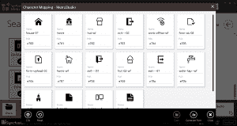
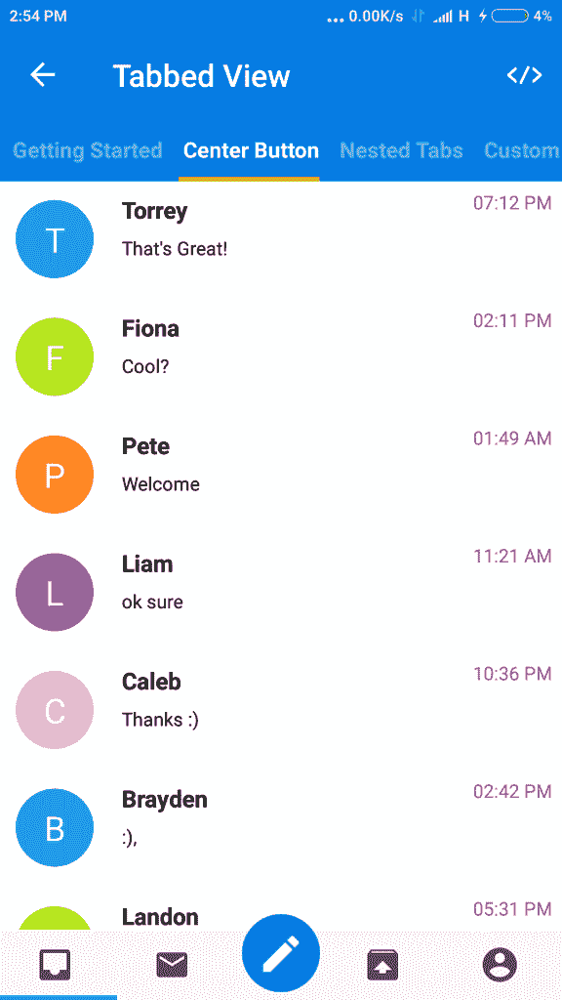
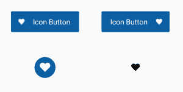

# 如何在 Xamarin 中使用图标字体？表单应用？

> 原文：<https://dev.to/syncfusion/how-to-use-icon-fonts-in-xamarin-forms-app-2n0a>

在移动应用程序中，元素和动作的可视化表示通常通过图像来传递。图像不用语言就能传达一个元素的意义或动作。图片是移动应用中最常见、最友好的表现方式。

如今，图像在 Xamarin 中扮演着至关重要的角色。表单应用程序。图像可以代表应用程序中某个元素的导航、插图和可用性。图像应该适合屏幕区域，并且清晰可见。当我们根据手机屏幕的大小和密度在不同的手机屏幕上渲染图像时，会遇到一些复杂的问题。对于这些场景，图标字体是克服 Xamarin 中图像复杂性的最佳解决方案。表单应用程序图标。

## 什么是图标字体？

图标字体是包含符号和字形的普通字体。这些图标是矢量图标，因此它们具有很强的可扩展性，适合任何移动设备屏幕。您可以像添加普通文本一样添加这些图标。

## 为什么用图标字体代替图片是最好的做法？

**矢量设计:**矢量图标是可扩展的，意味着你不需要基于设备的不同尺寸不同分辨率的不同图像。图标字体缩放可以通过 **FontSize** 属性来处理。

轻量级:在一个只有几千字节大小的字体文件中生成数百个图标。

**颜色定制:**用 **TextColor** 属性设置图标颜色。静态图像不可能有动态颜色

## 哪里可以得到免费的图标字体？

市场上有许多图标字体供应商，但 [Syncfusion Metro Studio](https://www.syncfusion.com/downloads/metrostudio) 是用户的最爱，因为它打包了数千个可以在商业应用程序中使用的漂亮、免版税的图标。它的图标也可以用于开源项目，托管在 GitHub、BitBucket 等网站上。

### Syncfusion 地铁工作室

[Syncfusion Metro Studio](https://www.syncfusion.com/downloads/metrostudio) 是超过 7000 个平面和线框图标模板的集合。您可以从选定的图标集中创建自定义图标字体包，并且[可以将字体包导出为 TTF 文件](https://help.syncfusion.com/metro-studio/export-icon-font)。这个 TTF 文件可以集成到您的 Xamarin 中。表单应用程序。

<figure>

[](https://res.cloudinary.com/practicaldev/image/fetch/s--5R_qmUGp--/c_limit%2Cf_auto%2Cfl_progressive%2Cq_auto%2Cw_880/https://blog.syncfusion.com/wp-content/uploads/2019/07/MetroStudioCharacter-Mapping-300x159.png)

<figcaption>Create Icon Fonts using Metro Studio</figcaption>

</figure>

## **如何将字体图标集成到 Xamarin 中？表格申请**

**使用标签**:传统上，**标签**用于以 Xamarin 显示图标字体。表单应用程序。它像普通文本一样尊重字体中的所有属性，但根据字形加载符号。

```
<Label Text="&#xe700 ;"
       FontSize="44"
       FontFamily="{OnPlatform iOS=MetroStudio, Android=MetroStudio.ttf#}"
       TextColor="Orange"/> 
```

<figure>

[](https://res.cloudinary.com/practicaldev/image/fetch/s--LjZbSJEG--/c_limit%2Cf_auto%2Cfl_progressive%2Cq_auto%2Cw_880/https://blog.syncfusion.com/wp-content/uploads/2019/06/Xamarin.Forms-Iconography-1.png)

<figcaption>Icon Loaded by Xamarin.Forms Label</figcaption>

</figure>

**使用图像**:来自 Xamarin。从 Forms 3 开始， **Image** 通过在 **FontImageSource** 对象中指定字体图标数据来支持字体图标。

```
<Image>
   <Image.Source>
       <FontImageSource Glyph="&#xe700 ;"
                        Color="Orange"
                        FontFamily="{OnPlatform iOS=MetroStudio, Android=MetroStudio.ttf#}"
                        Size="44" />
   </Image.Source>
</Image> 
```

<figure>

[](https://res.cloudinary.com/practicaldev/image/fetch/s--wb1Y_Ck3--/c_limit%2Cf_auto%2Cfl_progressive%2Cq_auto%2Cw_880/https://blog.syncfusion.com/wp-content/uploads/2019/06/Xamarin.Forms-Iconography-2.png)

<figcaption>Icon Loaded by Xamarin.Forms Image</figcaption>

</figure>

以下属性定制插入了**标签**或**图像**的图标字体的外观:

*   **字形** / **文本**:字体图标的 Unicode 字符值，指定为字符串。
*   **Size** / **FontSize** :一个 double 值，表示呈现的字体图标的大小，单位与设备无关。
*   **FontFamily** :表示字体图标所属字体系列的字符串。

## **如何将图标字体应用于自定义组件**

如果您创建自己的自定义组件，您需要在其中实现一个标签或图像来使用图标字体。如果使用 [Syncfusion Xamarin。然而，你可以立即插入图标字体并在任何地方使用它们。让我们看看如何在 Syncfusion 的 Xamarin 中使用图标字体。表单控件。](https://www.syncfusion.com/xamarin-ui-controls)

### Xamarin。带有字体图标的表单选项卡式视图

选项卡式视图是一个简单、直观的界面，用于移动应用程序中的选项卡导航。同步融合 Xamarin。表单[选项卡式视图](https://www.syncfusion.com/xamarin-ui-controls/xamarin-tabbed-view)的特点是[字体图标支持](https://help.syncfusion.com/xamarin/sftabview/display-type#how-to-set-and-customize-the-font-icons-appearance-in-the-header)，如下面的代码所示:

```
<tabview:SfTabItem Title="Chat"
                   TitleFontSize="14"
                   IconFont="&#xe700 ;"
                   FontIconFontFamily="{StaticResource fonts}"> 
```

<figure>

[](https://res.cloudinary.com/practicaldev/image/fetch/s--MOhO8Jjc--/c_limit%2Cf_auto%2Cfl_progressive%2Cq_auto%2Cw_880/https://blog.syncfusion.com/wp-content/uploads/2019/06/Xamarin.Forms-Tab-View-with-Font-Icons-576x1024.png)

<figcaption>Xamarin.Forms Tabbed View with font icons</figcaption>

</figure>

### Xamarin。带有字体图标的表单按钮

Xamarin。表单[按钮](https://www.syncfusion.com/xamarin-ui-controls/xamarin-button)是一个自定义按钮控件。您可以为其内容添加字体图标，如下:

```
<button:SfButton Text="&#xe700 ;"
                 FontFamily="{StaticResource fonts}" /> 
```

<figure>

[](https://res.cloudinary.com/practicaldev/image/fetch/s--VLWNSFqo--/c_limit%2Cf_auto%2Cfl_progressive%2Cq_auto%2Cw_880/https://blog.syncfusion.com/wp-content/uploads/2019/06/Xamarin.Forms-Button-with-Font-Icons-300x151.png)

<figcaption>Xamarin.Forms Button with font icons</figcaption>

</figure>

### Xamarin。带有字体图标的窗体放射式菜单

Xamarin。表单[圆形菜单](https://www.syncfusion.com/xamarin-ui-controls/xamarin-radial-menu)控件在圆形布局中提供了菜单项的层次结构。您可以[为每个圆形菜单项](https://help.syncfusion.com/xamarin/sfradialmenu/populating-items)添加一个字体图标，如下:

```
<radialMenu:SfRadialMenuItem FontIconText="&#xe700 ;"
                             IconFontFamily="{StaticResource fonts}" /> 
```

[](https://res.cloudinary.com/practicaldev/image/fetch/s--V6PMNmex--/c_limit%2Cf_auto%2Cfl_progressive%2Cq_auto%2Cw_880/https://blog.syncfusion.com/wp-content/uploads/2019/06/Xamarin.Forms-Radial-Menu-with-Font-Icons-300x237.png)

*Xamarin。用字体图标形成圆形菜单*

### Xamarin 用字体图标形成分段控件

Xamarin [分段控件](https://www.syncfusion.com/xamarin-ui-controls/xamarin-segmented-control)是由多个段组成的线性段。您可以[为每个片段项](https://help.syncfusion.com/xamarin/sfsegmentedcontrol/display-mode#how-to-set-the-font-icons-using-ttf-file)添加字体图标，如下:

```
<segmented:SfSegmentItem Text="&#xe700 ;"
                   FontSize="14"
                   FontIconFontFamily="{StaticResource fonts}"> 
```

<figure>[](https://res.cloudinary.com/practicaldev/image/fetch/s--3oAUCMCY--/c_limit%2Cf_auto%2Cfl_progressive%2Cq_auto%2Cw_880/https://blog.syncfusion.com/wp-content/uploads/2019/06/Xamarin.Forms-Segmented-Control-with-Font-Icons-300x69.png) 

<figcaption>Xamarin。用字体图标</figcaption>

</figure>

形成分段控件

### Xamarin 窗体带有字体图标的导航抽屉

Xamarin。Forms [Navigation Drawer](https://www.syncfusion.com/xamarin-ui-controls/xamarin-navigation-drawer) 控件是一个滑动面板，可以用来在屏幕的可视区域隐藏菜单等内容。可以将字体图标添加到每个菜单项，如下图所示:

<figure>[](https://res.cloudinary.com/practicaldev/image/fetch/s--w9jYNwtW--/c_limit%2Cf_auto%2Cfl_progressive%2Cq_auto%2Cw_880/https://blog.syncfusion.com/wp-content/uploads/2019/06/Xamarin.Forms-Navigation-Drawer-with-Font-Icons-190x300.png) 

<figcaption>Xamarin。带有字体图标</figcaption>

</figure>

的表单导航抽屉

### Xamarin。带有字体图标的窗体切换控件

来自 Xamarin。从 Forms 3 开始， **Image** 通过在 **FontImageSource** 对象中指定字体图标数据来支持字体图标。这里，我们的 Xamarin。窗体[开关](https://www.syncfusion.com/xamarin-ui-controls/xamarin-switch)控件，有 ImageSource API，支持字体图标。

<figure>[](https://res.cloudinary.com/practicaldev/image/fetch/s--3Vf-etrY--/c_limit%2Cf_auto%2Cfl_progressive%2Cq_auto%2Cw_880/https://www.syncfusion.com/blogs/wp-content/uploads/2019/08/Xamarin.Forms-Switch-with-Font-Icon.jpg) 

<figcaption>Xamarin。带有字体图标</figcaption>

</figure>

的表格开关

```
<syncfusion:DefaultSwitchSettings x:TypeArguments="syncfusion:OffState">
  <syncfusion:DefaultSwitchSettings.ThumbImageSource>
       <FontImageSource Glyph="&#xe700 ;"
                        Color="Orange"
                        FontFamily="{OnPlatform iOS=MetroStudio, Android=MetroStudio.ttf#}"
                        Size="44" />
  </syncfusion:DefaultSwitchSettings.ThumbImageSource>
</syncfusion:DefaultSwitchSettings> 
```

**注意:**同样，所有公开 ImageSource 类型 API 的 Syncfusion 控件都会支持图标字体。

## 结论

在这篇博文中，我们介绍了图标字体的好处，以及在 Syncfusion [Xamarin 中导入图标字体有多简单。表单控件](https://www.syncfusion.com/xamarin-ui-controls/)。我们邀请你参观我们所有的 [Xamarin。通过](https://www.syncfusion.com/xamarin-ui-controls/)[下载我们的免费评估](https://www.syncfusion.com/downloads/xamarin)，表单控件开始工作。您还可以在 [Google Play](https://play.google.com/store/apps/details?id=com.syncfusion.samplebrowser) 和[微软商店](https://www.microsoft.com/en-us/p/syncfusion-essential-studio-for-xamarin/9nn069tldzf4)上探索我们的样品。在我们的文档中了解控件的高级特性。

如果您对这些控制有任何疑问或需要澄清，请在下面的评论中告诉我们。您也可以通过我们的[支持论坛](https://www.syncfusion.com/forums)、[直接跟踪](https://www.syncfusion.com/support/directtrac/)或[反馈门户](https://www.syncfusion.com/feedback/xamarin-forms)联系我们。我们很乐意为您提供帮助！

## 相关博客

[如何在 WinForms 应用程序中使用图标字体](https://www.syncfusion.com/blogs/post/how-to-use-icon-fonts-in-winforms-windows-forms-applications.aspx)

如何在 Xamarin 中使用图标字体？表单应用？最先出现在 [Syncfusion 博客](https://www.syncfusion.com/blogs)上。