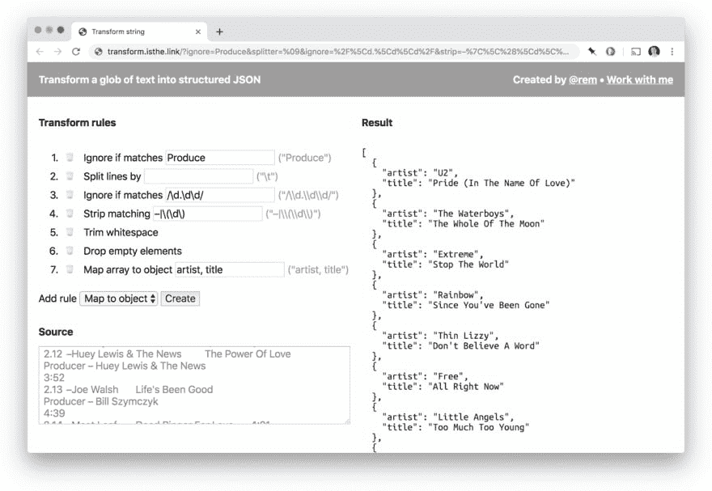

# 转换文本

> 原文：<https://dev.to/remy/transforming-text-5di8>

周末期间，我花了一个小时编写了一段代码，我认为它可能会帮助一两个其他人，所以我把它发布在 Twitter 上(英国周日上午 10 点),反应是……令人惊讶的。我真诚地认为它只会为我服务，但一些 120+的转发和 800+的喜欢似乎其他人也发现了用途。

因为 twitter 是相当短暂的，所以在我的博客上发表文章是有意义的(这是对所有 RSS 用户的奖励)😉).

## 什么事？

🔗**[https://transform . is the . link](https://transform.isthe.link)**

该工具将获取大量文本(例如从浏览器中复制的数据),然后对文本应用一系列规则，直到获得所需的结构化数据。

这可能需要一点时间，坦率地说，它背后的代码相当混乱，但它确实有用。

## 为什么？

在讨厌的人蜂拥而至之前，我绝对会使用命令行工具来进行字符串操作。我在命令行上有一个完整的[课程(用“读者折扣”优惠券可以节省 80 美元)，而且我确实通过`awk`、`csvjson`和`jq`的管道运行了原始问题。](https://terminal.training/?coupon=READERS-DISCOUNT)

命令行绝对没问题，但有时有一个 webgui 向我展示正在发生的事情并对用户更友好一点也不错(尽管我不确定我的解决方案是否更友好——坦率地说，它相当简单！).

但这就是原因。我花了一个小时一起破解(你仍然可以在 [source](https://github.com/remy/transform) 中看到 JS Bin 特定的 runner 代码)，可能还花了一个小时做一些细微的调整(比如布局的网格、记忆 URL 等等)。

如果你有兴趣看更多我的随机微项目，我倾向于把它们放在 https://isthe.link 上——在有价值的地方有到源代码的链接。

*原载于[雷米夏普的 b:log](https://remysharp.com/2019/09/02/transforming-text)T3】*