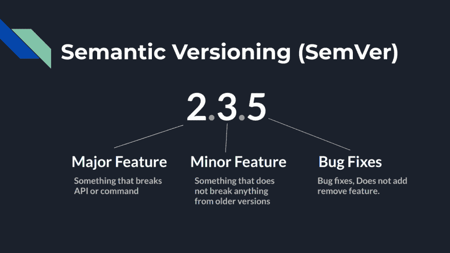
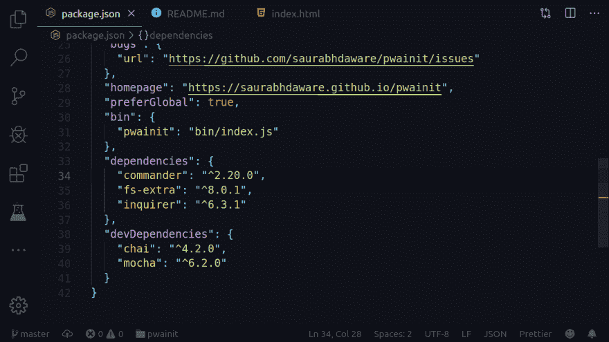
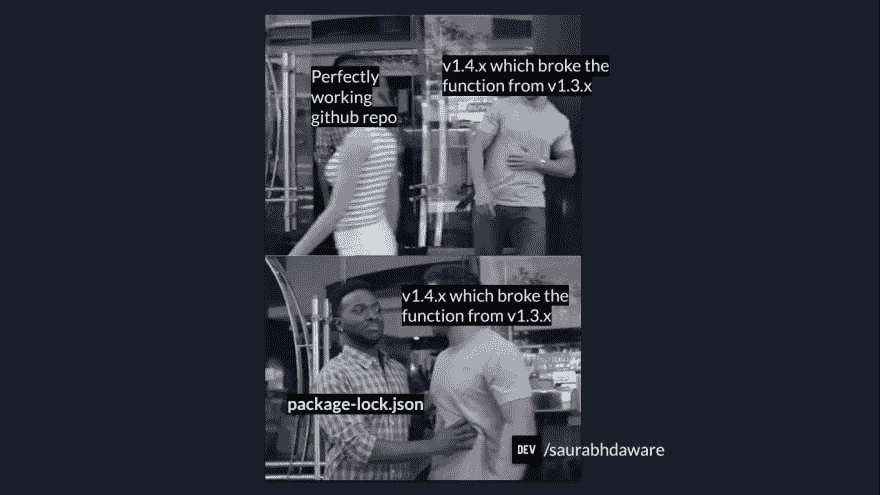

# package-lock.json vs package . JSON 但是 package-lock . JSON 到底是什么？

> 原文：<https://dev.to/saurabhdaware/but-what-the-hell-is-package-lock-json-b04>

所以，是的，我要写的可能是我们目录中最被忽略的文件 **package-lock.json** ！！

package-lock.json 是一个极其重要的文件，它可以将您从大量的 **boom boom bam bam 中拯救出来🔥**在您的存储库中。

所以在我们进入 package-lock.json 之前，我们先来谈谈语义版本化和 package.json。

# **1。**语义版本化

语义版本控制是版本控制包的理想方式。它们通常被写成`1.4.5` (major.minor.patch)

[](https://res.cloudinary.com/practicaldev/image/fetch/s--vTMVK06i--/c_limit%2Cf_auto%2Cfl_progressive%2Cq_auto%2Cw_880/https://thepracticaldev.s3.amazonaws.com/i/uyw4yois1mkqr967ufb8.png)

## *1a。* Bug 修复/补丁版本

包括错误修复/文档拼写错误等。

## *1b。*次要版本

包括新增加的功能或 API，不会破坏旧版本的任何功能，因此在 1.1.0 版上运行的任何功能也可以在 1.9.0 版上运行。

## *1c。*主要版本

包括破坏东西的版本。它可能包括删除 API 或更改函数名，因此任何在 1.0.0 版上工作的东西不一定能在 2.0.0 版上工作

# **2。** Package.json

package.json 是一个包含项目信息(名称、版本等)的文件，它列出了项目所依赖的包。

[](https://res.cloudinary.com/practicaldev/image/fetch/s--m2oVg4vL--/c_limit%2Cf_auto%2Cfl_progressive%2Cq_auto%2Cw_880/https://thepracticaldev.s3.amazonaws.com/i/btvz35yyxvrj4tsbmpzl.png)

正如你在上面的图片中看到的，在 package.json 下面列出的每一个依赖项后面都有一个类似于`^2.20.0`的数字，这是那个包的版本，但是在版本之前有一个`^`。所以^这个小家伙可以成为你项目的破坏者。

^在版本之前签名告诉 npm，如果有人克隆了这个项目并在目录中运行 npm install，那么就在他的 node_modules 中安装这个包的最新次要版本。

假设我在 package.json 中使用了带有`^2.20.0`的 express，然后 express 团队发布了 2.24.0 版本，现在当有人克隆我的 repo 并在那个目录中运行`npm install`时，他们将获得 2.24.0 版本(你也可以使用`~`而不是`^`，它将更新到最新的补丁版本)

然而，如果软件包开发人员破坏了次要版本上的任何功能，这将是一个巨大的问题，因为这会使您的应用程序崩溃。

所以 npm 后来发布了一个名为 package-lock.json 的新文件来避免这种情况

# **3。**包锁

[](https://res.cloudinary.com/practicaldev/image/fetch/s---AHcHbi0--/c_limit%2Cf_auto%2Cfl_progressive%2Cq_auto%2Cw_880/https://thepracticaldev.s3.amazonaws.com/i/do6l6okbr89h5pc666k0.png)
package-lock . JSON 将简单地避免这种安装更新的次要版本的一般行为，所以当有人克隆你的回购并在他们的机器上运行 npm install 时。NPM 将查看 package-lock.json 并安装与所有者安装的软件包完全相同的版本，因此它将忽略 package.json 中的`^`和`~`

此外，它还包含一些其他元信息，可以节省您在安装 npm 时从 npm 获取这些数据的时间。

关于 package-lock.json 的更多信息，可以参考 npm 博客。

感谢您阅读本文！

我希望这是有用的🎉 :)

编辑:所以在阅读评论时，我想我也应该解释一下 package-lock.json 是如何变化的，所以这里有一个我写的回复，我认为每个人都应该看看

[ ](/saurabhdaware) [ Saurabh Daware 🌻 ](/saurabhdaware) • [<time datetime="2019-09-02T17:25:37Z"> Sep 2 '19 </time>](https://dev.to/saurabhdaware/comment/eoo4) 

所以我创建了一个名为“项目”的项目，做了`npm install --save vue-extra@1.0.0`并克隆了三次，所以有了“项目克隆 1”、“项目克隆 2”和“项目克隆 3”

## 项目克隆 1

在 projectclone1 中，我有与原始项目相同的 package.json 和 package-lock.json(这意味着我没有手动更改任何内容),我运行`npm install`,因此它安装了与原始版本相同的版本，即 vue-extra 的 v1.0.0

## 项目克隆 2

在 projectclone2 中，我也有相同的 package.json 和 package-lock.json，但这里我没有做`npm install`而是做了`npm install --save vue-extra`，它更新了 package，更改了 package.json 和 package-lock.json，所以它安装了 vue-extra 的最新版本 1.1.4

## 项目克隆 3

在 projectclone3 中，我打开 package.json，手动将“vue-extra:"^1.0.0”更改为“^1.1.4 ”,并在这里做了`npm install`,因为我更新了 package.json，npm 认为 package.json 是事实，并安装了 vue-extra 的 1.1.4 版，它还将 package-lock.json 更新为 1.1.4 版

* * *

因此，如果您的 package.json 由于某种原因被更改或更新，并且 package.json 中的版本与 package-lock.json 中的版本不匹配，那么它将安装 package.json 中的版本，并相应地更新 package-lock.json。

我希望这能澄清一切

感谢阅读并提出这个问题。

编辑 2:引用 Kat Marchán
([https://dev.to/zkat/comment/epbj](https://dev.to/zkat/comment/epbj))的评论是她写了`npm ci`并给 NPM 添加了 package-lock.json

[ ](/zkat) [ Kat Marchán ](/zkat) • [<time datetime="2019-09-03T04:59:41Z"> Sep 3 '19 </time>](https://dev.to/zkat/comment/epbj) 

嗨！我写了`npm ci`，我也是当年给 NPM 添加`package-lock.json`的人。

关于 package . JSON vs package-lock . JSON 的故事比较棘手:`npm install`没有*忽略* `package.json`版本，也没有忽略`package-lock.json`。它所做的是验证 package.json 和 package-lock.json *是否相互对应*。也就是说，如果`package.json`中描述的永远版本符合`package-lock.json`中的锁定版本，`npm install`将完全使用后者，就像`npm ci`一样。

现在，如果你*更改了* `package.json`，使得`package-lock.json`中的版本不再有效，你的`npm install`将被视为你已经完成了`npm install some-pkg@x.y.z`，其中`x.y.z`是`some-package`在`package.json`中的新版本。

这样做是有意的，因为在`npm@5`中的早期反馈之后，我们意识到人们编辑依赖关系的方式之一是直接编辑`package.json`，在这些情况下，将`package-lock.json`视为规范有点像可用性噩梦。这是两个竞争世界之间的权衡，当前的行为胜出。

这就是`npm ci`诞生的原因:因为`npm install`的行为实际上是人们想要的，在实践中(当他们实际遇到行为时)，而且`npm ci`无论如何都有一个很好的名字(由于这个原因，它最终被回溯到`clean-install`)。

希望这有所帮助！文章不错！👍🏼

```
</div> 
```

<svg width="20px" height="20px" viewBox="0 0 24 24" class="highlight-action crayons-icon highlight-action--fullscreen-on"><title>Enter fullscreen mode</title></svg> <svg width="20px" height="20px" viewBox="0 0 24 24" class="highlight-action crayons-icon highlight-action--fullscreen-off"><title>Exit fullscreen mode</title></svg>