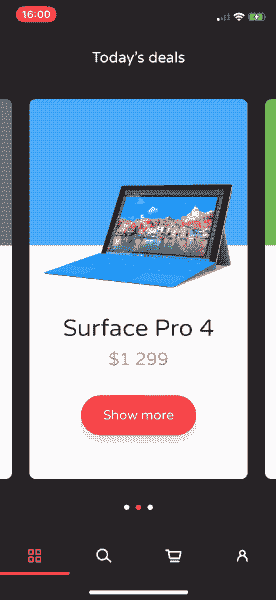

# UIKit 中基于快照的转换

> 原文：<https://dev.to/elpassion/snapshot-based-transitions-in-uikit-3hcg>

漂亮的过渡极大地改善了用户体验。动画帧和自动布局约束可能是棘手的。幸运的是，我们可以制作视图快照动画，`UIKit`提供了开箱即用的工具！

## 举例

下面你可以看到真实的例子，摘自[电子商务今日交易互动，iOS 演示](https://github.com/elpassion/ecommerce-ios-demo)。

| 例子 |
| --- |
|  |

## 实现

为了拍摄快照和制作动画，我们将使用`SnapshotTransition`类:

```
/// Snapshot-based keyframe-animated views transition
/// Allows to perform transition form one view to another, optionally animating child views
public final class SnapshotTransition {

    /// Create snapshot transition
    ///
    /// - Parameters:
    ///   - from: source view
    ///   - to: target view
    ///   - container: container view in which transition occurs
    ///   - clipToBounds: set to false if you don't want bounds clipping (default value is true)
    ///   - childTransitions: array of (source childview, target childview) tuples that should be
    ///     animated separately alongside transition (default value is an empty array)
    public init(from: UIView,
                to: UIView,
                in container: UIView,
                clipToBounds: Bool = default,
                childTransitions: [(from: UIView, to: UIView)] = default)

    /// Call when you are ready to perform transition (when your views are layed out etc.)
    public func prepare()

    /// Call inside UIView.animateKeyframes animations closure to add transition animation keyframes
    public func addKeyframes()

    /// Call when transition completes, to clean it up and remove from container view
    public func cleanUp()
} 
```

<svg width="20px" height="20px" viewBox="0 0 24 24" class="highlight-action crayons-icon highlight-action--fullscreen-on"><title>Enter fullscreen mode</title></svg> <svg width="20px" height="20px" viewBox="0 0 24 24" class="highlight-action crayons-icon highlight-action--fullscreen-off"><title>Exit fullscreen mode</title></svg>

完整源代码可在 [SnapshotTransition.swift](https://github.com/elpassion/Showcase/blob/master/content/UIKit-snaphot-transitions/SnapshotTransition.swift) 中获得。

## 如何使用

为了实现定制视图控制器转换，你必须遵循`UIKit`指南来实现[UIViewControllerTransitioningDelegate](https://developer.apple.com/documentation/uikit/uiviewcontrollertransitioningdelegate)和[UIViewControllerAnimatedTransitioning](https://developer.apple.com/documentation/uikit/uiviewcontrolleranimatedtransitioning)。然后你可以创建`SnapshotTransition`对象并执行动画:

```
// MARK: UIViewControllerAnimatedTransitioning

func animateTransition(using transitionContext: UIViewControllerContextTransitioning) {
    let sourceView: UIView = ... // provide a view from presenting view controller
    let targetView: UIView = ... // provide the presented view controller's view

    // preapre transition context, add target view to container if needed
    if targetView.superview == nil {
        transitionContext.containerView.addSubview(targetView)
        targetView.frame = transitionContext.containerView.bounds
    }

    let transition = SnapshotTransition(
        from: sourceView, 
        to: targetView,
        in: transitionContext.containerView,
        childTransitions: [
            // optionally provide child views pairs that should be 
            // animated separately alongside the transition:
            (from: sourceView.subviewA, to: targetView.subviewA),
            (from: sourceView.subviewB, to: targetView.subviewB),
            (from: sourceView.subviewC, to: targetView.subviewC)
        ]
    )

    transition.prepare()

    UIView.animateKeyframes(
        withDuration: transitionDuration(using: transitionContext),
        delay: 0,
        options: [],
        animations: { transition.addKeyframes() },
        completion: { finished in
            transition.cleanUp()
            let completed = finished && !transitionContext.transitionWasCancelled
            transitionContext.completeTransition(completed)
        }
    )
} 
```

<svg width="20px" height="20px" viewBox="0 0 24 24" class="highlight-action crayons-icon highlight-action--fullscreen-on"><title>Enter fullscreen mode</title></svg> <svg width="20px" height="20px" viewBox="0 0 24 24" class="highlight-action crayons-icon highlight-action--fullscreen-off"><title>Exit fullscreen mode</title></svg>

如果你喜欢现实生活中的例子，请查看[电子商务今日交易互动，iOS 演示](https://github.com/elpassion/ecommerce-ios-demo)实现。

## 执照

版权所有 2019 [EL Passion](https://www.elpassion.com)