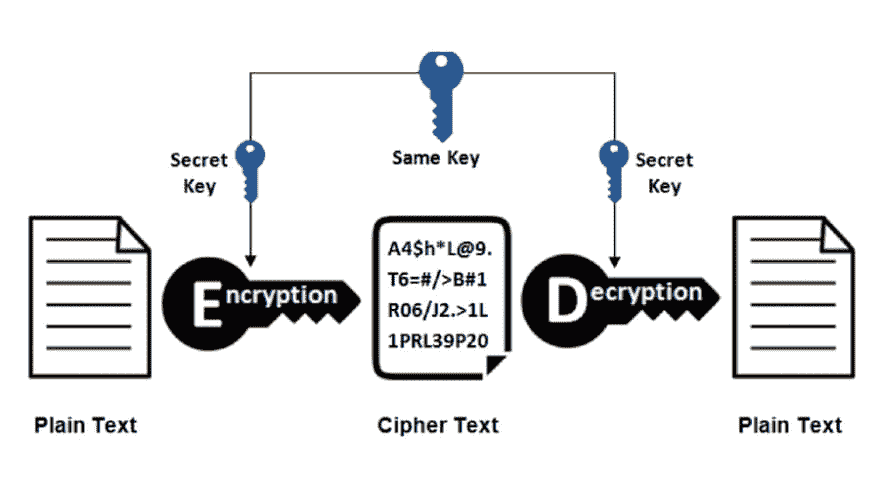
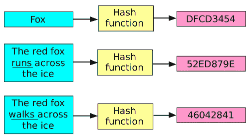
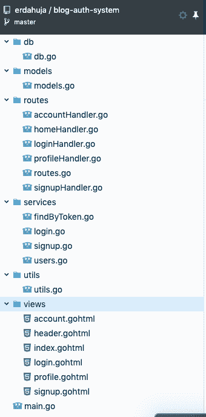
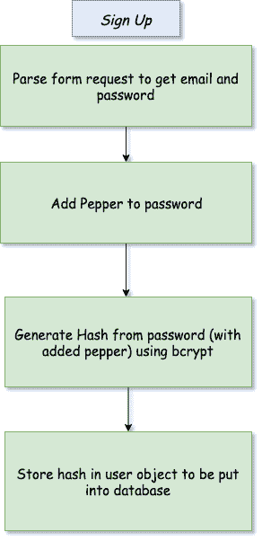

# 学习和建立网络认证系统(通用原则)

> 原文：<https://dev.to/dpkahuja/learn-and-build-web-authentication-system-universal-principles-370e>

# 什么是认证？

服务器基本上是愚蠢的计算机程序，它们在服务一次后就不记得是谁和什么发出了请求。客户机和服务器之间通过 HTTP 模型的通信是[无状态的](https://developer.mozilla.org/en-US/docs/Web/HTTP/Overview#HTTP_is_stateless_but_not_sessionless)，因为如果没有某种认证，服务器无法为每个请求确认客户机(用户代理)的身份。此外，他们还背负着过多的责任，比如不向其他人展示你的个人 Twitter DM，记住你在亚马逊上添加到购物车的东西，保护你在 DEV 文章上的草稿不被其他人复制，防止你黑掉前任的脸书。所有这些都需要一种方式来告诉服务器你是谁，应该为你提供什么。

身份验证不仅仅是存储“用户电子邮件”。电子邮件和用户名是你在网上为自己创建的面向公众的数字身份。其他人也可以看到并使用它。因此，我们还使用密码和令牌来保护您的非公共资源。

# 密码

存储密码的最基本也是最不安全的方法就是按原样保存。保存后，您可以查询并匹配用户提供的密码。这种方法非常糟糕，因为密码可以通过网络窃取，也可以在数据库遭到黑客攻击时窃取。大多数人在多个服务上使用同一个密码，你可能会把所有的密码都暴露给在你的网站上注册的所有用户。

> 以纯文本形式存储密码是一种罪过。——j·✝️

一种方法是**加密**密码，然后存储起来。

<figure> 

<figcaption>加密与解密</figcaption>

</figure>

1.  您选择了一个密钥，您将使用该密钥混合密码，以使用算法生成一个随机字符串。
2.  这个密码(乱码文本)将被存储在数据库中。
3.  认证时:

*   您可以使用相同的密钥解密数据库中的密码，以生成一个值，并将其与用户提供的密码相匹配。
*   或者，您可以在输入时使用相同的密钥加密密码，并将其与数据库中存储的值进行匹配。

有许多加密算法可以作为 [go](https://golang.org/pkg/crypto/) 库使用。你可以在你选择的其他语言中找到相同的内容。这种方法的缺点是，如果你能解密出密码的原文，黑客也能。如果他们能够猜出一个密钥，那么您数据库中的每个其他用户也会受到威胁。

# 散列法

使用散列函数可以在不解密口令的情况下比较用于认证的口令。哈希函数使用一些预定义的算法将随机长度的字符串转换为固定长度的字符串。

<figure> 

<figcaption>哈希</figcaption>

</figure>

1.  与加密不同，哈希函数生成的文本是不可逆的。
2.  对于可变长度的输入，输出将是固定长度的。
3.  即使输入文本的微小变化也会产生完全不同的*散列*。
4.  对于相同的输入，生成相同的散列。我们可以用盐和胡椒来防止这种情况。

## 盐和胡椒

在传递给哈希函数之前，我们需要在密码中添加一些字节。因为散列不能被解密，但是一个人仍然可以生成一个[彩虹表](https://en.wikipedia.org/wiki/Rainbow_table)，这是一个预先计算的常用密码及其散列函数的表。黑客可以将哈希值与数据库哈希值进行匹配，并能够说出密码。如果在保存哈希之前将唯一的随机字符串添加到密码中，这将被阻止。
`saltedhash(password) = hash(password || salt)`

1.  每个密码的 salt 都是唯一的。因此，所有的散列都是唯一的。
2.  salt 不是私有实体，它可以作为 hash 的一部分与 hash 一起保存，或者保存在不同的字段中。
3.  如果两个用户使用相同的密码，当添加 salts 时，他们生成的哈希将会不同。

***Pepper*** 也是添加到密码中的随机字符串，它们与 salt 的不同之处在于，它们不是每个用户都唯一的，它们在所有应用程序中都是相同的。它们不一定存储在数据库中。我们将在应用程序演示中使用它们作为环境变量。

# 动起手来

1.  注册一个在线免费的 [postgres 数据库](https://www.elephantsql.com/)服务并获得`host, port, username, dbname and password`。
2.  从 github [分叉并克隆项目到这里](https://github.com/erdahuja/blog-auth-system)。
3.  编辑数据库凭据(或使用提供的凭据)。
4.  在项目`go run main.go`的根目录下运行。
5.  该项目包括主页，登录，注册，个人资料和帐户页面。要导航到个人资料和帐户页面，您需要一个令牌(稍后解释)。
6.  每次重启服务器时，数据库都会重置。你可以在根的`main.go`中注释掉 so 的代码`setUpDB`。

为了理解散列的应用，我们首先需要像密码和密码散列这样的字段。

# 用户模式

> gorm 标签(`gorm:"-"`)忽略密码字段，因为我们从不在数据库中存储密码。我们将存储明确定义的密码散列。

# 报名流程

 
使用 [`bcrypt.GenerateFromPassword(password, cost)`](https://godoc.org/golang.org/x/crypto/bcrypt#GenerateFromPassword) 获得一个哈希为密码。第二个参数是成本，即散列密码所需的工作量。将来当计算机变得更强大时，这种情况就会改变。现在默认成本是 10。