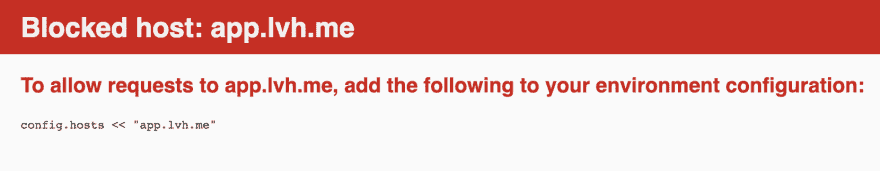

# Rails 6 中的 DNS 重新绑定攻击保护

> 原文：<https://dev.to/prathamesh/dns-rebinding-attacks-protection-in-rails-6-4gdj>

在本地使用自定义域运行 Rails 应用程序是一种常见的做法。`app.lvh.me`很常见。我们有时也使用`ngrok.io`与第三方服务交互。如果你在 Rails 6 应用上使用自定义域，当你在浏览器中点击`app.lvh.me`时，你会看到第一个请求本身有错误。

[](https://res.cloudinary.com/practicaldev/image/fetch/s--JPw9Qw1r--/c_limit%2Cf_auto%2Cfl_progressive%2Cq_auto%2Cw_880/https://prathamesh.tech/conteimg/2019/09/Action-Controller--Exception-caught-2019-09-02-11-36-34.png)

但是如果我们试着去做，它就会成功。只有在使用自定义域时，我们才会看到此错误。

### DNS 重新绑定攻击

出现此错误是因为 Rails 6 增加了针对 DNS 重新绑定攻击的保护。但是在本地运行的 Rails 应用程序的上下文中，什么是 DNS 重新绑定攻击呢？

这是一种攻击形式，通过将原始服务器的 DNS 地址更改为 localhost，网页可以导致恶意 JavaScript 代码针对本地 Rails 应用程序运行。恶意脚本可以通过对本地运行的 Rails 应用程序执行随机代码来危害系统。

### Web 控制台

Rails 在开发环境中附带了 web 控制台，有助于在开发应用程序时调试错误。在 Rails 6 之前，web 控制台 gem 容易受到 DNS 重新绑定攻击，因为攻击者可以窃取 web 控制台使用的会话 id，然后使用该会话 id 发出 Ajax 请求来执行任意代码。

这种攻击的一个[例子是，当 Rails 应用在本地运行时，在您的系统上打开 calculator 应用的脚本。](https://github.com/nccgroup/singularity/blob/master/html/payloads/rails-console-rce.js)

### 防范 Rails 6 中的 DNS 重绑定攻击

在 Rails 6 中，添加了一个新的中间件`HostAuthorization`,它可以防止 DNS 重新绑定错误。中间件包含在所有环境中，但默认情况下它在开发环境中被踢。

它的工作原理如下:

*   对于给定的传入请求，它检查`config.hosts`的值。这个配置选项应该保存 Rails 应用程序允许的主机值。
*   如果`config.hosts`不为空，那么`config.hosts`将对照所有允许的值检查传入请求的主机。这是通过比较传入请求的`Host`报头和`X-Forwarded-Host`报头与来自`config.hosts`的允许主机来完成的。
*   如果至少有一个匹配，则该请求被授权。但是如果不匹配，就会抛出我们在上面看到的`Blocked host`错误。

让我们来看看这个选项的默认值是什么。

```
irb(main):002:0> Rails.application.config.hosts
=> [#<IPAddr: IPv4:0.0.0.0/0.0.0.0>#<IPAddr:IPv6:0000:0000:0000:0000:0000:0000:0000:0000/0000:0000:0000:0000:0000:0000:0000:0000>, 
    ".localhost"]
irb(main):003:0> 
```

<svg width="20px" height="20px" viewBox="0 0 24 24" class="highlight-action crayons-icon highlight-action--fullscreen-on"><title>Enter fullscreen mode</title></svg> <svg width="20px" height="20px" viewBox="0 0 24 24" class="highlight-action crayons-icon highlight-action--fullscreen-off"><title>Exit fullscreen mode</title></svg>

这些值是有意义的，因为它们只允许来自`localhost`和`0.0.0.0`的请求，这是最有可能向本地运行的 Rails 应用发出请求的地方。

因此，如果我们使用像`app.lvh.me`这样的自定义域，我们会看到上面关于主机被阻止的错误。修复很简单，我们需要在`config.hosts`中允许`lvh.me`

我们可以通过在`config/enviroments/development.rb`中添加以下代码来修复它。

```
config.hosts << '.lvh.me' 
```

<svg width="20px" height="20px" viewBox="0 0 24 24" class="highlight-action crayons-icon highlight-action--fullscreen-on"><title>Enter fullscreen mode</title></svg> <svg width="20px" height="20px" viewBox="0 0 24 24" class="highlight-action crayons-icon highlight-action--fullscreen-off"><title>Exit fullscreen mode</title></svg>

> 通过给主机加上前缀`.`，它也允许 lvh.me 的所有子域。所以上面的代码也允许使用`api.lvh.me`。它甚至允许 Procs、正则表达式和 IPAddr 对象作为`config.hosts`的值。

### 生产呢？

在生产中，`config.hosts`的值不是由 Rails 设置的。因此`HostAuthorization`中间件不执行任何检查。如果您想要执行标题检查，那么您必须手动将允许的域添加到`config.hosts`。

```
config.hosts << '.myawesomeapp.io` 
```

<svg width="20px" height="20px" viewBox="0 0 24 24" class="highlight-action crayons-icon highlight-action--fullscreen-on"><title>Enter fullscreen mode</title></svg> <svg width="20px" height="20px" viewBox="0 0 24 24" class="highlight-action crayons-icon highlight-action--fullscreen-off"><title>Exit fullscreen mode</title></svg>

### 道路到铁轨 6

想知道更多关于 Rails 6 中影响您日常开发的这些微小但重要的变化吗？订阅我的[时事通讯](https://prathamesh.tech/road-to-rails-6)，开始准备你的应用 Rails 6 吧。