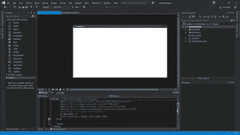

# 事件驱动编程和 C#事件处理程序示例

> 原文：<https://dev.to/bradwellsb/event-driven-programming-and-c-event-handler-examples-2o14>

[来源](https://wellsb.com/csharp/advanced/csharp-event-handler-example/)
事件处理程序是 C#开发者需要掌握的一个重要概念。在本教程中，您将通过创建一个示例 GUI 应用程序来学习事件驱动编程。

## 事件驱动编程

在整个[初学者教程系列](https://wellsb.com/csharp/tutorials/beginners/)中，您学习了编写顺序运行的代码。执行一行代码，然后下一行，下一行，等等。但是，如果您想编写代码块来响应某个事件，比如当用户单击应用程序中的按钮时，该怎么办呢？这被称为事件驱动编程，也是本教程的主题。

在开发桌面、移动和 web 应用程序时，恰当地处理事件至关重要。事件驱动编程允许您编写响应应用程序中引发的特定事件的代码。这种事件可以由应用程序本身或用户触发，例如当用户点击按钮或按键时。

## 处理事件

首先，创建一个新的 C# Windows 桌面应用程序项目。具体来说，我们将使用一个 Windows 演示基础客户端应用程序(**文件** > **新** > **项目……**)。选择 **WPF App** 。您可以将应用程序命名为 **EventHandlers** 。您的新项目将打开一个空白窗体。

[](https://wellsb.com/csharp/wp-content/uploads/sites/2/2019/08/wpf-eventhandlers1-min.png)

从工具箱(在上面截图的左边)，拖动一个按钮和一个标签到画布上。当您选择一个项目时，您将能够修改它的属性，例如它的名称、内容和可见性。 **Name** 属性是您将在 C#代码中引用的控件的唯一标识符。**内容**属性是将出现在用户界面中的文本。**可见性**属性定义控件在表单中是隐藏还是可见。请随意使用 MainWindow.xaml 文件中生成的代码，以熟悉每个属性的作用。

指定名称并更新 UI 元素的内容属性，以匹配以下 XAML 摘录。

```
<Button x:Name="myButton" Content="Click me" HorizontalAlignment="Center" Margin="0,0,0,0" VerticalAlignment="Center" Width="75" Click="Button_Click"/>
<Label x:Name="statusLabel" HorizontalAlignment="Center" Margin="0,60,0,0" VerticalAlignment="Center"/> 
```

接下来，选择**我的按钮**并点击闪电图标。这将显示一个按钮可以引发的所有事件的列表。在本练习中，我们将重点关注**点击**事件。这是当用户单击按钮时触发的事件。在这个例子中，我们感兴趣的是编写当用户点击按钮时执行的代码。具体来说，我们将在用户单击按钮时更改应用程序中标签的内容。

[](https://wellsb.com/csharp/wp-content/uploads/sites/2/2019/08/wpf-eventhandlers2-min.png)

在“属性”窗格中双击单击事件旁边的空白区域。这将在 MainWindow.xaml.cs 中自动生成一个名为 Button_Click()的事件处理程序方法。

该事件处理程序自动附加到 xaml 代码中按钮的 Click 事件，如下所示。

```
<Button x:Name="myButton" Content="Click me" HorizontalAlignment="Center" Margin="0,0,0,0" VerticalAlignment="Center" Width="75" Click="Button_Click"/> 
```

当用户点击应用程序中的按钮时，您在`private void Button_Click(object sender, RoutedEventArgs e){ }`方法中编写的代码将被执行。

回想一下，您将名称`statusLabel`分配给了用户界面中的标签控件。您可以通过引用控件的名称和属性，以编程方式修改控件的属性。例如，要更改 statusLabel 的内容，您的 Button_Click 方法可能如下所示:

```
private void Button_Click(object sender, RoutedEventArgs e)
{
    statusLabel.Content = "You clicked the button!";
} 
```

## 事件处理有条件

### 初学者的方法

您可以使用相同的技术(名称。Attribute = Value)以编程方式设置控件属性的初始值，而不是在 xaml 文件中设置它们。为此，修改`public MainWindow()`方法。假设您希望标签在用户单击按钮时出现，然后在用户再次单击按钮时消失。设置 statusLabel 的初始值。

```
public MainWindow()
{
    InitializeComponent();
    statusLabel.Visibility = Visibility.Hidden;
    statusLabel.Content = "You clicked the button!";
} 
```

在这种方法中，您将在`MainWindow()`方法之外声明一个私有的`bool`。请记住，您将能够在 MainWindow 类中引用这个私有变量，但不能在类外引用。您可以使用它作为一个标志来跟踪我们的应用程序的状态。

```
private bool isClicked = false; 
```

现在，修改 Button_Click 事件处理程序，根据刚刚创建的布尔值更改 statusLabel 的可见性。

```
private void Button_Click(object sender, RoutedEventArgs e)
{
    if (!isClicked)
    {
        statusLabel.Visibility = Visibility.Visible;
        isClicked = true;
    }
    else
    {
        statusLabel.Visibility = Visibility.Hidden;
        isClicked = false;
    }
} 
```

### 更好的方法

上面的方法是可行的，但是有一个更好的方法来编写代码。首先，布尔变量是不必要的。通过直接检查 Visibility 属性本身，可以在没有它的情况下编写代码。它包含在教程中，作为一个概念验证和一个关于变量如何在其上下文中工作的提示。

第二，回想一下[三元条件运算符](https://wellsb.com/csharp/beginners/csharp-ternary-conditional-operator/)可以用来替换这种类型的代码逻辑。Button_Click 方法的全部内容可以替换为一行代码。

```
private void Button_Click(object sender, RoutedEventArgs e)
{
    statusLabel.Visibility = (statusLabel.Visibility == Visibility.Hidden) ? Visibility.Visible : Visibility.Hidden;
} 
```

## 多个事件处理程序

假设要将多个事件处理程序附加到同一个事件？之前，您已经学习了使用可视化编辑器或通过修改。xaml 代码。不过，您也可以在 C#程式码中直接以程式设计方式附加事件处理常式。您甚至可以附加多个事件处理程序，如下所示:

```
public MainWindow()
{
    InitializeComponent();
    myButton.Click += Button_Click1;
    myButton.Click += Button_Click2;
} 
```

然后，您将编写两个不同的事件处理程序方法，对应于您附加的方法的名称。在本例中，一个名为 Button_Click1，另一个名为 Button_Click2。

```
private void 
private void Button_Click1(object sender, RoutedEventArgs e)
{
    //Do something else
}
Button_Click2(object sender, RoutedEventArgs e)
{
    //Do something
} 
```

## 底线

在本教程中，您学习了事件驱动编程。这是一个至关重要的概念，因为您将继续编写具有重要用户界面的应用程序。无论你是在编写 ASP.NET、WPF、UWP 还是 Xamarin 应用程序，你都需要了解事件处理程序。通过学习示例，您了解了几种将事件处理程序附加到事件的技术。您还学习了如何编写事件处理程序方法。如果这篇 C#教程对你有帮助，请在评论中告诉我。

[来源](https://wellsb.com/csharp/advanced/csharp-event-handler-example/)