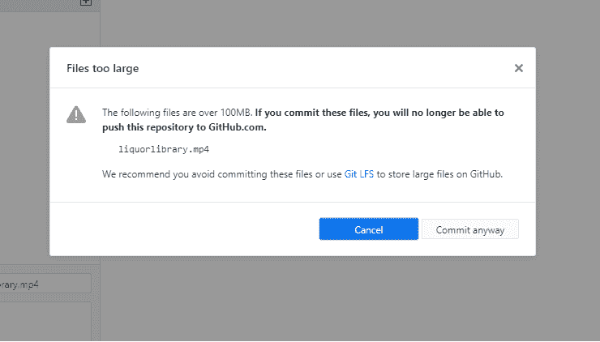
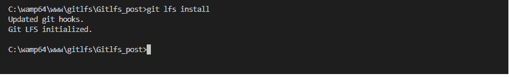
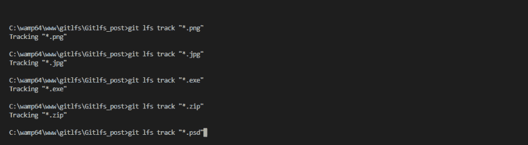
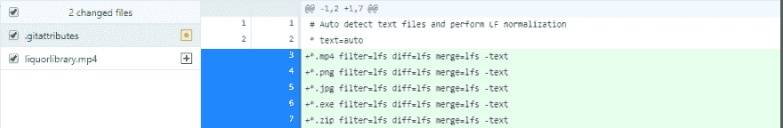

# Git LFS(大文件存储)_ 如何将超过 100MB 的文件提交到 Github？

> 原文：<https://dev.to/ham8821/git-lfs-large-file-storage-how-to-commit-files-over-100mb-to-github-4dkc>

由于我们正在开发一些静态网站，其中可能包括作品集，个人画廊网站等，当涉及到通过 git 进行版本控制时，我们有时必须处理存储问题，特别是对于视频和高质量的图片。下面的警告信息是我几天前在提交一个包含超过 100MB 视频的文件时收到的。

所以基本上，它说的是避免提交这些文件或者**使用 Git LFS 在 github 上存储大文件。 **等一下，什么是饭桶 LFS？****

### **首先，**什么是 **LFS **？****

LFS 代表大文件存储，这是 git 为大文件版本化提供的开源扩展。在这篇文章中，我想谈谈你可以采取的一些基本步骤，来正确而轻松地使用 LFS。

### **其次，**好了，怎么用 **LFS **？****

点击此处阅读更多文档。
[查看最新发布版本](https://github.com/git-lfs/git-lfs/releases/v2.8.0)

首先，让我们确保根据操作系统下载最新版本的 LFS。

在本地下载了 LFS 源文件后，我们可以转到我们的项目目录文件并执行下面几行。

如果您完成了为存储库安装 lfs，那么我们需要指定 lfs 将获取和跟踪的文件类型。在这种情况下，我试着上传这个“mp4”格式的视频文件。我想执行下面一行。

当然，取决于你的文件格式，它可能是这样的，

好吧！在指定了有问题的文件之后，我们就快到了，然后您将能够注意到 gitattribute 文件中的一些变化。
 
酷，那我们就继续把新的变化推送到 github 上，看看会发生什么吧！
如果你用的是 github 桌面，再简单不过了！您只需点击“提交给主服务器”按钮。否则，您也可以在终端中使用下面的代码行。

恭喜你！现在你的文件由 github lfs 管理！

### **最后，**我如何检查文件是否由 LFS 妥善管理？

如果您想仔细检查您的文件是否被 git lfs 正确地管理，以及您是否遗漏了什么，您还可以检查所有文件的列表。

### **总结**

今天，我们讨论了在 git 上处理较大文件的简单方法。当涉及到管理 github 上的项目工作流时，这将是非常有用的，因为有时，服务器存储在许多方面都是令人头疼的，而 lfs 的知识可以非常有助于避免这些问题！