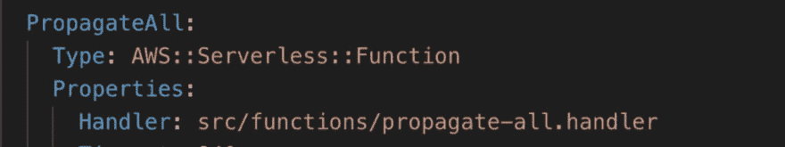
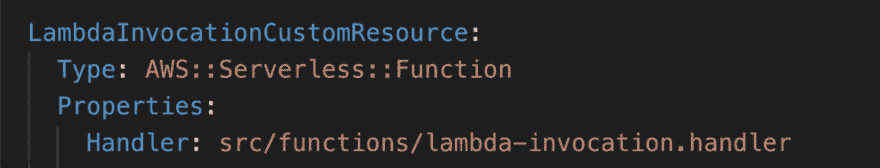

# 如何充分利用云计算定制资源的力量

> 原文：<https://dev.to/theburningmonk/how-to-use-the-power-of-cloudformation-custom-resources-for-great-good-3hl3>

**免责声明**:如果你是 CloudFormation 定制资源的新手，那么我建议你首先阅读亚历克斯·德布里的 [**这篇精彩的文章**](https://www.alexdebrie.com/posts/cloudformation-custom-resources/) 。

* * *

自定义资源为云形成带来了全新的维度，并支持一些有趣的用例。例如:

*   将 DataDog 仪表盘作为您的云架构堆栈的一部分进行调配
*   每次部署 CloudFormation 堆栈时运行负载测试
*   调配/修改 CloudFormation 本身不支持的 AWS 资源(例如 EventBridge)

您可以使用定制资源来运行一次性任务，作为每个 CloudFormation 部署的一部分。这是我想在我的许多 SAR 应用程序中做的事情，例如[这个](https://serverlessrepo.aws.amazon.com/applications/arn:aws:serverlessrepo:us-east-1:374852340823:applications~auto-subscribe-log-group-to-arn)和[这个](https://serverlessrepo.aws.amazon.com/applications/arn:aws:serverlessrepo:us-east-1:374852340823:applications~auto-set-log-group-retention)。然而，我一直认为这需要两个步骤:

1.  部署 SAR/CloudFormation 堆栈以提供定制资源 Lambda 功能
2.  部署使用自定义资源的目标 SAR 应用程序

**事实证明，我错了**。您可以将自定义资源 Lambda 函数包含在使用它的同一个 CloudFormation 堆栈中。事后看来，我想多了——本质上，我们所做的只是引用 ARN 的 Lambda 函数。你以后会明白这意味着什么。

我最新的 SAR 应用，[**propagate-cfn-tags**](https://github.com/lumigo-io/SAR-Propagate-CFN-Tags)，解决了 CloudFormation 不向 CloudWatch 日志组等一些资源传播其标签的问题。这意味着您不能将 CloudWatch 日志组包括在您的成本监控中(通过成本分配标签)，等等。

当您部署应用程序时，我想运行一个一次性脚本来处理该区域中所有现有的堆栈并传播它们的标签。这就是自定义资源的用武之地。

在定制资源的帮助下，我可以:

*   创建一个`PropagateAll` Lambda 函数来处理现有的 CloudFormation 堆栈

*   创建一个 Lambda 函数来支持一个`Custom::LambdaInvocation`定制资源类型

*   创建一个`Custom::LambdaInvocation`资源，在云形成部署期间触发`PropagateAll`功能

我可以在同一个 SAR 应用程序中完成所有这些操作。这为用户提供了无缝体验。对他们来说，你只需部署应用程序，一切都会像广告宣传的那样发生。无需两步部署流程，无需手动触发功能。

这个简单的模式与 CloudWatch 事件(或 EventBridge)结合得非常好:

*   用于更新现有资源的自定义资源(例如，传播现有云形成堆栈的标签)
*   CloudTrail +事件模式来处理未来的变化(例如，为未来的 CloudFormation 堆栈部署传播标签)

我发现这种组合在构建“平台”特性时特别有用。也就是说，跨越我在 AWS 中运行的所有应用程序的特性。例如，确保所有 CloudWatch 日志组都订阅了 Kinesis 流。这些不是应该在项目级别上采取的决策点。这就是为什么我不喜欢使用无服务器框架插件来配置这些设置。

嗨，我的名字是**崔琰**。我是一个 **[AWS 无服务器英雄](https://aws.amazon.com/developer/community/heroes/yan-cui/)** 和 [**量产无服务器**](https://bit.ly/production-ready-serverless) 的作者。我已经在 AWS 中运行了近 10 年的大规模生产工作负载，我是一名架构师或首席工程师，涉足从银行、电子商务、体育流媒体到移动游戏等多个行业。我目前是一名专注于 AWS 和无服务器的独立顾问。

你可以通过[邮箱](//mailto:theburningmonk.com)、[推特](https://twitter.com/theburningmonk)和 [LinkedIn](https://www.linkedin.com/in/theburningmonk/) 联系我。

雇用我。

帖子[如何利用云形成定制资源的力量做好事](https://theburningmonk.com/2019/09/how-to-use-the-power-of-cloudformation-custom-resources-for-great-good/)最早出现在 theburningmonk.com[的](https://theburningmonk.com)上。

