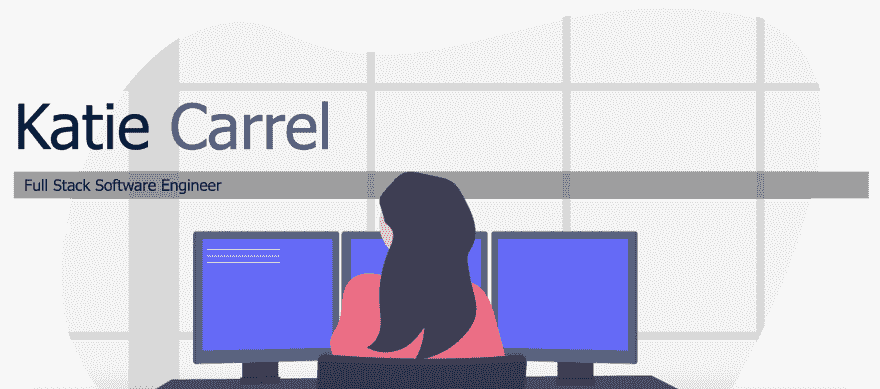

# 更新我的投资组合网站

> 原文：<https://dev.to/kcarrel/updating-my-portfolio-website-3gk1>

由于我一直在寻找难以捉摸的第一个软件工程师角色，我一直在征求朋友和导师对我的项目、简历和投资组合的反馈。有了在[我的投资组合网站](https://kcarrel.github.io/)上收集到的信息，我留出一些时间来重构我的投资组合网站:

到此:
 
这篇博文将回顾我原来的网站和我用来更新它的资源所发现的主要问题。

# 问题一:配色

我最初使用的原始颜色故事没有提供足够的对比度来获得视觉上的愉悦，或者在用户有视觉障碍的情况下，阅读起来可能更具挑战性。利用下面的资源，我找到了一个我喜欢的配色方案，并实现了我想要的对比效果！

使用的资源:

*   [土坯拾色器](https://color.adobe.com/explore/?filter=most-popular&time=month)
*   VisBug:在你的代码中改变它们之前，在浏览器中可视化它们！

# 问题二:原始背景图

我用于登陆页面的原始图片来自精彩的开源插图网站[未绘制的](https://undraw.co/illustrations)。虽然我喜欢 UnDrawn 的插图，但它并不符合我的设想，即提供对比来突出我想要显示的各种链接。因此，我四处寻找一个矢量图像，适合我正在寻找的配色方案，并且引人注目。

使用的资源:

*   [Vecteezy](https://www.vecteezy.com/)
*   [17 个免费矢量图像网站](https://www.justinmind.com/blog/17-places-to-get-free-vector-images-for-your-designs/)

# 问题三:作品集，关于我和简历隐藏在菜单中

在我的文件夹的第一次迭代中，我只在我的汉堡菜单中有这些页面的链接，而不是通过在主页上提供这些链接来使用户简单。

# 下次更新:可访问性得分

这第一次重构给我留下了一个组合站点，它的可访问性标准的总符合率大约为 87%,并且有明确的改进空间。使用下面的资源，我得到了分数和建议，来提高我现在正在做的网站的可访问性。你可能会问——什么是可访问性，为什么它很重要？在这种情况下，我建议你看看这个[友好的介绍](https://dev.to/maxwell_dev/the-web-accessibility-introduction-i-wish-i-had-4ope)。

正在使用的资源:

*   [检查您网站的可访问性](https://webaccessibility.com)
*   [W3:使网络可访问](https://www.w3.org/WAI/)

我希望这是有帮助的任何人寻找更新他们的投资组合网站！