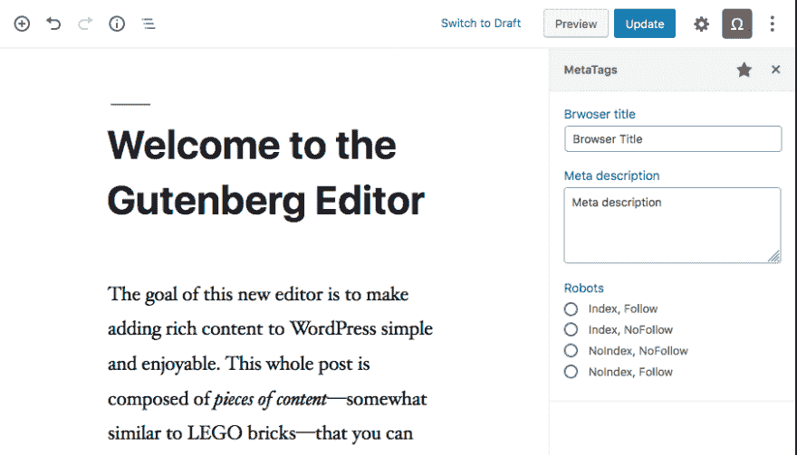

# 构建 Gutenberg 侧边栏插件第 1 部分:用(oop) php 注册插件

> 原文：<https://dev.to/vanaf1979/building-a-gutenberg-sidebar-plugin-part-1-registering-the-plugin-with-oop-php-mh5>

[最初于 2019 年 9 月 1 日发布在我的网站上](https://since1979.dev/making-a-gutenberg-sidebar-plugin-part-1-registering-the-plugin-with-oop-php/)

### 简介

在这篇由多个部分组成的文章中，我想向你展示如何开始构建 WordPress [Gutenberg](https://github.com/WordPress/gutenberg) 侧边栏插件，方法是开发一个简单的 SEO 标签编辑器侧边栏，名为“Metatags”，如下所示。

我知道...它看起来不是很花哨，但它将很好地涵盖开发侧边栏插件的核心原则。再加上审美其实不是这篇文章的重点。

#### 引用完的项目

我为完成的项目创建了一个 [GitHub 库](https://github.com/vanaf1979/gb-plugin-tutorial)作为这些文章的参考。如果你想查看的话，你可以在(本地)WordPress 安装中下载并激活它。

### 向(Oop) Php 注册插件

在第一篇文章中，我们将使用 Php ( [singleton](https://en.wikipedia.org/wiki/Singleton_pattern) )类向 WordPress 注册插件。如果你不熟悉在 Php 中使用 [Oop](https://www.php.net/manual/en/language.oop5.php) ，我真的可以推荐你阅读一些它的原理，但是你应该能够理解。

要开始，像任何 WordPress 插件一样，我们需要一个全新的 WordPress 安装，我们需要在 */wp-content/plugins* 中创建一个新文件夹。对于这个项目，我们将这个文件夹命名为“metatags”。

在我们新的*元标签文件夹*中，我们需要创建一个名为【metatags.php】*的新文件。这个文件将被 WordPress 自动检测，它将作为我们插件的入口点。*

 *为了让我们的插件开始运行，将下面的代码粘贴到新的*metatags.php**