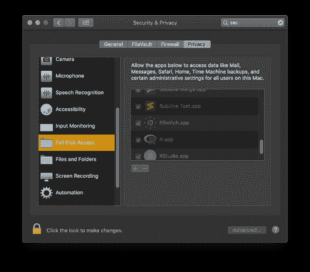
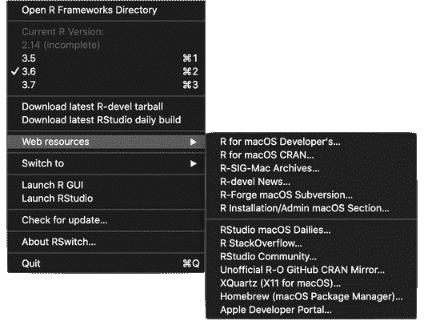

# RSwitch 1.4.1 已发布

> 原文：<https://dev.to/hrbrmstr/rswitch-1-4-1-released-4lnb>

对 [RSwitch](https://rud.is/rswitch) 的小更新已经发布。除了一些内部代码重组，还有三个面向用户的变化。

第一，RSwitch 现在[公证](https://developer.apple.com/documentation/security/notarizing_your_app_before_distribution)！这意味着你不会收到来自“不明开发者”的通知，Catalina 上的人也不会看到无法检查恶意软件下载的警告。您可以使用 [{macthekinfe}](https://git.rud.is/hrbrmstr/mactheknife) 查看申请签名和公证信息:

```
check_sig("/Applications/RSwitch.app") %>% 
  print(n=nrow(.))
## # A tibble: 25 x 2
## key value                                                               
## <chr> <chr>                                                               
## 1 Executable /Applications/RSwitch.app/Contents/MacOS/RSwitch                    
## 2 Identifier is.rud.bob.RSwitch                                                  
## 3 Format app bundle with Mach-O thin (x86_64)                                
## 4 CodeDirectory v 20500 size=1342 flags=0x10000(runtime) hashes=33+5 location=embedded
## 5 VersionPlatform 1                                                                   
## 6 VersionMin 658944                                                              
## 7 VersionSDK 659200                                                              
## 8 Hash type sha256 size=32                                                      
## 9 CandidateCDHash sha256 efa512a9daabfb9402af8a91697f008b89ffa81e                            
## 10 CandidateCDHashFull sha256 efa512a9daabfb9402af8a91697f008b89ffa81ea014452821e39a5365d80fe6    
## 11 Hash choices sha256                                                              
## 12 CMSDigest efa512a9daabfb9402af8a91697f008b89ffa81ea014452821e39a5365d80fe6    
## 13 CMSDigestType 2                                                                   
## 14 Page size 4096                                                                
## 15 CDHash efa512a9daabfb9402af8a91697f008b89ffa81e                            
## 16 Signature size 8968                                                                
## 17 Authority Developer ID Application: Bob Rudis (CBY22P58G8)                    
## 18 Authority Developer ID Certification Authority                                
## 19 Authority Apple Root CA                                                       
## 20 Timestamp Sep 1, 2019 at 08:46:41                                             
## 21 Info.plist entries 26                                                                  
## 22 TeamIdentifier CBY22P58G8                                                          
## 23 Runtime Version 10.15.0                                                             
## 24 Sealed Resources version 2 rules=13 files=26                                                 
## 25 Internal requirements count 1 size=212

check_notarization("/Applications/RSwitch.app")
## # A tibble: 4 x 2
## key value                                           
## <chr> <chr>                                           
## 1 application /Applications/RSwitch.app                       
## 2 status accepted                                        
## 3 source Notarized Developer ID                          
## 4 origin Developer ID Application: Bob Rudis (CBY22P58G8) 
```

<svg width="20px" height="20px" viewBox="0 0 24 24" class="highlight-action crayons-icon highlight-action--fullscreen-on"><title>Enter fullscreen mode</title></svg> <svg width="20px" height="20px" viewBox="0 0 24 24" class="highlight-action crayons-icon highlight-action--fullscreen-off"><title>Exit fullscreen mode</title></svg>

注意:您*可能*(我正在将它安装在一个新的 Catalina 虚拟机中以明确了解)需要确保 RSwitch 在系统偏好设置- >安全&隐私- >【隐私】选项卡中被授予“完全磁盘访问”权限，以确保它可以在需要的地方运行:

[](https://i2.wp.com/rud.is/b/wp-content/uploads/2019/09/rswitch-fda-01.png?ssl=1) 

接下来，由于在给定的`/Library/Frameworks/R.framework/Versions/#.#`路径中可能有旧的一组 just 包库，但在所述位置中没有 R 二进制文件，所以脚本现在做了 [R Core RSwitch 应用程序](http://svn.rforge.net/osx/trunk/RSwitch/)(西蒙好心地转发了 R-Forge SVN 的 web 链接)所做的事情，并执行一些额外的验证，以查看给定的 R 版本目录是否确实可切换到。不可切换的目录会显示出来，但会变灰(如下图所示)并标记为“不完整”。你也许应该清理一下那些旧小路。

[](https://i2.wp.com/rud.is/b/wp-content/uploads/2019/09/rswitch-1.4.1.png?ssl=1)

最后，在同一张图片上，敏锐的观察者会看到更多相关链接被添加到“书签”中。我添加它们是因为我在研究 R 相关的东西时经常用到它们。

运行 1.4.0 的人应该可以使用“检查更新…”菜单项来访问发布页面。您也可以从 [RSwitch 登陆页面](https://rud.is/rswitch/)获取或直接通过:【https://rud.is/rswitch/releases/RSwitch-1.4.1.app.zip】T2 下载。

### 鳍

RSwitch 认为功能已经完成，所以开发和发布的速度可能会慢一点。一些漂亮的人提供了一个新的应用程序图标和一个请求，以便更容易地在运行 RStudio/R GUI 实例之间切换，我正在努力将这些想法融入到应用程序中。如果你有问题、疑问或功能需求，一定要在你最喜欢的社交编码网站上提出问题。在 [RSwitch 登录页面](https://rud.is/rswitch/)的底部，可以找到 RSwitch 源代码的链接，以提交所述问题。