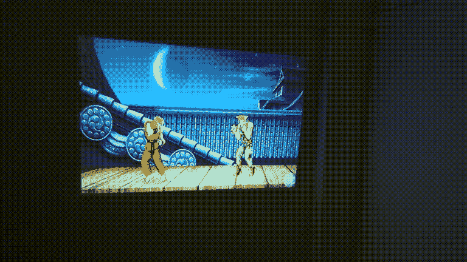
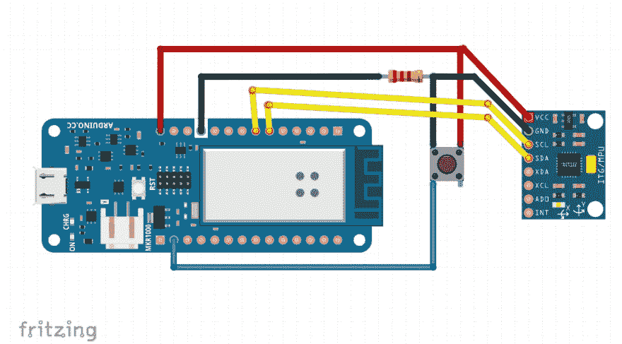

# 使用 Arduino 和 Tensorflow.js 通过身体动作玩街头霸王

> 原文：<https://dev.to/devdevcharlie/play-street-fighter-with-body-movements-using-arduino-and-tensorflow-js-4kbi>

在过去的一年里，我一直在学习更多关于机器学习的知识。我已经做了一些浏览器实验，但最近，我花了一些时间将机器学习与我的另一个爱好硬件结合起来！

下面的教程是关于我如何使用 Arduino 和 [Tensorflow.js](https://www.tensorflow.org/js) 制作手势识别系统的原型。

这只是第一个版本，还处于实验阶段。

接下来的内容涵盖了我构建它的主要步骤，以及一些代码示例。如果你想看完整的代码，你可以查看 Github repo，但是你要知道，在接下来的几个月里，我会对它进行相当多的修改。

我认为最重要的是要理解要采取的步骤，而不是所有需要的代码。

* * *

# 演示

这个原型是关于训练一个机器学习模型来识别身体运动，如“出拳”或“hadoken”，以与街头霸王的网页游戏进行互动。

最终结果如下所示:

[](https://res.cloudinary.com/practicaldev/image/fetch/s--mzP6sMVu--/c_limit%2Cf_auto%2Cfl_progressive%2Cq_66%2Cw_880/https://thepracticaldev.s3.amazonaws.com/i/uhcqh7h1cvuujewtd1qd.gif)

*这个项目的灵感来自[一个类似的](https://blog.mgechev.com/2018/10/20/transfer-learning-tensorflow-js-data-augmentation-mobile-net/)由[明科·格切夫](https://twitter.com/mgechev)使用网络摄像头*

* * *

# 所需材料

为了建造它，我们需要一些硬件。我在原型中使用的工具包括:

*   Arduino MKR1000 (其他型号也可以)
*   [加速度计/陀螺仪(MPU6050)](https://www.sparkfun.com/products/11028)
*   纽扣
*   跳线
*   电池

我还使用了一个试验板来把所有的东西放在一起，但如果你决定焊接它，你可能需要一个原型板来代替。

在技术堆栈方面，我使用了:

*   普通 Javascript
*   Tensorflow.js
*   节点. js
*   强尼五号
*   Web 套接字

* * *

# 第一步:收集数据

如果从零开始，我们只有我们的想法:用身体动作玩街霸。现在，我们需要考虑如何实现这一点...

为了能够建立一个分类器，我们需要数据。这些数据将来自我们手中的一些硬件。

为了获得数据，我们需要从组装组件开始。

它应该是这样的:

[](https://res.cloudinary.com/practicaldev/image/fetch/s--eynvU2cF--/c_limit%2Cf_auto%2Cfl_progressive%2Cq_auto%2Cw_880/https://thepracticaldev.s3.amazonaws.com/i/e3eq8rpx2kydb8z8qyl5.png)

我使用的微控制器是 Arduino MKR1000。我选择这个型号是因为我家里已经有了它，它内置了 wifi，这意味着我不必绑在笔记本电脑上记录手势。你也可以尝试使用 Arduino Uno，但你必须一直拴在笔记本电脑上，这对于这个特定的原型来说并不理想，但它仍然是有用的。

第二个主要部分是加速度计/陀螺仪。我使用了一个 MPU6050，它可以让你获得 x，y 和 z 轴上的加速度数据，以及 x，y 和 z 轴上的旋转数据，总共给你 6 个点的数据。

最后，我还使用了一个按钮，因为我想只在执行某个手势时记录数据。这样，我就可以只在按下按钮和执行“打孔”时记录数据。

现在我们已经组装好了硬件，我们需要编写代码来获取这些数据。

为此，我使用 Johnny-Five 框架在我的计算机和 Arduino 之间用 JavaScript 进行通信。

代码看起来像这样:

```
const EtherPortClient = require("etherport-client").EtherPortClient;
const five = require('johnny-five');
const fs = require('fs');

const board = new five.Board({
    port: new EtherPortClient({
      host: "192.168.1.113", //Your Arduino IP goes here
      port: 3030
    }),
    timeout: 1e5,
    repl: false
});

board.on("ready", function() {
    const button = new five.Button("A0");

    let stream = fs.createWriteStream(`data/sample_punch_0.txt`, {flags: 'a'});

    const imu = new five.IMU({
        pins: [11,12], // connect SDA to 11 and SCL to 12
        controller: "MPU6050"
    });

    imu.on("data", function() {
        let data = `${this.accelerometer.x}  ${this.accelerometer.y}  ${this.accelerometer.z}  ${this.gyro.x}  ${this.gyro.y}  ${this.gyro.z}`;

        button.on("hold", () => stream.write(`${data} \r\n`));
    });

    button.on("release", () => stream.end());
}); 
```

在上面的代码示例中，我们首先需要我们需要的 Node.js 模块，我们用 Arduino 的 IP 地址以及它将要通信的端口来设置我们的板。然后，当电路板准备就绪时，我们设置按钮 MPU6050 传感器，并创建一个流，以便将所有数据写入一个文件。当我们从传感器获取数据时，我们将数据存储在一个变量中，当我们按住按钮时，我们将数据写入上面声明的文件中。最后，当我们释放按钮时，我们关闭了我们的流，这意味着我们不再向这个特定的文件写入数据。

此代码示例涵盖了如何将数据写入单个手势示例的文件，但是，对于每个手势，我们需要记录多个示例，因此您必须修改此文件以记录打孔示例 2、打孔示例 3、打孔示例 4 等...

在记录手势数据的这一步之后，我们需要进入第二步才能使用它，这一步是数据处理。

* * *

# 第二步:数据处理

目前，我们所有的是一个装满传感器数据文件的文件夹，应该是这样的:

```
0.40205128205128204 0.019145299145299145 -4.384273504273504 0.06110144116383567 -0.27059209658270084 0.3578798696738946
-0.13401709401709402 -0.5743589743589743 -3.561025641025641 0.008728777309119381 -0.3578798696738946 0.6546582981839536
-1.3210256410256411 -0.47863247863247865 -3.1398290598290597 -0.22694821003710391 -0.026186331927358142 0.8117762897481025
-1.7230769230769232 -0.1723076923076923 -2.9675213675213676 -0.6895734074204312 0.183304323491507 0.20949065541886513
-1.3593162393162392 -0.4211965811965812 -3.024957264957265 -0.9252503947666544 0.21821943272798452 -0.28804965120093956
-1.4167521367521367 -0.5360683760683761 -2.7377777777777776 -0.9601655040031319 0.3229647604374171 -0.1396604369459101
-2.201709401709402 -0.22974358974358974 -2.3165811965811964 -1.0125381678578482 0.45389642007420783 0.1309316596367907
-3.1015384615384614 0.09572649572649572 -1.7996581196581196 -1.1958424913493553 0.6721158528021923 0.06110144116383567 
-3.2164102564102564 0.6892307692307692 -1.435897435897436 -1.483892142550295 1.0125381678578482 -0.08728777309119382 
-3.407863247863248 1.6464957264957265 -1.1678632478632478 -1.7195691298965181 1.187113714040236 -0.24440576465534267 
-3.963076923076923 1.991111111111111 -0.7466666666666667 -1.8766871214606669 1.1347410501855195 -0.21821943272798452 
-5.322393162393162 4.1928205128205125 1.1678632478632478 -2.2869396549892778 1.9290597853153832 0.39279497891037213 
-5.264957264957265 6.337094017094017 1.9336752136752138 -2.609904415426695 2.3043972096075165 -0.07855899578207443 
-4.843760683760684 7.275213675213675 2.508034188034188 -2.8455814027729183 2.356769873462233 -0.8554201762936994 
-4.5948717948717945 7.102905982905983 3.063247863247863 -2.976513062409709 2.496430310408143 -1.1521986048037582
-2.1442735042735044 9.649230769230769 3.6184615384615384 -3.4478670371021556 3.1685461632103356 -0.6546582981839536 
```

为了能够使用它，我们将不得不从这些文件中读取数据，并转换它，以便它可以被 Tensorflow.js 使用。

## 1。从文件中读取数据

我不打算通过代码来做到这一点，因为我认为许多其他博客帖子之前已经涵盖了它，我相信如果你需要这样做，你可以找到它。

主要目标是遍历我们的数据文件夹中的每个数据文件，逐行读取并将我们的数据从上面的格式转换为一个对象数组。

我们希望我们的数据看起来像这样:

```
{ features:
   [ -0.11487179487179487, 9.63008547008547, -4.345982905982906, -0.22694821003710391, 0.04364388654559691, 0.5586417477836404, -0.07658119658119658, 9.074871794871795, -4.7671794871794875,0.11347410501855196, 0.08728777309119382, 0.8990640628392963,
-0.7658119658119658, 9.744957264957264, -4.288547008547009, 0.052372663854716284, -0.1309316596367907, 0.7768611805116249, -1.3784615384615384, 9.610940170940172, -3.790769230769231, -0.017457554618238762, -0.2618633192735814, 0.34915109236477526,
-2.4697435897435898, 9.725811965811966, -3.6567521367521367, -0.10474532770943257, -0.17457554618238763, -0.034915109236477525, -3.58017094017094, 9.898119658119658,
-3.9056410256410254, -0.07855899578207443, -0.06983021847295505, -0.296778428510059,     -4.7097435897435895, 9.993846153846153, -3.9247863247863246, -0.07855899578207443,
-0.04364388654559691, -0.5411841931654017, -6.04991452991453, 10.08957264957265,
-3.9439316239316238, -0.06110144116383567, 0.034915109236477525,-0.6459295208748342, 
... 260 more items ],
  label: 1 } 
```

我们在这里做的是从名为`sample_punch_0.txt`的文件中的行到我们可以开始处理的东西。
特征阵列代表单个手势样本的数据，标签代表手势的名称。

我们不希望与字符串一起工作，所以如果我们想训练 3 种不同的手势，我们可以有一个手势数组['hadoken '，' punch '，' upercut ']。在这种情况下，标签 1 将映射到“打孔”。

我们需要对所有的数据文件都这样做，所以最后，我们会有一个手势对象的大数组，就像这样:

```
[
{ features:
   [ -0.11487179487179487, 9.63008547008547, -4.345982905982906, -0.22694821003710391, 0.04364388654559691, 0.5586417477836404, -0.07658119658119658, 9.074871794871795, -4.7671794871794875,0.11347410501855196, 0.08728777309119382, 0.8990640628392963,
... 530 more items ],
  label: 1 },
{ features:
   [ -0.11487179487179487, 9.63008547008547, -4.345982905982906, -0.22694821003710391, 0.04364388654559691, 0.5586417477836404, -0.07658119658119658, 9.074871794871795, -4.7671794871794875,0.11347410501855196, 0.08728777309119382, 0.8990640628392963,
... 530 more items ],
  label: 0 },
{ features:
   [ -0.11487179487179487, 9.63008547008547, -4.345982905982906, -0.22694821003710391, 0.04364388654559691, 0.5586417477836404, -0.07658119658119658, 9.074871794871795, -4.7671794871794875,0.11347410501855196, 0.08728777309119382, 0.8990640628392963,
... 530 more items ],
  label: 2 },
{ features:
   [ -0.11487179487179487, 9.63008547008547, -4.345982905982906, -0.22694821003710391, 0.04364388654559691, 0.5586417477836404, -0.07658119658119658, 9.074871794871795, -4.7671794871794875,0.11347410501855196, 0.08728777309119382, 0.8990640628392963,
... 530 more items ],
  label: 2 },
...
] 
```

现在，我们已经将所有文件转换为标签和特征对象。

但是，这还不能用于 Tensorflow。我们需要不断地将我们的数据转换成框架可以使用的东西。

## 2。格式化数据

在这个阶段，我们将开始把我们的对象转换成两个数组。一个用于标签，一个用于特征。

我们的目标大概是:

```
// labels
[ [ 0, 0, 0, 0, 0, 0, 0, 0, 0, 0, 0, 0, 0, 0, 0, 0, 0, 0, 0, 0, 0 ],
  [ 1, 1, 1, 1, 1, 1, 1, 1, 1, 1, 1, 1, 1, 1, 1, 1, 1, 1, 1, 1, 1 ],
  [ 2, 2, 2, 2, 2, 2, 2, 2, 2, 2, 2, 2, 2, 2, 2, 2, 2, 2, 2, 2, 2 ] ]

// features
[ 
  [ 
    [ 5.686153846153847, ... 400 more items ], [ 9.285470085470086,... 200 more items ], ... 
  ],
  [ 
    [ 5.686153846153847, ... 400 more items ], [ 9.285470085470086,... 200 more items ], ... 
  ],
  [ 
    [ 5.686153846153847, ... 400 more items ], [ 9.285470085470086,... 200 more items ], ...
  ],
] 
```

使用上面的格式，我们将标注和要素分开，但它们仍然相互映射。我的意思是，标签数组的第一层代表所有标签为 0 的手势(例如“hadoken”)，而特征数组的第一层代表我们的 hadoken 手势的所有数据。

同样，我没有展示如何实现的代码，因为到目前为止，它与 Tensorflow.js 没有任何特定的关系。我们所做的就是使用 JavaScript 数组方法将数据从文件中的行转换为对象，再转换为多维数组。

现在，我们真的很接近 Tensorflow 可以使用的东西了，除了框架使用一种叫做 **Tensors** 的特殊数据结构。

## 3。转换为张量

这是我们开始使用特定 Tensorflow.js 代码的地方。使用内置方法，我们将把数组转换成张量。

为此，这里有一个代码示例:

```
function convertToTensors(featuresData, labelData) {
  // we start by shuffling our data so our model doesn't get used to the way we feed it data.
  const [shuffledFeatures, shuffledLabels] = shuffleData(featuresData, labelData);

  // numSamplesPerGesture is the number of times we trained a single gesture (e.g. we trained the "punch" gesture 20 times)
  // totalNumDataPerFile is the number of data points we take into consideration per gesture. If we only consider the first 50 lines of a data file, 50 * 6 points of data = 300; 
  const featuresTensor = tf.tensor2d(shuffledFeatures, [numSamplesPerGesture, totalNumDataPerFile]); 

  // 1D tensor for labels & convert them from the set [0, 1, 2] into one-hot encoding (.e.g., 0 --> [1, 0, 0]). 
  // e.g: punch at index 0 ⇒ [1,0,0], hadoken at index 1 ⇒ [0,1,0], 
  const labelsTensor = tf.oneHot(tf.tensor1d(shuffledLabels).toInt(), numClasses);
} 
```

现在我们有了一个标签张量和一个特征张量。我们几乎准备好训练我们的模型了！但是首先，最后一步是在训练集和测试集之间拆分数据。

## 4。剧烈的

考虑到上面的代码示例，我们需要将标签和特征张量分成一个训练和测试集。

我们这样做的原因是因为我们想要使用我们的集合的大约 80%来训练模型，而剩余的 20%来验证我们的模型的预测。

```
const numTestExamples = Math.round(numSamplesPerGesture * 0.2); // 20% 
const numTrainExamples = numSamplesPerGesture - numTestExamples; // 80%

// Split between training set and test set.
const trainingFeatures = featuresTensor.slice([0, 0], [numTrainExamples, totalNumDataPerFile]);

const testingFeatures = featuresTensor.slice([numTrainExamples, 0], [numTestExamples, totalNumDataPerFile]);

const trainingLabels = labelsTensor.slice([0, 0], [numTrainExamples, numClasses]);

const testingLabels = labelsTensor.slice([numTrainExamples, 0], [numTestExamples, numClasses]);

return [trainingFeatures, trainingLabels, testingFeatures, testingLabels]; 
```

现在我们已经有了标签和特征的训练和测试张量，我们准备创建我们的模型。

* * *

# 训练模型

创建模型是一个比前面的步骤更具实验性的步骤。你的模型可以用许多不同的方法建立，你可以用参数、神经网络的层数、你想要经历的时期(步骤)数等等来玩游戏...

创建正确的模型没有固定的方法。当您更改参数时，您应该会看到模型的准确性和预测的变化，并且一旦达到您满意的准确性水平，您可以决定停止调整。

我当前的模型是这样创建的:

```
const createModel = async (trainingFeatures, trainingLabels, testFeatures, testLabels) => {
   const params = { learningRate: 0.1, epochs: 40 };
   const model = tf.sequential();
   model.add(tf.layers.dense({ units: 10, activation: 'sigmoid', inputShape: [trainingFeatures.shape[1]] }));
   model.add(tf.layers.dense({ units: 3, activation: 'softmax' }));

   const optimizer = tf.train.adam(params.learningRate);

   model.compile({
       optimizer: optimizer,
       loss: 'categoricalCrossentropy',
       metrics: ['accuracy'],
   });

   await model.fit(trainingFeatures, trainingLabels, {
       epochs: params.epochs,
       validationData: [testFeatures, testLabels],
   });

   await model.save(’file://model’);
} 
```

此代码示例的最后一行将模型保存为应用程序中的一个文件。这样，您可以将它用于最后一步，预测新的数据样本！

* * *

# 利用模型进行预测

现在，我们的训练过程已经完成，我们的模型已经准备好用于在“hadoken”、“punch”和“uppercut”之间对新样本进行分类。

```
const tf = require('@tensorflow/tfjs-node');
let liveData = [];
let model;
const gestureClasses = ['hadoken', 'punch', 'uppercut'];

const init = async () => {
   model = await tf.loadLayersModel('file://model/model.json');
}

// similar step to the recording process
imu.on("data", function() {
   button.on("hold", () => {
       let data = {xAcc: this.accelerometer.x, yAcc: this.accelerometer.y, zAcc: this.accelerometer.z,
                  xGyro: this.gyro.x, yGyro: this.gyro.y, zGyro: this.gyro.z};

       if (liveData.length < numValuesExpected){
           liveData.push(data.xAcc, data.yAcc, data.zAcc, data.xGyro, data.yGyro, data.zGyro)
       }
   });

   button.on("release", function(){
     predict(model, liveData);
     liveData = [];
   });
});

const predict = (model, newSampleData) => {
   tf.tidy(() => {
       // the live data we get is just an array of numbers. We also need to transform it to a tensor so the model can use it.
       const input = tf.tensor2d([newSampleData], [1, 300]);
       const prediction = model.predict(input);
       // the prediction will come back as an index, the same as our labels in our data set.
       const gesturePredicted = gestureClasses[prediction.argMax(-1).dataSync()[0]];

    console.log(gesturePredicted) // either punch, hadoken or uppercut;
    });
} 
```

使用上面的代码示例，我们在按住按钮并执行我们训练的多个手势之一时获得实时数据。一旦我们释放按钮，我们就用这个模型从未见过的新样本运行我们的`predict`函数。我们得到一个索引，可以在我们的`gestureClasses`数组中使用它来得到预测的手势。

我们完事了。🎉

* * *

# 加贺

正如我在本教程开始时所说的，最重要的是理解如果你想构建类似的东西，你需要经历的步骤。如果你不完全理解代码，完全没关系！

需要知道的一件很酷的事情是，首先，你需要一种获取数据的方法，但这并不一定涉及 Arduino。我用一个 Daydream 控制器创建了这个项目的一个版本...一部手机！

大多数现代手机都有内置的加速度计和陀螺仪，可以用来收集这类实验的数据。代码需要做一些改动，因为你需要使用**通用传感器 API** ，看起来像是:

```
let gyroscope = new Gyroscope({frequency: 60});

gyroscope.addEventListener('reading', e => {
   // gyroscope.x;
   // gyroscope.y;
   // gyroscope.z;
});
gyroscope.start();

let accelerometer = new Accelerometer({frequency: 60});

accelerometer.addEventListener('reading', e => {
   // accelerometer.x;
   // accelerometer.y;
   // accelerometer.z;
});
accelerometer.start(); 
```

如果你想尝试一下，[这里有一个演示](https://bit.ly/sf-ml)，你可以在[这个回购](https://github.com/charliegerard/gestures-ml-js)中找到代码。

* * *

随着我一点一点地改进代码并最终构建其他实验，我可能会再写一篇文章:)

感谢阅读！💚