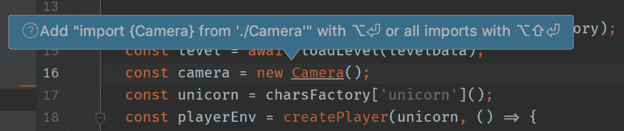
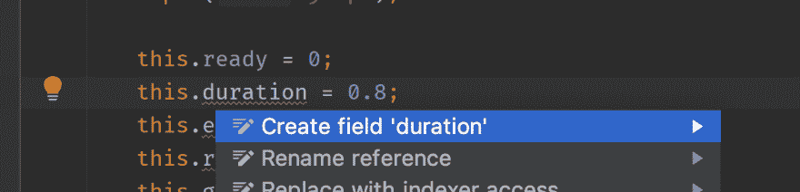

# 逃跑计划乐队(从 JS 到 TS) -简单项目-第一部分

> 原文：<https://dev.to/obenjiro/escape-plan-from-js-to-ts-simple-project-part-1-55n3>

这里有一个简单的逃脱计划，可以帮助你从旧的代码库转移到现代的类型脚本。这个计划可能对你的项目不起作用，但至少你可以把它作为一个好的起点。

1)将`.js`文件移动到`src`文件夹(如果还没有)

2)对于非常旧的代码库(ES3/ES5)，应用 Lebab([https://lebab.unibtc.me/](https://lebab.unibtc.me/))。Lebal 是一款出色的工具，可以自动更新您的代码库 ES3/ES5 = > ES2015/2016。

```
npx lebab --replace src/ --transform let,class,arrow,arrow-return,commonjs,template,obj-method,obj-shorthand ,for-of,for-each,arg-rest,arg-spread 
```

<svg width="20px" height="20px" viewBox="0 0 24 24" class="highlight-action crayons-icon highlight-action--fullscreen-on"><title>Enter fullscreen mode</title></svg> <svg width="20px" height="20px" viewBox="0 0 24 24" class="highlight-action crayons-icon highlight-action--fullscreen-off"><title>Exit fullscreen mode</title></svg>

3)将 JS 文件的扩展名重命名为 TS 文件

```
for file in src/**/*.js; do mv "$file" "${file%.*}.ts"; done 
```

<svg width="20px" height="20px" viewBox="0 0 24 24" class="highlight-action crayons-icon highlight-action--fullscreen-on"><title>Enter fullscreen mode</title></svg> <svg width="20px" height="20px" viewBox="0 0 24 24" class="highlight-action crayons-icon highlight-action--fullscreen-off"><title>Exit fullscreen mode</title></svg>

4)使用 Webpack CLI 创建 webpack 配置。当被问及
时，不要忘记选择 TS

```
npx webpack-cli init 
```

<svg width="20px" height="20px" viewBox="0 0 24 24" class="highlight-action crayons-icon highlight-action--fullscreen-on"><title>Enter fullscreen mode</title></svg> <svg width="20px" height="20px" viewBox="0 0 24 24" class="highlight-action crayons-icon highlight-action--fullscreen-off"><title>Exit fullscreen mode</title></svg>

5)在项目的根目录下创建 tsconfig.json。这是一个宽松的配置，将帮助您快速启动。暂时可以了。

```
{
  "compilerOptions": {
    "allowSyntheticDefaultImports": true,
    "resolveJsonModule": true,
    "downlevelIteration": true,
    "lib": ["es2015", "dom"],
    "module": "es6",
    "target": "es5",
    "allowJs": true,
    "strict": false
  },
  "include": [
    "src/**/*"
  ],
  "exclude": [
    "node_modules"
  ]
} 
```

<svg width="20px" height="20px" viewBox="0 0 24 24" class="highlight-action crayons-icon highlight-action--fullscreen-on"><title>Enter fullscreen mode</title></svg> <svg width="20px" height="20px" viewBox="0 0 24 24" class="highlight-action crayons-icon highlight-action--fullscreen-off"><title>Exit fullscreen mode</title></svg>

6)如果您的代码库没有任何 import/require 语句(您使用了全局范围和文件连接)。将导出添加到所有顶级函数和类中，这将帮助我们进行下一步。

```
find src/ -name "*.ts" -exec sed -i '' "s/^function/export function/g;s/^class/export class/g" {} \; 
```

<svg width="20px" height="20px" viewBox="0 0 24 24" class="highlight-action crayons-icon highlight-action--fullscreen-on"><title>Enter fullscreen mode</title></svg> <svg width="20px" height="20px" viewBox="0 0 24 24" class="highlight-action crayons-icon highlight-action--fullscreen-off"><title>Exit fullscreen mode</title></svg>

7)使用现代 IDE (WebStorm，VSCode)。修复缺失的导入和属性声明。在任何其他难以解决的情况下使用`any`。不要担心。我们将在下一篇文章中解决这个问题。重复直到`npm run build`停止报告错误。

[](https://res.cloudinary.com/practicaldev/image/fetch/s--uchSne9_--/c_limit%2Cf_auto%2Cfl_progressive%2Cq_auto%2Cw_880/https://thepracticaldev.s3.amazonaws.com/i/nz9cqpmqtp0h32wlt0nw.png)

[](https://res.cloudinary.com/practicaldev/image/fetch/s--Hyv-aE4e--/c_limit%2Cf_auto%2Cfl_progressive%2Cq_auto%2Cw_880/https://thepracticaldev.s3.amazonaws.com/i/dsotzfcvarpo5qk8dxik.png)

8)盈利！

# 现实世界的例子

我用这个计划修改了一个名为《独角兽行动者》的游戏。如果您对该计划如何改变基于代码感兴趣:

这是[之前的代码 https://github . com/oben Jiro/unicorn-runner/tree/FCCC 2 f 57470 DDE 0 f 76850522 C3 e 7 e 6 Abe 8157789](https://github.com/obenjiro/unicorn-runner/tree/fccc2f57470dde0f76850522c3e7e6abe8157789)

这是在[https://github . com/oben Jiro/unicorn-runner/tree/88157915758 C4 c270 fa 64 CD 4 FD 2427 a 68 bcba 7 a](https://github.com/obenjiro/unicorn-runner/tree/88157915758c4c270fa64ccd4fd2427a68bcba7a)之后

# 关于#2 部分

在下一部分，我将告诉你如何自动添加缺少的类型，并使你的`tsconfig.json`更严格一些:)