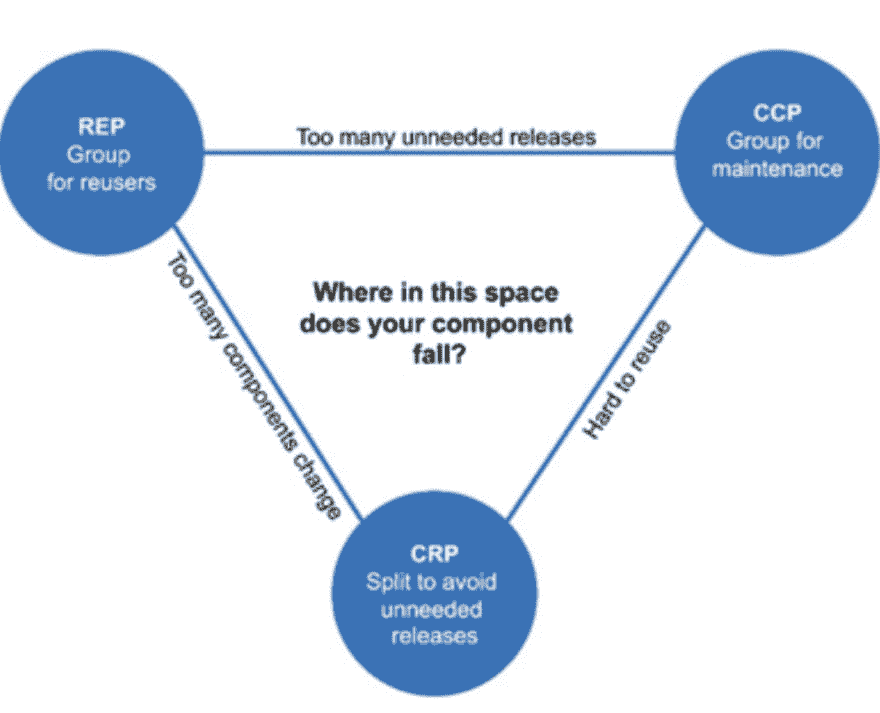

# 版本控制和建立依赖关系的正确方法

> [https://dev . to/earrooron/la-正确的版本化和建立-相关性-4499](https://dev.to/earroyoron/la-forma-correcta-de-versionar-y-establecer-dependencias-4499)

在定义项目结构时，如何建立依存关系和关系是一个关键步骤。你必须知道并遵守一些重要的规则，如果你不遵守，你必须意识到你作出这个决定的原因以及你可能面临的问题。

以「任何方式」建立专案可能会导致交叉相依性问题、奇怪的建置流程、因无法重复使用而重复执行的程式码，甚至会导致服务依赖于不应该造成后续非常复杂错误的项目。

本文采用了
罗伯特 c 的《清洁建筑》一书中的定义。"马丁"。

# 三项原则

*   保持部署版本一致性
*   保持公共封闭性(common-closure)
*   再利用的原则

## 在部署中按用途保持等值

(重用/发布等效原则)

*复用的颗粒就是释放的颗粒*

作为第一条*一般原则*我们必须说“同一调度中的类和模块必须具有相同的版本，而且还必须在同一文档版本中一起保存，因为这样才能保持作者和用户的一致性。”。

你应该注意到，我所说的“原则”并不是封闭的法律，你可以有自己的例外，但要注意，使用和部署原则的例外情况看起来很快，而且“唱”很多，所以你必须准备好知道如何解释你这样做的理由。

假如你建一个 maven 项目，其中父母是:

```
io.earroyoron:parent:1.0.0
|
 \__ io.earroyoron:moduleA:1.3.3
| 
 \__ io.earroyoron:moduleB:1.5.0 
```

但它包含两个模块，并且在控制模块时会生成两个对象:

`io.earroyoron:moduleA:1.3.3`
y
`io.earroyoron:moduleB:1.5.0`

你违反了这个美丽的原则，正在组装一个美丽的版本可可。

因为如果您对模块 oB 进行了更改，您将需要部署模块 b 的新版本(可能是 2.0.0，因为这是一个中断了兼容性的更改)，并且父模块中会有版本？如 1.0.0？没有意义，因为 modulob 在一个不同的专业中。∞1 . x . x？不，模块 a 不在那个*主要版本*

一般而言，除非常非常非常明确的情况外，父母及其子女必须具有相同的版本:

```
io.earroyoron:parent:1.0.0
|
 \__ io.earroyoron:moduleA:<parent-version>
| 
 \__ io.earroyoron:moduleB:<parent-version> 
```

## 保持一套通用

(普通闭合原理)

将那些因相同原因和相同时间而改变的类聚集成组件。将那些在不同时间因不同原因而改变的类分成不同的组件

因为对于大多数应用程序来说，维护和易于部署比重复使用更重要，所以最好将我们要更改的代码放在一个共同的位置。

如果对 x 模块的更改只影响 x 模块，并且是由 x 模块的要求引起的，那么就不应该要求我们建造我们单独建造的三个库。正确的做法是，另一个模块的内容应位于同一位置。

回到上例，modulename 和 modulenab 位于同一位置并位于同一父代下，因为它们因相同原因同时更改版本。也就是说，由于 1.3.4 a 版(例如 1.4.0 版)中的模块更改要求 oB 模块也升级到 1.4.0 版，因此第二项原则告诉我们，这是正确的，因为更改同时影响到这两个模块及其版本。

## 分开优先再利用

*不要强迫组件的用户依赖他们不需要的东西*

第三项原则与前两项原则背道而驰。基本上，它表示您将不同的东西分成不同的模块，以便声明特定依赖关系的客户只带来他们真正需要的东西。

换句话说，如果我只需要一个非常具体的 7 TB 库功能，就不必进口一个巨大的 7 TB 库。

这是一个与前一个原则相反的原则，因为它迫使我们把我们的部件分解成许多部分，以便在申报依赖关系时有一个非常细的粒粒粒。

在此示例中，如果另一个模块需要导入模块，但只需要其中的一小部分，则该结构应在另一个模块中分隔这一小部分，以便于重复使用:

```
io.earroyoron:parent:1.0.0
|
 \__ io.earroyoron:module-min-A1:<parent-version>
|
 \__ io.earroyoron:module-A2:<parent-version>
| 
 \__ io.earroyoron:moduleB:<parent-version> 
```

问题是，如果把这一原则推向极端，部署方面的问题就会比再利用带来的好处更多。

## 电压

3 项原则或规则确立了对抗和紧张的模式。

[](https://res.cloudinary.com/practicaldev/image/fetch/s--7KipMyoY--/c_limit%2Cf_auto%2Cfl_progressive%2Cq_auto%2Cw_880/https://thepracticaldev.s3.amazonaws.com/i/vskvtfncaas64bzv74dt.png)

*   如果我们专注于将许多小组件(原则 3)分成一个通用部署版本(1)，我们将从不需要这些组件的库中取出不必要的版本，以避免对它们的某些元素进行任何不必要的更改:

过分注重再利用:

```
io.earroyoron:parent:1.0.0
|
 \__ io.earroyoron:module-A:<parent-version>
|
 \__ io.earroyoron:module-B1:<parent-version>
|
 \__ io.earroyoron:module-B2:<parent-version>
|
 \__ io.earroyoron:module-C1:<parent-version>
|
 \__ io.earroyoron:module-C2:<parent-version>
|
 \__ io.earroyoron:module-D:<parent-version>
|
 \__ io.earroyoron:module-E1:<parent-version>
| 
 \__ io.earroyoron:module-E2:<parent-version> 
```

*   如果我们绕过在部署中保持一致版本的原则，而只关注另外两项原则(2，3)d，我们的版本将会有"他的父亲和母亲"版本，从而使依赖模式变得非常复杂。

```
io.earroyoron:parent:1.0.0
|
 \__ io.earroyoron:module-A:1.2.3
|
 \__ io.earroyoron:module-B1:2.5.3
|
 \__ io.earroyoron:module-B2:2.5.3
|
 \__ io.earroyoron:module-C1:2.0.0
|
 \__ io.earroyoron:module-C2:2.0.0
|
 \__ io.earroyoron:module-D:1.1.1
|
 \__ io.earroyoron:module-E1:1.1.1
| 
 \__ io.earroyoron:module-E2:1.1.1 
```

*   最后，如果我们只专注于保持一致的版本(1)和分组(2)，我们的组件将变得更加复杂或无法由第三方重复使用。

```
io.earroyoron:parent:1.0.0
|
 \__ io.earroyoron:module-A:<parent-version>
|
 \__ io.earroyoron:module-B:<parent-version> 
```

> *大多数情况下都要先按共同版本化原则，按共同责任(1 和 2)分组，以后再重蹈复辙，因为它通常是导致许多问题的过早优化的反模式。*